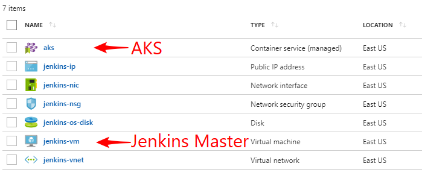
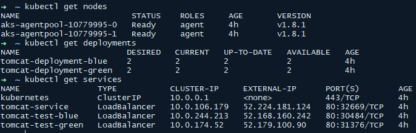
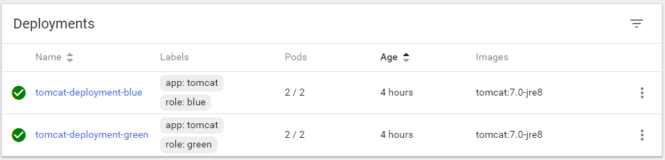
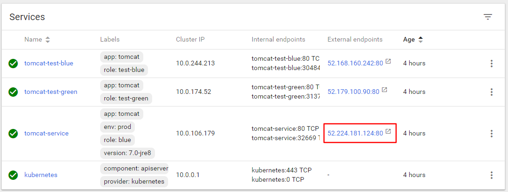
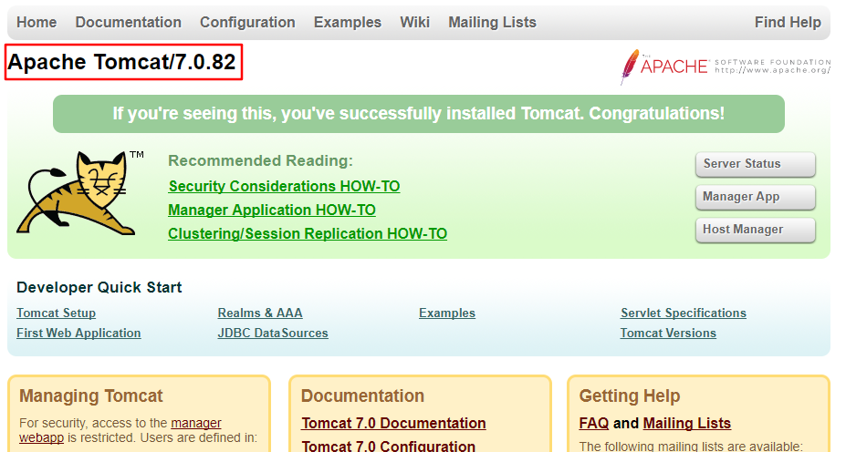
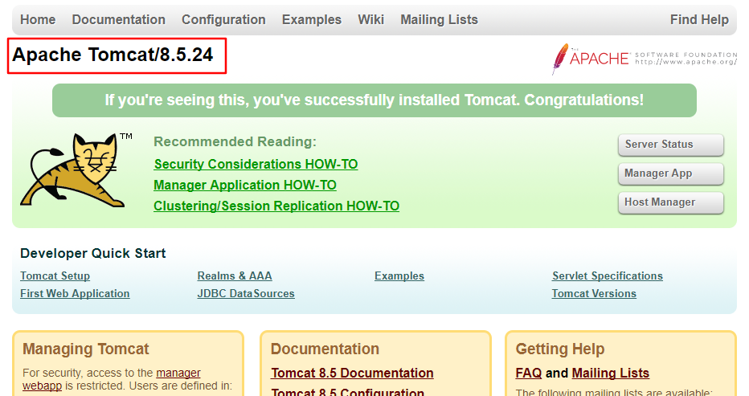

# Zero-downtime Deployment to AKS with Jenkins

<a href="https://portal.azure.com/#create/Microsoft.Template/uri/https%3A%2F%2Fraw.githubusercontent.com%2FAzure%2Fazure-quickstart-templates%2Fmaster%2F301-jenkins-aks-zero-downtime-deployment%2Fazuredeploy.json" target="_blank">
    
</a>
<a href="http://armviz.io/#/?load=https%3A%2F%2Fraw.githubusercontent.com%2FAzure%2Fazure-quickstart-templates%2Fmaster%2F301-jenkins-aks-zero-downtime-deployment%2Fazuredeploy.json" target="_blank">
    
</a>

This template provisions a Jenkins master running in a VM on Azure; configures a DevOps pipeline based on
two public Tomcat Docker images and deploys to [AKS (Azure Container Service)](https://azure.microsoft.com/en-us/services/container-service/).
It is an example to demonstrate how we can use Jenkins pipeline to do zero-downtime deployment on AKS.

The quickstart template will provision the following resources in Azure:

* A Jenkins master running on a Linux Ubuntu 16.04 LTS VM in Azure. The instance is pre-configured with
   the Azure Service Principal credential you provide. This credential is used to manage the Azure resources.
* An AKS cluster, with the following resources:
   * For blue/green deployment demonstration:
      * Two similar deployments representing the environment **blue** and **green**. Both are initially setup with the 
         `tomcat:7` image.
      * Two test endpoint service (`tomcat-test-blue` and `tomcat-test-green`), which are connected to the corresponding
         deployments, and can be use to test if the deployments are ready for production use.
      * A production service endpoint (`tomcat-service`) which represents the public endpoint that the users will access.
         Initially it is routing to the **blue** environment.

         We call the environment that is serving the public traffic the **active** environment (initially "blue"), and
         the other one "**inactive**" or "**staging**".
   * For RollingUpdate deployment demonstration:
      * A deployment `tomcat-deployment-rolling-update` with 2 replicas and using the `RollingUpdate` strategy.
      * A service endpoint `tomcat-service-rolling` for public access to the Tomcat service in the deployment.
* A basic pipeline that demonstrates the steps to do blue/green deployment to Kubernetes:
   1. Ask for the Tomcat image version (`7`, `8`, or `9`) to be deployed.

      (In real world project, we can configure an upstream job to build the image, and feed the image name & tag to the
      deployment job.)

   1. Deploy the Tomcat image to the inactive environment.
   1. Verify that the inactive environment is working as expected through the test endpoint.
   1. Update the application public endpoint to route the traffic to inactive environment, after that it becomes active.
   1. Verify that the public endpoint is working properly with the updated backend environment.
* A basic pipieline that demonstrates the rolling update deployment to Kubernetes.

   ***Note***: As the rolling-update process is pretty straight forward, we do not provide further instructions on it.
   You can check the **AKS Rolling Update Deployment** job in Jenkins after the quickstart template deployment finishes,
   and try to build the Job.

**Note**: At the time when this quickstart is created, AKS is in preview. You may need to enable the preview
for your Azure subscription. Please refer to https://docs.microsoft.com/en-us/azure/aks/kubernetes-walkthrough#enabling-aks-preview-for-your-azure-subscription
for more details.

## How to try it out

### Prerequisites

* An Azure subscription.
* An Azure Service Principal to manage the related Azure resources.
* An SSH key pair that will be used to login remotely to the Jenkins master VM.

### Steps

1. Click the **Deploy to Azure** button from above, this will lead you to the ARM provision page.
1. Fill in the parameters, agree to the terms & conditions and click Purchase. It takes about 20 minutes
   for the provision process to complete. Once the deployment is complete, the resource group contains
   all resources for the Jenkins master and the AKS cluster:

   

1. Check in the resource group, then then click `Deployments` to find the latest deployment with the name
   `Microsoft.Template`, the following details will be displayed in the *Outputs* section:
   * `ADMIN_USERNAME`: The Admin username for the Jenkins master VM, which is the one you filled in the provision page
   * `JENKINS_VM_FQDN`: The host name of the Jenkins master VM
   * `JENKINS_URL`: The Jenkins URL
   * `SSH`: The SSH command to create a tunnel through which you can login and manage the Jenkins instance
      securely
   * `KUBERNETES_MASTER_FQDN`: The host name of the ACS Kubernetes master node
1. Run the command listed in the `SSH` box. Check the Jenkins admin password by running the following command
   in the SSH session:

   ```sh
   sudo cat /var/lib/jenkins/secrets/initialAdminPassword
   ```

1. Visit http://localhost:8080, login with the admin password.
1. Follow the instructions to setup the Jenkins instance.
1. You can access the AKS cluster by doing the following from your local machine.

   > **Note**: 	You need Azure CLI version 2.0.25 or later for AKS.
   > Refer to https://docs.microsoft.com/en-us/cli/azure/install-azure-cli?view=azure-cli-latest#update-the-cli 
   > if you need to update your installation.

   In command line:

   ```sh
   az login
   az aks get-credentials \
       --resource-group <yourResourceGroup> \
       --name aks \
       --admin
   ```

   To verify the connection to your cluster, use the `kubectl get` command.

   

   ```sh
   kubectl proxy
   ```

   Type http://localhost:8001/ui in your browser to get to the Kubernetes Web UI (Dashboard.) You should be able
   to see the deployments:

   

   and the service endpoints:

   

   Click the the external endpoint for the `tomcat-service`, you'll see the Tomcat 7 landing page:

   

   You can also check the external endpoints for `tomcat-test-blue` and `tomcat-test-green`. Both of them show
   the same Tomcat 7 landing page initially.

   ***Note***: In recent version of Kubernetes, the dashboard UI redirection seems to be broken. If you see
   blank page after the server redirection, add a trailing slash `/` to the redirected address in the
   address bar.

1. Go back to your Jenkins master dashboard, you should see a job **AKS Kubernetes Blue/green Deployment**.
1. Click the job, on the left panel click **Build with Parameters**, Choose a Tomcat version that is to be rolled
   into production. Initially, both the blue and green environments were setup with the version `7`,
   so we can try `8` or `9`.
1. Start the build.
1. When the Jenkins job finishes, verify the new Tomcat version has been deployed and enabled through to the public
   service endpoint, click the external endpoint for `tomcat-service`. The version shown is Tomcat/8.X.X.

   

   Check the `role` label for `tomcat-service`, this indicates which environment is the current active one. 
   Go to the external endpoint for that environment and you should see the same version of Tomcat landing page.

1. If you run the build more than once, it will cycle through BLUE and GREEN deployments. i.e., if the current
   environment is **Green**, the job will deploy/test the **Blue** environment and then update the application
   public endpoint to route traffic to the **Blue** environment if all is good with testing.
