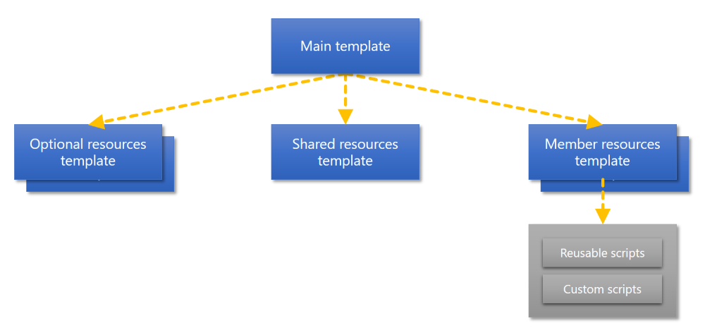

# Azure Resource Manager QuickStart Templates

This repo contains all currently available Azure Resource Manager templates contributed by the community. A searchable template index is maintained at https://azure.microsoft.com/en-us/documentation/templates/.
The following information is relevant to get started with contributing to this repository.

+ [**Contribution guide**](/1-CONTRIBUTION-GUIDE/README.md). Describes the minimal guidelines for contributing.
+ [**Best practices**](/1-CONTRIBUTION-GUIDE/best-practices.md). Best practices for improving the quality of your template design.
+ [**Git tutorial**](/1-CONTRIBUTION-GUIDE/git-tutorial.md). Step by step to get you started with Git.

You are currently reading the best practices.

## Best practices

+ It is a good practice to pass your template through a JSON linter to remove extraneous commas, parenthesis, brackets that may break the "Deploy to Azure" experience. Try http://jsonlint.com/ or a linter package for your favorite editing environment (Visual Studio Code, Atom, Sublime Text, Visual Studio etc.)
+ It's also a good idea to format your JSON for better readability. You can use a JSON formatter package for your local editor or [format online using this link](https://www.bing.com/search?q=json+formatter).
+ A starter template is provided [here](/100-STARTER-TEMPLATE-with-VALIDATION) for you to follow.

The following guidelines are relevant to the main deployment template and nested templates (if used).

1. Template parameters should follow **camelCasing**.
2. Minimize parameters whenever possible, this allows for a good "hello world" experience where the user doesn't have to answer a number of questions to complete a deployment.  If you can use a variable or a literal, do so.  Users who want to parameterize something will likely have the skills to do so. Only provide parameters for:
 + Things that are globally unique (e.g. website name).  These are usually endpoints that the user may need to be aware of, however in many cases a unique name can be generated automatically.
 + Other things a user must know to complete a workflow (e.g. admin user name on a vm)
 + Secrets (e.g. admin password on a vm)
 + Share parameters whenever possible - e.g. the location parameter should be shared among resources that must or are likely to be in the same location
 + If you must include a parameter, define a defaultValue, unless the parameter is used for a password.
3. Every parameter in the template should have the **lower-case description** tag specified using the metadata property. This looks like below

 ```
 "parameters": {
   "storageAccountType": {
     "type": "string",
     "metadata": {
     "description": "The type of the new storage account created to store the VMs disks"
     }
   }
 }
 ```
 
4. Do not use a parameter to specify the **location**. Use the location property of the resourceGroup instead. By using the **resourceGroup().location** expression for all your resources, the resources in the template will automatically be deployed in the same location as the resource group.

 ```
 "resources": [
   {
     "name": "[variables('storageAccountName')]",
     "type": "Microsoft.Storage/storageAccounts",
     "apiVersion": "2015-06-15",
     "location": "[resourceGroup().location]",
     "comments": "This storage account is used to store the VM disks",
     "properties": {
       "accountType": "Standard_GRS"
     }
   }
 ]
 ```

5. Name **variables** using this scheme **templateScenarioResourceName** (e.g. simpleLinuxVMVNET, userRoutesNSG, elasticsearchPublicIP etc.) that describe the scenario rather. This ensures when a user browses all the resources in the Portal there aren't a bunch of resources with the same name (e.g. myVNET, myPublicIP, myNSG)
6. For many resources with a resource group, a name is not often relevant and using something like "storageAccount" may be acceptable.  You can also use variables for the name of a resource. Use **displayName** tags for a "friendly" name in the JSON outline view.  This should ideally match the name property value or property name.

 ```
 "resources": [
   {
     "name": "[variables('storageAccountName')]",
     "type": "Microsoft.Storage/storageAccounts",
     "apiVersion": "2015-06-15",
     "location": "[resourceGroup().location]",
     "comments": "This storage account is used to store the VM disks",
     "tags": { "displayName": "storageAccount" },
     "properties": {
       "accountType": "Standard_GRS"
     }
   }
 ]
 ```
	
7. Specifying a lower-case **comments** property for each resource in the template, helps other contributors to understand the purpose of the resource.

 ```	
 "resources": [
   {
     "name": "[variables('storageAccountName')]",
     "type": "Microsoft.Storage/storageAccounts",
     "apiVersion": "2015-06-15",
     "location": "[resourceGroup().location]",
     "comments": "This storage account is used to store the VM disks",
     "properties": {
       "accountType": "Standard_GRS"
     }
   }
 ]
 ```

9. Do not create a parameter for a **storage account name**. Storage account names need to be lower case and can't contain hyphens (-) in addition to other domain name restrictions. A storage account has a limit of 24 characters. They also need to be globally unique. To prevent any validation issue configure a variables (using the expression **uniqueString** and a static value **storage**). Storage accounts with a common prefix (uniquestring) will not get clustered on the same racks.
	
 ```
 "variables": {
 	"storageAccountName": "[concat(uniquestring(resourceGroup().id),'storage')]"
 }
 ```
 
 Note: Templates should consider storage accounts throughput constraints and deploy across multiple storage accounts where necessary. Templates should distribute virtual machine disks across multiple storage accounts to avoid platform throttling.

10. If you use a **public endpoint** in your template (e.g. blob storage public endpoint), **do not hardcode** the namespace. Use the **reference** function to retrieve the namespace dynamically. This allows you to deploy the template to different public namespace environments, without the requirement to change the endpoint in the template manually. Use the following reference to specify the osDisk. Define a variable for the storageAccountName (as specified in the previous example), a variable for the vmStorageAccountContainerName and a variable for the OSDiskName. 

 ```
 "osDisk": {"name": "osdisk","vhd": {"uri": "[concat(reference(concat('Microsoft.Storage/storageAccounts/', variables('storageAccountName')), providers('Microsoft.Storage', 'storageAccounts').apiVersions[0]).primaryEndpoints.blob, variables('vmStorageAccountContainerName'),'/',variables('OSDiskName'),'.vhd')]"}}
 ```

 If you have other values in your template configured with a public namespace, change these to reflect the same reference function. For example the storageUri property of the virtual machine diagnosticsProfile.

 ```
 "diagnosticsProfile": {"bootDiagnostics": {"enabled": "true","storageUri":"[reference(concat('Microsoft.Storage/storageAccounts/', variables('storageAccountName')), providers('Microsoft.Storage', 'storageAccounts').apiVersions[0]).primaryEndpoints.blob]"}}
 ```
 
 You can also **reference** an **existing storage account** in a different resource group.

 ```
 "osDisk": {"name": "osdisk", "vhd": {"uri":"[concat(reference(resourceId(parameters('existingResourceGroup'), 'Microsoft.Storage/storageAccounts/', parameters('existingStorageAccountName')), providers('Microsoft.Storage', 'storageAccounts').apiVersions[0]).primaryEndpoints.blob, variables('vmStorageAccountContainerName'),'/',variables('OSDiskName'),'.vhd')]"}}
 ```
 
11. **Passwords** must be passed into parameters of type **securestring**. Do not specify a defaultValue for a parameter that is used for a password or an SSH key. Passwords must also be passed to **customScriptExtension** using the **commandToExecute** property in protectedSettings.

 ```
 "properties": {
 	"publisher": "Microsoft.OSTCExtensions",
 	"type": "CustomScriptForLinux",
 	"settings": {
 		"fileUris": [
 			"[concat(variables('template').assets, '/lamp-app/install_lamp.sh')]"
 		]
 	},
 	"protectedSettings": {
 		"commandToExecute": "[concat('sh install_lamp.sh ', parameters('mySqlPassword'))]"
 	}
 }
 ```

 Note: In order to ensure that secrets which are passed as parameters to virtualMachines/extensions are encrypted, the protectedSettings property of the relevant extensions must be used.
 
12. Use tags to add metadata to resources allows you to add additional information about your resources. A good use case for tags is adding metadata to a resource for billing detail purposes. 

13. You can group variables into complex objects. You can reference a value from a complex object in the format variable.subentry (e.g. `"[variables('storage').storageAccounts.type]"`). Grouping variables helps you to keep track of related variables and improves readability of the template.

 ```
 "variables": {
 	"storage": {
 		"storageAccounts": {
 		"name": "[concat(uniquestring(resourceGroup().id),'storage')]",
 		"type": "Standard_LRS"
 		}
 	}
 },
 "resources": [
	 {
	 "type": "Microsoft.Storage/storageAccounts",
	 "name": "[variables('storage').storageAccounts.name]",
	 "apiVersion": "[2015-06-15]",
	 "location": "[resourceGroup().location]",
	 "properties": {
	 	"accountType": "[variables('storage').storageAccounts.type]"
	 }
 	 }
 ]
 ```

 Note: A complex object cannot contain an expression that references a value from a complex object. Define a seperate variable for this purpose.

14. The **domainNameLabel** property for publicIPAddresses used must be **unique**. domainNameLabel is required to be betweeen 3 and 63 charcters long and to follow the rules specified by this regular expression ^[a-z][a-z0-9-]{1,61}[a-z0-9]$. As the uniqueString function will generate a string that is 13 characters long in the example below it is presumed that the dnsPrefixString prefix string has been checked to be no more than 50 charcters long and to conform to those rules.

 ```
 "parameters": {
 	"publicIPAddressName": {
 		"type": "string"
 	},
 	"dnsPrefixString": {
 		"type": "string",
 		"maxLength": 50
 	}
 },
 "variables": {
 	"dnsPrefix": "[concat(parameters('dnsPrefixString'),uniquestring(resourceGroup().id))]"
 }
 ```

15. If a template creates any new **publicIPAddresses** then it should have an **output** section that provides details of the IP address and fully qualified domain created to easily retrieve these details after deployment. 

 ```
 "outputs": {
 "fqdn": {
 	"value": "[reference(resourceId('Microsoft.Network/publicIPAddresses',parameters('publicIPAddressName')),providers('Microsoft.Network', 'publicIPAddresses').apiVersions[0]).dnsSettings.fqdn]",
 	"type": "string"
 },
 "ipaddress": {
 	"value": "[reference(resourceId('Microsoft.Network/publicIPAddresses',parameters('publicIPAddressName')),providers('Microsoft.Network', 'publicIPAddresses').apiVersions[0]).ipAddress]",
  	"type": "string"
 }
}
```

16. publicIPAddresses assigned to a Virtual Machine Instance should only be used when these are required for application purposes, for connectivity to the resources for debug, management or administrative purposes either inboundNatRules, virtualNetworkGateways or a jumpbox should be used.

## Single template or nested templates

It is obvious to create a single deployment template for deploying a single resource. Nested templates are common for more advanced scenarios. The following section is by no means a hard requirement, but more of a guidance to help to decide between a single template or a decomposed nested template design. 

* Create a single template for a single tier application
* Create a nested templates deployment for a multitier application
* Use nested templates for conditional deployment

### Nested templates

Define a complex object variable in the azuredeploy.json that contains the absolute Uri of the repository folder. Add an relative path entry in that variable for each nested template you are using in your deployment. This gives quick overview of the nested templates referenced in your resources. Store all nested templates in the nested folder. The templatelink in the resource combines the absolute Uri with the relative path. When you fork a repository you only need to update the absolute Uri in the azuredeploy.json file. 

```
"variables": {
  "template": {
    "base": "https://raw.githubusercontent.com/Azure/azure-quickstart-templates/master/101-create-availability-set",
    "shared": "nested/sharedresources.json"
  }
},
"resources": [
  {
    "name": "shared",
    "type": "Microsoft.Resources/deployments",
    "apiVersion": "2015-01-01",
    "properties": {
      "mode": "Incremental",
      "templateLink": {
        "uri": "[concat(variables('template').base, variables('template').shared)]",
        "contentVersion": "1.0.0.0"
      }
    }
  }
]
```

It is possible to deploy a nested template based on parameter input. The parameter input is used to concatenate the relative path to a nested template. Based on the user input a different template is deployed. This enabled a conditional nested template deployment. The paramater is used to define the name of the template. Ensure the allowedValues of the input paramater match the names of the nested templates.

### Nested templates design for more advanced scenarios

When you decide to decompose your template design into multiple nested templates, the following guidelines will help to standardize the design. These guidelines are based on the [best practices for designing Azure Resource Manager templates](https://azure.microsoft.com/en-us/documentation/articles/best-practices-resource-manager-design-templates/) documentation.
For this guidance a deployment of a SharePoint farm is used as an example. The SharePoint farm consists of multiple tiers. Each tier can be created with high availability. The recommended design consists of the following templates.

+ **Main template** (azuredeploy.json). Used for the input parameters.
+ **Shared resouces template**. Deploys the shared resources that all other resources use (e.g. virtual network, availability sets). The expression dependsOn enforces that this template is deployed before the other templates.
+ **Optional resources template**. Conditionally deploys resources based on a parameter (e.g. a jumpbox)
+ **Member resources templates**. Each within an application tier within has its own configuration. Within a tier different instance types can be defined. (e.g. first instance creates a new cluster, additional instances are added to the existing cluster). Each instance type will have its own deployment template.
+ **Scripts**. Widely reusable scripts are applicable for each instance type (e.g. initialize and format additional disks). Custom scripts are created for specific customization purpose are different per instance type.


 
The **main template** is stored in the **root** of the folder, the **other templates** are stored in the **nested** folder. The scripts are stored in the **scripts** folder.