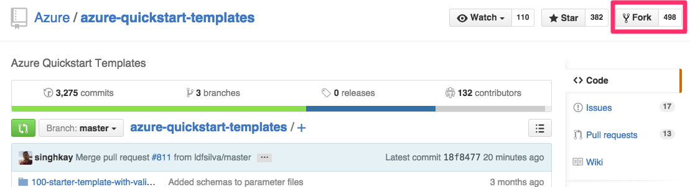
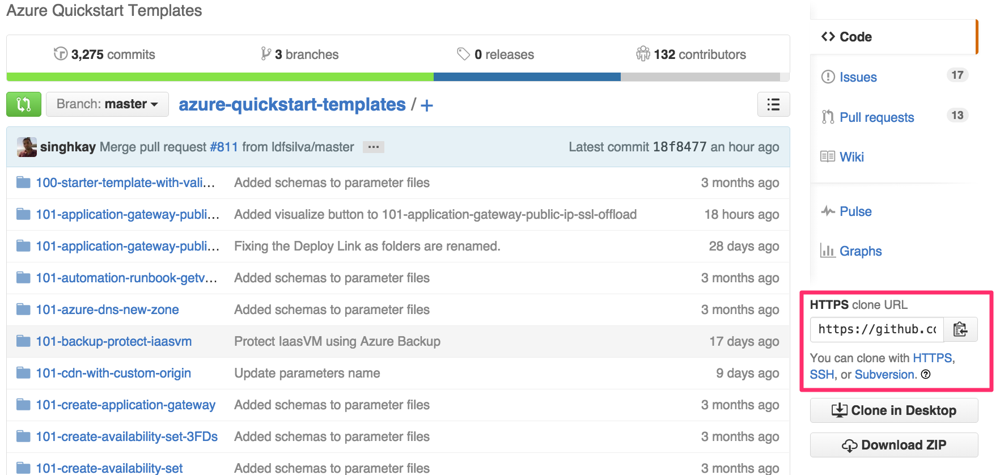
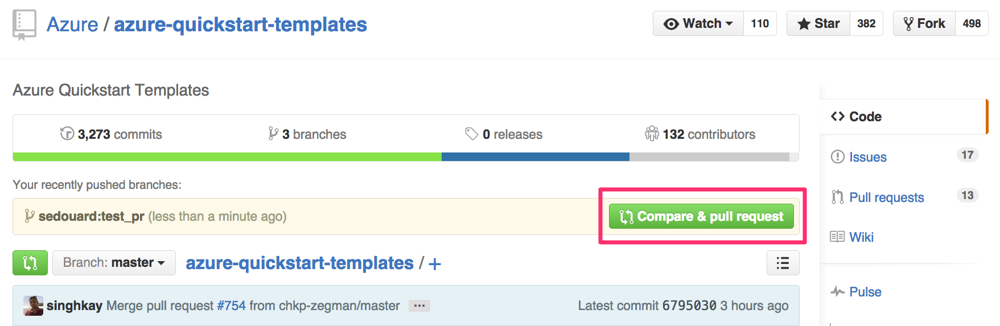

# Azure Resource Manager QuickStart Templates

This repo contains all currently available Azure Resource Manager templates contributed by the community. A searchable template index is maintained at https://azure.microsoft.com/en-us/documentation/templates/.
The following information is relevant to get started with contributing to this repository.

+ [**Contribution guide**](/1-CONTRIBUTION-GUIDE/README.md#contribution-guide). Describes the minimal guidelines for contributing.
+ [**Best practices**](/1-CONTRIBUTION-GUIDE/best-practices.md#best-practices). Best practices for improving the quality of your template design.
+ [**Git tutorial**](/1-CONTRIBUTION-GUIDE/git-tutorial.md#git-tutorial). Step by step to get you started with Git.

You are currently reading the Git tutorial.

## Git tutorial

We're following basic GitHub Flow. If you have ever contributed to an open source project on GitHub, you probably know it already - if you have no idea what we're talking about, check out [GitHub's official guide](https://guides.github.com/introduction/flow/). Here's a quick summary:

+ Fork the repository and clone to your local machine
+ You should already be on the default branch `master` - if not, check it out (`git checkout master`)
+ Create a new branch for your template (`git checkout -b my-new-template)
+ Write your template
+ Stage the changed files for a commit (`git add .`)
+ Commit your files with a useful commit message ([example](https://github.com/Azure/azure-quickstart-templates/commit/53699fed9983d4adead63d9182566dec4b8430d4)) (`git commit`)
+ Push your new branch to your GitHub Fork (`git push origin my-new-template`)
+ Visit this repository in GitHub and create a Pull Request.

For a detailed tutorial, please check out the following information.

You probably heard of Git before, but it's possible that you haven't used it. Writing an ARM Template doesn't require masterful Git skills, but you will need a few basics. This small tutorial will go over all the steps, taking you from zero to ARM Template contributor.

This guide assumes you're new to git and that you're using a Windows computer. If you're using Linux OSX, its very similar, with the exception of Windows-specifics such as installation of git.

#### Table of Contents
- [Git Tutorial for ARM Template Submissions](#git-tutorial-for-the-pct-arm-templates)
    - [Get Git](#get-git)
    - [Fork the Repository to your Account](#fork-the-repository-to-your-account)
    - [Clone the template Repository to your Machine](#clone-the-arm-template-repository-to-your-machine)
    - [Creating a new Branch for your template](#creating-a-new-branch-for-your-template)
    - [Staging your Changes for a Commit](#staging-your-changes-for-a-commit)
    - [Commit your Changes](#commit-your-changes)
    - [Push your new Branch to Your Fork on GitHub](#push-your-new-branch-to-your-fork-on-github)
    - [Make a Pull Request](#make-a-pull-request)
    - [Updating Pull Requests](#updating-pull-requests)
    - [Squashing Commits](#squashing-commits)
    - [Syncing Your Fork](#syncing-your-fork)

### Get Git
If you don't have Git installed, head over to the official [Git Download page and download it](https://git-scm.com/download/win). Once installed and downloaded, you might also want to install [Posh Git](https://github.com/dahlbyk/posh-git). If you're already using Chocolatey or Windows 10's package manager to install software, you can simply run the following command from an elevated PowerShell (right click, select 'Run as Administrator'):

```
cinst git.install
cinst poshgit

# Restart PowerShell / CMDer before moving on - or run
$env:Path = [System.Environment]::GetEnvironmentVariable("Path","Machine") + ";" + [System.Environment]::GetEnvironmentVariable("Path","User")

cinst git-credential-winstore
cinst github
```

#### Ensure a Safe Push Behavior
Git has multiple ways of pushing - and changed the default behavior a few years ago. `git config --global push.default` configures what branches will be pushed to the remote. The default in Git 2.0 is `simple` meaning that whenever `git push` is run, only the current branch is pushed. Prior to version 2.0, the default behavior was `matching`, meaning that a `git push` would push all branches with a matching branch on the remote.

If you're installing a fresh version of Git, you're fine. If you want to make super-duper sure that everything will okay, run the following command:

```
git config --global push.default simple
```

#### A Word About Git Clients
Many users are initially put off by the idea of having to work with Git through the command line. I distinctly remember not even considering the PowerShell/Terminal and instead downloading one of the many GUI tools that are available. As someone who went through the experience of trying to use a Git GUI without really understanding what Git is doing on the command-line-level, let me tell you: It will end in tears.

In fact, I find it a lot easier today to work with the command-line. Git will do *exactly* what you tell it do - each step will be obvious to you. GUIs often try to combine multiple commands together into one fancy button, which will surely blow your whole project up, if you don't understand what's going on under the hood. For those reasons, I *heavily* recommend sticking with the command-line.

### Fork the Repository to your Account
Before we can get started, you need to register with GitHub. Either create or login into your account. Then, head over to the [Azure/azure-quickstart-templates](https://github.com/Azure/azure-quickstart-templates) repository and click the little 'fork' button in the upper right.



This will create a copy of the repository as it exists in the `azure` organization (hence called azure/azure-quickstart-templates) in your own account.

### Clone the Azure QuickStart Templates Repository to your Machine
Visit your fork (which should be at github.com/{your_name}/azure-quickstart-templates) and copy the "HTTPS Clone URL". Using this URL, you're able to `clone` the repository, which is really just a fancy way of saying "download the whole repository, including its history and information about its origin".



Now that you have Git installed, open up PowerShell. If everything worked correctly, you should be able to run `git --version`. If that works, navigate to a folder where you'd like to keep the `arm-templates` repository (and hence, all your arm templates). To get a copy of your fork onto your local machine, run:

```
git clone https://github.com/{YOUR_USERNAME}/azure-quickstart-templates
```

This should generate output that looks roughly like this:

```
Windows PowerShell
Copyright (C) 2015 Microsoft Corporation. All rights reserved.

C:\Users\feriese> git --version
git version 1.9.5.msysgit.1
C:\Users\feriese> git clone https://github.com/sedouard/azure-quickstart-templates
Cloning into 'arm-templates'...
remote: Counting objects: 1027, done.
remote: Compressing objects: 100% (4/4), done.
Receiving objects: 100% (1027/1027), 16.02 MiB | 9.11 MiB/s, done.
emote: Total 1027 (delta 0), reused 0 (delta 0), pack-reused 1023R
Resolving deltas:   5% (30/531)
Resolving deltas: 100% (531/531), done.
Checking connectivity... done.
C:\Users\feriese>
```

You can run `explorer arm-templates` to open up the folder. All the files are there - including the history of the whole repository. The connection to your fork (`your_name/arm-templates`) is still there. To confirm that, `cd` into the cloned folder and run the following command, which will show you all the remote repositories registered:

```
git remote -v
```

The output should be:

```
C:\Users\sedouard\azure-quickstart-templates [master]> git remote -v
origin  https://github.com/sedouard/arm-templates (fetch)
origin  https://github.com/sedouard/arm-templates (push)
```

As you can see, we're connected to your fork of the arm-templates (called "origin"), but currently not connected to the upstream version living in `catalystcode/arm-templates`. To change that, we can simply add remotes. Run the following command:

```
git remote add upstream https://github.com/Azure/azure-quickstart-templates
```

Entering `git remote -v` again should give you both repositories - both yours (called "origin") and the one for the whole team (called "upstream").

### Creating a new Branch for your template
In modern Git development, every single change that you want to make to the code base will be made in a "branch". Like a tree branch, the branch is "based" on a different branch, and unlike other SCM systems Git branches are very lightweight. In our case, your base branch will always be `master`, which is the default branch name for GitHub pages. In order to create a new branch, you can always run:

```
# This makes sure that your new branch is based on master
git checkout master
# This creates the new branch
git checkout -b my-new-branch
```
You can now go ahead and make your changes - adding files, your template, fixing typos. Keep in mind that a branch should host isolated changes: You would normally not fix someone else's template and add a new one in branch. Instead, you create one branch that fixes typos; and another branch for your added template.

### Staging your Changes for a Commit
Now that you made your changes, you can "stage" them for a commit. Whenever you stage a file for a commit, you make a snapshot of the file at the time you're staging it for a commit. If you change a file after you staged it, you will have to stage it again. To stage a file, simply run:

```
git add ./path-to/my-file.md
```

If you just want to stage all files in your current repository (including deletions), run:

```
git add --all .
```

### Commit your Changes
Now that your changes have been staged, we're ready to commit them. You can either pass the commit command a title for your commit - or omit the parameter, in which case Git will open up the default text editor to create a commit message.

###### Hint: Changing the Default Editor
The default editor will most likely be Vim. If you don't like that, use [GitPad](https://github.com/github/GitPad) - it'll make sure that you can edit all your Git messages with whatever editor is associated with `txt` files.

To commit the quick way:
```
git commit -m "Add template: 3 VMS 1 Subnet"
```

To commit the long way, allowing you to define both title and message of your commit:
```
git commit
```

### Push your new Branch to Your Fork on GitHub
You wrote a template, made some changes, committed - now we have to make sure that your changes also end up on GitHub. To do so, we have to push your local branch to your fork on GitHub. Run the command below (obviously using the name of the branch you want to push)

```
git checkout NAME_OF_YOUR_BRANCH
git push -u origin NAME_OF_YOUR_BRANCH
```

### Make a Pull Request
Now, head over to the [catalystcode/arm-templates](https://github.com/CatalystCode/arm-templates) repository. In most cases, GitHub will pick up on the fact that you just pushed a branch with some changes to your local fork, assuming that you probably want for those changes to end up in the upstream branch. To help you, it'll show a little box right above the code asking you if you want to make a pull request.



Click that button. GitHub will open up the 'Create a Pull Request Page'. It is probably a good idea to notify potential reviewers in your pull request. You can do this by doing an @mention to the maintainer of the repository.

As soon as you hit the 'Create Pull Request' button, it'll show up in the list of pull requests and trigger some automated validation.

### Updating Pull Requests
Once people have reviewed your pull request, it is very likely that you want to update it. Good news! Whenever you update the branch in your fork, your pull request will be automatically updated.

Let's look at a scenario: You just pushed pushed your branch (using `git push -u origin NAME_OF_YOUR_BRANCH`), went to GitHub, and created a Pull Request.

To update the PR with additional changes, edit your files in your branch - then, commit the changes and push them to GitHub:

```
git checkout NAME_OF_YOUR_BRANCH
# Make changes, stage all changes for commit
git add --all .
# Commit
git commit
# Push to GitHub
git push
```

If you want to update your Pull Request without creating a new commit, you can "amend" your last commit. To do so, call `git commit` with the `--amend` parameter and force-push the result to GitHub, overwriting the previous version.

```
git checkout NAME_OF_YOUR_BRANCH
# Make changes, stage all changes for commit
git add --all .
# Commit
git commit --amend
# Push to GitHub
git push -f
```

Please note the advice further up [about default push behavior in old/outdated versions of Git](#ensure-a-safe-push-behavior).

When we're ready to merge your Pull Request, it is very likely we may ask you to "squash your commits". To do so, read on below.

### Squashing Commits
You should commit often. It's a great backup and safety net in case you mess up. At the same time, you don't want your pull request to contain all your commits - in practice, a pull request should contain one commit. There are obvious exceptions to this rule (like epic projects - think 'Windows support for Docker'), but your little template should most definitely be just one commit. For that to happen, we need to rewrite history.

Rewriting Git history is a little bit scary, but it's easy to do. Here's the setup: You just made six commits to your branch. Before making a pull request, you want all those commits to be turned into one. To change the history of your last six commits, run:

```
git rebase -i HEAD~6
```

It is important that you change only commits that *you* made, since your branch will not be compatible with "upstream" (catalystcode/arm-templates) if you rewrite history that is already present in the repository there. You can however mess with your own fork as much as you want to, since you should be the only person working with it.

Once you run the command, you will be presented with a screen that looks like this:

```
pick 4a67852 Update interactions.js
pick e9c1c12 Further Mini-JS Optimizations
pick 676adb6 Listener is always undefined
pick 6e8ba27 Automated Jekyll Deployment
pick fc0c120 Remove Gemfile Lock
pick 1cd833d Fix Deployment Folder
```

See how every single commit begins with the word `pick`, followed by its commit id and the title? You can replace the `pick` with an action of your choice. Available are:

 * `p`, `pick`: use commit
 * `r`, `reword`: use commit, but edit the commit message
 * `e`, `edit`: use commit, but stop for amending
 * `s`, `squash`: use commit, but meld into previous commit
 * `f`, `fixup`: like "squash", but discard this commit's log message
 * `x`, `exec`: run command (the rest of the line) using shell

In order to squash all six commits into the very first one you made, you would change the file to:

```
pick 4a67852 Update interactions.js
fixup e9c1c12 Further Mini-JS Optimizations
fixup 676adb6 Listener is always undefined
fixup 6e8ba27 Automated Jekyll Deployment
fixup fc0c120 Remove Gemfile Lock
fixup 1cd833d Fix Deployment Folder
```

Then, once you're done, update the branch on your own fork in GitHub. Push with the `f` parameter (force), telling Git to overwrite whatever GitHub has in the branch:

```
git push -f
```

If you never pushed the branch before, you can use the normal push command - there's no history that we need to overwrite with the `f` parameter.

```
git push -u origin NAME_OF_YOUR_BRANCH
```

### Syncing Your Fork

After some time, you'll find that your fork has become out of sync with the upstream repository (as others add arm templates and they get merged in). To sync your fork up, you just need to do a local merge and then push those changes. There are a few different ways to do this, but this is the method [recommended by GitHub](https://help.github.com/articles/syncing-a-fork/):

```
# Get all of the latest from upstream for all branches
git fetch upstream
# Now make sure you're on master - the main branch for this project
git checkout master
# Merge in the changes from upstream (note: this commits locally)
git merge upstream/master
# And then push those to your fork on GitHub
git push
```

Now you can start from a clean state, knowing your next template will be the only divergence from `upstream` you'll have to deal with.

**Based on an awesome git tutorial from [Felix Rieseberg](https://github.com/felixrieseberg)**
