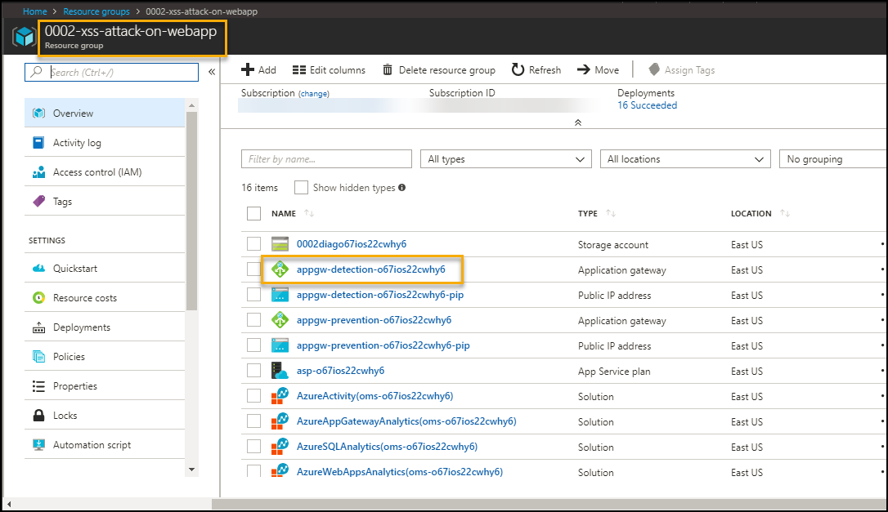
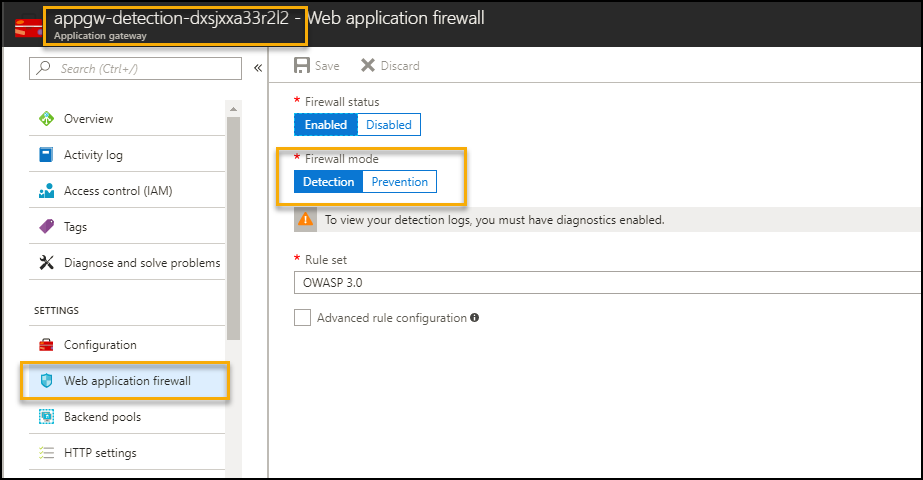
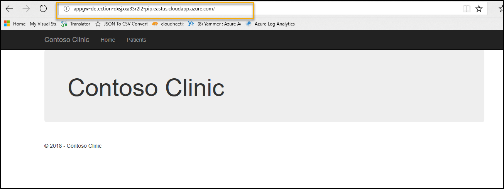
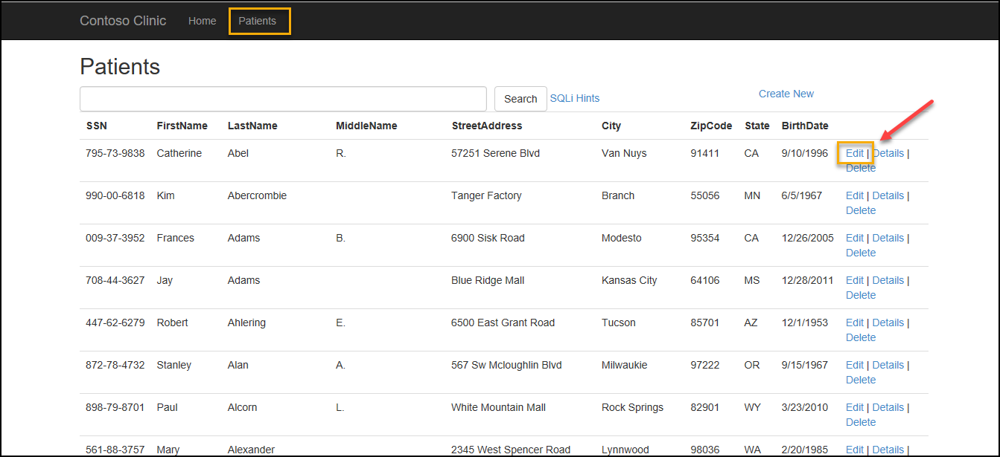
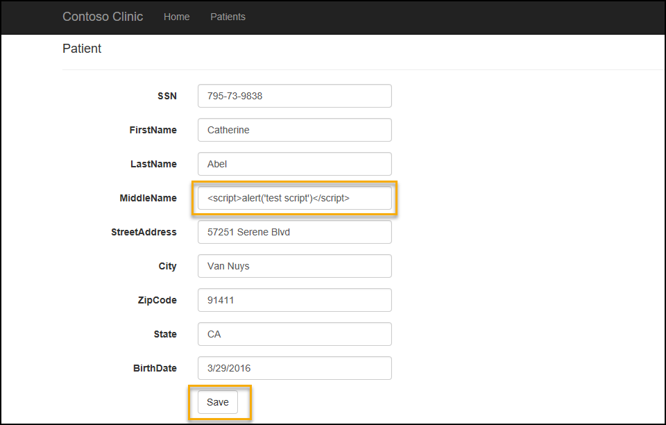
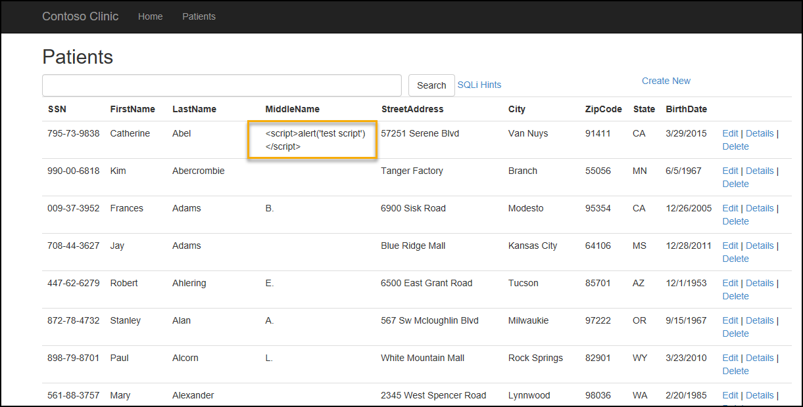
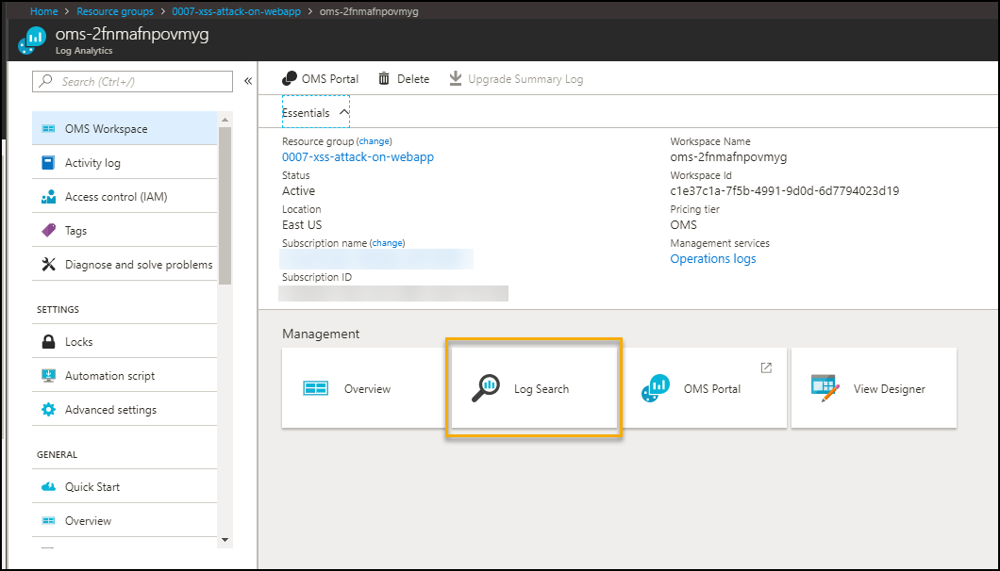
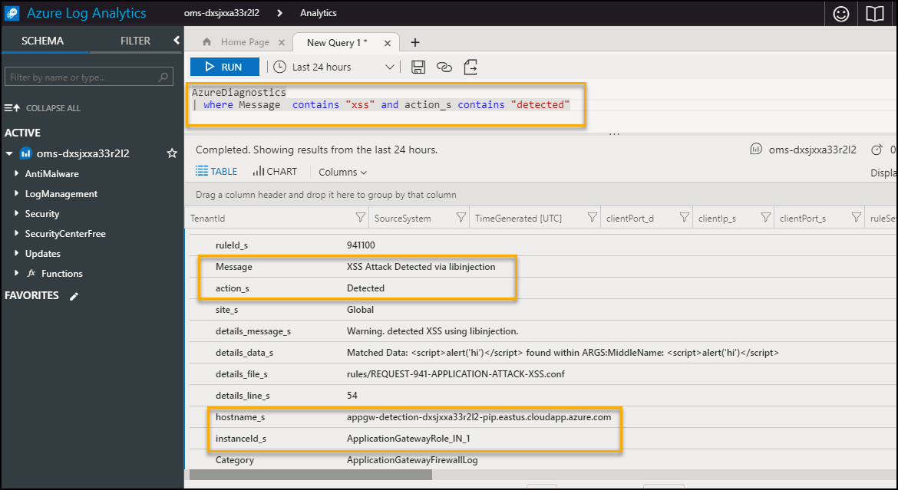
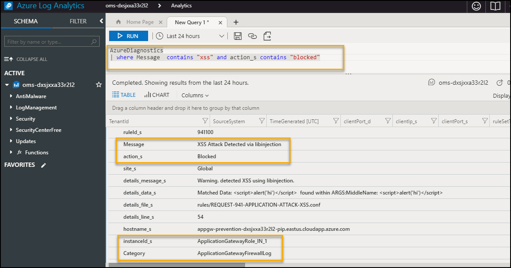

# XSS-Attack-Prevention
This repository contains XSS-Attack-Prevention security scenario.

This repository contains SQL injection attack detection & prevention on a Web Application <p></p>

<a href="https://portal.azure.com/#create/Microsoft.Template/uri/https%3A%2F%2Fraw.githubusercontent.com%2FAzure%2Fazure-quickstart-templates%2Fmaster%2F101-XSS-Attack-Prevention%2Fazuredeploy.json" target="_blank">
     
</a>
<a href="http://armviz.io/#/?load=https%3A%2F%2Fraw.githubusercontent.com%2FAzure%2Fazure-quickstart-templates%2Fmaster%2F101-XSS-Attack-Prevention%2Fazuredeploy.json" target="_blank">
     
</a>

# Table of Contents
1. [Objectives](#objectives)
2. [Overview](#overview)
3. [Pre-requisites](#prerequisites)
4. [Deploy](#deployment)
5. [Perform Attack](#attack)
6. [Detect Attack](#detect)
7. [Respond/Mitigate](#mitigate)
8. [Configuration validation](#config)

<a name="objectives"></a>
# Objective of the POC
Showcase a Cross Site Scripting (XSS) attack and mitigation on a Web Application 

<a name="overview"></a>
# Overview
It showcases following use cases
1. Perform XSS (Cross Site Scripting) attack on Web App with following configuration --> Application detects attack using application gateway
    * Application Gateway (WAF enabled-Detection mode)
  

2. Perform XSS (Cross Site Scripting) attack on Web App with following configuration --> Application prevents attack using application gateway
    * Application Gateway (WAF enabled-Prevention mode)
  

# Important Notes <a name="notes"></a>
First time it takes few hours for OMS to pull logs for detection and prevention events. For subsequent requests it takes 10-15 mins to reflect in OMS.

<a name="prerequisites"></a>
# Prerequisites
Access to Azure subscription to deploy following resources 
1. Application gateway (WAF enabled)
2. App Service (Web App)
3. SQL Database 
4. OMS (Monitoring)

<a name="deployment"></a>
# Deploy

1. Deploy using "Deploy to Azure" button at the top 

Following steps are required to update SQL Server firewall settings and load data into database. 

1. Clone Azure quickstart templates repository using

    `git clone https://github.com/Azure/azure-quickstart-templates.git`

2. Open Windows PowerShell (Run as Administrator) and navigate to 101-XSS-Attack-Prevention directory for XSS attack scenario
 
    `cd .\azure-quickstart-templates\101-XSS-Attack-Prevention\`
    
3. Login to Azure by passing subscription id to execute script.

    `Login-AzureRmAccount -SubscriptionId "<subscription id>" `

4. Execute following command to generate secure string password (password given during deployment of the scenario) for SQL server login

    `$pass= "<SQL server admin password>" |  ConvertTo-SecureString -AsPlainText -Force`

5. Execute following command to configure SQL Server Firewall and load data into database using secure string password generated in above step

    `.\DSC\sqlserver.ps1 -ResourceGroupName "<ResourceGroupName>" -SqlAdminUser "<SqlAdminUser>" -SqlAdminPassword $pass -Verbose`

<a name="attack"></a>
# Perform Attack 
Attack on web app with
* Application gateway - WAF - Detection mode 
 

1. Go to Azure Portal --> Select Resource Groups services --> Select Resource Group --> <ResourceGroupName> given during deployment

2. Select Application Gateway with name 'appgw-detection-' as prefix.

    


3. Application Gateway WAF enabled and Firewall in Detection mode as shown below.

    

4. On Overview Page --> Copy Frontend public IP address as
    

5. Open Internet Explorer with above details as shown below  
    

4. Click on Patient link and select Edit option 

    

4. Perform XSS attack by copying javascript code " **<script>alert('test script')</script>** " in MiddleName text box and click on "Save". 
  


5. Application will save data in database and dispaly it on dashboard
.

        
    
<a name="detect"></a>    
# Detect
To detect the attack execute following query in Azure Log Analytics 
<p/>
<u>Note</u>: first time it takes few hours for OMS to pull logs for detection and prevention events. For subsequent requests it takes 10-15 mins to reflect in OMS, so if you don't get any search results, please try again after sometime.
<p/>
1. Go to Azure Portal --> navigate to Log Analytics in same resource group  

 

2. Go to Log analytics --> Click on Log Search --> Type query search 

    ```AzureDiagnostics | where Message  contains "xss" and action_s contains "detected"```

 
    
3. Following details gets logged. 

 
    
<a name="mitigate"></a>
# Mitigate 

  * Update Web application firewall mode to Prevention for application gateway. This will take 5-10 mins. Hence we will connect the application using Application Gateway (WAF- Prevention mode) 

    
    
  

## Detection after Mitigation 

* Execute the step 4,5, 6 and 7 to perform XSS attack with Application Gateway having WAF Enabled and Firewall in Prevention. Application Gateway will prevent access as below

  

 
* To detect the prevention of attack execute following query in Azure Log Analytics


    AzureDiagnostics | where Message  contains "xss" and action_s contains "blocked"
    
  


You will notice events related to detection and prevention items. First time it takes few hours for OMS to pull logs for detection and prevention events. For subsequent requests it takes 10-15 mins to reflect in OMS, so if you don't get any search results, please try again after sometime.


<a name="config"></a>
## Configuration Validation
* Cross site scripting (XSS) is a common attack vector that injects malicious code into a vulnerable web application. A successful cross site scripting attack can have devastating consequences for an online business’s reputation and its relationship with its clients. Automatic detection and remediation procedure of such vulnerabilities can be easily done using the controls available in Cloudneeti.

* Cloudneeti is available on the Azure marketplace. Try out the free test drive here https://aka.ms/Cloudneeti 


**References** 

https://docs.microsoft.com/en-us/azure/application-gateway/application-gateway-introduction
 
https://docs.microsoft.com/en-us/azure/application-gateway/application-gateway-web-application-firewall-overview


