# Azure Blockchain Service

And here we are in another chapter on our ARM Templates learning path. This time we gonna deploy a simple Web App Service with a GitHub Repository Account linked.

But let's understand a bit better how all this will work.

## What is Azure Blockchain Service?

Azure Blockchain Service is a fully managed ledger service that enables users the ability to grow and operate blockchain networks at scale in Azure. By providing unified control for both infrastructure management as well as blockchain network governance, Azure Blockchain Service provides:

- Simple network deployment and operations
- Built-in consortium management
- Develop smart contracts with familiar development tools

Azure Blockchain Service is designed to support multiple ledger protocols. Currently, it provides support for the Ethereum Quorum ledger using the IBFT consensus mechanism.

These capabilities require almost no administration and all are provided at no additional cost. You can focus on app development and business logic rather than allocating time and resources to managing virtual machines and infrastructure. In addition, you can continue to develop your application with the open-source tools and platform of your choice to deliver your solutions without having to learn new skills.

### Concepts
#### Azure Blockchain Service Consortium

Using Azure Blockchain Service, you can create private consortium blockchain networks where each blockchain network can be limited to specific participants in the network. Only participants in the private consortium blockchain network can view and interact with the blockchain. Consortium networks in Azure Blockchain Service can contain two types of member participant roles:

 - **Administrator** - Privileged participants who can take consortium management actions and can participate in blockchain transactions.
 - **User** - Participants who cannot take any consortium management action but can participate in blockchain transactions.

Consortium networks can be a mix of participant roles and can have an arbitrary number of each role type. There must be at least one administrator.

#### Azure Blockchain Service security

Azure Blockchain Service uses several Azure capabilities to keep your data secure and available. Data is secured using isolation, encryption, and authentication.

**Isolation**

Azure Blockchain Service resources are isolated in a private virtual network. Each transaction and validation node is a virtual machine (VM). VMs in one virtual network cannot communicate directly to VMs in a different virtual network. Isolation ensures communication remains private within the virtual network.

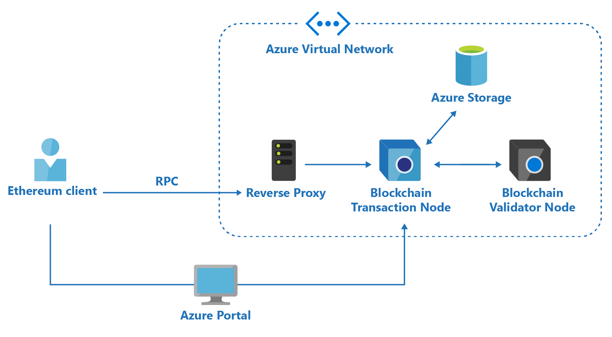

**Encryption**

User data is stored in Azure storage. User data is encrypted in motion and at rest for security and confidentiality. For more information, see: [Azure Storage security guide.](https://docs.microsoft.com/en-gb/azure/storage/common/storage-security-guide)

**Authentication**

Transactions can be sent to blockchain nodes via an RPC endpoint. Clients communicate with a transaction node using a reverse proxy server that handles user authentication and encrypts data over SSL.

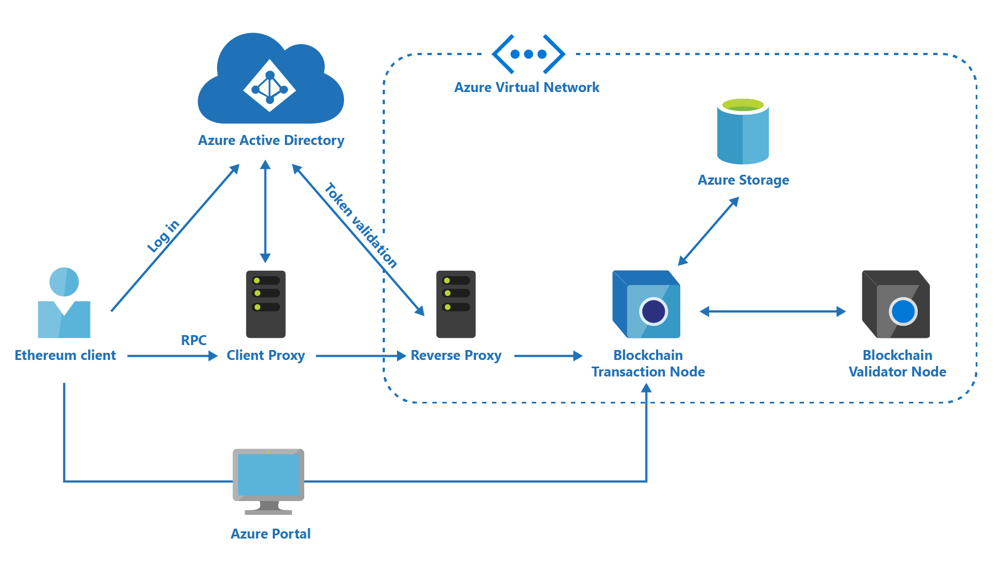

**Keys and Ethereum accounts**

When provisioning an Azure Blockchain Service member, an Ethereum account, public, and private key pair are generated. The private key is used to send transactions to the blockchain. The Ethereum account is the last 20 bytes of the public key's hash. The Ethereum account is also called a wallet.

Now that you got a good idea of how the service works, let's dig on the template file.

###The Template
Don't let the size of the template scares you. The structure is very intuitive and once that you get the gist of it, you gonna see how easier your life will be regarding creating resources on Azure.

Those are the parameters on the template, nevertheless, there are just three parameters we will need to insert. The parameters we will manipulate and inform are:

Parameter         | Suggested value     | Description
:--------------- | :-------------      |:---------------------
**blockchainMemberName** |*yourname*-*organization* i.e.:  krisnatagoras-mseducation  | Blockchain member name.
**memberPassword**  | Complex password|"Password for the BlockChain Administrator. The password must be at least 12 characters long and have a lower case, upper characters, digit and a special character (Regex match)
**Location**| One of these Locations | "eastus", "southeastasia", "westeurope", "northeurope",  "westus2", "japaneast"

##Deployment
There are a few ways to deploy this template.
You can use [PowerShell](https://docs.microsoft.com/en-us/azure/azure-resource-manager/resource-group-template-deploy), [Azure CLI](https://docs.microsoft.com/en-us/azure/azure-resource-manager/resource-group-template-deploy-cli), [Azure Portal](https://docs.microsoft.com/en-us/azure/azure-resource-manager/resource-group-template-deploy-portal) or your favorite SDK.

For this task, we gonna deploy using Visual Code and the portal and a little surprise for you at the end. :D

For Azure CLI I choose to use the Visual Code with Azure CLI extensions, if you like, you can find more information [here](https://code.visualstudio.com/docs/azure/extensions). But bare in mind that you don't need to use the Visual Code, you can stick with the old good always present **Command Line** on Windows or any **bash terminal**.

###Using Azure CLI with Visual Code
type on the terminal windows: **az login**

You gonna be redirected to the Azure Portal where you can use your credentials to login into.

After login, you gonna have your credentials.

In order to set the right subscription, you can use the following command:

**az account set --subscription "< your subscription id >"**

####Resource Group

After you logged in, we gonna need to create a Resource Group for our deployment. If you haven't yet created a Resource Group, we gonna do that now! But what is a Resource Group, one might ask. Bare with me! A Resource Group is a container that holds related resources for an Azure solution. The resource group includes those resources that you want to manage as a group. Simply saying, it's like a folder that contains files. Simple as that ;-)

To create a Resource Group, you need a name and the location for your Resource Group.

For a list of locations, type: **az account list-locations**

To create the Resource group, just type the command:

**az group create --name BlockChain-RG --location < yourlocation >**

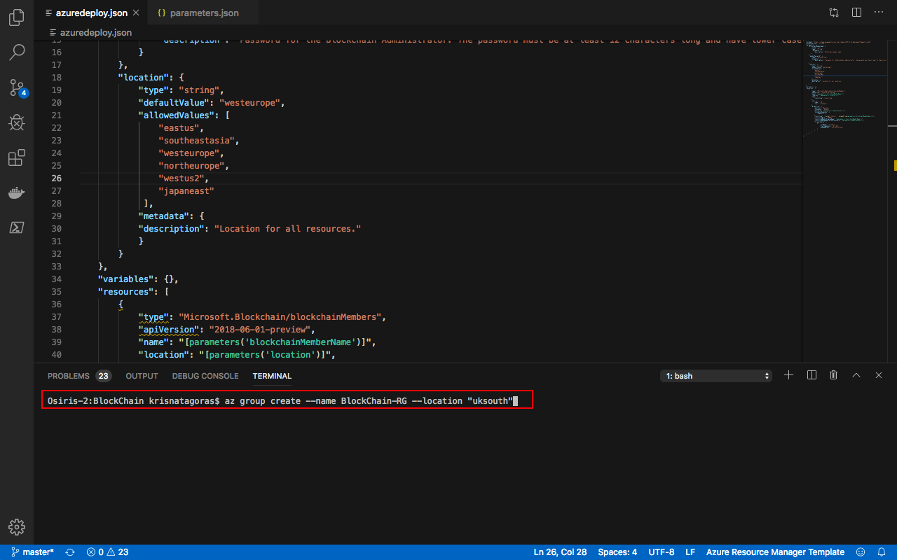

Super simple, right? Now that we have our **Resource Group** created, let's deploy our BlockChain Service.

**az group deployment create --name "name of your deployment" --resource-group "BlockChain-RG" --template-file "./azuredeploy.json"**

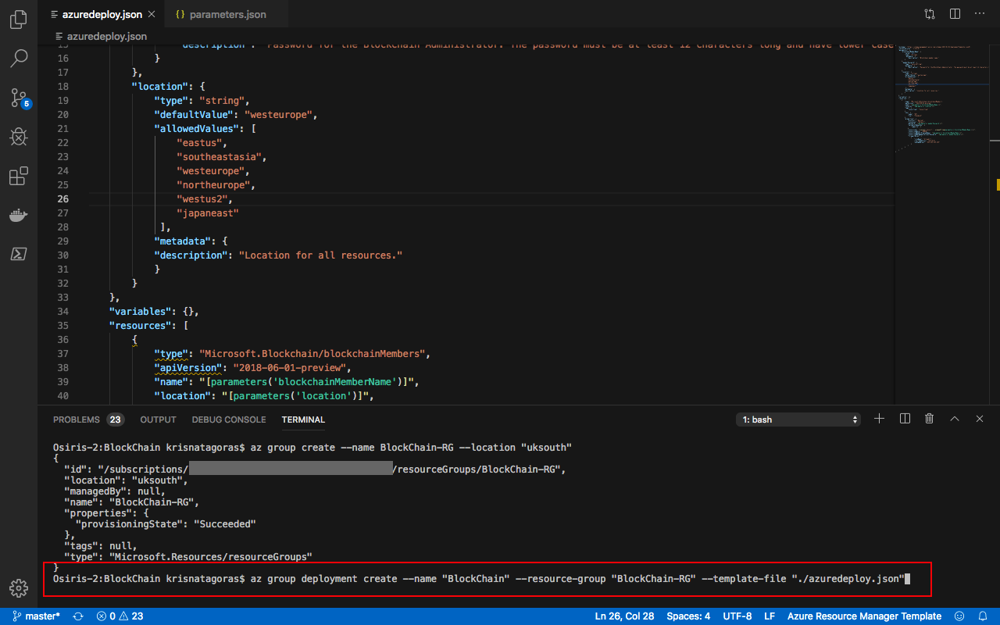

You gonna need to insert the parameters information:

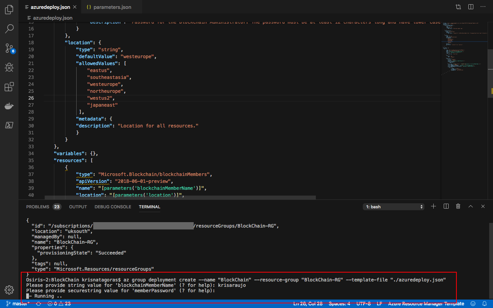

As you can see, it's running.   

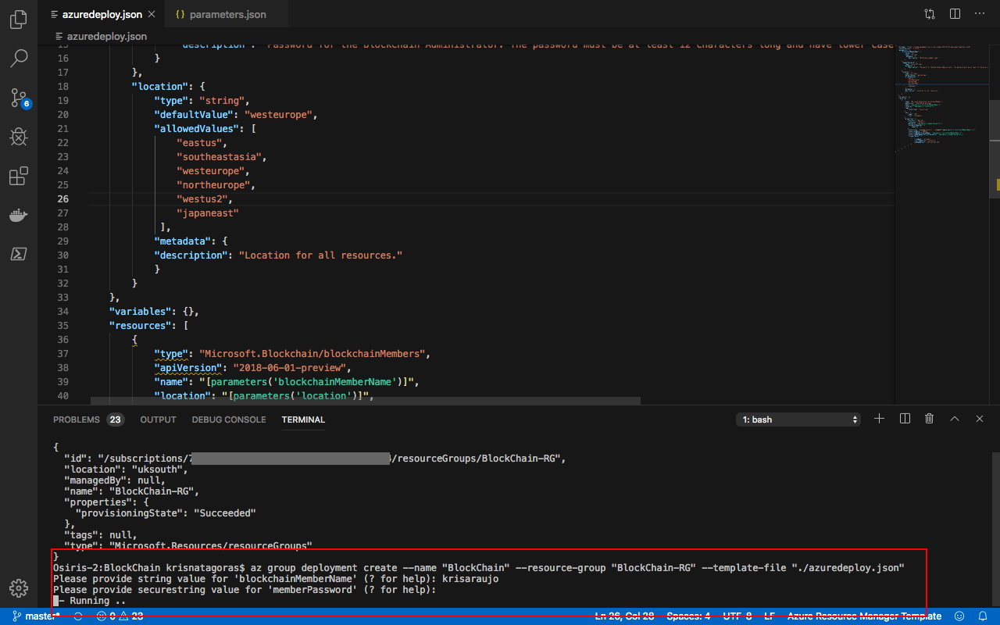

Go grab a cup of coffee, have some fresh air and I'm sure that before you come back you gonna have your BlockChain Service will be deployed.

And there we go, our deploy is Succeeded:  

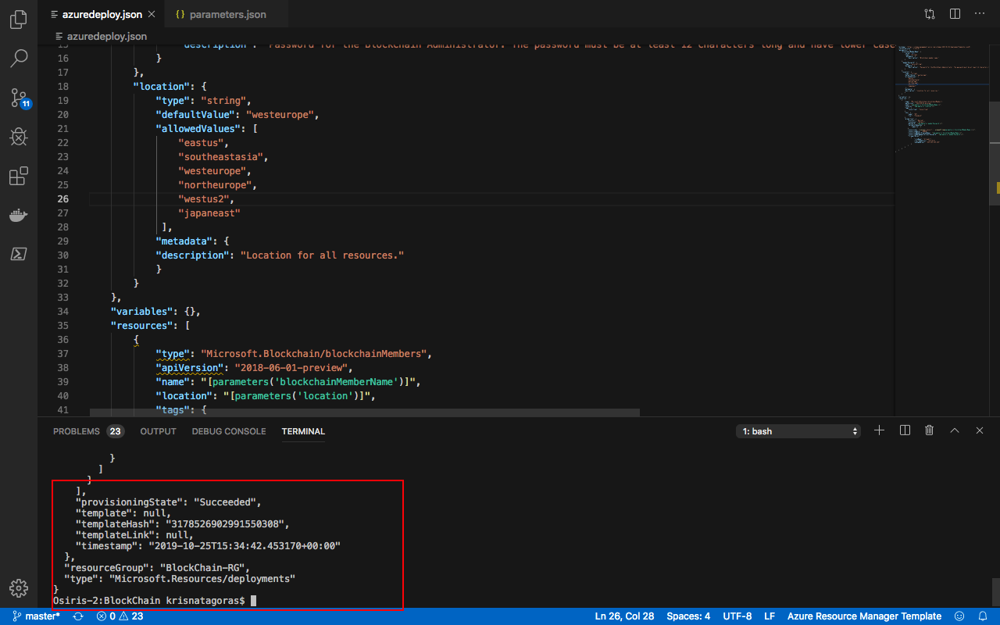

Let's go and check the resource at the [Azure Portal](https://portal.azure.com).

On the portal, go to Resource Groups. On this blade, you can see the Resource Group we've created.

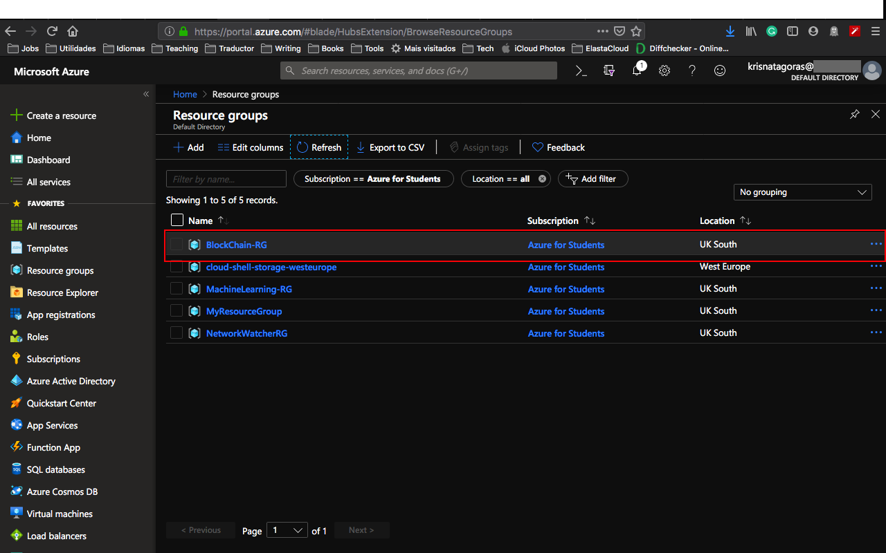

Go the Resource Group, find the Resource group you've created.
Click on the Resource Group and there it's our resources **Resources**:

- Azure Blockchain Service

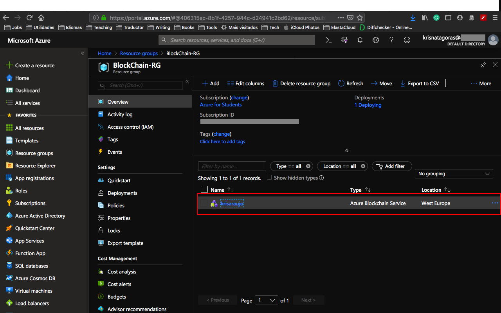

Click on the **Azure Blockchain Service** with your name, and on the next page, you have an overview of the service.

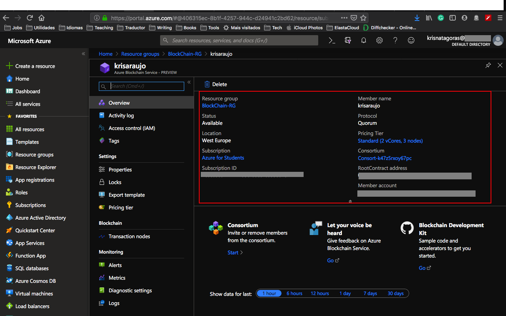

And that is just the tip of the iceberg. Now you can start to develop applications for your Blockchain Service.

Most important, don't forget to have fun!

###Using the Portal

At the Portal, in All Services look for **Templates**, you can favorite this service.

Click in **Add** to add your template:

On General, type a name and a description for your template, and click on [OK].

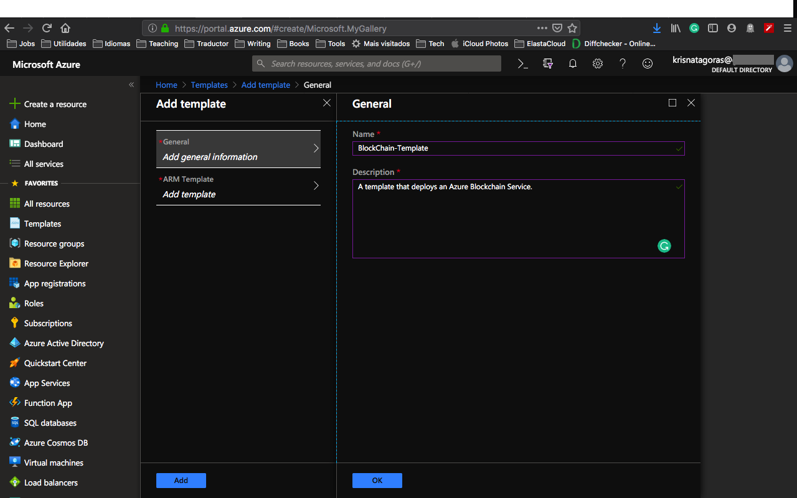

On ARM Template, replace the contents of the template with your template, and click on [OK].

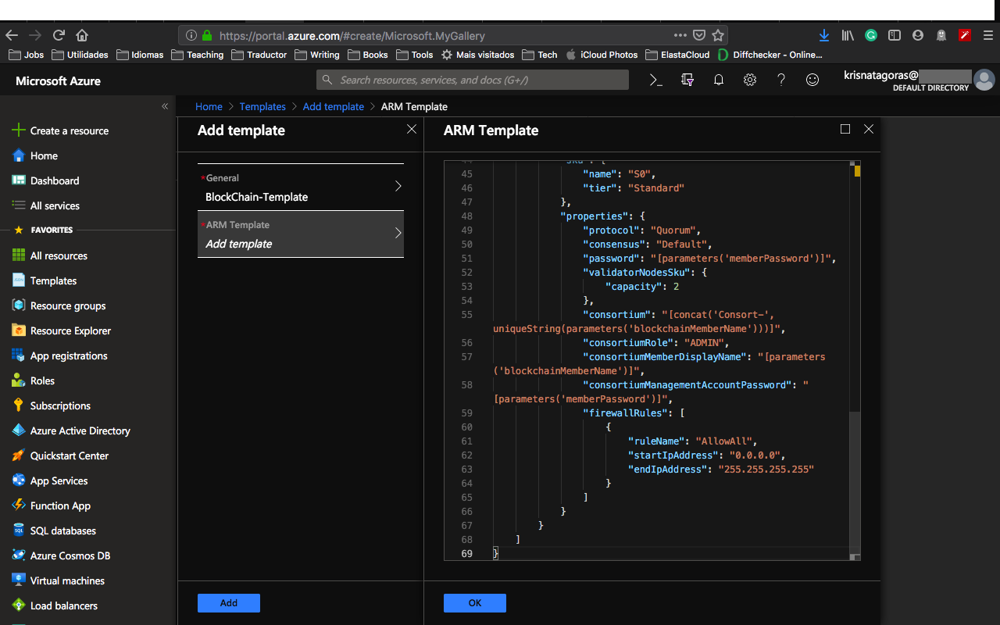

Click on the refresh button and there is your template:

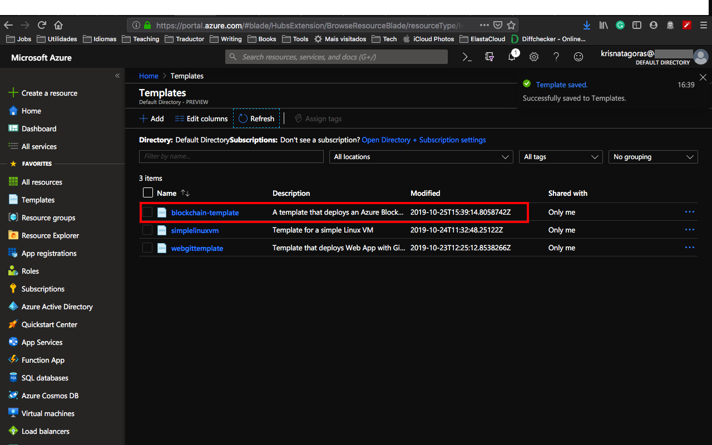

Open the template and click in [Deploy]

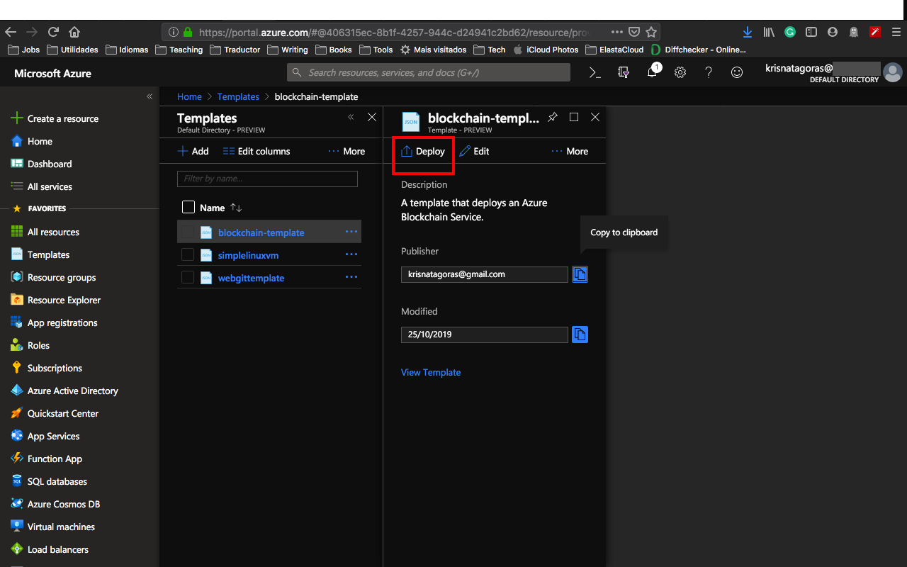

On the screen Custom Deployment, insert the information that you must be already familiar with.

Select [I agree] and click on [Purchase].

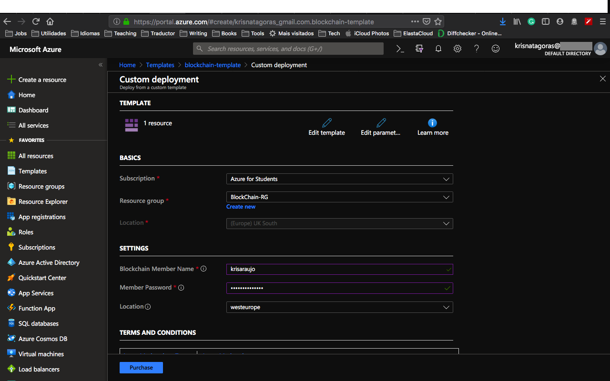

As you can see, it's deploying.

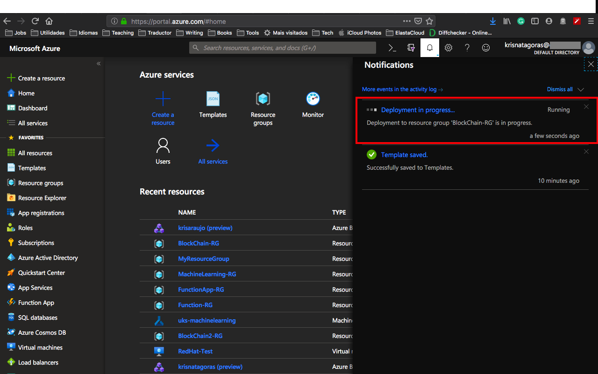

After a couple of minutes, voilà, you have your BlockChain Service deployed.

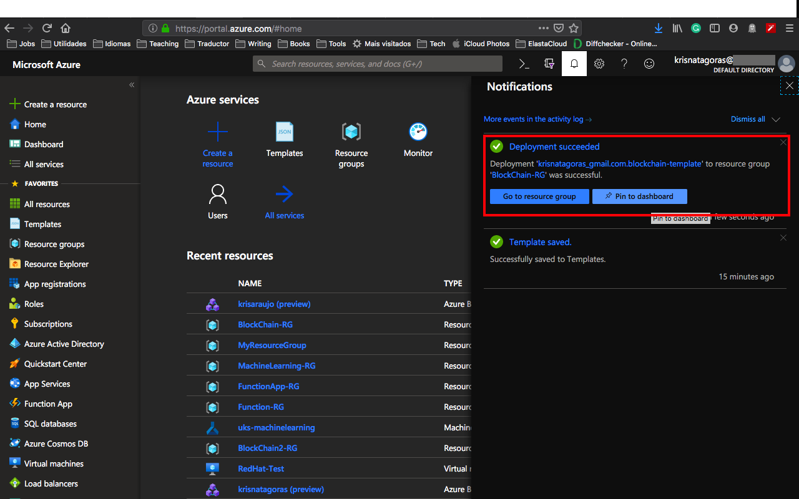

Go to the Resource. Repeat the test you have done before and enjoy your coding.

**p.s.: Pretty easy to create resources on Azure, right? But if you are the sort of IT guy that always looks for automating things on the extreme :D Surprise, surprise!.
Just click on the button below and it will automatically deploy the VM on your Azure Portal.**

#####Important disclaimer: Azure charge you for the resources you are using, and you don't want to finish all your credits at once, right? So, for not running out of credit, don't forget to stop the Web App at the portal or even delete the Resource Group you create to avoid any unnecessary charges.

###How to shutdown your resources:
####Using the portal:

On the portal, open your Resource Group, if you will not use the BlockChain Service anymore, you can just click on the [Delete] Button.

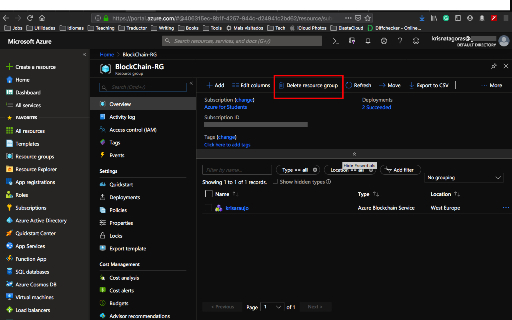
