# Azure Functions App

This time we will deploy a **Function App**. Azure Functions is a serverless compute service that lets you run event-triggered code without having to explicitly provision or manage infrastructure.  

With a **Function App** you also deploy a hosting Web Plan and a Storage account. The WebPlan is settled for Consumption. For more information about hosting Plans click [here!](https://docs.microsoft.com/en-gb/azure/azure-functions/functions-scale)  

And the Storage Account is for General Purpose **Standard_LRS**, for more information about Storage Accounts, click [here!](https://docs.microsoft.com/en-us/azure/storage/common/storage-account-overview)

## How Functions App works in Azure

Azure Functions is a solution for easily running small pieces of code, or "functions," in the cloud. You can write just the code you need for the problem at hand, without worrying about a whole application or the infrastructure to run it. Functions can make development even more productive, and you can use your development languages of choice, such as C#, Java, JavaScript, PowerShell, and Python. Pay only for the time your code runs and trust Azure to scale as needed. Azure Functions lets you develop serverless applications on Microsoft Azure.

## What can I do with Functions

Functions are a great solution for processing data, integrating systems, working with the internet-of-things (IoT), and building simple APIs and microservices. Consider Functions for tasks like image or order processing, file maintenance, or for any tasks that you want to run on a schedule.

## How much does Functions cost

Azure Functions has two kinds of pricing plans. Choose the one that best fits your needs:

- **Consumption plan** - When your function runs, Azure provides all of the necessary computational resources. You don't have to worry about resource management, and you only pay for the time that your code runs.
- **App Service plan** - Run your functions just like your web apps. When you are already using App Service for your other applications, you can run your functions on the same plan at no additional cost.

### The Template

The only parameter we need to inform is:

Parameter         | Suggested value     | Description
:--------------- | :-------------      |:---------------------
**funcName** |*location**name**enviroment* i.e.:  uksmyfunctiontst  | The unique name of Function App. I recommend you to use the notation above, which helps to create a unique name for your Web Application. The name must use alphanumeric and underscore characters only. There is a 35 character limit to this field. The App name cannot be changed once the bot is created.

## Deployment

There are a few ways to deploy this template.
You can use [PowerShell](https://docs.microsoft.com/en-us/azure/azure-resource-manager/resource-group-template-deploy), [Azure CLI](https://docs.microsoft.com/en-us/azure/azure-resource-manager/resource-group-template-deploy-cli), [Azure Portal](https://docs.microsoft.com/en-us/azure/azure-resource-manager/resource-group-template-deploy-portal) or your favorite SDK.

For this task, we will deploy using Visual Code with CLI extension and the portal. There is little surprise for you at the end of this tutorial.

For Azure CLI I'm using the Visual Code with Azure CLI extensions, if you like, you can find more information [here](https://code.visualstudio.com/docs/azure/extensions). But bare in mind that you don't need to use the Visual Code, you can stick with the old good always present **Command Line** on Windows or any **bash terminal**.

### Using Azure CLI with Visual Code

type on the terminal windows: **az login**

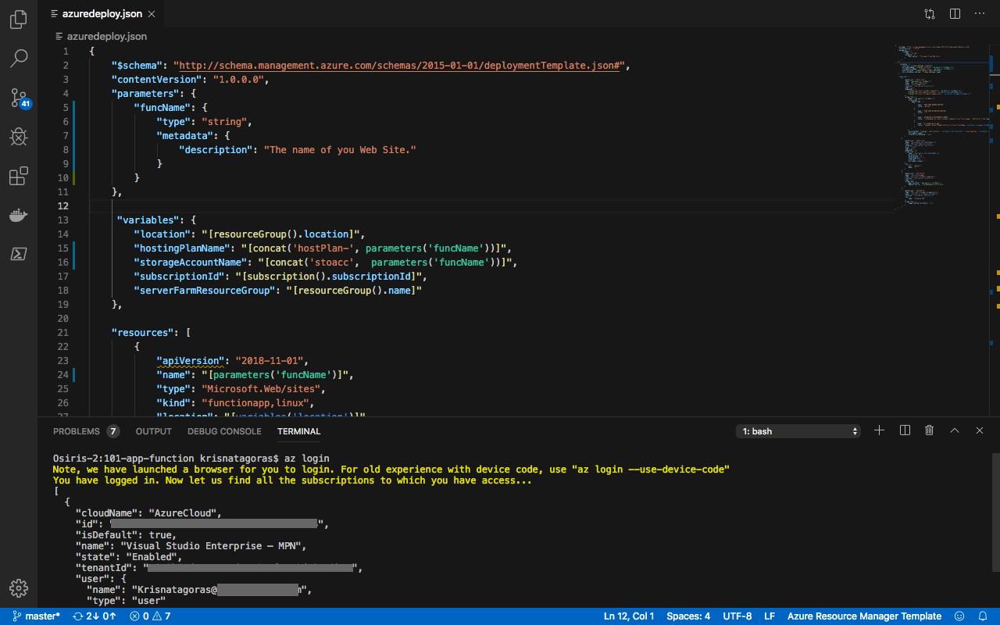

You will be redirected to the Azure Portal where you can use your credentials to login into.

After login, you gonna have your credentials.

To to set the right subscription, you can use the following command:

#### az account set --subscription "your subscription id"

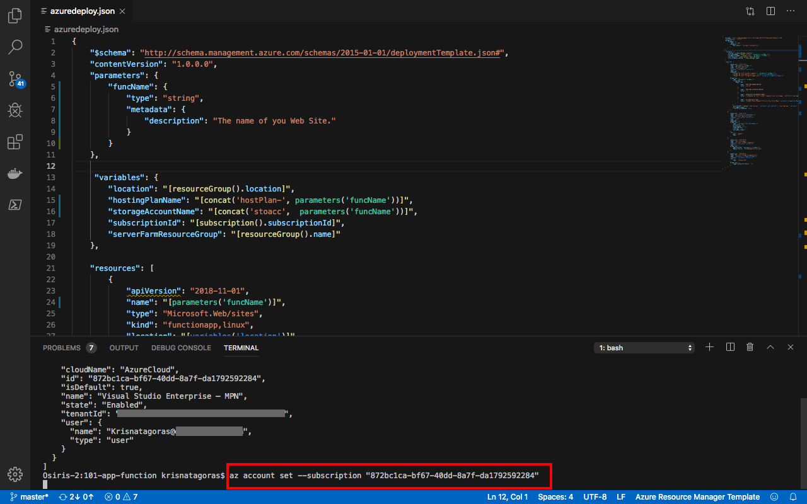

### Resource Group

After you logged in, you need to create a Resource Group for our deployment. If you haven't yet created a Resource Group, do that now! But before, what is a Resource Group? Bare with me! A Resource Group is a container that holds related resources for an Azure solution. The resource group includes those resources that you want to manage as a group. Simply saying, it's like a folder that contains files. Simple as that.

To create a Resource Group, you need a name and the location for your Resource Group.

For a list of locations, type: **az account list-locations**

To create the Resource group, just type the command:

#### az group create --name "resource-group" --location "your location"

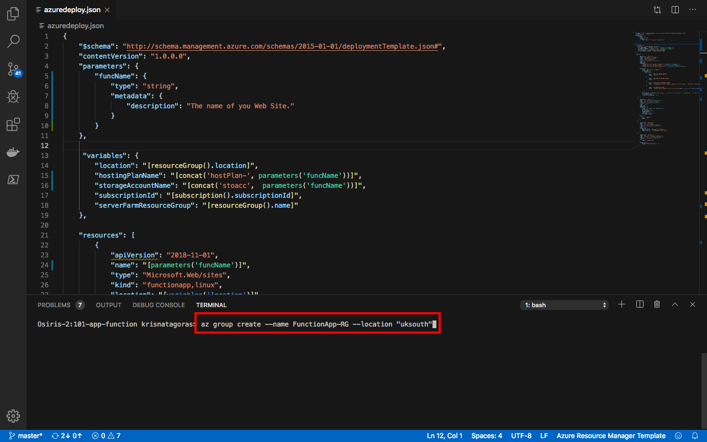

Super simple, right? Now that we have our **Resource Group** created, let's deploy our Function App.

#### az group deployment create --name "name of your deployment" --resource-group "resource-group" --template-file "./azuredeploy.json"

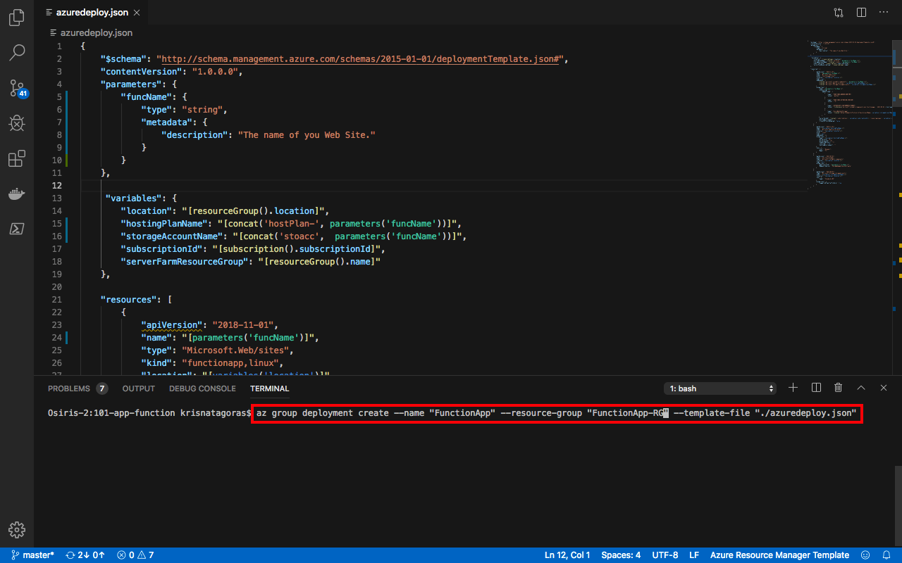

You need to insert the values for the parameters.
As you can see, it's running.

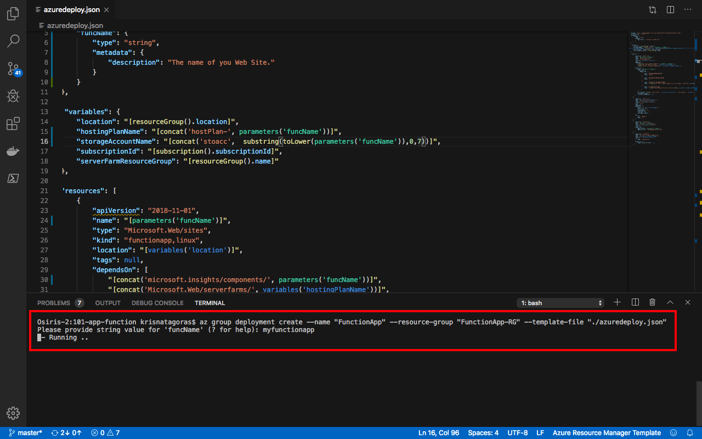

Go grab a cup of coffee, have some fresh air. Before you come back you will have your Function App.

And there we go, our deployment is Succeeded:

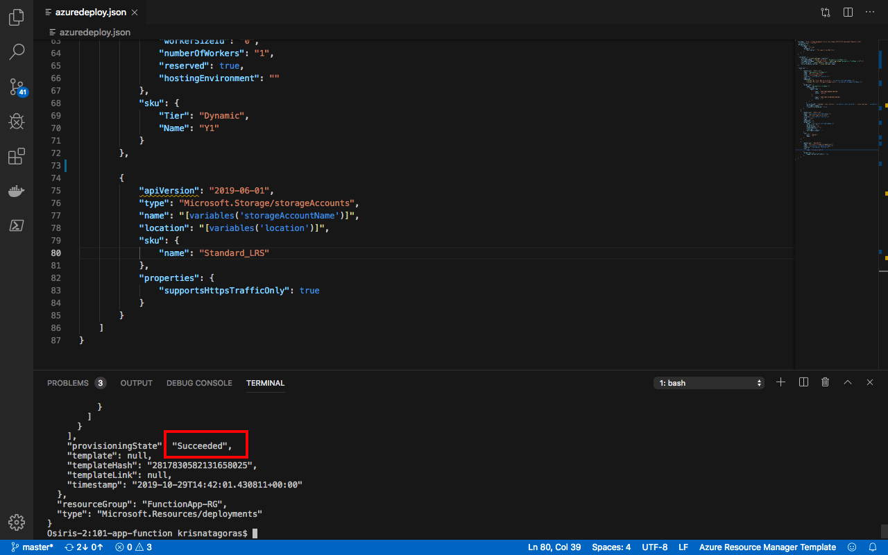

Let's go and check the resource at the [Azure Portal](https://portal.azure.com).

On the portal, go to Resource Groups. On this blade, you can see the Resource Group we've created.

Click on the Resource Group and there it's your resources **Resources**:

- App Service plan
- Storage Account
- App Service

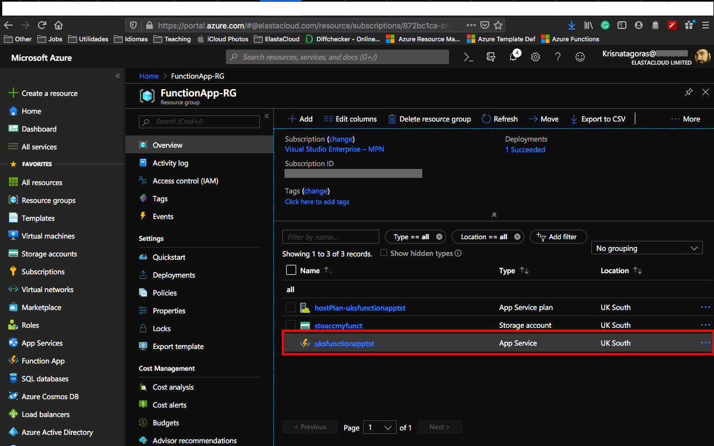

Click on the App Service and you will have an overview of your **Function App**.

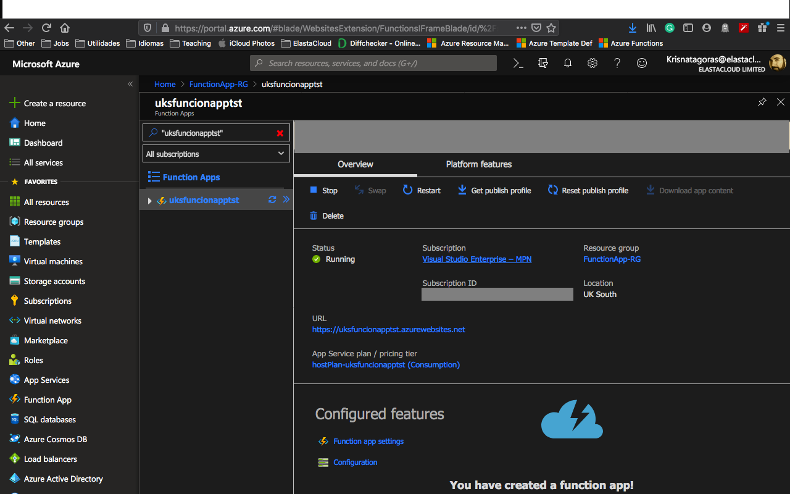

And that is just the tip of the iceberg. Now you can practice with your functions.

And the most important, don't forget to have fun!

### Using the Portal

At the Portal, in All Services look for **Templates**, you can favorite this service.

Click in **Add** to add your template:

On General, type a name and a description for your template, and click on [OK].

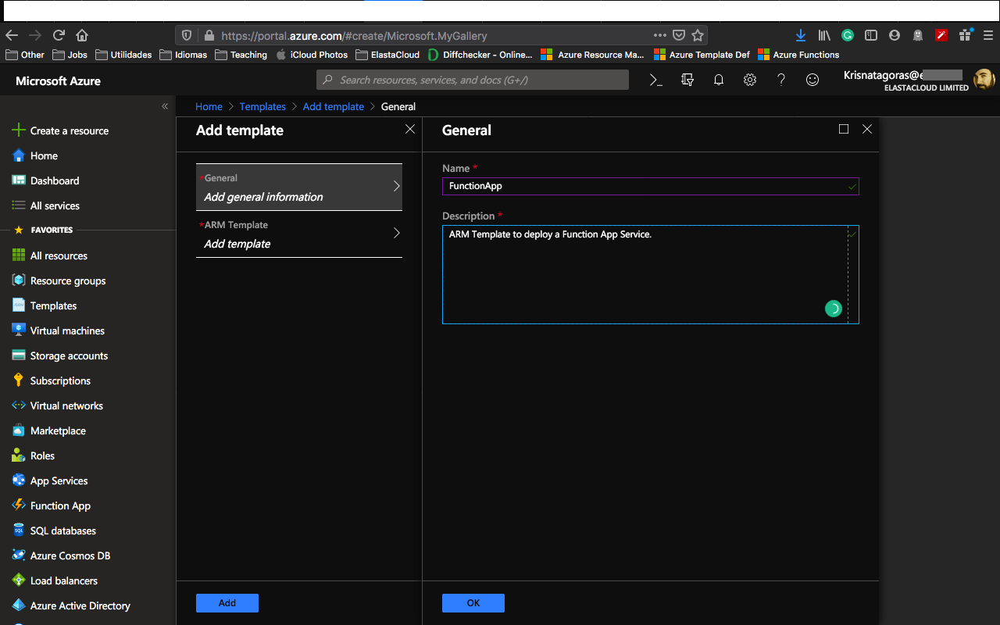

On ARM Template, replace the contents of the template with your template, and click on [OK].

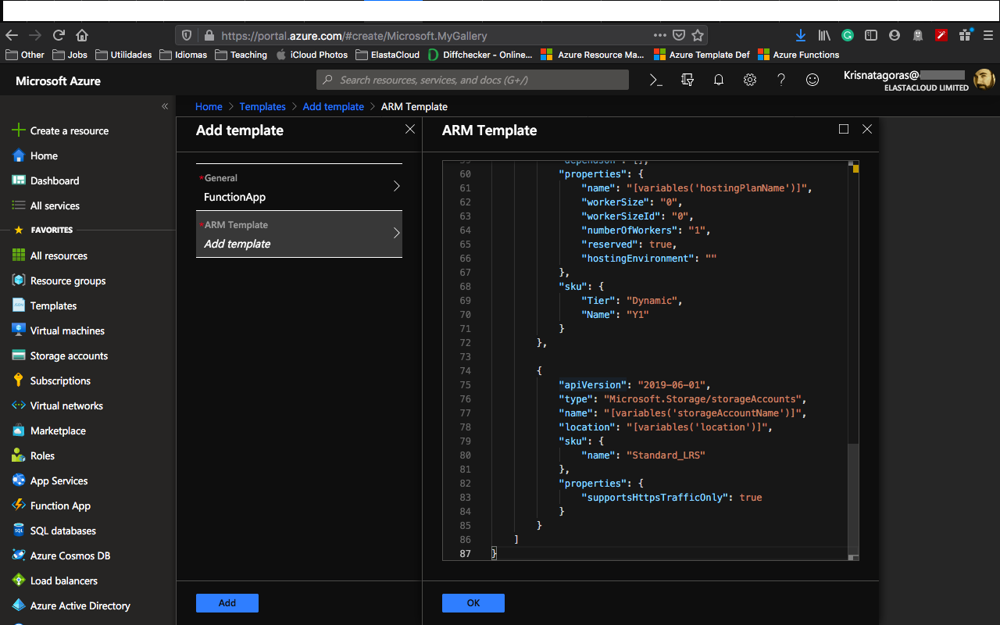

Click on the refresh button and you will find your template. Click on it and then click in [Deploy]

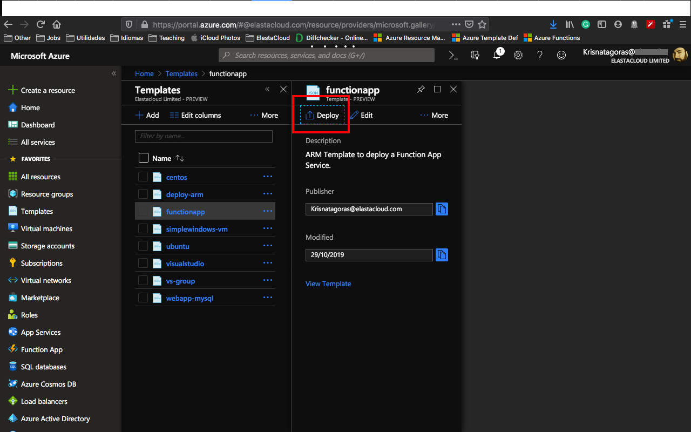

On the screen Custom Deployment, insert the information that you must be already familiar with.

Select [I agree] and click on [Purchase].

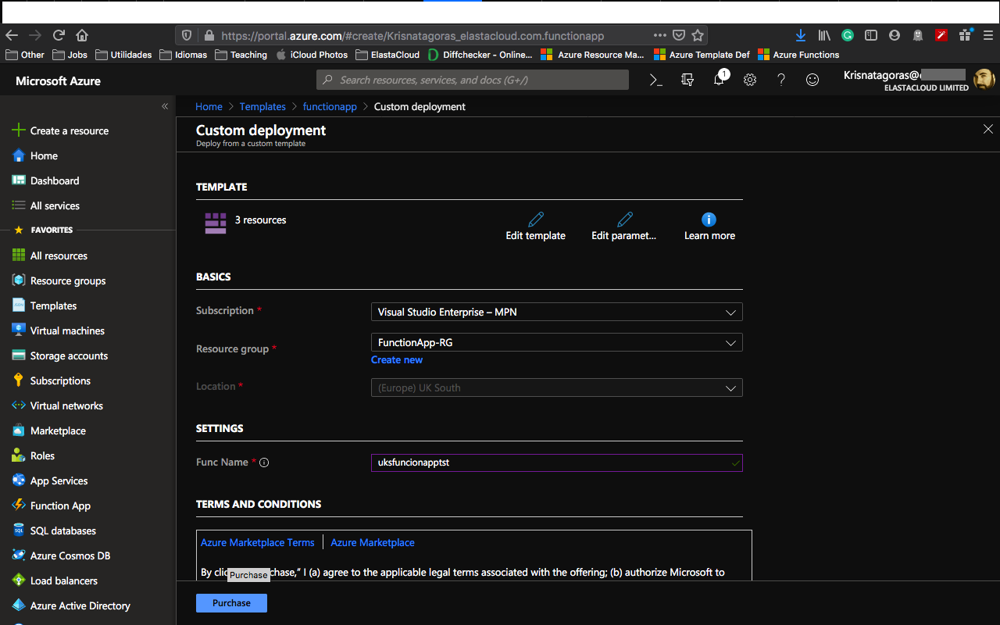

As you can see, it's deploying.

After a couple of minutes, voilà, you have your Function App deployed.

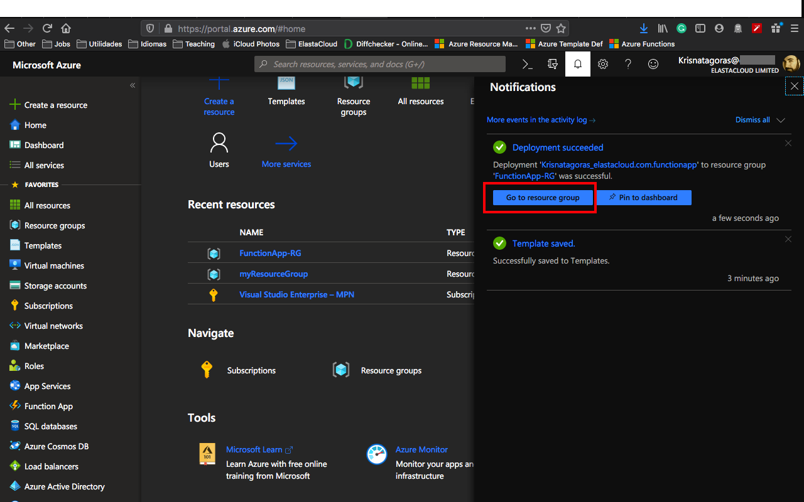

Go to the Resource. Repeat the test you have done before and enjoy your coding.

**p.s.: Pretty easy to create resources on Azure, right? But if you are the sort of IT guy that always looks for automating things on the extreme :D Surprise, surprise!. Just click on the button below and it will automatically deploy the VM on your Azure Portal.**

#### Important disclaimer: Azure charge you for the resources you are using, and you don't want to finish all your credits at once, right? So, for not running out of credit, don't forget to stop the Function App at the portal or even delete the Resource Group you create to avoid any unnecessary charges.

### How to shutdown your resources

#### Using the portal

On the portal, open your Resource Group, if you will not use the Web App anymore, you can just click on the [Delete] Button.

You can also just stop the Web App in case you gonna need the resource. Open the resource and click on Stop.

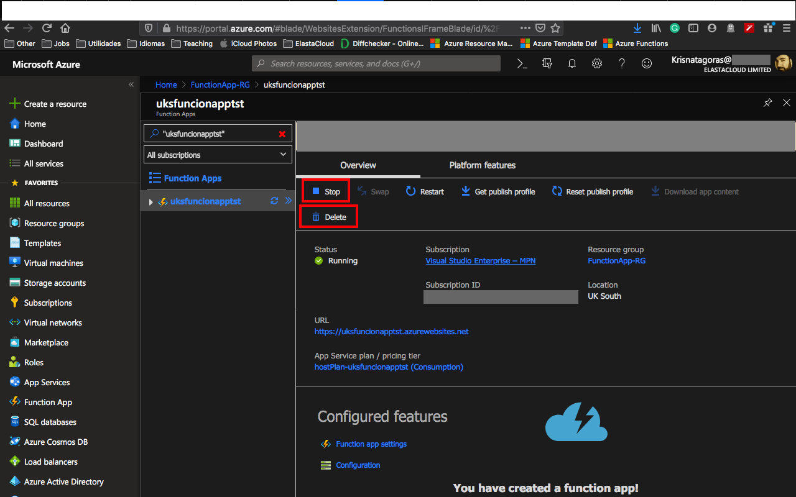

Just refresh your screen and you are good to go.
