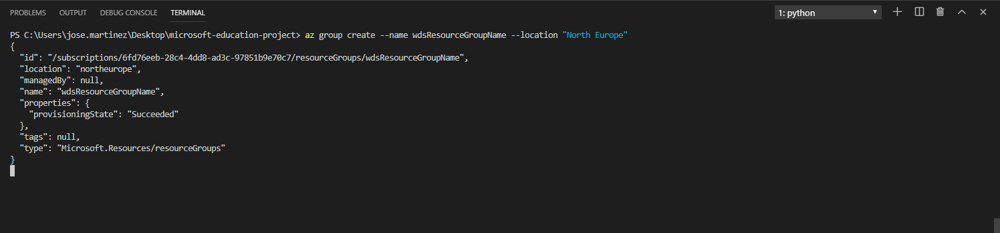
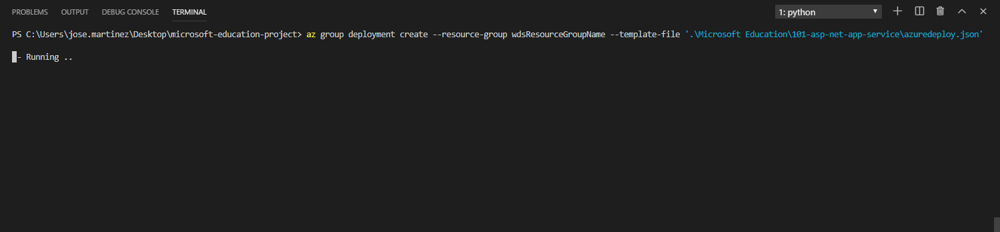
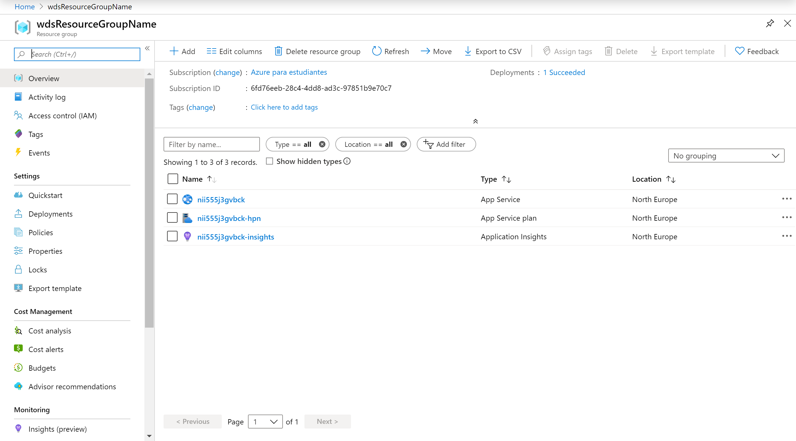
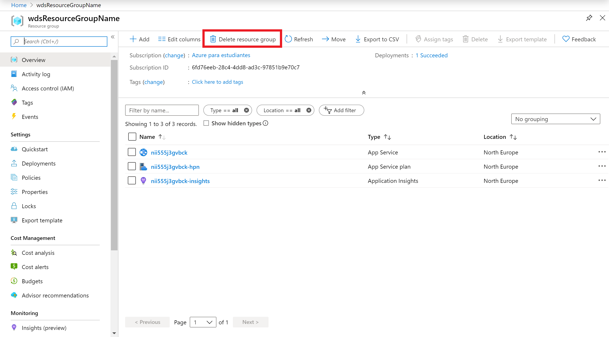

## Node App - App Service

The intent of this README is to deploy an ASP-NET App. This template was designed to be an easy and fast way to create an App Service to deploy your ASP-NET App.

You can deploy this template by using the [Azure Portal](https://docs.microsoft.com/en-us/azure/azure-resource-manager/resource-group-template-deploy-portal) or [Azure CLI](https://docs.microsoft.com/en-us/azure/azure-resource-manager/resource-group-template-deploy-cli). Let's dig on the template and have some fun coding.

### The template

In the template we have 3 different sections. These sections are:

    - Parameters
    - Variables
    - Resources

Let's see each section.

#### Parameters

The parameters are fields that we should modify of our App Service.
Here, we will find only a parameters: 

|**PARAMETERS NAME**   |**DESCRIPTION**   |
|---|---|
|name   |Name for your application. It has to be unique.   |
|location   |Location for the deploy of our resources.   |


Like this names has to be unique, we will ensure that by adding the name of the resource group where we will deploy the App Service to the name field. The format will be like follows:

```
<appServiceName>-<resourceGroupName>
```

#### Variables

The variables are fields that we should not modify. That's because it is configured to get our App Service deployed into a Free tier.

On that template, we have the following variables:

|**VARIABLES NAME**   |**DESCRIPTION**   |
|---|---|
|subscriptionId   |ID of our subscription   |
|hostingEnvironment   |Name of the App Service Environment. If you don't know if you need it, you should leave it empty. Here you can see some [documentation](https://docs.microsoft.com/en-in/azure/app-service/environment/intro)   |
|serverFarmResourceGroup   |Name of the resource group where our serverFarm is.   |
|alwaysOn   |It allows us to have the app On even if it is no traffic.   |
|sku   |Shape for our product.   |
|skuCode   |Code to identify our product.   |
|workerSize   |Optional. The worker size. Possible values are Small, Medium, and Large. For JSON, the equivalents are 0 = Small, 1 = Medium, and 2 = Large   |
|workerSizeId   |Gets or sets size ID of machines: 0 - Small 1 - Medium 2 - Large   |
|numberOfWorkers   |Gets or sets number of workers.   |
|hostingPlanName   |Name for the hosting plan. On free tier, you can only have 1 linux hosting environment.   |
|currentStack   |Framework used on the hosting   |
|netFrameworkVersion   |Framework version   |


#### Resources

The resources are the services that we will to deploy into Azure. In this template we will deploy three resources:

|**RESOURCE NAME**   |**DESCRIPTION**   |
|---|---|
|Microsoft.Web/sites   |This is our App Service.   |
|Microsoft.Web/serverfarms   |This is the hosting for our App Service.  |
|microsoft.insights/components   |Used to monitor our live web application   |

## Deployment

There are a few ways to deploy this template.
You can use [PowerShell](https://docs.microsoft.com/en-us/azure/azure-resource-manager/resource-group-template-deploy), [Azure CLI](https://docs.microsoft.com/en-us/azure/azure-resource-manager/resource-group-template-deploy-cli), [Azure Portal](https://docs.microsoft.com/en-us/azure/azure-resource-manager/resource-group-template-deploy-portal) or your favorite SDK.

For this task, we will deploy using the Portal and Azure CLI, I choose to use the Visual Code with Azure CLI extensions, if you like, you can find more information [here](https://code.visualstudio.com/docs/azure/extensions). But bare in mind that you don't need to use the Visual Code, you can stick with the old good always present **Command Line** on Windows or any **bash terminal**.

### Using Azure CLI with Visual Code
Type on the terminal windows: 

```
az login
```


You gonna be redirected to the Azure Portal where you can use your credentials to login into.

After login, you gonna have your credentials. 

In order to set the right subscription, you can use the follow command:

```
az account set --subscription "< your subscription id >"
```

### Resource Group

A resource group is a container that holds related resources for an Azure solution. The resource group includes those resources that you want to manage as a group. 

We gonna need to create a resource group for our deployment if we haven't yet create a resource group.

To create a resource group, we will need a name and the location. For a list of locations, type:

```
az account list-locations
```

To create the resource group, just type the command:

```
az group create --name <mygroupname> --location <thelocation>
```



Now, we are ready to deploy our template. Type the next command to get it:

```
az group deployment create --resource-group <your resource-group name> --template-file <full path and name of your template>
```



It will spend some time on the deployment. Bring it like 5 minutes until the process finish.

When it finished, let's go to the Portal, and let's see our App Services.



Congratulations! You have deployed the template succesfully. We can see our web visiting an url like that:

```
<app-name>.azurewebsites.net
```

You can redeploy it automatically with just click on this button: 

<a href="https://portal.azure.com/#create/Microsoft.Template/uri/https%3A%2F%2Fraw.githubusercontent.com%2FAzure4StudentQSTemplates%2Fazure-quickstart-templates%2Fmaster%2F101-asp-net-app-service%2Fazuredeploy.json" target="_blank">
    
</a>
<a href="http://armviz.io/#/?load=https%3A%2F%2Fraw.githubusercontent.com%2FAzure4StudentQSTemplates%2Fazure-quickstart-templates%2Fmaster%2F101-asp-net-app-service%2Fazuredeploy.json" target="_blank">
    
</a>


### Deploy your app

To deploy your our ASP.NET app you can follow that [tutorial](https://docs.microsoft.com/en-in/azure/app-service/app-service-web-get-started-dotnet#create-an-aspnet-core-web-app). 

Just take care when you want to publish your application, because you have to select an existing app service (the one que have created).

### How to shutdown your resources

On the portal, open your resource group and click on the Delete button.



### What to do if deployment fails

When we are trying to deploy our template, we can find that this fails. If that happens, what we will do it is to delete the resource group and then redeploy our template.

To delete the resource group, we will go to our resource group, and then, we will delete it exactly the same that we made on the last section.
