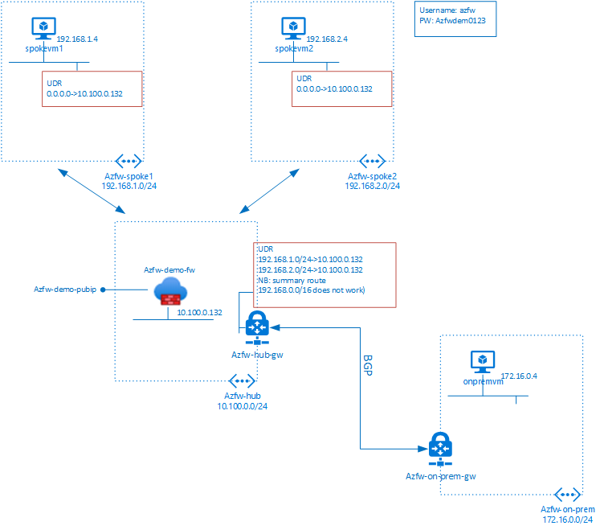
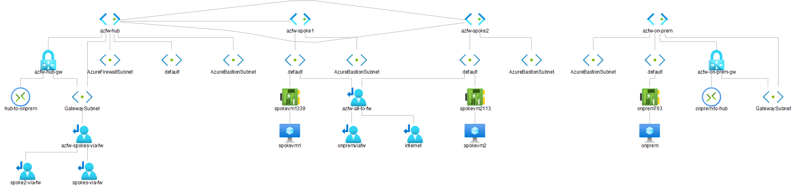

# 101-azurefirewall-hub-spoke-demo

&nbsp;
&nbsp;

&nbsp;
&nbsp;

&nbsp;
&nbsp;

## Overview and deployed resources

This template creates an Azure Firewall demonstration setup. The topology consists of a hub VNET with AZFW, two peered spokes with a VM in each, and a VNET simulating an on-premise location connected through S2SVPN. Bastion is deployed in each of the spoke and on-prem VNETs, to connect to the VMs without the need to for public ip's.
The Firewall is configured with rules permitting connectivity between the spoke VMs, and between the spokes and the on-prem VM.

The following resources are part of the solution:

+ **Azure Fiewall**
+ **VNET and VNET peering**: One Hub VNET, two Spoke VNETs peered to the Hub, one On-prem VNET
+ **Virtual Machines**: One in each Spoke and On-prem
+ **Bastion**: One in each Spoke and On-prem
+ **VPN Gateway with S2sVPN**: Between Hub and On-prem

## Deployment steps

Click the "Deploy to Azure" button at the beginning of this document or deploy the templates through Powershell or CLI. 
Remember to turn Windows Defender Firewall off manually on all VMs.

