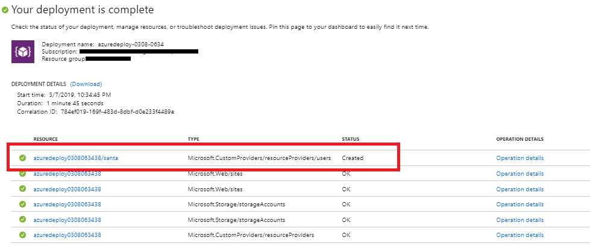

# Creating a Custom Provider with Resources

&nbsp;
&nbsp;

&nbsp;
&nbsp;

&nbsp;
&nbsp;

<a href="https://portal.azure.com/#create/Microsoft.Template/uri/https%3A%2F%2Fraw.githubusercontent.com%2FAzure%2Fazure-quickstart-templates%2Fmaster%2F101-custom-rp-with-function%2Fazuredeploy.json" target="_blank">
    
</a>
<a href="http://armviz.io/#/?load=https%3A%2F%2Fraw.githubusercontent.com%2FAzure%2Fazure-quickstart-templates%2Fmaster%2F101-custom-rp-with-function%2Fazuredeploy.json" target="_blank">
    
</a>

This sample template deploys a custom resource provider to Azure and creates a user using an ARM template.  You may optionally deploy the function app and custom provider definition - this only needs to be done once and then the custom resource can be deployed many times.

The customproviders resource is a hidden Azure resource so to confirm that the resource provider has been deployed you will have to check the box that says *Show hidden types* in the Azure portal Overview page for the resource group.


## Details on the custom resource provider created

This sample deployment creates the following two apis on the resource.

1) An ARM extended resource called "users"
2) An API called "ping"

### Users

The users resource is defined in the following part of the ARM template : 

```json
"resourceTypes": [
                                {
                                    "name":"users",
                                    "routingType":"Proxy,Cache",
                                    "endpoint": "[concat('https://', parameters('funcname'), '.azurewebsites.net/api/{requestPath}')]"
                                }
                            ]
```

In the above template we can see that the resource "users" has been defined as a Proxy resource which means that it is backed by a REST api endpoint. The details of the endpoint come next. The endpoint uri in the section refers to the endpoint that implements this resource. When the resource is defined as above , the resource will support all CRUD calls like "GET", "PUT", "DELETE" etc and it is expected that the endpoint has implemented them. In the above case this means that we will be able to make the following calls on ARM:

```
PUT/GET/DELETE /subscriptions/{subscriptionid}/resourceGroups/{resourcegroup}/providers/Microsoft.CustomProviders/resourceProviders/{customrpname}/users/name?<api-version>
```

You can see this in action in the last part of the template where we create this new user type : 

```json
        {
            "type": "Microsoft.CustomProviders/resourceProviders/users",
            "name": "[concat(parameters('funcname'), '/santa')]",
            "apiVersion": "2018-09-01-preview",
            "location": "eastus",
            "properties": {
                "FullName": "Santa Claus",
                "Location": "NorthPole"
            },
            "dependsOn": [
                "[concat('Microsoft.Web/sites/',parameters('funcname'))]"
            ]
        }
```

Navigating to the deployment details on the templatedeployment  will show a new resource type called resourceproviders/users created on the custom resource provider with the name santa


To confirm that the user has been created , you can use a rest api client such as postman and run the following query and see the results:

```
GET  
https://management.azure.com/subscriptions/{subscriptionid}/resourceGroups/{resourcegroup}/providers/Microsoft.CustomProviders/resourceProviders/{customrpname}/users/santa?api-version=2018-09-01-preview
```

You can also create\delete additional users.

### Ping action

In addition to users you can also define actions on your resourceprovider. An example action called ping is provided here defined as follows:

```json
"actions": [
                                {
                                    "name": "ping",
                                    "routingType":"Proxy",
                                    "endpoint": "[concat('https://', parameters('funcname'), '.azurewebsites.net/api/{requestPath}')]"
                                }
                            ]
```

The format for this action is similar to the resource type defined above , but since this is an action this call will only support POST methods as follows:

```
POST  
https://management.azure.com/subscriptions/{subscriptionid}/resourceGroups/{resourcegroup}/providers/Microsoft.CustomProviders/resourceProviders/{customrpname}/ping?api-version=2018-09-01-preview
```

The code that enables this process is all implemented as part of the azure function that is deployed along with the template. To further understand how the function has been configured please look here:

+ [**Creating an azure function**](SampleFunctions/CSharpSimpleProvider/README.md)

