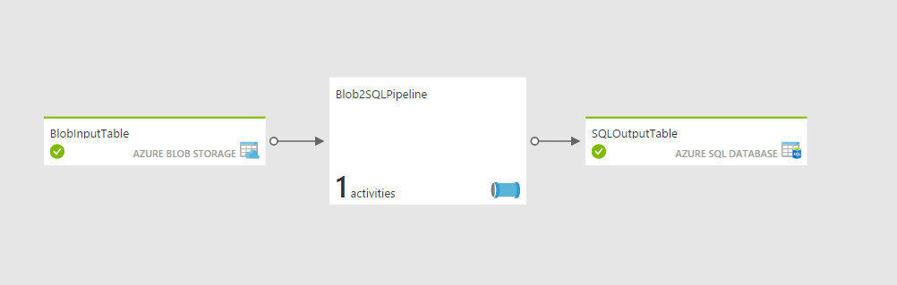

# Copy data from Azure Blob Storage to Azure SQL Database
Please do the following steps before deploying the template: 

1. Complete the prerequisites mentioned in [Overview and prerequisites](https://azure.microsoft.com/documentation/articles/data-factory-copy-data-from-azure-blob-storage-to-sql-database/) article.
2. Update values for the following parameters in **azuredeploy.parameters.json** file. 
	1. storageAccountName
	2. storageAccountKey
	3. sqlServerName
	4. databaseName
	5. sqlServerUserName
	6. sqlServerPassword  

<a href="https://portal.azure.com/#create/Microsoft.Template/uri/https%3A%2F%2Fraw.githubusercontent.com%2FAzure%2Fazure-quickstart-templates%2Fmaster%2F101-data-factory-blob-to-sql-copy%2Fazuredeploy.json" target="_blank">
    
</a>
<a href="http://armviz.io/#/?load=https%3A%2F%2Fraw.githubusercontent.com%2FAzure%2Fazure-quickstart-templates%2Fmaster%2F101-data-factory-blob-to-sql-copy%2Fazuredeploy.json" target="_blank">
    
</a>

When you deploy this Azure Resource Template, a data factory is created with the following entities: 

- Azure Storage linked service
- Azure SQL Database linked service
- Azure Blob dataset
- Azure SQL dataset
- Pipeline with a copy activity 

The copy activity in the pipeline copies data from an Azure blob to an Azure SQL database. You should see a diagram similar to the following one in the diagram view of the data factory.  



## Deploying sample
You can deploy this sample directly through the Azure Portal or by using the scripts supplied in the root of the repository.

To deploy a sample using the Azure Portal, click the **Deploy to Azure** button at the top of the article. 

To deploy the sample via the command line (using [Azure PowerShell or the Azure CLI](https://azure.microsoft.com/en-us/downloads/)) you can use the scripts.

Simply execute the script and pass in the folder name of the sample.  For example:

```PowerShell
.\Deploy-AzureResourceGroup.ps1 -ResourceGroupLocation 'eastus' -ArtifactStagingDirectory 101-data-factory-blob-to-sql-copy
```
```bash
azure-group-deploy.sh -a 101-data-factory-blob-to-sql-copy -l eastus