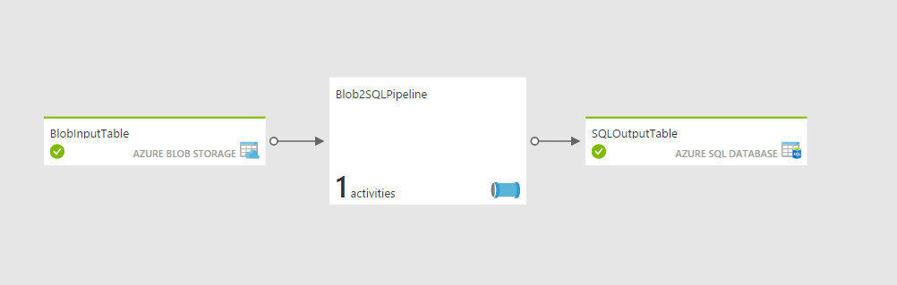

# Azure Data Factory Data Copy Activity

This template creates a very simple Data Factory pipeline that copies data from a file in a Blob Storage into a SQL Database table. Prior to  executing this make sure you have a Storage Account and a SQL Database provisioned. 

## Prerequisites:
1. Azure Storage
2. Source CSV file within a blob container 
3. Azure SQL Database
4. Target table in the database

Data Factory result diagram:

