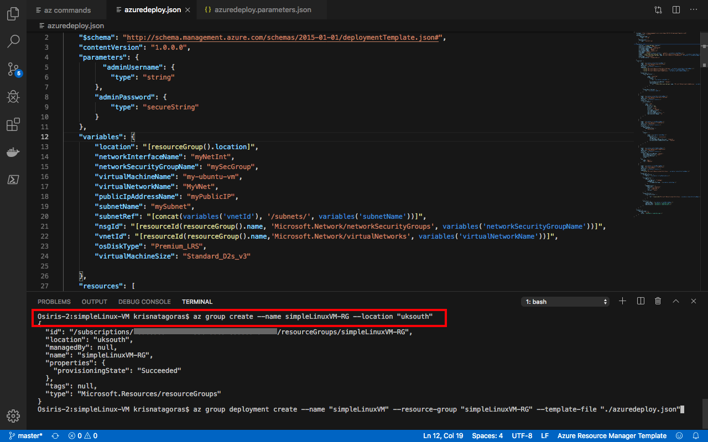
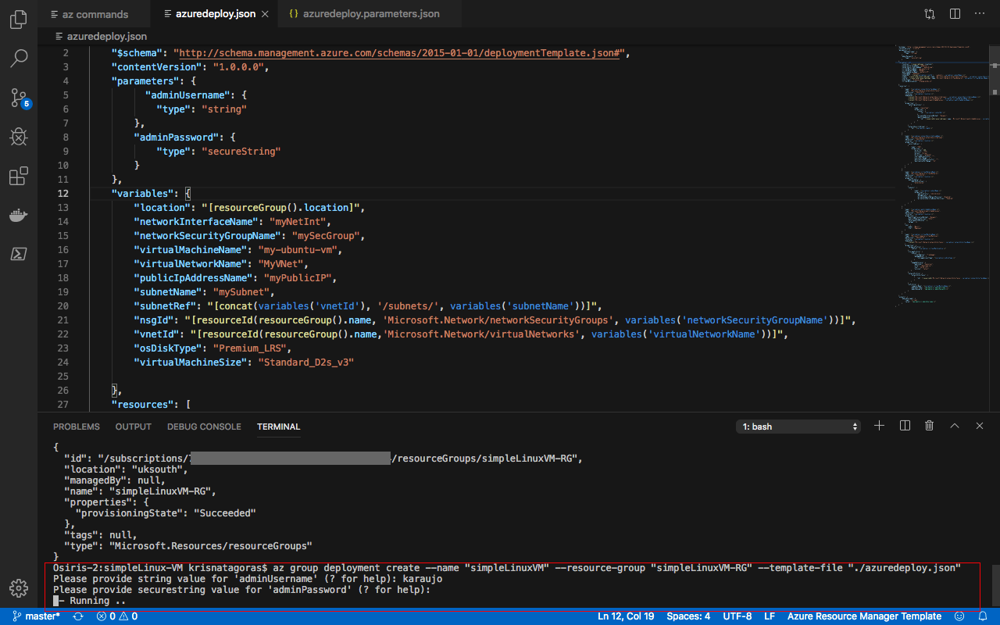

# Deploy a Network Security Group, a Virtual Network and an Azure Databricks Workspace with the Virtual Network

The purpose of this ARM Template is **Deploy a Network Security Group, a Virtual Network and an Azure Databricks Workspace with the Virtual Network** inserting a few parameters.

## The Template

Don't let the size of the template scares you. The structure is very intuitive and once that you get the gist of it, you will see how much easier your life will be deploying resources to Azure.

These are the parameters on the template, most of them already have values inserted, the ones that you need to inform are: **adminUsername**, **adminPassword** and **resourceGroup**.

Parameter         | Suggested value     | Description
:--------------- | :-------------      |:---------------------
**WorkspaceName** |  | The name of your DataBricks Workspace.
**Pricing Tier** | 14 Day Trial, Standard or Premium
**Resource Group** The Resource Group which you wish to deploy your DataBricks Environment. 
**Disable Public Ip** | Default is false | Set this to true to disable Public IP creation.

All the other parameters can be left as default.

**Nsg Name** Name of the network Security Group
**Vnet Name** Name of the Virtual Network
**Private Subnet Name** Name of the Private Subnet
**Public Subnet Name** Name of the Public Subnet
**Location** Location of Data Center
**Vnet Cidr** Cidr Range of the Vnet
**Private Subnet Cidr** Cidr Range of the Private Subnet
**Public Subnet Cidr** Cidr Range of the Public Subnet
**NAT Gateway Name** Name of the NAT Gateway
**NAT Gateway Public IP Name** Name of the NAT Gateway Public IP

## Deployment

There are a few ways to deploy this template.
You can use [PowerShell](https://docs.microsoft.com/en-us/azure/azure-resource-manager/resource-group-template-deploy), [Azure CLI](https://docs.microsoft.com/en-us/azure/azure-resource-manager/resource-group-template-deploy-cli), [Azure Portal](https://docs.microsoft.com/en-us/azure/azure-resource-manager/resource-group-template-deploy-portal) or your favorite SDK.

For Azure CLI I'm using the Visual Code with Azure CLI extensions. If you would like you can find more information [here](https://code.visualstudio.com/docs/azure/extensions). But bare in mind that you don't need to use the Visual Code app, you can stick with the always present **Command Line** on Windows or the Linux **bash terminal**.

### Using Azure CLI with Visual Code

In the terminal window type: **az login**

You will be redirected to the Azure Portal in your web browser where you can insert your credentials and log in.

After logging in, you will see your credentials on the terminal.

To set the right subscription, type following command:

#### az account set --subscription "your subscription id"

### Resource Group

Now you need a Resource Group for our deployment. If you haven't already created a Resource Group, you can do it now. If you are new to Azure and wonder what is a Resource Group? Bare with me! A Resource Group is a container that holds related resources for an Azure solution. The resource group includes those resources that you want to manage as a group. Simply saying: it's like a folder that contains files. Simple as that.

To create a Resource Group, you need a name and a location for your Resource Group.

For a list of locations, type: **az account list-locations**

To create the Resource group, type the command:

#### az group create --name "resource-group" --location "your location"

Super simple, right? Now that we have our **Resource Group** created, let's deploy the **Simple Linux Virtual Machine** using the az cli.

#### az group deployment create --name "name of your deployment" --resource-group "resource-group" --template-file "./azuredeploy.json"

Insert the values for the parameters.
As you can see, it's running.

Go grab a cup of coffee, have some fresh air. Before you come back you will have your  **Virtual Machine**.

And there we go, your deployment has Succeeded:

Let's check the resource in the [Azure Portal](https://portal.azure.com).

On the portal, navigate to Resource Groups. On this blade, you can see the Resource Group we've created.

Click on the Resource Group to expand and show the **Resources**:

- DataBricks-nsg
- Databricks-vnet
- DataBricks Workspace

Click on the Databricks workspace and then click in **Launch Workspace**.

And Voilà, there you have a brandy new DataBricks Environment.

Most important, don't forget to have fun!

### Using the Portal

Using your favorite web browser Navigate to the Portal, in All Services look for **Templates**, you may want to add this service to favorites.

Click on **Add** to add your template:

On General, type the name and the description for your template, and click on [OK].

On ARM Template, replace the contents of the template with your template, and click on [OK].

Click on the refresh button and there is your template:

Open the template and click in [Deploy]

On the screen Custom Deployment, insert the information that you must be already familiar with.

Select [I agree] and click on [Purchase].

As you can see, it's deploying.

After a couple of minutes, voilà, you have your DataBricks Environment deployed.

Go to the Resource. Repeat the test that you have done before.

**p.s.: It's pretty easy to create resources on Azure, right? But if you are the sort of IT guy that always loves automation, here is the surprise. Just click on the button below and it will automatically deploy simple Linux Virtual Machine through the  Azure Portal.**

#### Important disclaimer: Azure charges you for the resources you are using, and you don't want to use all your credits at once, right? So, don't forget to stop the Virtual Machine at the portal or even delete the Resource Group you have created to avoid unnecessary charges

### How to shutdown your resources

#### Using the portal

On the portal, open your Resource Group, you can delete the DataBricks Environment by clicking on [Delete].

You can also delete the Resource Group. Click on the Resource Group and then in [Delete].

Just refresh your screen and you are good to go.
