# Create Azure Machine Learning Services Resources with the Deploy to Azure Button below

# Azure Machine Learning Workspace

The purpose of this ARM Template is to deploy an **Azure Machine Learning workspace** with a **Storage account**, **Container registry**, **Key vault** and **Application Insights**.

But let's understand a bit better how **Azure Machine Learning workspace** work.

## Overview

### What is machine learning

Machine learning is a data science technique that allows computers to use existing data to forecast future behaviors, outcomes, and trends. By using machine learning, computers learn without being explicitly programmed.

Forecasts or predictions from machine learning can make apps and devices smarter. For example, when you shop online, machine learning helps recommend other products you might want based on what you've bought. Or when your credit card is swiped, machine learning compares the transaction to a database of transactions and helps detect fraud. And when your robot vacuum cleaner vacuums a room, machine learning helps it decide whether the job is done.

### What is Azure Machine Learning

Azure Machine Learning provides a cloud-based environment you can use to prep data, train, test, deploy, manage, and track machine learning models. Start training on your local machine and then scale out to the cloud. The service fully supports open-source technologies such as PyTorch, TensorFlow, and sci-kit-learn and can be used for any kind of machine learning, from classical ml to deep learning, supervised and unsupervised learning.

Explore and prepare data, train and test models, and deploy them using rich tools such as:

- A visual interface in which you can drag-n-drop modules to build your experiments and then deploy models
- Jupyter notebooks in which you use the SDKs to write your code, such as these sample notebooks
- Visual Studio Code extension

For more information, you can consult [Azure Machine Learning Documentation](https://docs.microsoft.com/en-gb/azure/machine-learning/)

### What is an Azure Machine Learning workspace

The workspace is the top-level resource for Azure Machine Learning, providing a centralized place to work with all the artifacts you create when you use Azure Machine Learning. The workspace keeps a history of all training runs, including logs, metrics, output, and a snapshot of your scripts. You use this information to determine which training run produces the best model.

Once you have a model you like, you register it with the workspace. You then use the registered model and scoring scripts to deploy to Azure Container Instances, Azure Kubernetes Service, or a field-programmable gate array (FPGA) as a REST-based HTTP endpoint. You can also deploy the model to an Azure IoT Edge device as a module.

## The Template

Don't let the size of the template scares you. The structure is very intuitive and once that you get the gist of it, you will see how much easier your life will be deploying resources to Azure.

These are the parameters on the template, they already have values inserted, so you don't need to worry about changing them.

Here the list of all parameters:

Parameter | Suggested value | Description
:--------------- | :------------- |:---------------------
**workspaceName** | globally unique name | The name of the machine learning workspace.
**location** | location | This template takes the location of your Resource Group. Treating appropriately the available locations for each resource.

## Deployment

There are a few ways to deploy this template.
You can use [PowerShell](https://docs.microsoft.com/en-us/azure/azure-resource-manager/resource-group-template-deploy), [Azure CLI](https://docs.microsoft.com/en-us/azure/azure-resource-manager/resource-group-template-deploy-cli), [Azure Portal](https://docs.microsoft.com/en-us/azure/azure-resource-manager/resource-group-template-deploy-portal) or your favorite SDK.

For Azure CLI I'm using the Visual Code with Azure CLI extensions. If you would like you can find more information [here](https://code.visualstudio.com/docs/azure/extensions). But bare in mind that you don't need to use the Visual Code app, you can stick with the always present **Command Line** on Windows or the Linux **bash terminal**.

### Using Azure CLI with Visual Code

In the terminal window type: **az login**

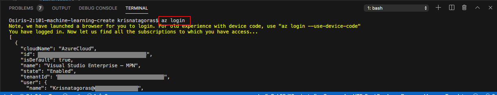

You will be redirected to the Azure Portal in your web browser where you can insert your credentials and log in.

After logging in, you will see your credentials on the terminal.

To set the right subscription, type following command:

#### az account set --subscription "your subscription id"

### Resource Group

Now you need a Resource Group for our deployment. If you haven't already created a Resource Group, you can do it now. If you are new to Azure and wonder what is a Resource Group? Bare with me! A Resource Group is a container that holds related resources for an Azure solution. The resource group includes those resources that you want to manage as a group. Simply saying: it's like a folder that contains files. Simple as that.

To create a Resource Group, you need a name and a location for your Resource Group.

For a list of locations, type: **az account list-locations**

The Machine Learning service isn't yet available for all locations. Check the availability of locations [here](https://azure.microsoft.com/en-gb/global-infrastructure/services/?products=).

To create the Resource group, type the command:

#### az group create --name "resource-group" --location "your location"

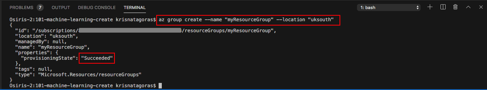

Super simple, right? Now that we have our **Resource Group** created, let's deploy the **Azure Machine Learning workspace** using the az CLI.

#### az group deployment create --name "name of your deployment" --resource-group "resource-group" --template-file "./azuredeploy.json"

As you can see, it's running.

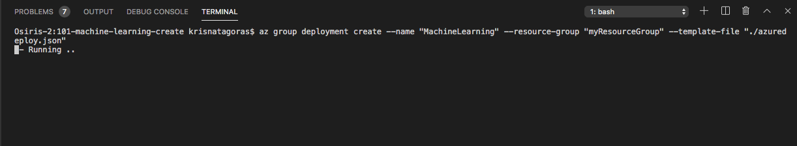

Go grab a cup of coffee, have some fresh air. Before you come back you will have your **Azure Machine Learning workspace**.

And there we go, your deployment has Succeeded:

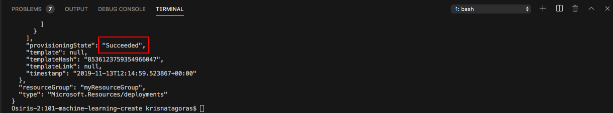

Let's check the resource in the [Azure Portal](https://portal.azure.com).

On the portal, navigate to Resource Groups. On this blade, you can see the Resource Group we've created.

Click on the Resource Group to expand and show the **Resources**:

- Application Insights
- Key vault
- Container registry
- Storage account
- Machine Learning

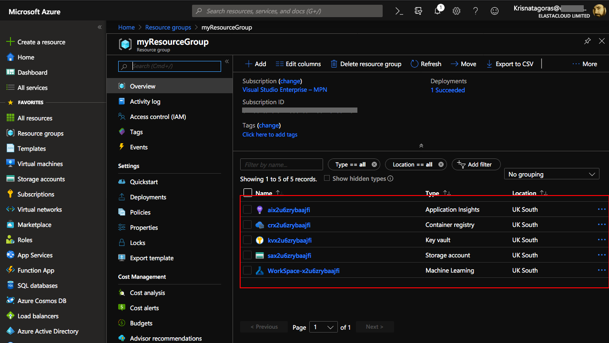

Click on **Machine Learning** and you will have an overview of your **WorkSpace**.

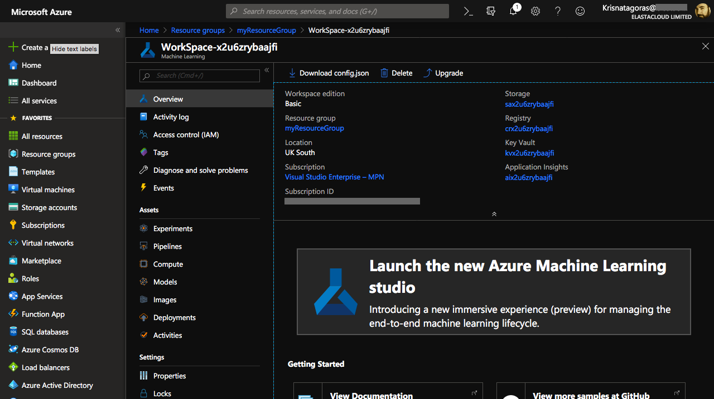

Congratulations, you have deployed a **Machine Learning Workspace** and that is just the tip of the Iceberg.

Most important, don't forget to have fun!

### Using the Portal

Using your favorite web browser Navigate to the Portal, in All Services look for **Templates**, you may want to add this service to favorites.

Click on **Add** to add your template:

On General, type the name and the description for your template, and click on [OK].

On ARM Template, replace the contents of the template with your template, and click on [OK].

Click on the refresh button and you will find your template. Click on your template and then click in [Deploy]

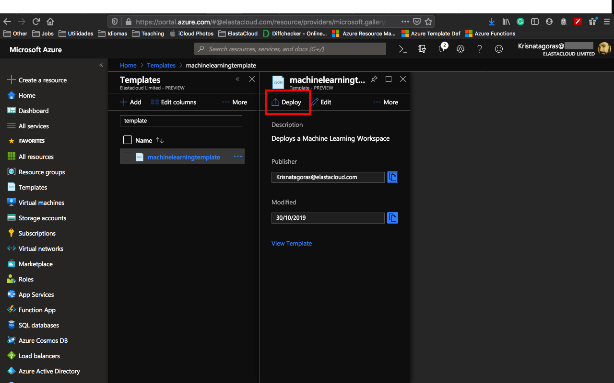

On the screen Custom Deployment, inform the values for the parameters, by now you must be already familiar with these.

Select [I agree] and click on [Purchase].

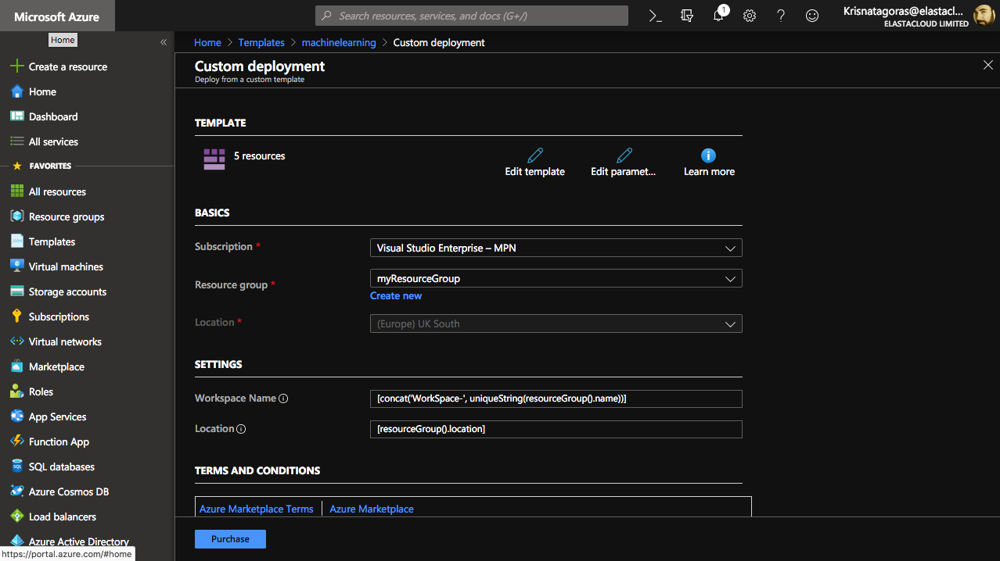

As you can see, it's deploying.

After a couple of minutes, voilà, you have your **Azure Machine Learning workspace** deployed.

Go to the Resource. Repeat the test that you have done before.

**p.s.: It's pretty easy to create resources on Azure, right? But if you are the sort of IT guy that always loves automation, here is the surprise. Just click on the button below and it will automatically deploy Azure Machine Learning workspace through the Azure Portal.**

#### Important disclaimer: Azure charges you for the resources you are using, and you don't want to use all your credits at once, right? So, don't forget to stop the Azure Machine Learning workspace at the portal or even delete the Resource Group you have created to avoid unnecessary charges

## How to shutdown your resources

## Using the portal

On the portal, open your Resource Group, if you want to remove the **Azure Machine Learning workspace **, you can just click on the [Delete] Button.

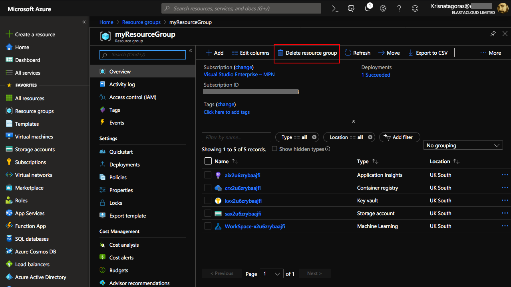

Just refresh your screen and you are good to go.

## Create Additional Resources Needed

Once you have created the base Azure Machine Learning Service Workspace we need to add additional compute resources.

## Create Compute Targets

### Create Machine Learning Compute

- Click on the nav Compute
- Click New
- Enter a name for the resource
- Select Machine Learning Compute from the dropdown
- Select the machine size
- Enter the min and max nodes (recommend min of 0 and max of 5)
-Click Create Create Compute

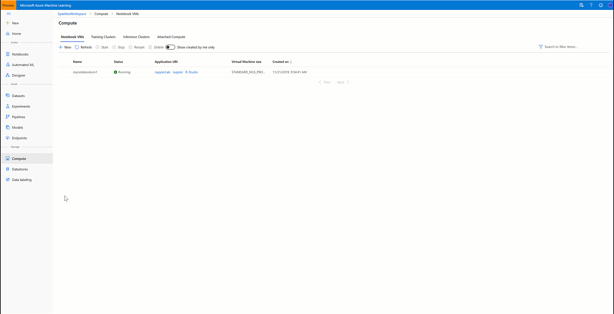

### Create Notebook Virtual Machine

- Click on the Notebook VM nav
- Click New
- Give the notebook a unique name
- Select the VM size (NC6 is always good)
- Click Create Create VM
- Optional Kuberetes Cluster

### Create Kubernetes Compute

- Click on the nav Compute
- Click New
- Enter a name for the resource
- Select Kubernetes Service from the dropdown
- Click Create Create Kubernetes
- Retrieve important information

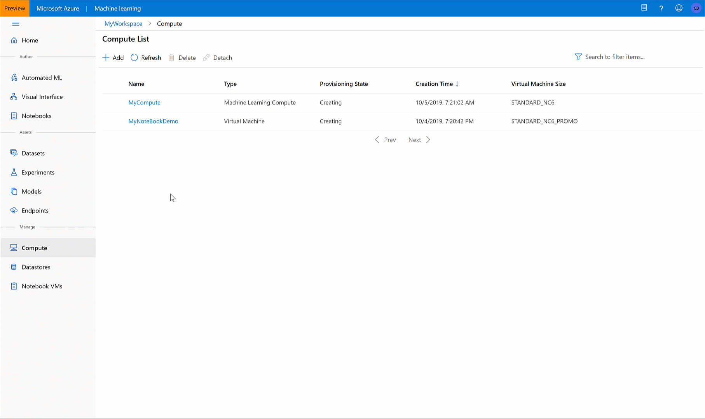

## In order to run the demos you will need to retrieve the following information:

subscription id: You can get this by going to <azure.portal.com> and logging into your account. Search for subscriptions using the search bar,click on your subscription and copy the id.
resource group: the name of the resource group you created in the setup steps
compute target name: the name of the compute target you created in the setup steps
Make sure to never commit any of these details to Git / GitHub

### Resources

- [Azure Machine learning](https://azure.microsoft.com/services/machine-learning )
- [Create development environment for Machine learning](https://docs.microsoft.com/azure/machine-learning/service/how-to-configure-environment)
- [Hyperparameter tuning in AML](https://docs.microsoft.com/azure/machine-learning/service/how-to-tune-hyperparameters)
- [AML Python SDK](https://docs.microsoft.com/azure/machine-learning/service/how-to-configure-environment)
- [AML Pipelines](https://docs.microsoft.com/azure/machine-learning/service/how-to-create-your-first-pipeline)
- [Getting started with Auto ML](https://docs.microsoft.com/azure/machine-learning/service/concept-automated-ml)
- [Intro to AML – MS Learn](https://docs.microsoft.com/en-us/learn/modules/intro-to-azure-machine-learning-service)
- [Automate model select with AML - MS Learn](https://docs.microsoft.com/en-us/learn/modules/automate-model-selection-with-azure-automl)
- [Train local model with AML - MS Learn](https://docs.microsoft.com/en-us/learn/modules/train-local-model-with-azure-mls)
