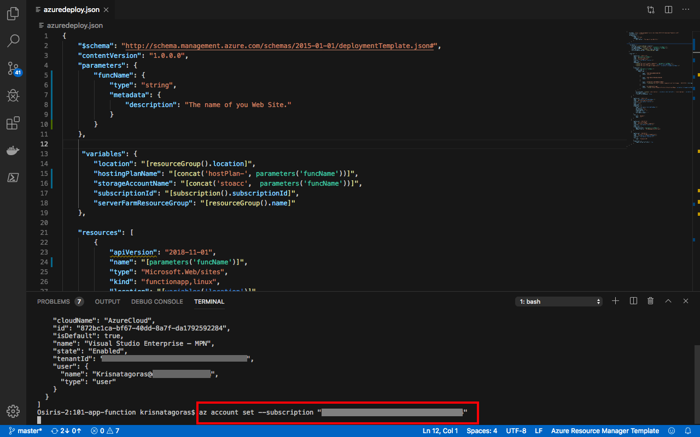
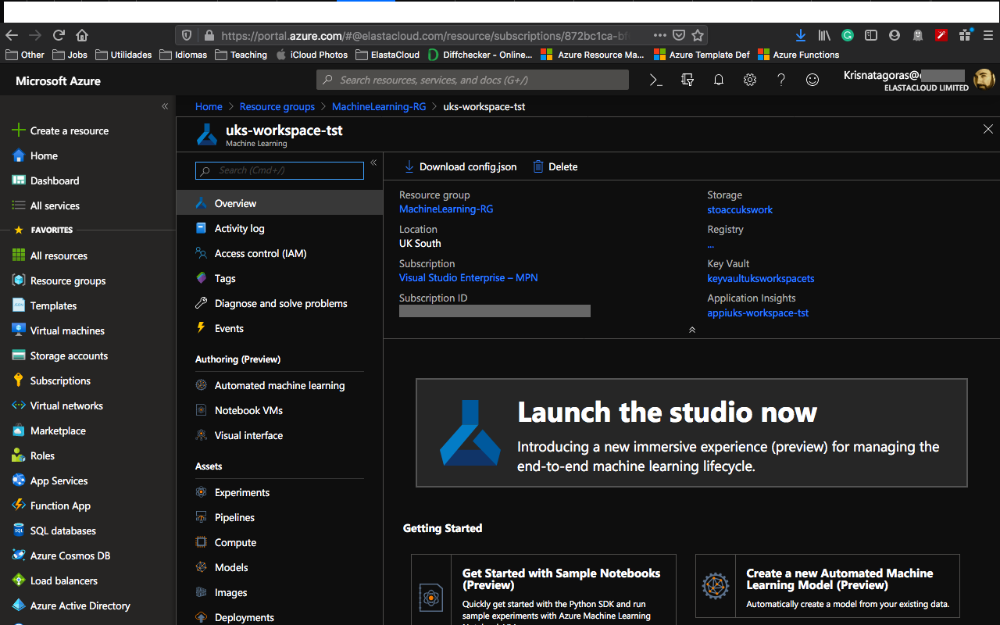
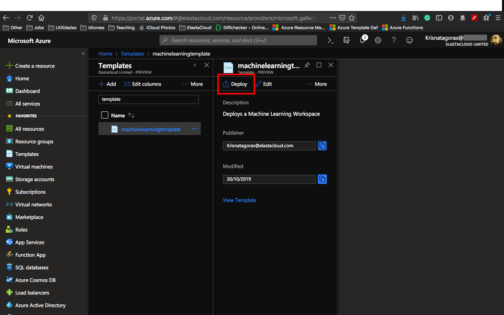

# Azure Machine Learning Workspace

We will deploy an **Azure Machine Learning workspace**. The workspace is the top-level resource for Azure Machine Learning. It provides a centralized place to work with all the artifacts you create when you use Azure Machine Learning. You can share a workspace with others.

With an **Azure Machine Learning workspace** you also deploy a **Standard Storage Account**, **Application Insights** and **Key Vault** for your credentials.  

For more information about [Storage Account](https://docs.microsoft.com/en-gb/azure/storage/common/storage-account-overview) and [Key Vaults](https://docs.microsoft.com/en-gb/azure/key-vault/key-vault-overview), [Application Insights](https://docs.microsoft.com/en-gb/azure/azure-monitor/overview) click on the links. 

### What is machine learning?

Machine learning is a data science technique that allows computers to use existing data to forecast future behaviors, outcomes, and trends. By using machine learning, computers learn without being explicitly programmed.

Forecasts or predictions from machine learning can make apps and devices smarter. For example, when you shop online, machine learning helps recommend other products you might want based on what you've bought. Or when your credit card is swiped, machine learning compares the transaction to a database of transactions and helps detect fraud. And when your robot vacuum cleaner vacuums a room, machine learning helps it decide whether the job is done.

### What is Azure Machine Learning?

Azure Machine Learning provides a cloud-based environment you can use to prep data, train, test, deploy, manage, and track machine learning models. Start training on your local machine and then scale out to the cloud. The service fully supports open-source technologies such as PyTorch, TensorFlow, and scikit-learn and can be used for any kind of machine learning, from classical ml to deep learning, supervised and unsupervised learning.

Explore and prepare data, train and test models, and deploy them using rich tools such as:

- A visual interface in which you can drag-n-drop modules to build your experiments and then deploy models
- Jupyter notebooks in which you use the SDKs to write your own code, such as these sample notebooks
- Visual Studio Code extension

For more information, you can consult [Azure Machine Learning Documentation](https://docs.microsoft.com/en-gb/azure/machine-learning/)

### What is an Azure Machine Learning workspace?

The workspace is the top-level resource for Azure Machine Learning, providing a centralized place to work with all the artifacts you create when you use Azure Machine Learning. The workspace keeps a history of all training runs, including logs, metrics, output, and a snapshot of your scripts. You use this information to determine which training run produces the best model.

Once you have a model you like, you register it with the workspace. You then use the registered model and scoring scripts to deploy to Azure Container Instances, Azure Kubernetes Service, or to a field-programmable gate array (FPGA) as a REST-based HTTP endpoint. You can also deploy the model to an Azure IoT Edge device as a module.

###The Template

The only parameter we need to inform is:

Parameter         | Suggested value     | Description
:--------------- | :-------------      |:---------------------
**workspaceName** |*location*-*name*-*enviroment* i.e.:  uks-workspace-tst  | The name of your ML Workspace. I recommend you to use the notation above, which helps to create a unique name for your ML Workspace. The name must use alphanumeric and underscore characters only. There is a 35 character limit to this field. The Workspace name cannot be changed once the bot is created.

##Deployment
There are a few ways to deploy this template.
You can use [PowerShell](https://docs.microsoft.com/en-us/azure/azure-resource-manager/resource-group-template-deploy), [Azure CLI](https://docs.microsoft.com/en-us/azure/azure-resource-manager/resource-group-template-deploy-cli), [Azure Portal](https://docs.microsoft.com/en-us/azure/azure-resource-manager/resource-group-template-deploy-portal) or your favorite SDK.

For this task, we gonna deploy using Azure CLI and the portal and a little surprise for you at the end. :D

For Azure CLI I choose to use the Visual Code with Azure CLI extensions, if you like, you can find more information [here](https://code.visualstudio.com/docs/azure/extensions). But bare in mind that you don't need to use the Visual Code, you can stick with the old good always present **Command Line** on Windows or any **bash terminal**.

###Using Azure CLI with Visual Code
type on the terminal windows: **az login**

You gonna be redirected to the Azure Portal where you can use your credentials to login into.

After login, you gonna have your credentials.

In order to set the right subscription, you can use the following command:

**az account set --subscription "< your subscription id >"**

####Resource Group

After you logged in, we gonna need to create a Resource Group for our deployment. If you haven't yet created a Resource Group, we gonna do that now! But what is a Resource Group, one might ask. Bare with me! A Resource Group is a container that holds related resources for an Azure solution. The resource group includes those resources that you want to manage as a group. Simply saying, it's like a folder that contains files. Simple as that ;-)

To create a Resource Group, you need a name and the location for your Resource Group.

For a list of locations, type: **az account list-locations**

To create the Resource group, just type the command:

**az group create --name MachineLearning-RG --location < yourlocation >**

Super simple, right? Now that we have our **Resource Group** created, let's deploy our ML Workspace.

**az group deployment create --name "name of your deployment" --resource-group "The group you created" --template-file "./azuredeploy.json"**

You gonna need to insert the name of your WorkSpace and press [Enter].
As you can see, it's running.   

Go grab a cup of coffee or have some fresh air and I'm sure that before you come back you gonna have your ML Working Space deployed.

And there we go, our deploy is Succeeded:  

Let's go and check the resource at the [Azure Portal](https://portal.azure.com).

On the portal, go to Resource Groups. On this blade, you can see the Resource Group we've created.

Click on the Resource Group and there it's your resources **Resources**:

- Application Insights
- Key vault
- Storage account
- Machine Learning

Click on **Machine Learning** and you will have an overview of your **WorkSpace**.

Congratulations, you have deployed a **Machine Learning Workspace** and that is just the tip of the Iceberg.

Don't forget to have fun!

###Using the Portal

At the Portal, in All Services look for **Templates**, you can favorite this service.

Click in **Add** to add your template:

On General, type a name and a description for your template, and click on [OK].

On ARM Template, replace the contents of the template with your template, and click on [OK].

Click on the refresh button and you will find your template. Click on it and then click in [Deploy]

On the screen Custom Deployment, insert the information that you must be already familiar with.

Select [I agree] and click on [Purchase].

As you can see, it's deploying.

After a couple of minutes, voilà, you have your ML Workspace deployed.

Go to the Resource. Repeat the test you have done before and enjoy your coding.

**p.s.: Pretty easy to create resources on Azure, right? But if you are the sort of IT guy that always looks for automating things on the extreme :D Surprise, surprise!.
Just click on the button below and it will automatically deploy on your Azure Portal.**

#####Important disclaimer: Azure charge you for the resources you are using, and you don't want to finish all your credits at once, right? So, for not running out of credit, don't forget to stop the Workspace at the portal or even delete the Resource Group you create to avoid any unnecessary charges.

###How to shutdown your resources:
####Using the portal:

On the portal, open your Resource Group, if you will not use the ML Workspace, you can just click on the [Delete] button on the overview blade.

Or even delete your Resource Group.

Just refresh your screen and you are good to go.
