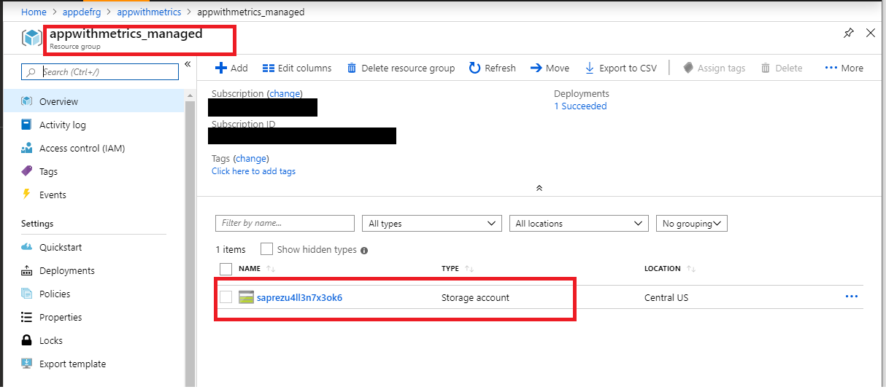
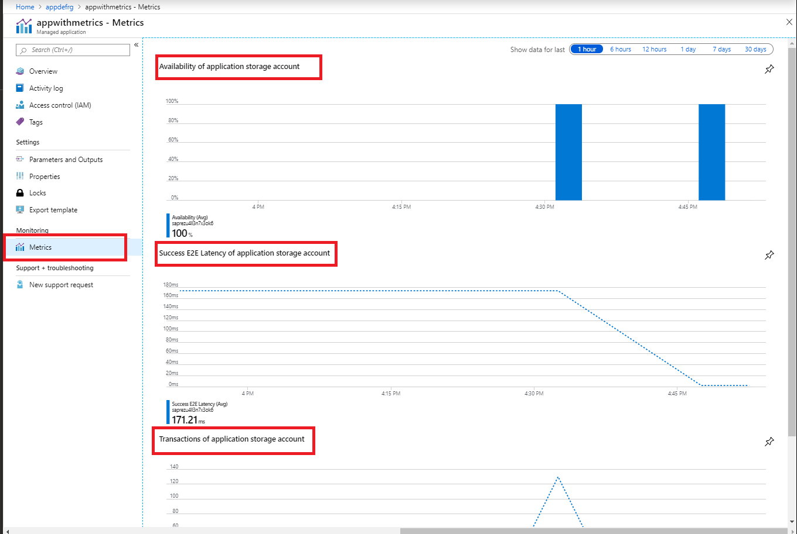

# Deploying your first Managed Application with default view

This sample template deploys a Service catalog managed application definition that creates a storage account as part of an application. The application definition has a customized default application overview (header and description) and expose storage account metrics (availability, success E2E latency and transactions) as application metrics.

## Overview experience and application metrics

This sample deployment creates the following two resources:

1) A service catalog managed application definition.
2) A managed application that contains a storage account.

Once you click on the deployed managed application you will notice that Overview contains header and description of the application.

If you click managed resource group in managed application Overview, you'll see a storage account created inside that resource group.

Go back to the deployed application and click Metrics menu item. You'll see 3 storage account metrics exposed as application metrics: Availability, Success E2E latency and Transactions.

Both Overview and Metrics experiences are driven by [viewDefinition.json](artifacts/ManagedAppZip/viewDefinition.json) file from the deployed application definition package that was used to deploy the application.

Overview is defined by "kind": "Overview" element, that has values for the header and description shown as a default overview experience.

Metrics are defined by "kind": "Metrics" element. You can use any metric supported by your application Azure resource to expose it as application metric. You can use different metrics view: bar chart, line chart etc for better visualization. You can drill down into metric that you are interested in and explore more using [Azure Metrics Explorer](https://docs.microsoft.com/en-us/azure/azure-monitor/platform/metrics-getting-started) capabilities.

To learn more about View definition please visit:
+ [**View definition artifact in Azure Managed Applications**](https://docs.microsoft.com/en-us/azure/managed-applications/concepts-view-definition)
