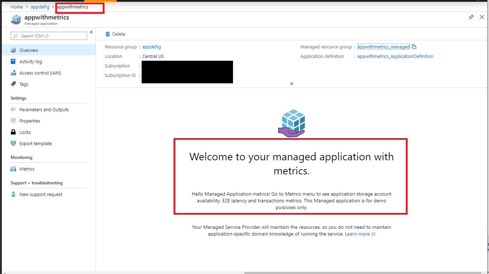
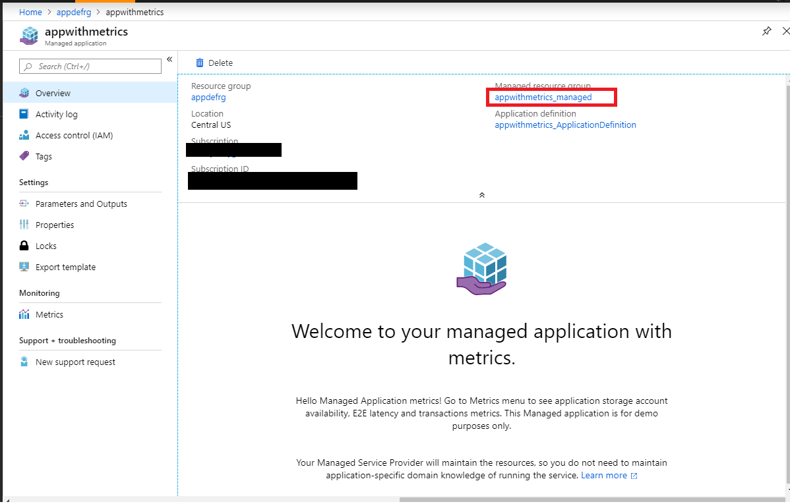
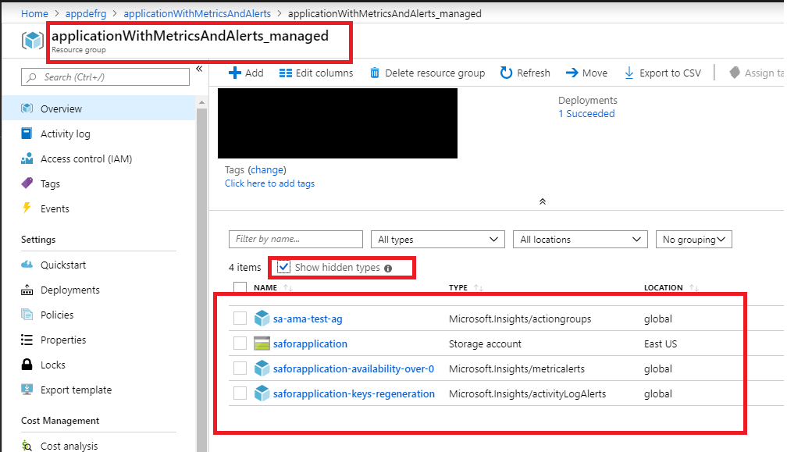
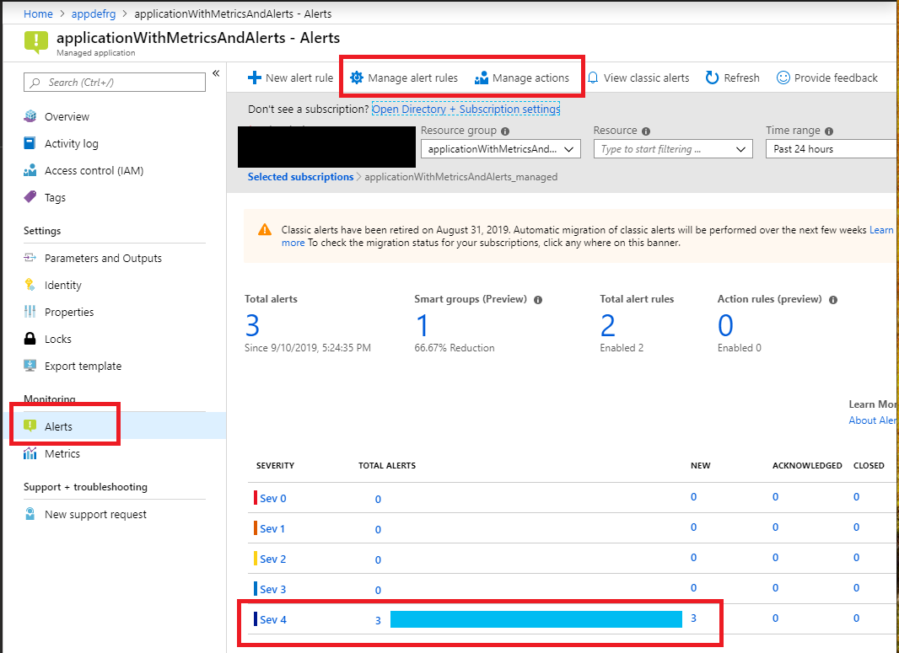
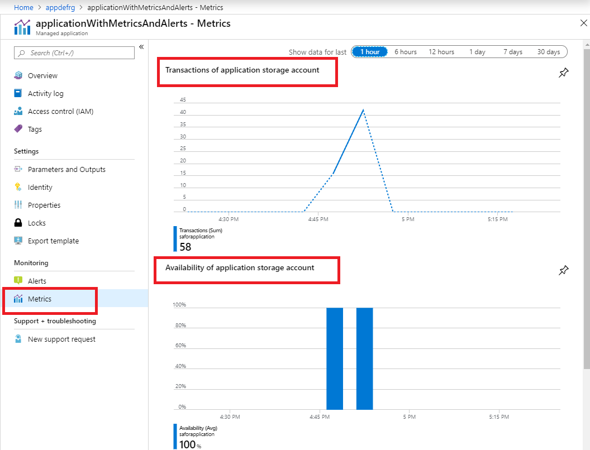

# Creating managed application with metrics and alerts

If this is your first time learning about Azure managed applications, please visit:
+ [**Deploying your first managed application**](https://github.com/Azure/azure-quickstart-templates/tree/master/101-managed-application).

This sample shows how you can author a Service catalog managed application definition that will allow to deploy managed application with defined metrics and alerts.
Managed application will contain single storage account as a resource, expose application metrics: storage account metrics (availability, success E2E latency,  transactions), and alerts: metric alert based on storage account availability and activity log alerts based on regenerating storage account keys.

This sample template combines two steps:

1. Deploys a Service catalog managed application definition.
1. Deploys a managed application using deployed application definition.

In a production environment a typical scenario would deploy the application definition and application instance as separate steps. Usually definition is deployed once and an application many times. In this sample the two steps are combined to make it easy to quickly see the final result of those steps.

Once your deployed this sample template, go to the deployed managed application. Application Overview contains header and description of the application.

This view is driven by [viewDefinition.json](artifacts/ManagedAppZip/viewDefinition.json) file from application definition package.
Overview is defined by "kind": "Overview" element, that has values for the header and description shown as a default overview experience.
To learn more about View definition please visit:
+ [**View definition artifact in Azure Managed Applications**](https://docs.microsoft.com/en-us/azure/managed-applications/concepts-view-definition)

Click managed resource group in managed application Overview.

You'll see a storage account created inside that resource group. Click "Show hidden types" and you'll see that actually resource group contains an action group and two alert rules. These resources are deployed using Azure Resource Manager template [mainTemplate.json](artifacts/ManagedAppZip/mainTemplate.json) from the application definition package. 

This sample [mainTemplate.json](artifacts/ManagedAppZip/mainTemplate.json) specifies deployment of the [action group](artifacts/ManagedAppZip/mainTemplate.json#L45), [metric alert rule](artifacts/ManagedAppZip/mainTemplate.json#L59) and [activity log alert rule](artifacts/ManagedAppZip/mainTemplate.json#L102) in addition to storage account deployment.

To learn more about Azure Resource Manager templates best practices please visit: 
+ [**Azure Resource Manager Templates - Best Practices Guide**](https://github.com/Azure/azure-quickstart-templates/blob/master/1-CONTRIBUTION-GUIDE/best-practices.md)

To learn more about Azure alerts, please visit:
+ [**Overview of alerts in Microsoft Azure**](https://docs.microsoft.com/en-us/azure/azure-monitor/platform/alerts-overview).

The sample application definition creates application with lock level set to None, so you'll be able to access resources in managed resource group. Go to the managed resource group, go to storage account and try to perform some blob operations to generate some transactions, also go to "Access keys" and regenerate storage account key(s).

Go back to the application and select Alerts menu. You'll be able to explore Alert rules, so you'll see that this application has two alert rules:
 + Metrics alert rule: if Availability metric for the storage account is greater than 0.
 + Activity log alert rule: if storage account key was regenerated. 

It may take a moment to propagate, but because you performed some blob operation and regenerated storage account key, you'll see Alerts raised for your application.

Now click on Metrics menu item. Application is exposing three metrics: Transactions, Availability and Success E2E latency for the application storage account. Because you performed some blob operations with the storage account you'll see data is flowing into the metric graphs.

Metrics view is driven by  by [viewDefinition.json](artifacts/ManagedAppZip/viewDefinition.json) file from application definition package. They are defined by "kind": "Metrics" element. You can use any metric supported by your application Azure resource to expose it as application metric. You can use different metrics view: bar chart, line chart etc for better visualization. 
To learn more about View definition please visit:
+ [**View definition artifact in Azure Managed Applications**](https://docs.microsoft.com/en-us/azure/managed-applications/concepts-view-definition)

You can drill down into metric that you are interested in and explore more using [**Azure Metrics Explorer**](https://docs.microsoft.com/en-us/azure/azure-monitor/platform/metrics-getting-started) capabilities.

