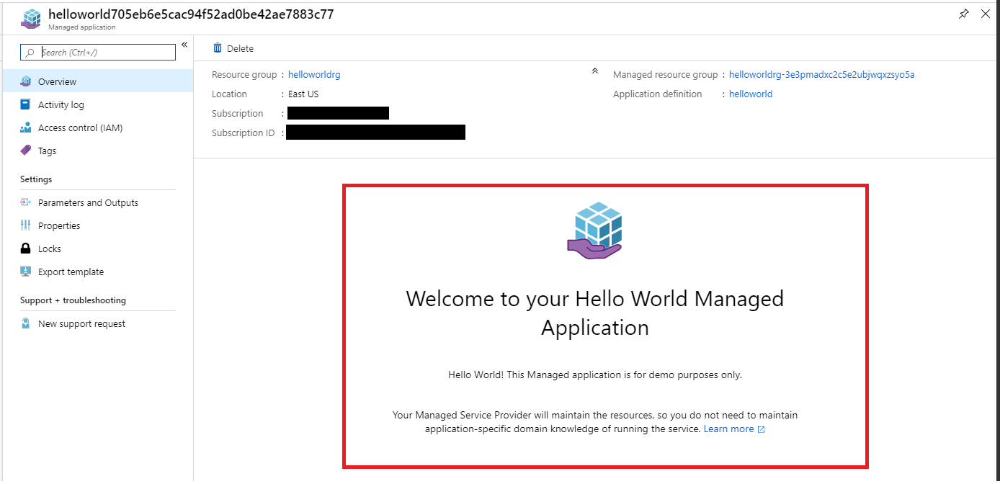
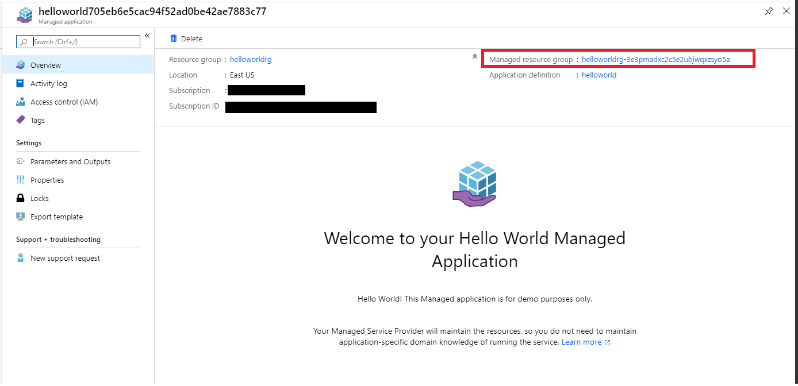
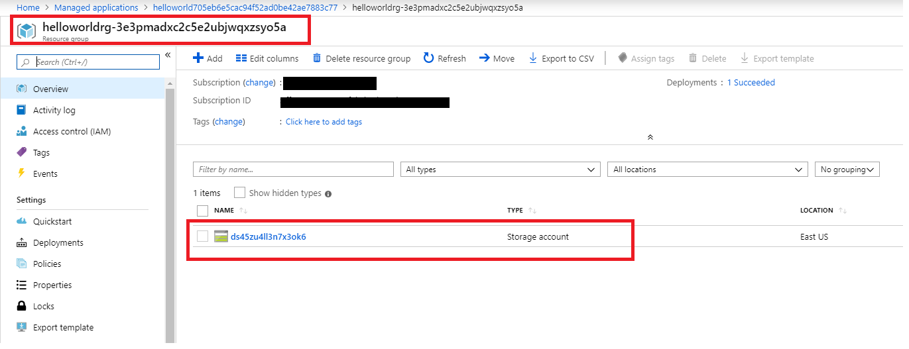
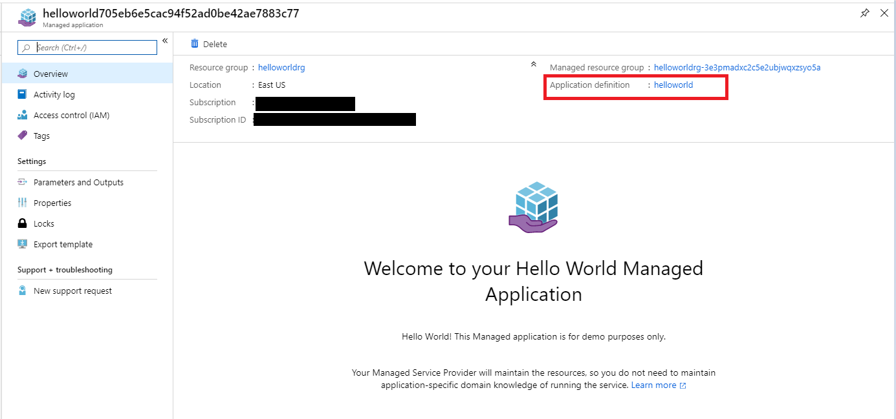
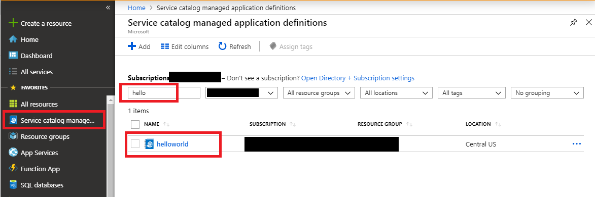
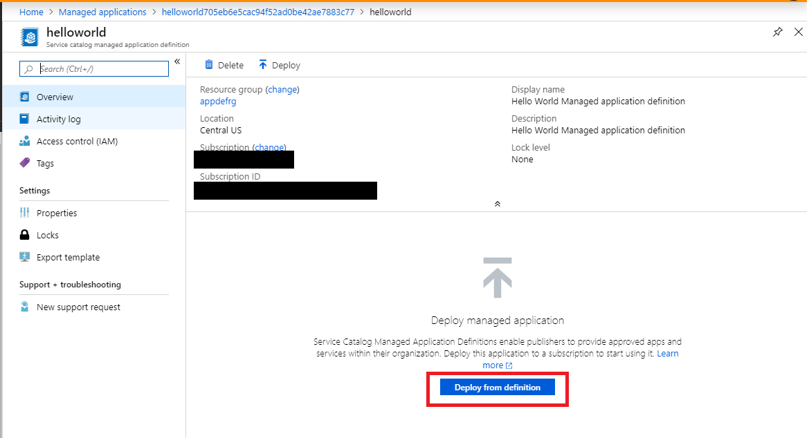
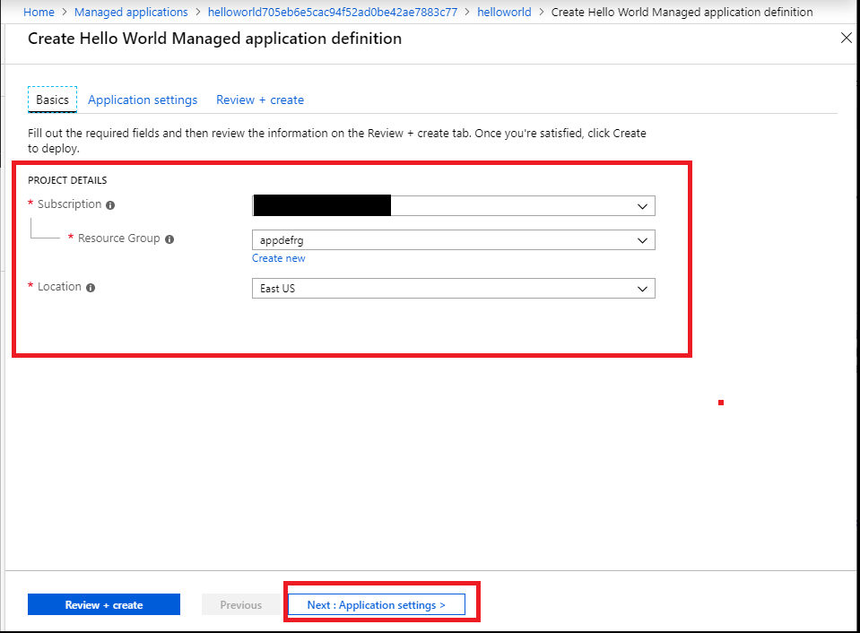
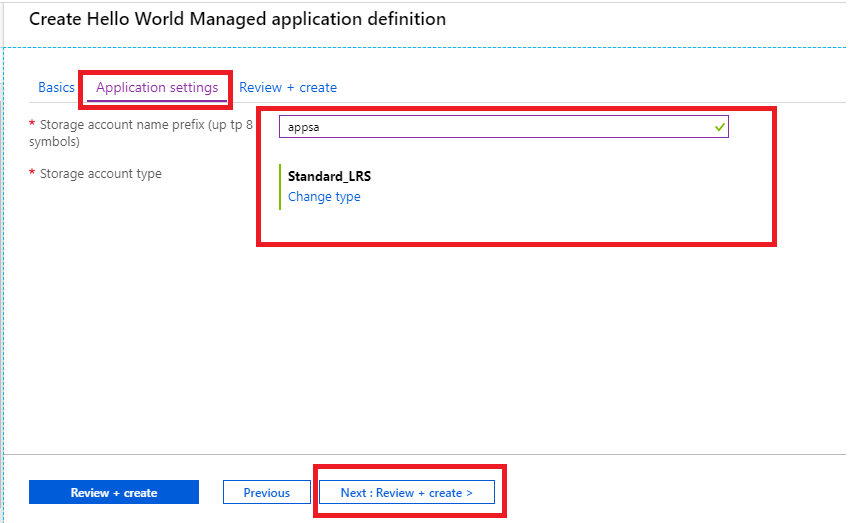
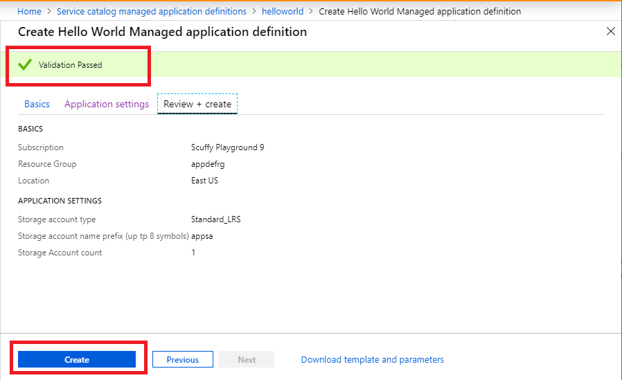
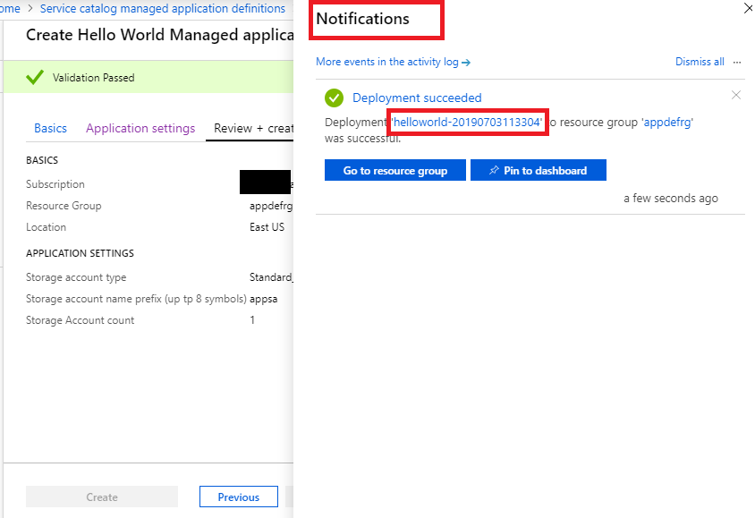

# Deploying your first Managed Application with default view

This sample template deploys a managed application along with a managed application definition that contains a single storage account as a resource. This application demonstrates an ability to create default view for the application: customizing application overview header and description.
[To learn more about managed applications click here](https://docs.microsoft.com/en-us/azure/managed-applications/overview)

To deploy the managed application, this template first deploys a Service catalog Managed Application Definition, after that uses the definition to  deploy a managed application. You can also use the package located under the artifacts folder to deploy the managed application as Azure Marketplace application offer. 

To learn more about Managed Application definitions and Marketplace please visit :

1) [Publish an Azure managed application definition](https://docs.microsoft.com/en-us/azure/managed-applications/publish-managed-app-definition-quickstart)
2) [Azure managed applications in the Marketplace](https://docs.microsoft.com/en-us/azure/managed-applications/publish-marketplace-app)

## Exploring created Managed Application

This sample deployment creates the following two resources:

1) A Managed Application definition.
2) A Managed Application instance that contains a storage account.

Once you click on the managed application you will notice that Overview contains header and description of the application.

This view is driven by [view definition](artifacts/ManagedAppZip/viewDefinition.json) file from application definition package.

To learn more about View definition please visit:
+ [**View definition artifact in Azure Managed Applications**](https://docs.microsoft.com/en-us/azure/managed-applications/concepts-view-definition)

If you click managed resource group in  managed application Overview you'll see storage account created inside that resource group.

## Exploring created Managed Application definition and deploy another application instance

If you click on application definition in managed application Overview you'll be able to see managed application definition that was used for the application deployment.

You can also browse to the application definition using Service catalog managed application definition view.

Navigate to the managed application definition, you'll see "Deploy from definition" button.

When you click "Deploy from definition" button you'll see the Create application experience that is driven by Create UI definition file.
Fill in Basics and proceed to Application Settings.

Enter storage account prefix and select storage account type if needed. Proceed to "Next: Review + Create".

You should see "Validation Passed" status so you may proceed with actual application deployment: click "Create".

You should see notification that application deployment was succesful, so you can navigate to the application.

This Create experience is authored by the application developer, packaged inside application definition package as  [createUiDefinition.json](artifacts/ManagedAppZip/createUiDefinition.json) file from application definition package..

To learn more about authoring your managed application Create experience please visit:
+ [Create Azure portal user interface for your managed application](https://docs.microsoft.com/en-us/azure/managed-applications/create-uidefinition-overview)
+ [Test your portal interface for Azure Managed Applications](https://docs.microsoft.com/en-us/azure/managed-applications/test-createuidefinition)
