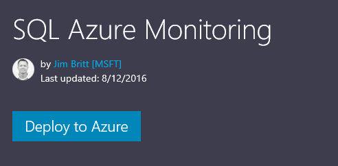
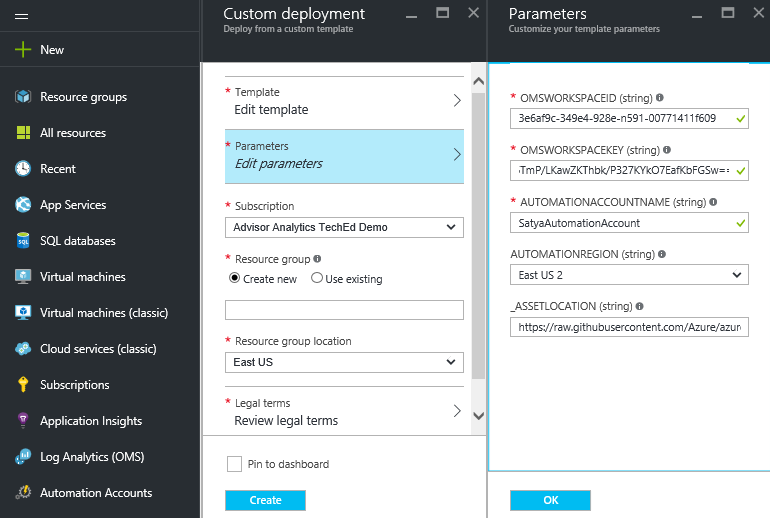
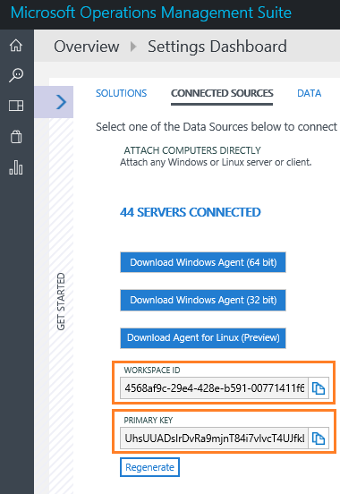
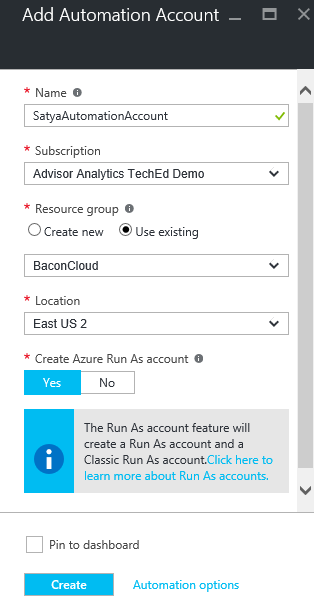
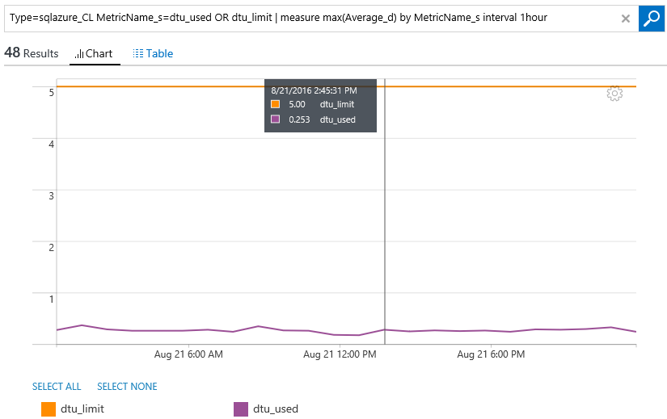
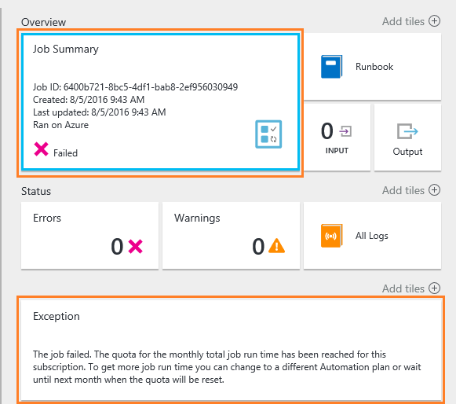

# SQL Azure Monitoring

Operations Management Suite (OMS) is a management offering which provides monitoring for Azure Resources through the Log Analytics service. Log Analytics enables users to collect, correlate and visualize structured and unstructured data. Through the out of the box solutions available in OMS Log Analytics, users can easily monitor and receive notifications on the health of their Azure Resources such as SQL Azure. Microsoft Azure SQL Database, also known as SQL Azure, is a scalable relational database service that provides familiar SQL-Server-like capabilities to applications running in Azure cloud. OMS Log Analytics collects and visualizes the important SQL Azure performance metrics and enables users to easily create custom monitoring rules in addition to those provided with the solution. OMS Log Analytics enables you to monitor across multiple Azure subscriptions, resources and elastic pools and more importantly lets you identify issues at each layer of your application stack. 

This solution (currently in private preview) will allow you to capture your Azure SQL database metrics (across subscriptions and elastic pools) and visualize them in Operations Management Suite (Log Analytics). This solution leverages an automation runbook in Azure Automation, the Log Analytics Ingestion API, together with Log Analytics views to present data about all your SQL databases in a single log analytics workspace. 

 
## Prerequisites

+ Azure Subscription (if you don’t have one you can create one [here](https://azure.microsoft.com/en-us/free/))
+ Operations Management Suite Account (Free Sign Up – No credit card required. Sign up for your free OMS account [here](https://www.microsoft.com/en-us/cloud-platform/operations-management-suite))
+ **New Azure Automation Account (with RunAs Account). To create a new Automation Account refer to step 4 below.**

## How do I get started?

1. We leverage the Azure Resource Manager (ARM) templates to configure this solution. You find the SQL Azure ARM Template [here](https://azure.microsoft.com/en-us/documentation/templates/101-sqlazure-oms-monitoring/).
2. Click the button that says ‘**Deploy to Azure**’. This will launch the ARM Template you need to configure in the Azure Portal.
  
   
  
3. You need to provide the OMS Workspace ID, OMS Workspace Key, Automation Account Name, and Automation Region in the custom deployment ARM template.
  
   
  
 * **OMS Workspace ID + Primary Key**: If you haven’t created an OMS workspace you can create one [here](https://www.microsoft.com/en-us/cloud-platform/operations-management-suite). You can find the Workspace ID and Primary Key inside the OMS portal under **Settings** and then click the **Connected Sources** tab as shown in the image below.
   
    
   
4. **Create a new Automation account**: Go back into the Azure Portal https://portal.azure.com opening a separate tab from the one that is already opened with the ARM Template.
 * If you have an existing OMS Log Analytics workspace in a Resource Group, proceed to create the Automation account in this Resource Group. It is recommended that the Azure region is the same as the OMS Log Analytics resource. By default, the wizard will create an SPN account as part of this process. Note: Make sure to create the new Automation Account leveraged for this solution in the subscription that you are wanting to monitor the SQL Azure databases.
 * If you don’t have an existing OMS Log Analytics workspace in a Resource Group, create a new Automation account into a new Resource Group. SPN account will be created by default.
   
    
   
    Once you have created the Automation account, you can proceed to fill the Automation account name with what you created and specify the region you created the Automation account in. Click ‘OK’ on the ‘Parameters’ blade.
5. Under the ‘Custom Deployment’ blade select the subscription you would like to use and select the **same Resource Group you used for the automation account** that is asked within the region you are in.
6. Accept the licensing terms and click create. It takes **15-20 minutes** before data starts appearing in the OMS Log Analytics portal. To check if the data got in search for Type=sqlazure_CL

## Queries for alerts

1. Example queries that you can run and create alerting rules.

Description | Query
--- | ---
**SQL Azure: Average CPU utilization percentage greater than 80% over 5 minutes** | Type=sqlazure_CL MetricName_s=cpu_percent  | measure Avg(Average_d) by DatabaseName_s interval 10minutes
**SQL Azure: Average DTU utilization percentage greater than 80% over 15 minutes** |Type=sqlazure_CL MetricName_s=dtu_consumption_percent  | measure Avg(Average_d) by DatabaseName_s interval 10minutes
**SQL Azure: Number of failed connections Greater than 0 over 60mins** | Type=sqlazure_CL MetricName_s= connection_failed Average_d!=0 TimeGenerated>NOW-1HOUR | measure count() by DatabaseName_s

One of the most useful queries you can perform is to compare the DTU utilization. Database Throughput Unit (DTU) provide a way to describe the relative capacity of a performance level of Basic, Standard, and Premium databases. DTUs are based on a blended measure of CPU, memory, reads, and writes. As DTUs increase, the power offered by the performance level increases. For example, a performance level with 5 DTUs has five times more power than a performance level with 1 DTU. A maximum DTU quota applies to each server.
By running the following query, you can easily tell if you are underutilizing or over utilizing your SQL Azure databases
Type=sqlazure_CL MetricName_s=dtu_used OR dtu_limit | measure max(Average_d) by MetricName_s interval 1hour

 
 
## Troubleshooting

This solution leverages an Azure Automation runbook for gathering metrics for the SQL PaaS database metrics analysis.  When creating your Azure Automation account that will be leveraged for this solution, it is recommended:

1. That this is a brand new account not currently leveraged by any other runbooks or production workloads since we will be updating ARM modules during deployment
2. This account needs to be switched from Free to Standard to ensure that you are able to execute the runbooks and receive the data over time.  Switching from Free to a Basic can be done by navigating to the freshly created automation account, select settings / Pricing tier and usage, and selecting Basic from the options provided.  This will ensure that the default 500 minutes is not consumed already or shortly after enabling this solution. If you reach the 500 minutes trial limit you will receive an errors message like this one below.

 
