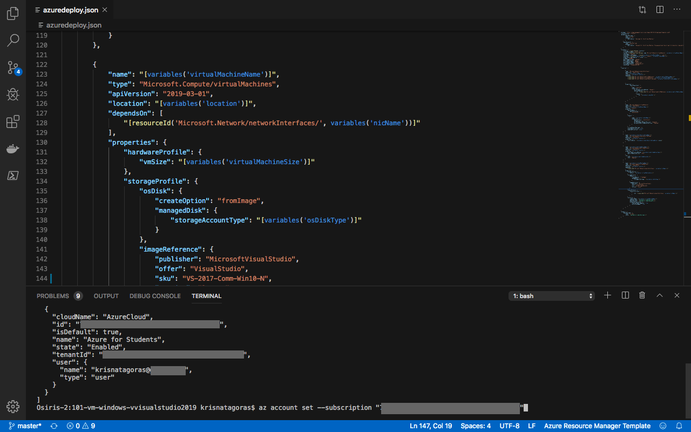
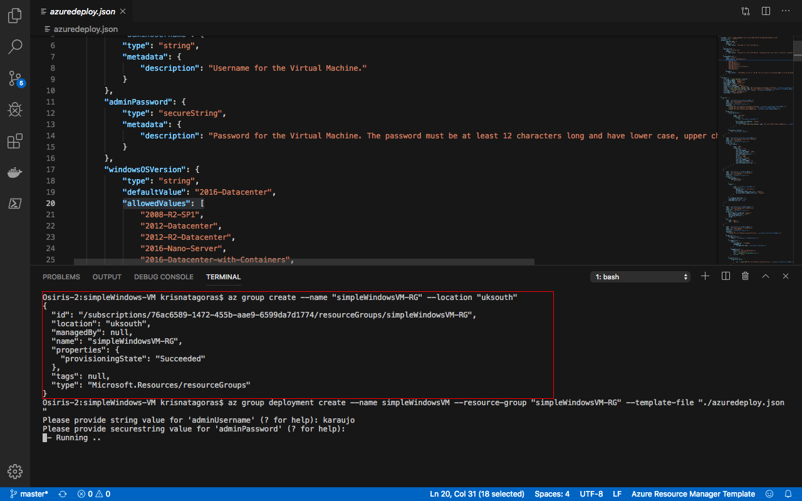
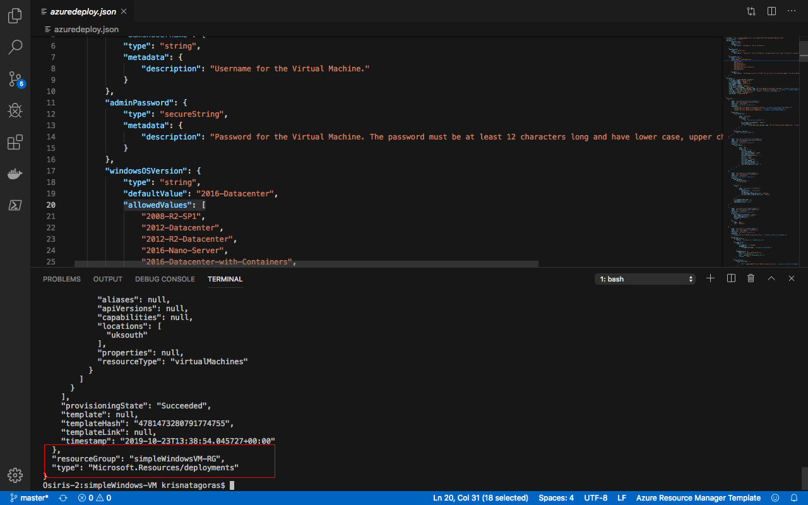
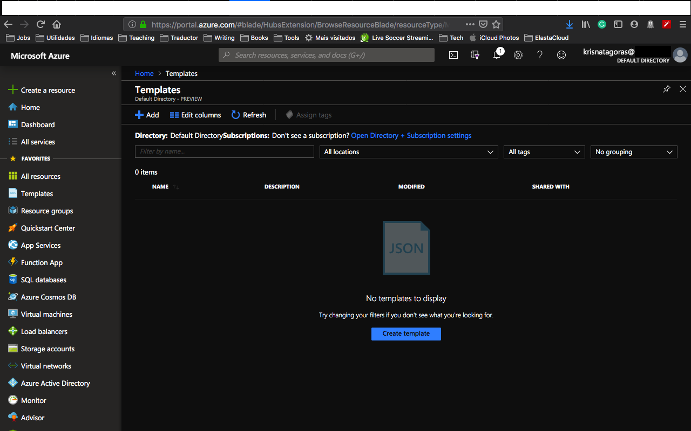
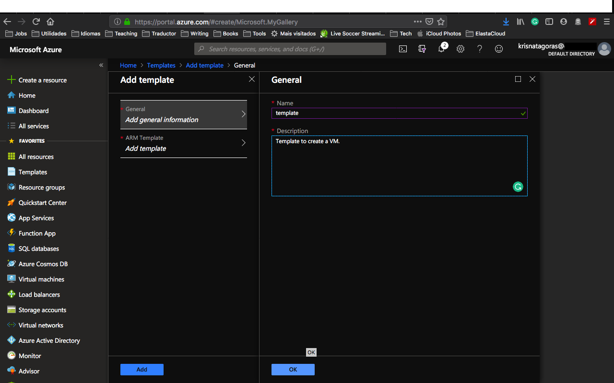

# Simple Windows Virtual Machine

We will deploy a simple Windows Virtual Machine. In order to complete this task, all you need is the azuredeploy.json file and a couple of commands if you deploy using Azure CLI.

It's good to bear in mind that there are different ways to deploy resources in Azure, here a few options if you want to dig on the Azure Universe. You can run this template either using [PowerShell](https://docs.microsoft.com/en-us/azure/azure-resource-manager/resource-group-template-deploy), [Azure CLI](https://docs.microsoft.com/en-us/azure/azure-resource-manager/resource-group-template-deploy-cli), [Azure Portal](https://docs.microsoft.com/en-us/azure/azure-resource-manager/resource-group-template-deploy-portal) or your favorite SDK.

## The Template

Don't let the size of the template scares you. The structure is very intuitive and once that you get the gist of it, you will see how easier your life will be regarding creating resources on Azure.

The only parameters that we need to inform are:  **adminUsername**, **adminPassword** and **vmName**.

Don't worry about changing anything on the file, either on the portal or using Azure CLI, you need to inform just the following parameters. There are some requirements for username and password.

- *adminUsername:* Usernames can be a maximum of 20 characters and cannot end in a period (".").

- *adminPassword:* Password requirements between 12 to 72 characters and have lower and upper characters, a digit and a special character (Regex match [\W_])

- *vmName:* The name of your Virtual Machine. There is a default value, but you can change it during your deployment. Also, know that the maximum characters allowed are 15.

Let's rock with the Deployment.

## Deployment

There are a few ways to deploy your template.
You can use [PowerShell](https://docs.microsoft.com/en-us/azure/azure-resource-manager/resource-group-template-deploy), [Azure CLI](https://docs.microsoft.com/en-us/azure/azure-resource-manager/resource-group-template-deploy-cli), [Azure Portal](https://docs.microsoft.com/en-us/azure/azure-resource-manager/resource-group-template-deploy-portal) or your favorite SDK.

For this task, we going to deploy using Visual Code and the portal and a little surprise for you at the end. :D

For Azure CLI I choose to use the Visual Code with Azure CLI extensions, if you like, you can find more information [here](https://code.visualstudio.com/docs/azure/extensions). But bare in mind that you don't need to use the Visual Code, you can stick with the old good always present **Command Line** on Windows or any **bash terminal**.

### Using Azure CLI with Visual Code

type on the terminal windows: **az login**

You will be redirected to the Azure Portal where you can use your credentials to login into.

After login, you have your credentials.

In order to set the right subscription, you can use the following command:

#### az account set --subscription "your subscription id"

### Resource Group

After you logged in, we need to create a Resource Group for our deployment. If you haven't yet created a Resource Group, we will do that now! But what is a Resource Group, one might ask. Bare with me! A Resource Group is a container that holds related resources for an Azure solution. The resource group includes those resources that you want to manage as a group. Simply saying, it's like a folder that contains files. Simple as that ;-)

To create a Resource Group, you need a name and the location for your Resource Group.

For a list of locations, type: **az account list-locations**

To create the Resource group, just type the command:

#### az group create --name "resource-group" --location "your location"

Super simple, right? Now that we have our **Resource Group** created, let's deploy our Virtual Machine.

#### az group deployment create --name "name of your deployment" --resource-group "resource-group" --template-file "./azuredeploy.json"

As you can see, it's running. Go grab a cup of coffee, have some fresh air and I'm sure that before you come back you will have your Windows Virtual Machine with Visual Studio ready.

And there we go, our deploy is Succeeded:  

Let's go and check the resource at the Azure Portal:
Go the Resource Group, find the Resource group you've created.
And there it's your brand new **Virtual Machine**:

Open your Virtual Machine and then click on the button **connect**.

Download the RDP File (you need an RDP software to connect), double click on the file, insert your **login** and **password**.

And Voilà, there you have a brandy new Windows Server Virtual Machine.

Have fun coding!

### Using the Portal

At the Portal, in All Services look for **Templates**, you can favorite this service.

Click in **Add** to add your template:

On General, type a name and a description for your template, and click on [OK].

On ARM Template, replace the contents of the template with your template, and click on [OK].

Click on the refresh button and there is your template:

Open the template and click in [Deploy]

On the screen Custom Deployment, check your information and if you don't have the Resource Group you can click and [create new]:
The name of the Resource Group is: simpleWindowsVM-RG, select your location and click on [OK]. Insert the rest of the information for the parameters, note that it shows for your option to choose which Windows version you want.

By now you shall be familiar with these parameters, select [I agree] and click on [Purchase].

And voilà, you have your new VM deployed.

To connect with the Virtual Machine you can repeat the same process as before, using the RDP file.

Now is time to get your hands dirty, don't forget that you are in the cloud now :D

**p.s.: If by any chance you felt a bit overloaded with all these processes or perhaps you are asking yourself if there is a simple way to deploy your Virtual Machine? Good news for you bud! Just click on the button below and it will automatically deploy the VM on your Azure Portal.**

Now that you have done the hard work, with the Portal is even easier to create our Windows Virtual Machine with Visual Studio.

Just click on this button: [Deploy to Azure]

Insert your credentials to log in to the Portal.

Create the group if you haven't yet, insert the parameters **adminUsername**, **adminPassword** and **vmName**.

Select [I agree..] and then click in [Purchase].

And voilà, you have your new VM deployed. How easy was that, uhn?

To connect with the Virtual Machine you can repeat the same process as before, using the RDP file.

Now it is time to get your hands dirty, don't forget that you are in the cloud now, happy coding! :D

#### Important disclaimer: Azure charges you for the resources you are using, and you don't want to finish all your credits immediately, right? So, for not running out of credit, don't forget to stop the VM at the portal or even delete the Resource Group you create to avoid any unnecessary charges

### How to shutdown your resources

#### Using the portal

On the portal, open your Resource Group, if you will not use the service or VM anymore, you can just click on the [Delete] Button.

You can also just stop the service or the Virtual Machine in case you need the resource. Open the resource and click on Stop.

Just refresh your screen and you are good to go.
