# Simple Windows Virtual Machine

We gonna deploy a simple Windows Virtual Machine. In order to complete this task, all you gonna need is the azuredeploy.json file and a couple of commands if you deploy using Azure CLI.

It's good to bear in mind that there are different ways to deploy resources in Azure, here a few options if you want to dig on the Azure Universe. You can run this template either using [PowerShell](https://docs.microsoft.com/en-us/azure/azure-resource-manager/resource-group-template-deploy), [Azure CLI](https://docs.microsoft.com/en-us/azure/azure-resource-manager/resource-group-template-deploy-cli), [Azure Portal](https://docs.microsoft.com/en-us/azure/azure-resource-manager/resource-group-template-deploy-portal) or your favorite SDK.

###The Template
Don't let the size of the template scares you. The structure is very intuitive and once that you get the gist of it, you gonna see how easier your life will be regarding creating resources on Azure.

The only parameters that we need to inform are:  **adminUsername**, **adminPassword**, **vmName** and **windowsOSVersion**. The windows version though comes in the template with the Default Value: **"2016-Datacenter"** which means that your O.S. version will be a Windows Server 2016 Datacenter. You will see that there are also other options.

Don't worry about changing anything on the file, either on the portal or using Azure CLI, you gonna be asked to insert this information, but bear in mind that there is some requirement for those two parameters:

- *adminUsername:* Usernames can be a maximum of 20 characters in length and cannot end in a period (".").

The following usernames are not allowed:  

  | | ||
:--------- | :-------- |:-----------    |:------
administrator     | admin | user     |user1|
test|     user2|     test1|     user3|
admin1     |1 |    123|     a|
actuser     |adm     |admin2|     aspnet
backup     |console |    david |    guest
john     |owner     |root |    server
sql     |support     |support_388945a0     |sys
test2     |test3     |user4     |user5

- **adminPassword:** There are varying password length requirements, depending on the tool you are using:

    Portal - between 12 - 72 characters  
    PowerShell - between 8 - 123 characters  
    CLI - between 12 - 123  

    - Have lower characters
    - Have upper characters
    - Have a digit
    - Have a special character (Regex match [\W_])

. The following passwords are not allowed:

>abc@123     iloveyou!     P@$$w0rd     P@ssw0rd     P@ssword123
Pa$$word     pass@word1     Password!     Password1     Password22

- **windowsOSVersion:** The following values are allowed:
    - "2008-R2-SP1"
       - "2012-Datacenter"
       - "2012-R2-Datacenter"
       - "2016-Nano-Server"
       - "2016-Datacenter-with-Containers"
       - "2016-Datacenter"
       - "2019-Datacenter"

Keep this in mind and let's roll with the Deployment.

- **vmName:** The name of you Virtual Machine. Keep in mind that the Virtual Machine Name is key for you to deploy multiple resources at the same group. It will come with a default value, but you can change it when deploying your resource. Also know that the maximum characters allowed are 15.

##Deployment
There are a few ways to deploy your template.
You can use [PowerShell](https://docs.microsoft.com/en-us/azure/azure-resource-manager/resource-group-template-deploy), [Azure CLI](https://docs.microsoft.com/en-us/azure/azure-resource-manager/resource-group-template-deploy-cli), [Azure Portal](https://docs.microsoft.com/en-us/azure/azure-resource-manager/resource-group-template-deploy-portal) or your favorite SDK.

For this task, we gonna deploy using Visual Code and the portal and a little surprise for you at the end. :D

For Azure CLI I choose to use the Visual Code with Azure CLI extensions, if you like, you can find more information [here](https://code.visualstudio.com/docs/azure/extensions). But bare in mind that you don't need to use the Visual Code, you can stick with the old good always present **Command Line** on Windows or any **bash terminal**.

###Visual Code
type on the terminal windows: **az login**

You gonna be redirected to the Azure Portal where you can use your credentials to login into.

After login, you gonna have your credentials.

In order to set the right subscription, you can use the following command:

**az account set --subscription "< your subscription id >"**

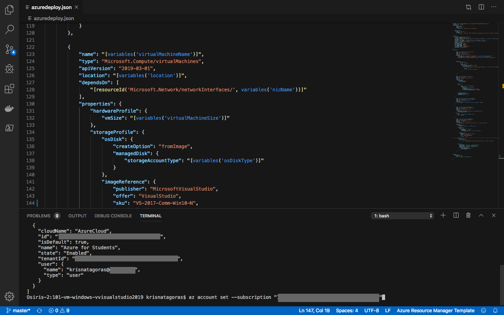

If you haven't yet created a Resource Group, we gonna do that now! A Resource Group is a container that holds related resources for an Azure solution. The resource group includes those resources that you want to manage as a group. You decide which resources belong in a resource group based on what makes the most sense for you or your organization.

That is the command sintax:

**az group create --name simpleWindowsVM-RG --location < yourlocation >**

For a list of locations, type: *az account list-locations*

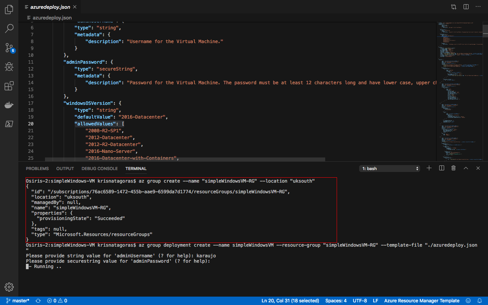

With the Resource Group created, we can deploy our VM using the template:

**az group deployment create --name simpleWindowsVM --resource-group simpleWindowsVM-RG --template-file "azuredeploy.json"**

Note that it's running:

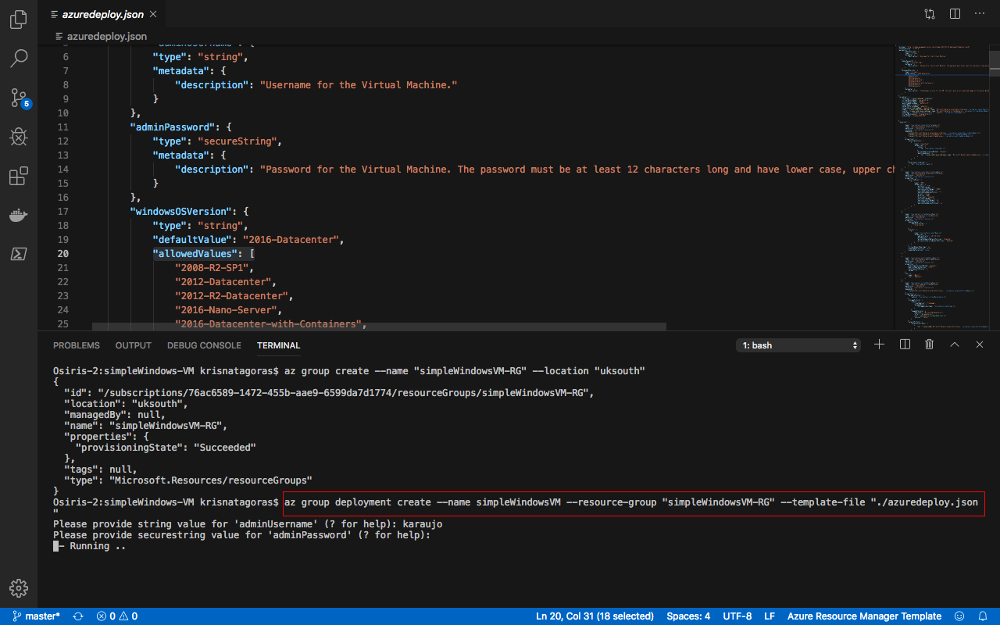

And there we go, our deploy is Succeeded:  

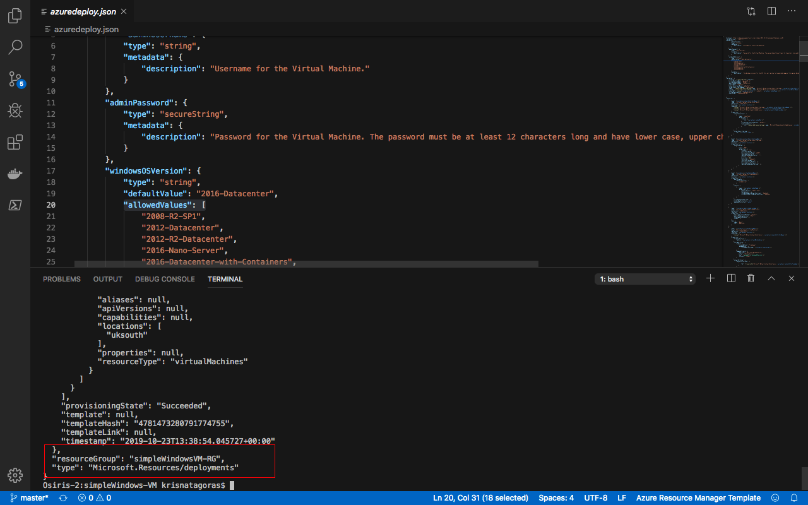

Let's go and check the resource at the Azure Portal:
Go the Resource Group, find the Resource group you've created.
And there it's your brand new **Virtual Machine**:

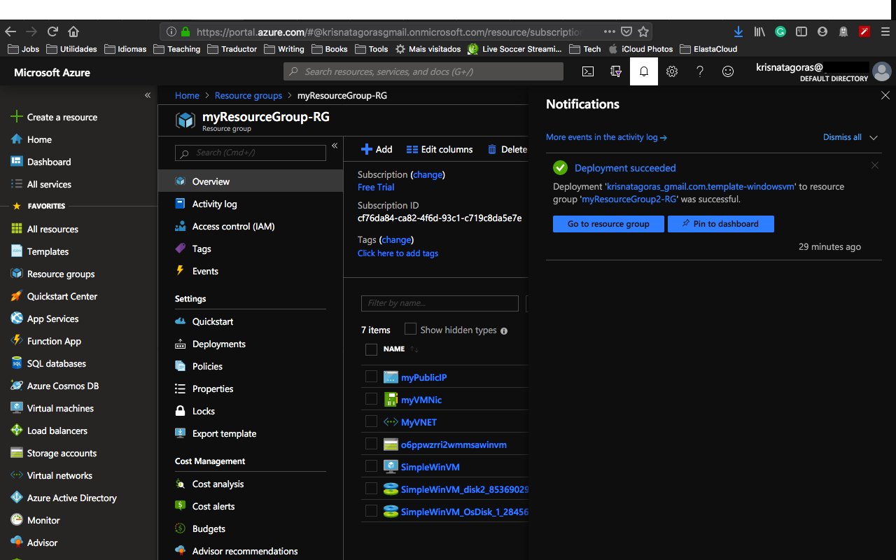

Note that beyond your Virtual Machine there are also all the resources that the VM needs in order to run:  

*Virtual Network Interface*  
*Public IP Address*  
*Storage Account*    
*Virtual Network*  
*Disks*

Compare these resources with your ARM Template is a good exercise to have a better understanding.

Continuing, let's open your Virtual Machine and check the details:

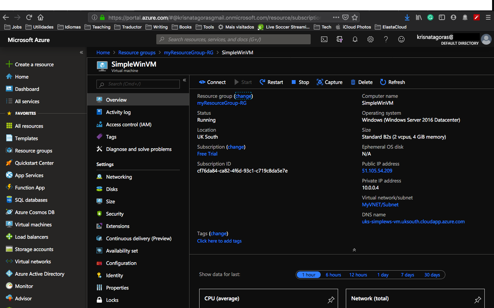

We gonna use Remote Desktop Protocol to connect into this Virtual Machine. Click on [Connect]and then download the RDP File.

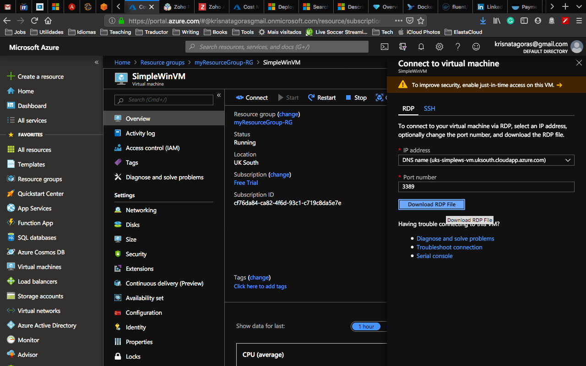

Double click on the file and you should open the RDP Software to connect to the Virtual Machine.

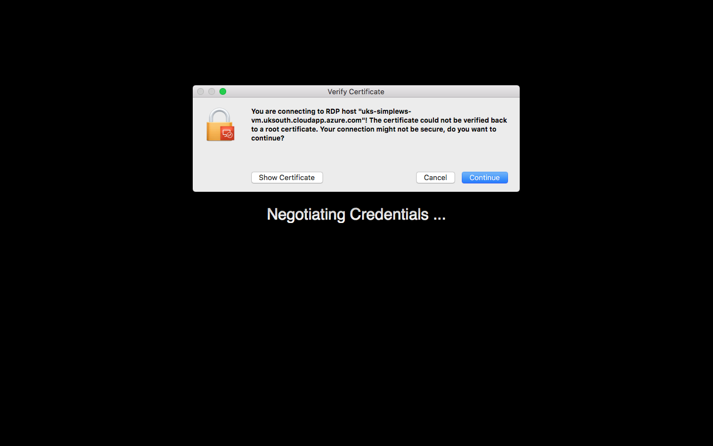

Click on [Continue]

Type your user and password and Voilà, you are connected in your Windows Virtual Machine... how cool is that uh?

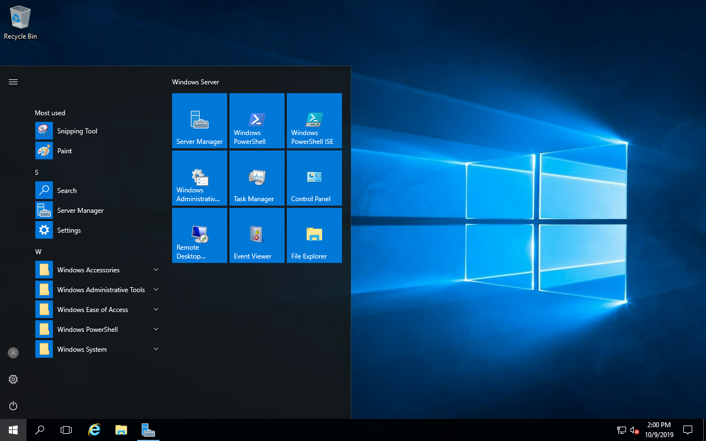

Now you are ready to practice, make your hand dirty buddy!

###Using the Portal

At the Portal, in All Services look for **Templates**, you can favorite this service.

Click in **Add** to add your template:

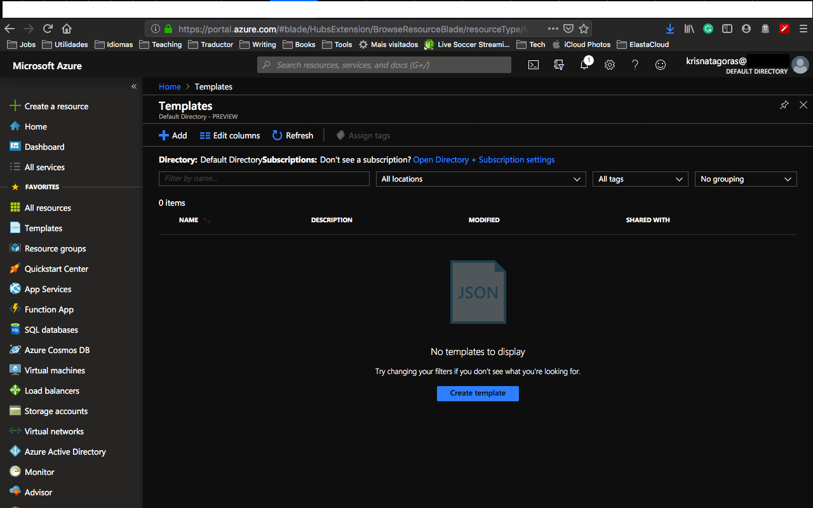

On General, type a name and a description for your template, and click on [OK].

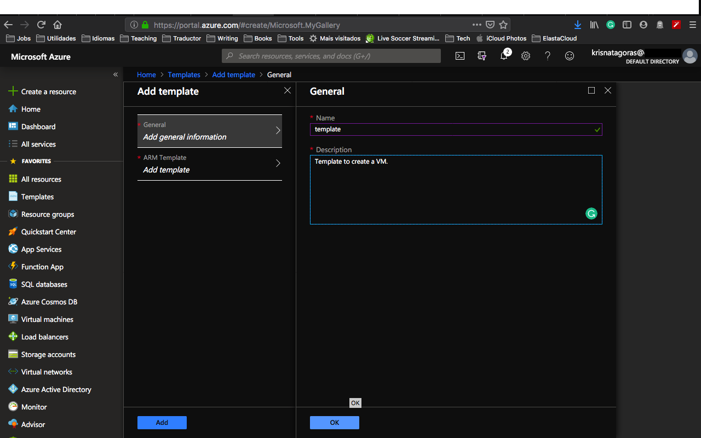

On ARM Template, replace the contents of the template with your template, and click on [OK].

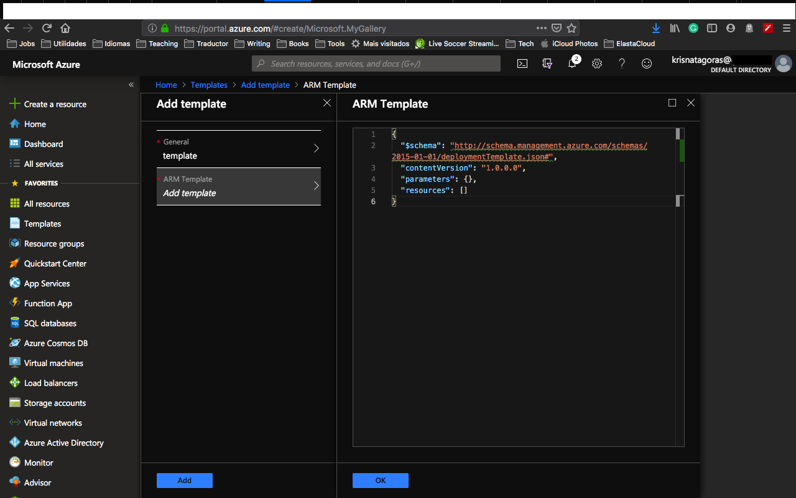

Click on the refresh button and there is your template:

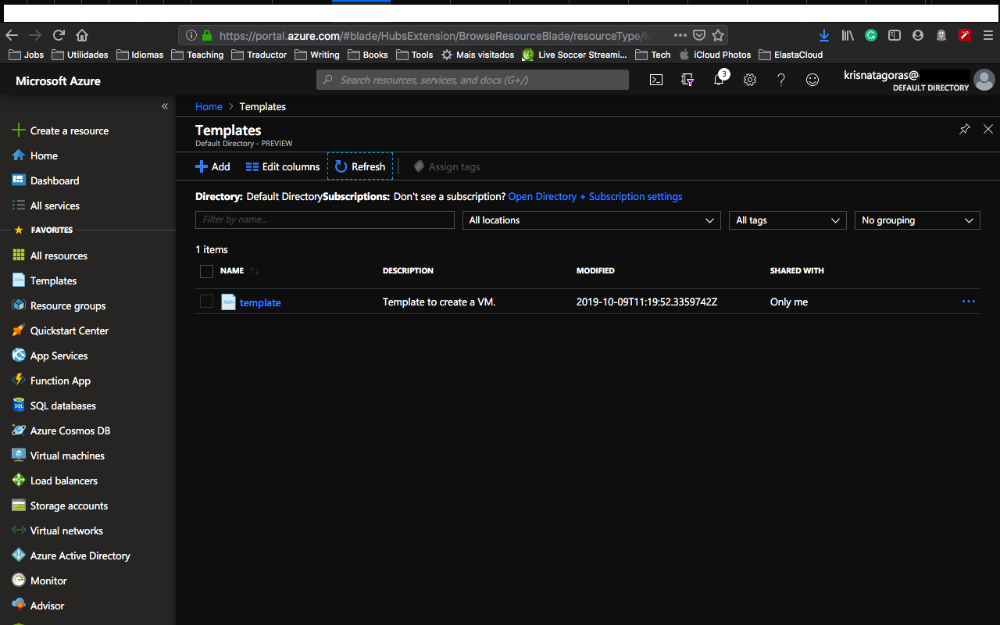

Open the template and click in [Deploy]

On the screen Custom Deployment, check your information and if you don't have the Resource Group you can click and [create new]:
The name of the Resource Group is: simpleWindowsVM-RG, select your location and click on [OK]. Insert the rest of the information for the parameters, note that it shows for your option to choose which Windows version you want.

By now you shall be familiar with these parameters, select [I agree] and click on [Purchase].

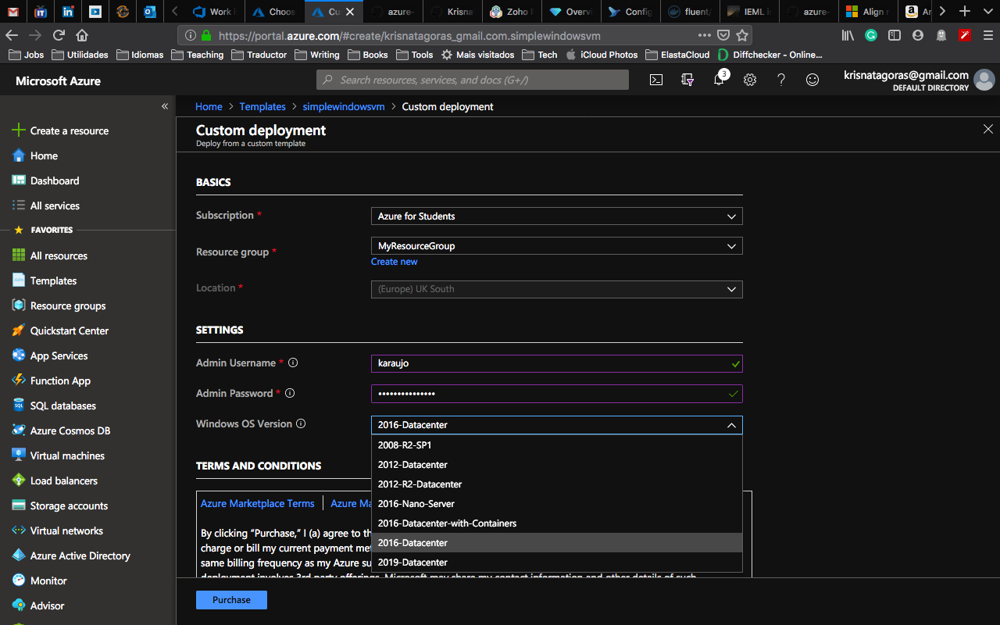

And voilà, you have your new VM deployed.

To connect with the Virtual Machine you can repeat the same process as before, using the RDP file.

Now is time to get your hands dirty, don't forget that you are in the cloud now :D

**p.s.: Pretty easy to create resources on Azure, right? But if you are the sort of IT guy that always looks for automating things on the extreme :D Surprise, surprise!.
Just click on the button below and it will automatically deploy the VM on your Azure Portal.**

####Important disclaimer: Azure charges you for the resources you are using, and you don't want to finish all your credits at once, right? So, for not running out of credit, don't forget to stop the VM at the portal or even delete the Resource Group you create to avoid any unnecessary charges.

###How to shutdown your resources:
####Using the portal:

On the portal, open your Resource Group, if you will not use the service or VM anymore, you can just click on the [Delete] Button.

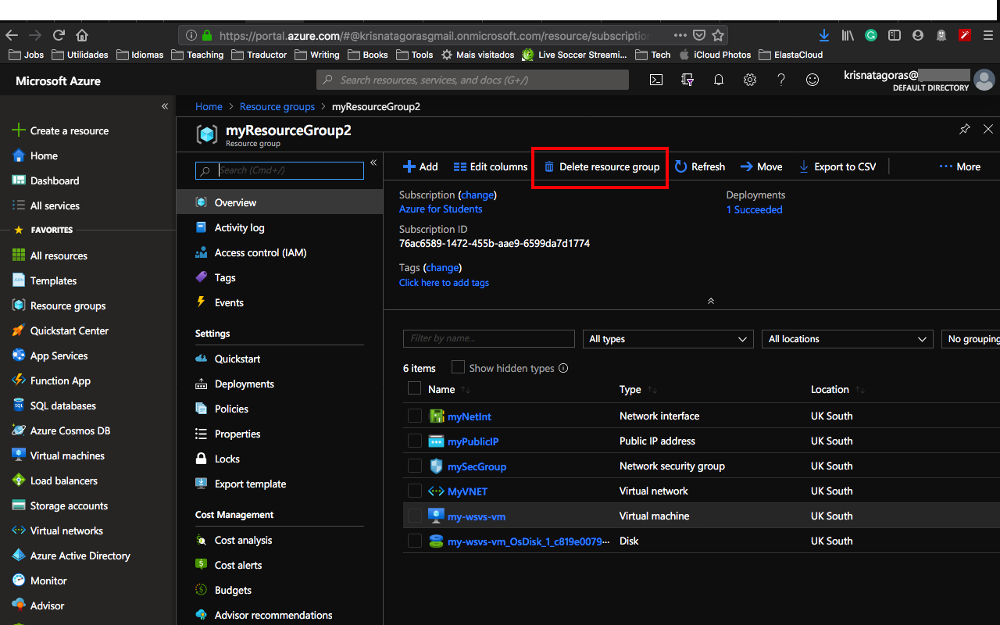

You can also just stop the service or Virtual Machine in case you gonna need the resource. Open the resource and click on Stop.

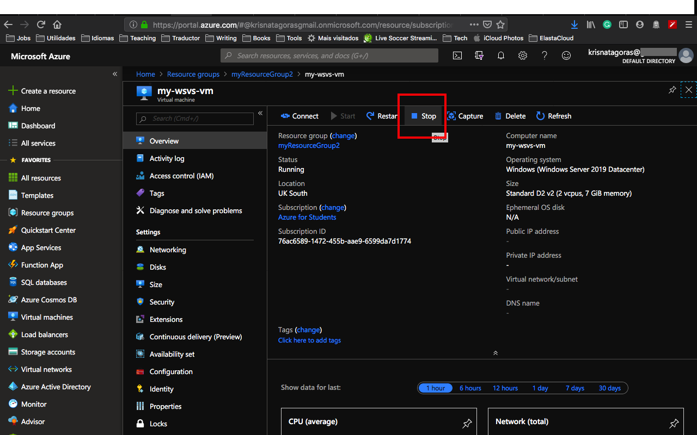

Just refresh your screen and you are good to go.
