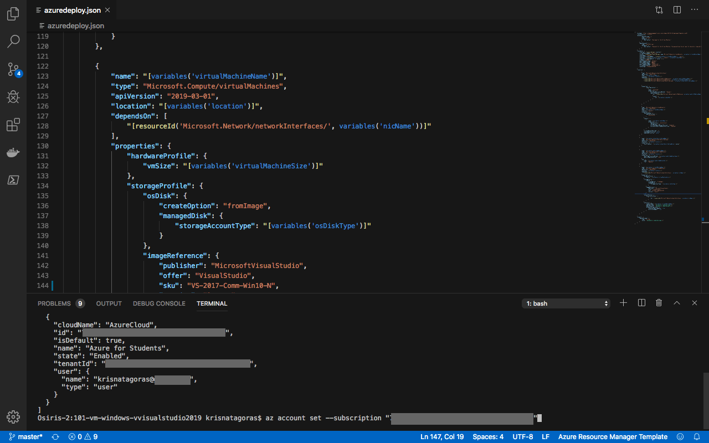
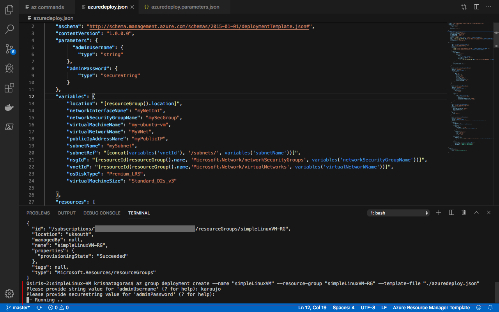
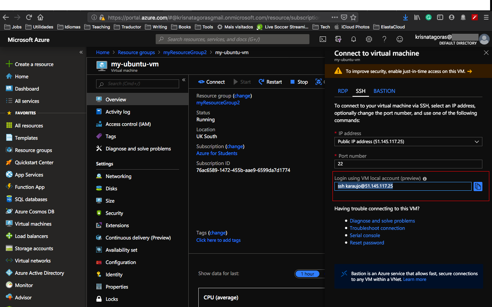
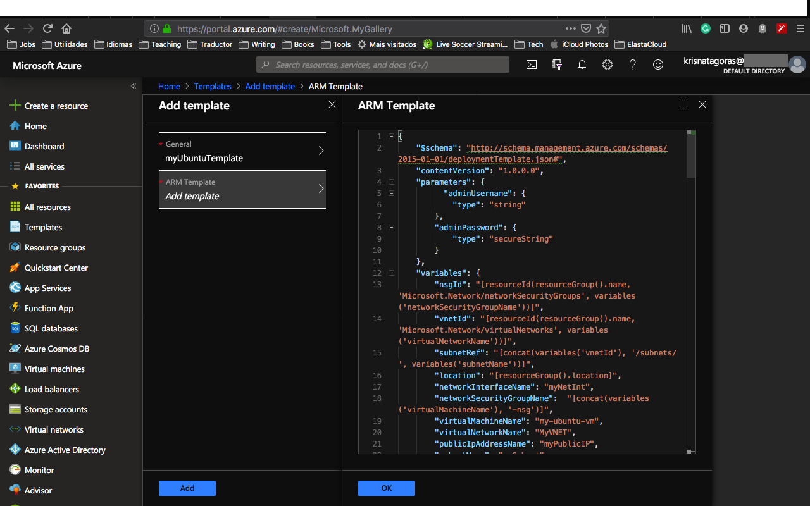
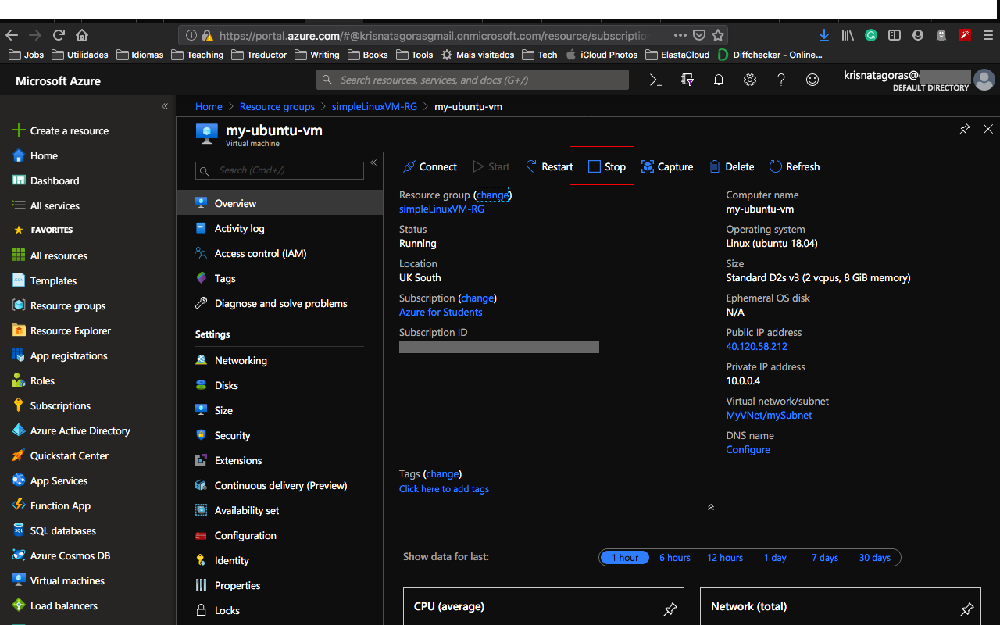

##Ubuntu Server 18.04-LTS Virtual Machine

The intent of this README is to guide you in a deployment a **Standard_DS1 _v2**.

It's good to bear in mind that there are different ways to deploy resources in Azure, here a few options if you want to dig on the Azure Universe. You can run this template either using [PowerShell](https://docs.microsoft.com/en-us/azure/azure-resource-manager/resource-group-template-deploy), [Azure CLI](https://docs.microsoft.com/en-us/azure/azure-resource-manager/resource-group-template-deploy-cli), [Azure Portal](https://docs.microsoft.com/en-us/azure/azure-resource-manager/resource-group-template-deploy-portal) or your favorite SDK.

###The Template
Don't let the size of the template scares you. The structure is very intuitive and once that you get the gist of it, you gonna see how easier your life will be regarding creating resources on Azure.

The only parameters that we need to inform are  **adminUsername**, **adminPassword** and **vmName**.

Don't worry about changing anything on the file, either on the portal or using Azure CLI, you gonna be asked to insert this information, but bear in mind that there is some requirement for those two parameters:

- *adminUsername:* Usernames can be a maximum of 20 characters in length and cannot end in a period (".").

The following usernames are not allowed:  

  | | ||
:--------- | :-------- |:-----------    |:------
administrator     | admin | user     |user1|
test|     user2|     test1|     user3|
admin1     |1 |    123|     a|
actuser     |adm     |admin2|     aspnet
backup     |console |    david |    guest
john     |owner     |root |    server
sql     |support     |support_388945a0     |sys
test2     |test3     |user4     |user5

- *adminPassword* There are varying password length requirements, depending on the tool you are using:

    Portal - between 12 - 72 characters  
    PowerShell - between 8 - 123 characters  
    CLI - between 12 - 123  

    - Have lower characters
    - Have upper characters
    - Have a digit
    - Have a special character (Regex match [\W_])

. The following passwords are not allowed:

>abc@123     iloveyou!     P@$$w0rd     P@ssw0rd     P@ssword123
Pa$$word     pass@word1     Password!     Password1     Password22

- *vmName:* The name of you Virtual Machine. Keep in mind that the Virtual Machine Name is key for you to deploy multiple resources at the same group. It will come with a default value, but you can change it when deploying your resource. Also know that the maximum characters allowed are 15.

Keeping that in mind, let's rock with the Deployment.         

##Deployment
There are a few ways to deploy this template.
You can use [PowerShell](https://docs.microsoft.com/en-us/azure/azure-resource-manager/resource-group-template-deploy), [Azure CLI](https://docs.microsoft.com/en-us/azure/azure-resource-manager/resource-group-template-deploy-cli), [Azure Portal](https://docs.microsoft.com/en-us/azure/azure-resource-manager/resource-group-template-deploy-portal) or your favorite SDK.

For this task, we gonna deploy using Visual Code and the portal and a little surprise for you at the end. :D

For Azure CLI I choose to use the Visual Code with Azure CLI extensions, if you like, you can find more information [here](https://code.visualstudio.com/docs/azure/extensions). But bare in mind that you don't need to use the Visual Code, you can stick with the old good always present **Command Line** on Windows or any **bash terminal**.

###Using Azure CLI with Visual Code
type on the terminal windows: **az login**

You gonna be redirected to the Azure Portal where you can use your credentials to login in.

After login, you gonna have your credentials.

In order to set the right subscription, you can use the following command:

**az account set --subscription "< your subscription id >"**

####Resource Group

After you logged in, we gonna need to create a Resource Group for our deployment. If you haven't yet created a Resource Group, we gonna do that now! But what is a Resource Group, one might ask. Bare with me! A Resource Group is a container that holds related resources for an Azure solution. The resource group includes those resources that you want to manage as a group. Simply saying, it's like a folder that contains files. Simple as that ;-)

To create a Resource Group, you need a name and the location for your Resource Group.

For a list of locations, type: **az account list-locations**

To create the Resource group, just type the command:

**az group create --name simpleLinuxVM-RG --location < yourlocation >**

Super simple, right? Now that we have our **Resource Group** created, let's deploy our Virtual Machine.

**az group deployment create --name "name of your deployment" --resource-group "simpleLinuxVM-RG" --template-file "./azuredeploy.json"**

As you can see, it's running. Go grab a cup of coffee, have some fresh air and I'm sure that before you come back you gonna have your Ubuntu Server Virtual Machine ready.

And there we go, our deploy is Succeeded:  

Let's go and check the resource at the Azure Portal:
Go the Resource Group, find the Resource group you've created.
And there it's your brand new **Virtual Machine**:

Note that beyond your Virtual Machine there are also all the resources that the VM needs in order to run:  

*Virtual Network Interface*  
*Public IP Address*  
*Storage Account*    
*Virtual Network*  
*Disks*

Compare these resources with your ARM Template is a good exercise to have a better understanding.

Open your Virtual Machine and then click on the button **connect**.

There you gonna see the ssh command to connect to your Virtual Machine. Copy the command and open your terminal.

Paste the command and press **Enter**.  

Insert the password you've created.  

And Voilà, there you have a brandy new Windows Virtual Machine with Visual Studio.

Don't forget to have fun!

###Using the Portal

At the Portal, in All Services look for **Templates**, you can favorite this service.

Click in **Add** to add your template:

On General, type a name and a description for your template, and click on [OK].

On ARM Template, replace the contents of the template with your template, and click on [OK].

Click on the refresh button and there is your template:

Open the template and click in [Deploy]

On the screen Custom Deployment, check your information and if you don't have the Resource Group you can click and [create new]:

Insert all the information, by now you should be familiar with it, select [I agree] and click on [Purchase].

And voilà, you have your new VM deployed.

Repeat the connection process that you have done before and enjoy your bash terminal :D .

**p.s.: Pretty easy to create resources on Azure, right? But if you are the sort of IT guy that always looks for automating things on the extreme :D Surprise, surprise!.
Just click on the button below and it will automatically deploy the VM on your Azure Portal.**

#####Important disclaimer: Azure charge you for the resources you are using, and you don't want to finish all your credits at once, right? So, for not running out of credit, don't forget to stop the VM at the portal or even delete the Resource Group you create to avoid any unnecessary charges.

###How to shutdown your resources:
####Using the portal:

On the portal, open your Resource Group, if you will not use the service or VM anymore, you can just click on the [Delete] Button.

You can also just stop the service or Virtual Machine in case you gonna need the resource. Open the resource and click on Stop.

Just refresh your screen and you are good to go.
