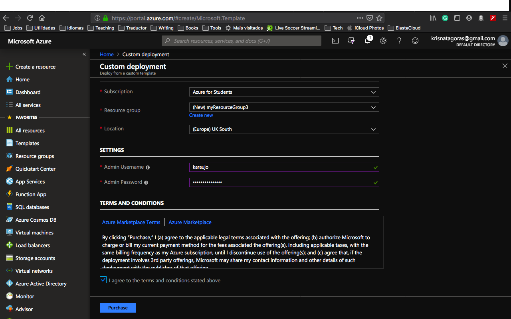

##Simple Windows 10 with Visual Studio 2019

This README intends to deploy a Windows 10 with a Visual Studio Community latest embedded. This template was designed to be an easy and fast way to create a Virtual Machine ready for you to code with Visual Studio.  
 
You can deploy this template by using the [Azure Portal](https://docs.microsoft.com/en-us/azure/azure-resource-manager/resource-group-template-deploy-portal) or [Azure CLI](https://docs.microsoft.com/en-us/azure/azure-resource-manager/resource-group-template-deploy-cli). Let's dig on the template and have some fun coding.

###The Template
Don't get scared by the size of the template. Once that you understand how it works, you gonna see how easier your life will be regarding creating resources on Azure.

The only two parameters that we need to inform are login **adminUsername** and **adminPassword**.

Don't worry about changing anything on the file, either on the portal or using Azure CLI, you gonna be asked to insert this information, but bear in mind that there is some requirement for those two parameters:

- *adminUsername:* Usernames can be a maximum of 20 characters in length and cannot end in a period (".").

The following usernames are not allowed:  

  | | ||
:--------- | :-------- |:-----------    |:------
administrator     | admin | user     |user1|
test|     user2|     test1|     user3|
admin1     |1 |    123|     a|
actuser     |adm     |admin2|     aspnet
backup     |console |    david |    guest
john     |owner     |root |    server
sql     |support     |support_388945a0     |sys
test2     |test3     |user4     |user5

- *adminPassword* There are varying password length requirements, depending on the tool you are using:

    Portal - between 12 - 72 characters  
    PowerShell - between 8 - 123 characters  
    CLI - between 12 - 123  

    - Have lower characters
    - Have upper characters
    - Have a digit
    - Have a special character (Regex match [\W_])

. The following passwords are not allowed:

>abc@123     iloveyou!     P@$$w0rd     P@ssw0rd     P@ssword123
Pa$$word     pass@word1     Password!     Password1     Password22

Keeping that in mind, let's rock with the Deployment.

##Deployment
There are a few ways to deploy this template.
You can use [PowerShell](https://docs.microsoft.com/en-us/azure/azure-resource-manager/resource-group-template-deploy), [Azure CLI](https://docs.microsoft.com/en-us/azure/azure-resource-manager/resource-group-template-deploy-cli), [Azure Portal](https://docs.microsoft.com/en-us/azure/azure-resource-manager/resource-group-template-deploy-portal) or your favorite SDK.

For this task, we will deploy using the Portal and Azure CLI, I choose to use the Visual Code with Azure CLI extensions, if you like, you can find more information [here](https://code.visualstudio.com/docs/azure/extensions). But bare in mind that you don't need to use the Visual Code, you can stick with the old good always present **Command Line** on Windows or any **bash terminal**.

###Using Azure CLI with Visual Code
type on the terminal windows: **az login**

 

You gonna be redirected to the Azure Portal where you can use your credentials to login into.

After login, you gonna have your credentials. 

To set the right subscription, you can use the following command:

**az account set --subscription "< your subscription id >"**

 

####Resource Group

After you logged in, we gonna need to create a Resource Group for our deployment. If you haven't yet created a Resource Group, we gonna do that now! But what is a Resource Group, one might ask. Bare with me! A Resource Group is a container that holds related resources for an Azure solution. The resource group includes those resources that you want to manage as a group. Simply saying, it's like a folder that contains files. Simple as that ;-)

To create a Resource Group, you need a name and the location for your Resource Group.

For a list of locations, type: **az account list-locations**

To create the Resource group, just type the command: 
 
**az group create --name < mygroupname> --location < yourlocation >**

 

Super simple, right? Now that we have our **Resource Group** created, let's deploy our Virtual Machine.

**az group deployment create --name "name of your deployment" --resource-group "The group you created" --template-file "./azuredeploy.json"**

As you can see, it's running. Go grab a cup of coffee, have some fresh air and I'm sure that before you come back you gonna have your Windows Virtual Machine with Visual Studio ready.

 
And there we go, our deploy is Succeeded:  

Let's go and check the resource at the Azure Portal:
Go the Resource Group, find the Resource group you've created.
And there it's your brand new **Virtual Machine**:

Open your Virtual Machine and then click on the button **connect**.

Download the RDP File (you gonna need a RDP software to connect), double click on the file, insert your **login** and **password**.

And Voilà, there you have a brandy new Windows Virtual Machine with Visual Studio. 

Have fun coding!

####Important disclaimer: Azure charges you for the resources you are using, and you don't want to finish all your credits at once, right? So, for not running out of credit, don't forget to stop the VM at the portal or even delete the Resource Group you create to avoid any unnecessary charges.

###Using the Portal
At the Portal, in All Services look for **Templates**, you can favorite this service.

Click in **Add** to add your template:

On General, type a name and a description for your template, and click in [OK].

On ARM Template, replace the contents of the template with your template, and click in [OK].

 

Click on the refresh button and there is your template:

Open the template and click in [Deploy]

 

On the screen Custom Deployment, check your information and if you don't have the Resource Group you can click and [create new]:

Insert all the information, by now you should be familiar with it, select [I agree] and click on [Purchase].

And voilà, you have your new VM deployed. How easy was that, uhn?

To connect with the Virtual Machine you can repeat the same process as before, using the RDP file.

Now it is time to get your hands dirty, don't forget that you are in the cloud now, happy coding! :D 

**p.s.: If by any chance you felt a bit overloaded with all these processes or perhaps you are asking yourself if there is a simple way to deploy your Virtual Machine? Good news for you bud! Just click on the button below and it will automatically deploy the VM on your Azure Portal.**

Now that you have done the hard work, with the Portal is even easier to create our Windows Virtual Machine with Visual Studio.

Just click on this button: **Deploy to Azure**

Insert your credentials to log in to the Portal.

Create the group if you haven't yet, select the location and insert the **admin user** and **password**:

Select **I agree..** and then click in **Purchase**.

And voilà, you have your new VM deployed. How easy was that, uhn?

To connect with the Virtual Machine you can repeat the same process as before, using the RDP file.

Now it is time to get your hands dirty, don't forget that you are in the cloud now, happy coding! :D 

####Important disclaimer: Azure charges you for the resources you are using, and you don't want to finish all your credits at once, right? So, for not running out of credit, don't forget to stop the VM at the portal or even delete the Resource Group you create to avoid any unnecessary charges.

###How to shutdown your resources:
####Using the portal:

On the portal, open your Resource Group, if you will not use the service or VM anymore, you can just click on the [Delete] Button.

You can also just stop the service or Virtual Machine in case you gonna need the resource. Open the resource and click on Stop.

 

Just refresh your screen and you are good to go.

