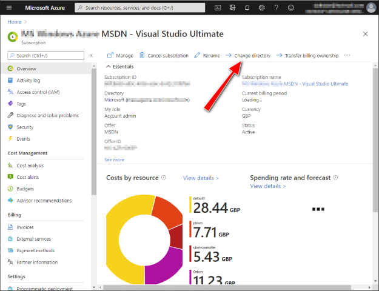
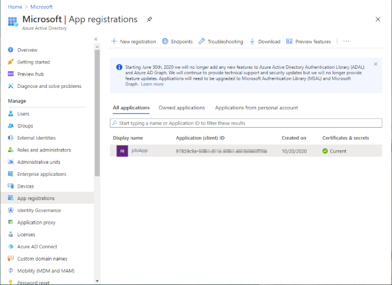
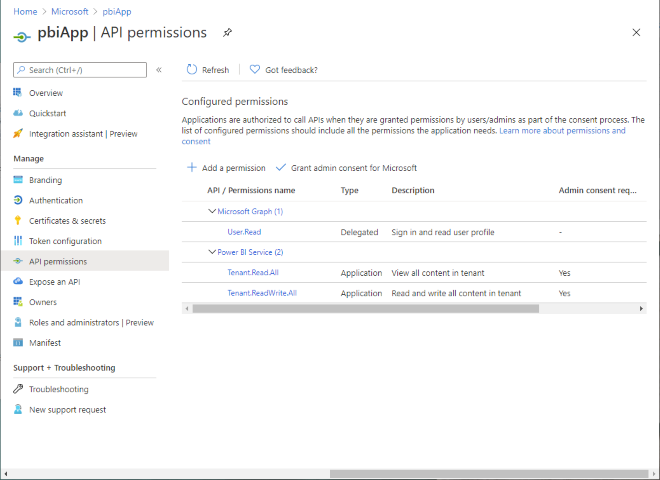
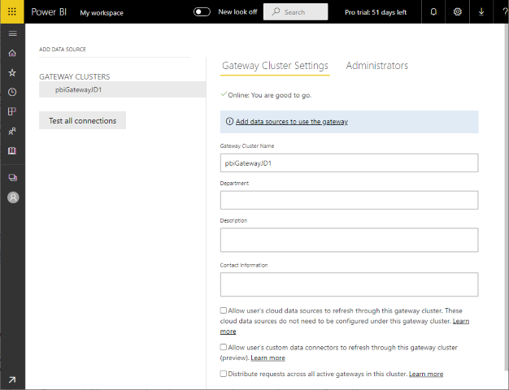
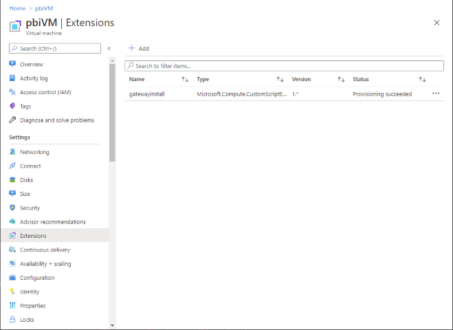
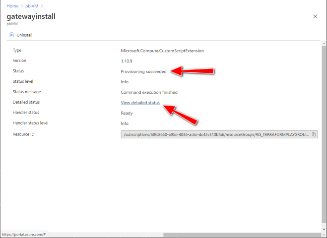
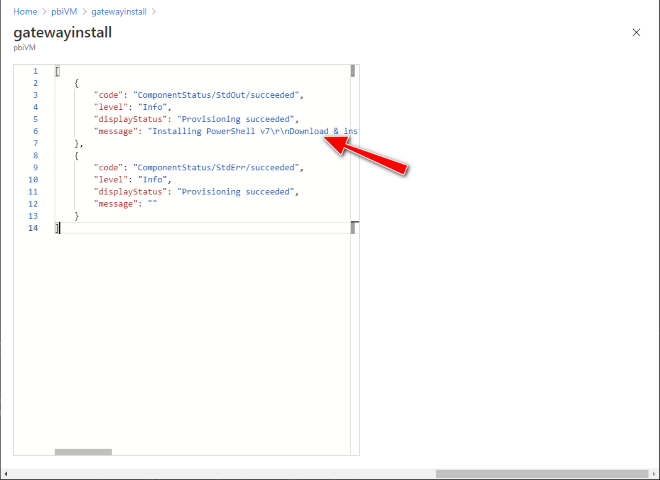
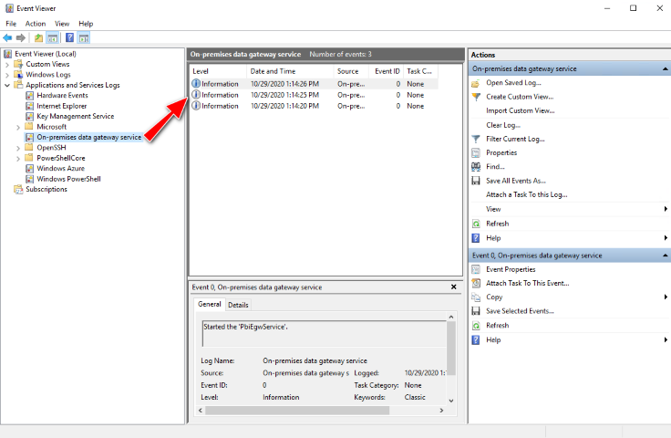
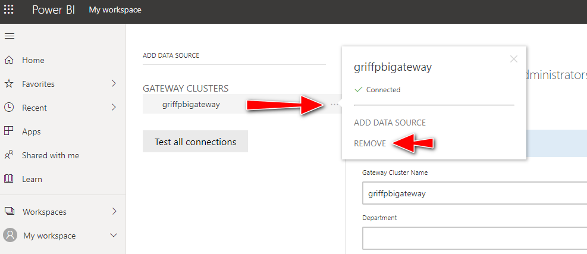

# Power BI Data Gateway


[](https://portal.azure.com/#create/Microsoft.Template/uri/https%3A%2F%2Fraw.githubusercontent.com%2FAzure%2Fazure-quickstart-templates%2Fmaster%2F101-vm-with-powerbi-data-gateway%2Fazuredeploy.json)  [](http://armviz.io/#/?load=https%3A%2F%2Fraw.githubusercontent.com%2FAzure%2Fazure-quickstart-templates%2Fmaster%2F101-vm-with-powerbi-data-gateway%2Fazuredeploy.json)

# Deploy a Power BI Gateway on an Azure VM

This project will create a new Windows Virtual Machine in Azure running the Power BI Gateway using ARM.  The [Power BI Gateway](https://docs.microsoft.com/en-us/data-integration/gateway/service-gateway-onprem) is useful if your data is within a VNET and you want to expose it to the Power BI service.

The deployment is done using ARM and a CustomScriptExtension with the included PowerShell scripts.  The scripts will install PowerShell 7 (a pre-requisite of the [Power BI Gateway PS Cmdlets](https://docs.microsoft.com/en-us/powershell/gateway/overview?view=datagateway-ps)), then install and configure the Power BI Data Gateway.  Logging of the Power BI Gateway deployment is done locally to log files and also surfaced back into Azure via the CustomScriptExtension.

## Developer Microsoft 365 Subscription

It is recommended that you use a development M365 tenant as a sandbox for this deployment.  You can get a free Microsoft 365 E5 developer subscription from here: https://developer.microsoft.com/en-us/microsoft-365/dev-program#Subscription.  You will need to associate this M365 tenant to either a new or existing Azure subscription, as this is needed to host the Azure VM that will be running the Power BI Gateway.  To change the directory of an existing Azure subscription, within the [Azure portal](https://portal.azure.com/), select 'change directory' then select your M365 tenant:



## AAD Application

You will also need an AAD Application registered with a secret to create the Power BI Gateway cluster:



This application will need the PBI Service permissions enabled:



Make a note of the AAD Application Id, secret and your Tenant Id.

## Gateway Administration

You will need to add additional administrator(s) to the Power BI Gateway Data Cluster so that you can manage it once it is created.  The `gateway_admin_ids` variable is a comma separated list of AAD User Object Ids (you can also use AAD Group Object Ids too).

> Note: If you encounter problems, see the [troubleshooting](#Troubleshooting) section for tips on fixing this.

## Power BI Data Gateway

Once the deployment is complete, login to the [Power BI portal](https://app.powerbi.com/) and check it exists under https://app.powerbi.com/groups/me/gateways:



## Removing the Power BI Data Gateway

The [pbiGatewayRemove.ps1](./scripts/pbiGatewayRemove.ps1) PowerShell script can be used to remove the gateway once it's been registered on the tenant.  This is useful if you're running the provisioning within a CI build and want to tear it down cleanly before removing the hosted VM.  Otherwise, you'll end up with an orphan gateway registration, which you'll need to remove manually in the Power BI portal - see [instructions below](#Gateway-not-created).

```bash
pwsh ./scripts/pbiGatewayRemove.ps1 -AppId {YOUR-AAD-APP-ID} -Secret {YOUR-AAD-APP-SECRET} -TenantId {YOUR-AAD-tenant-ID} -GatewayName {YOUR-GATEWAY-NAME} -Region {YOUR-GATEWAY-REGION}
```

## Troubleshooting

To troubleshoot any Power BI Gateway deployment or configuration errors, check the Azure VM Extensions status in the [Azure portal](https://portal.azure.com/):





An example of the output within the Azure VM Extension 'Detailed status' is available here: [CustomScriptExtension output](docs/gatewayinstall.json)

If this doesn't help, then remote desktop (RDP) onto the VM and check the logs in the following locations:

- C:\WindowsAzure\Logs\Plugins\Microsoft.Compute.CustomScriptExtension\1.10.9\CustomScriptHandler.log
- C:\WindowsAzure\Logs\Plugins\Microsoft.Compute.CustomScriptExtension\setup.log
- C:\WindowsAzure\Logs\Plugins\Microsoft.Compute.CustomScriptExtension\pbiGateway.log

An example of both the [setup.log](docs/setup.log) and [pbigateway.log](docs/pbiGateway.log) have also been included.

You can also check that the PowerShell script files have been successfully downloaded onto the VM in the following location:

- C:\Packages\Plugins\Microsoft.Compute.CustomScriptExtension\1.10.9\Downloads\0\
- C:\Packages\Plugins\Microsoft.Compute.CustomScriptExtension\1.10.9\Status\0.status

Lastly, look in Event Viewer under 'Applications and Services Logs' - 'On-premises data gateway service':



### Gateway admins not being added

You may find that when specifying additional gateway admins they are not applied - this will be appear in the log as "Warning! Data Gateway admin user not added". If this happens, try re-deploying.

### Gateway not created

If the Power BI Data Gateway fails to be created, it maybe because one has already been provisioned with the same name.  You can try deleting the gateway manually in the portal by hovering over the cluster and moving your cursor to the right-hand side until three dots appear:



After clicking 'Remove', re-run the ARM deployment.