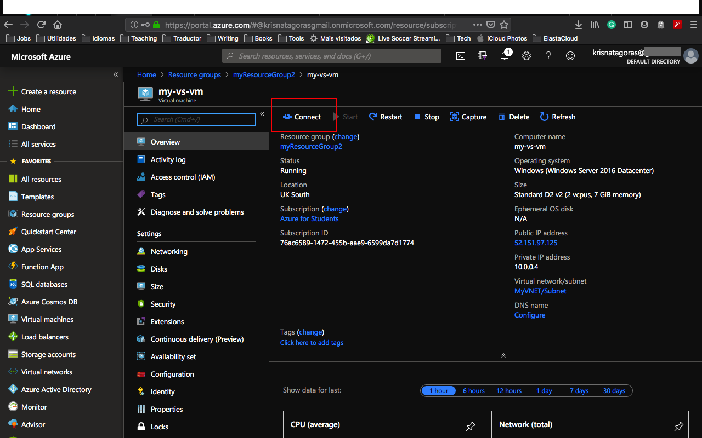
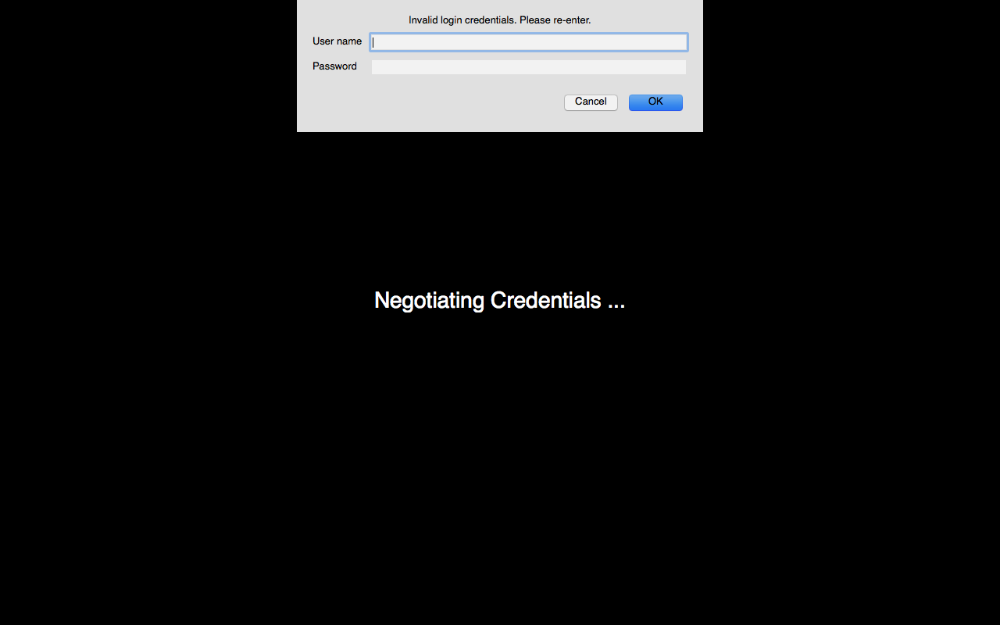

# Simple Windows Server 2016 - Datacenter with Visual Studio 2019

The intent of this README is to guide you in a deployment a **Windows Server 2016 - Datacenter Standard-D2-v2** (Two VCPUs and 7 GIB RAM) with the **Visual Studio Community 2019**.  

This template was designed to be an easy and fast way to create a Virtual Machine ready for you to start coding with Visual Studio.  

You can deploy this template either using the [Azure Portal](https://docs.microsoft.com/en-us/azure/azure-resource-manager/resource-group-template-deploy-portal) or [Azure CLI](https://docs.microsoft.com/en-us/azure/azure-resource-manager/resource-group-template-deploy-cli). Let's dig on the template and have some fun.

## The Template

Don't let the size of the template scares you. The structure is very intuitive and once that you get the gist of it, you gonna see how easier your life will be regarding creating resources on Azure.

The only parameters that we need to inform are:  **adminUsername**, **adminPassword** and **vmName**.

Don't worry about changing anything on the file, either on the portal or using Azure CLI, you need to inform just the following parameters. There are some requirements for username and password.

- *adminUsername:* Usernames can be a maximum of 20 characters and cannot end in a period (".").

- *adminPassword:* Password requirements between 12 to 72 characters and have lower and upper characters, a digit and a special character (Regex match [\W_])

- *vmName:* The name of your Virtual Machine. There is a default value, but you can change it during your deployment. Also, know that the maximum characters allowed are 15.

Let's rock with the Deployment.

## Deployment

There are a few ways to deploy this template.
You can use [PowerShell](https://docs.microsoft.com/en-us/azure/azure-resource-manager/resource-group-template-deploy), [Azure CLI](https://docs.microsoft.com/en-us/azure/azure-resource-manager/resource-group-template-deploy-cli), [Azure Portal](https://docs.microsoft.com/en-us/azure/azure-resource-manager/resource-group-template-deploy-portal) or your favorite SDK.

For this task, we will deploy using the Portal and Azure CLI, I choose to use the Visual Code with Azure CLI extensions, if you like, you can find more information [here](https://code.visualstudio.com/docs/azure/extensions). You don't need to use the Visual Code, you can stick with the old good always present **Command Line** on Windows or any **bash terminal**.

### Using Azure CLI with Visual Code

type on the terminal windows: **az login**

You will be redirected to the Azure Portal where you can use your credentials to log in.

After logged in you have your subscription, azure shows you all the subscriptions you have. If you more than one subscription you can set the right one, using the following command:

#### az account set --subscription "your subscription id"

### Resource Group

After you logged in, we gonna need to create a Resource Group for our deployment. If you haven't yet created a Resource Group, we gonna do that now! But what is a Resource Group, one might ask. Bare with me! A Resource Group is a container that holds related resources for an Azure solution. The resource group includes those resources that you want to manage as a group. Simply saying, it's like a folder that contains files. Simple as that ;-)

To create a Resource Group, you need a name and the location for your Resource Group.

For a list of locations, type: **az account list-locations**

To create the Resource group, just type the command:

#### az group create --name "resource-group" --location "your location"

Super simple, right? Now that we have our **Resource Group** created, let's deploy our Virtual Machine.

#### az group deployment create --name "name of your deployment" --resource-group "resource-group" --template-file "./azuredeploy.json"

As you can see, it's running. Go grab a cup of coffee, have some fresh air and I'm sure that before you come back you gonna have your Windows Virtual Machine with Visual Studio ready.

And there we go, our deploy is Succeeded:  

Let's go and check the resource at the Azure Portal:
Go the Resource Group, find the Resource group you've created.
And there it's your brand new **Virtual Machine**:

Open your Virtual Machine and then click on the button **connect**.

Download the RDP File (you gonna need an RDP software to connect), double click on the file, insert your **login** and **password**.

And Voilà, there you have a brandy new Windows Virtual Machine with Visual Studio.

Have fun coding!

### Using the Portal

At the Portal, in All Services look for **Templates**, you can favorite this service.

Click in **Add** to add your template:

On General, type a name and a description for your template, and click on [OK].

On ARM Template, replace the contents of the template with your template, and click on [OK].

Click on the refresh button and to see your template:

Open the template and click in [Deploy]

On the screen Custom Deployment, check your information and if you don't have the Resource Group you can click and [Create New].

Insert all the information, by now you should be familiar with it, select [I agree] and click on [Purchase].

And voilà, you have your new VM deployed. How easy was that, uhn?

To connect with the Virtual Machine you can repeat the same process as before, using the RDP file.

Now it is time to get your hands dirty, don't forget that you are in the cloud now, happy coding! :D

**p.s.: If by any chance you felt a bit overloaded with all these processes or perhaps you are asking yourself if there is a simple way to deploy your Virtual Machine? Good news for you bud! Just click on the button below and it will automatically deploy the VM on your Azure Portal.**

Now that you have done the hard work, with the Portal is even easier to create our Windows Virtual Machine with Visual Studio.

Just click on this button: [Deploy to Azure]

Insert your credentials to log in to the Portal.

Create the group if you haven't yet, insert the parameters **adminUsername**, **adminPassword** and **vmName**.

Select [I agree..] and then click in [Purchase].

And voilà, you have your new VM deployed. How easy was that, uhn?

To connect with the Virtual Machine you can repeat the same process as before, using the RDP file.

Now it is time to get your hands dirty, don't forget that you are in the cloud now, happy coding! :D

#### Important disclaimer: Azure charges you for the resources you are using, and you don't want to finish all your credits immediately, right? So, for not running out of credit, don't forget to stop the VM at the portal or even delete the Resource Group you create to avoid any unnecessary charges

### How to shutdown your resources

#### Using the portal

On the portal, open your Resource Group, if you will not use the service or VM anymore, you can just click on the [Delete] Button.

You can also just stop the service or Virtual Machine in case you gonna need the resource. Open the resource and click on Stop.

Just refresh your screen and you are good to go.
