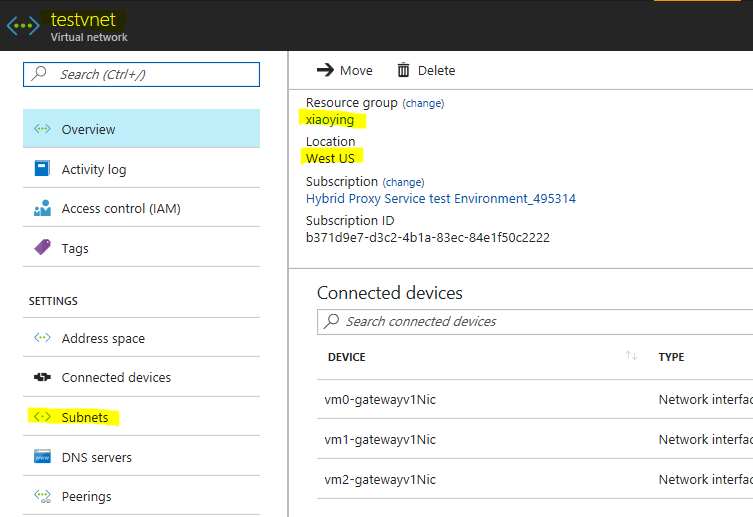

# Create self host IR and make it workable in azure VMs

Before deploying the template you must have the following

1. **Data Factory.** The integration runtime is created in the data factory. If you don't have a data factory,  see the [Create data factory](https://docs.microsoft.com/en-us/azure/data-factory/data-factory-move-data-between-onprem-and-cloud#create-data-factory) for steps to create one.
2. **Virtual Network.** The virtual machine will join this VNET. If you don't have one, use this tutorial, see [Create virtual network](https://docs.microsoft.com/en-us/azure/virtual-network/virtual-networks-create-vnet-arm-pportal#create-a-virtual-network) to create one.

<a href="https://portal.azure.com/#create/Microsoft.Template/uri/https%3A%2F%2Fraw.githubusercontent.com%2FAzure%2Fazure-quickstart-templates%2Fmaster%2F101-vms-with-selfhost-integration-runtime%2Fazuredeploy.json" target="_blank">
    
</a>
<a href="http://armviz.io/#/?load=https%3A%2F%2Fraw.githubusercontent.com%2FAzure%2Fazure-quickstart-templates%2Fmaster%2F101-vms-with-selfhost-integration-runtime%2Fazuredeploy.json" target="_blank">
    
</a>

When you deploy this Azure Resource Template, you will create a logical selfhost IR in your data factory and the following resources
- Azure Virtual Machine 
- Azure Storage (for VM system image and boot diagnostic)
- Public IP Address
- Network Interface
- Network Sercurity Group

This template can help you create selfhost IR and make it workable in azure VMs. The VM must join in an exsiting VNET. 

The below picture can help you find how to get vnet and subnet information.

