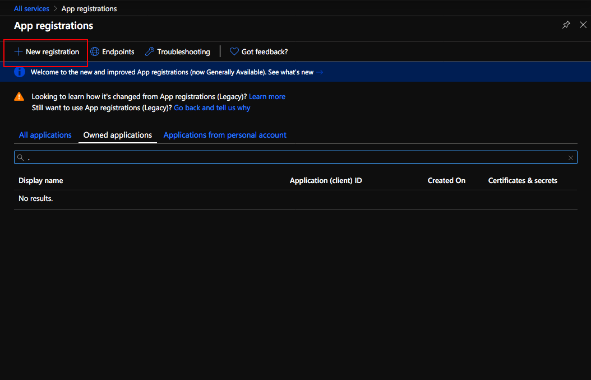
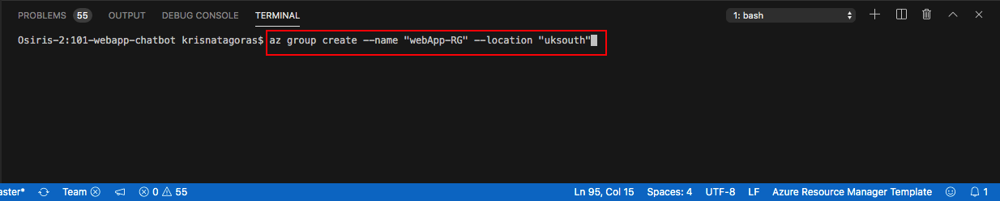

# Azure Bot Service

The purpose of this ARM Template is deploy a **Web App Bot** with a **App Service**, **App Service plan**, and **Application Insights**.

But let's understand a bit better how **Azure Bot Service** work.

## Overview

### What is Azure Bot Service

Azure Bot Service and Bot Framework provide tools to build, test, deploy, and manage intelligent bots all in one place. The creation of a Bot using Azure goes beyond
just the deployment of our ARM Template. Here we gonna scratch just the surface of what is offered in Azure. Through the use of modular and extensible framework provided by the SDK, tools, templates, and AI services, developers can create bots that use speech, understand natural language, handle questions and answers, and much more.

Azure Bot Service and Bot Framework offer an integrated set of tools and services to facilitate the creation of Bots. You can choose your favorite development environment or command-line tools to create your bot. SDKs exist for C#, JavaScript, and Typescript. (SDKs for Java and Python are under development.) Plus, Azure Bot Service and Bot Framework, provide tools for various stages of bot development to help you design and build bots. From **Plan** to -> **Build** to -> **Test** to -> **Publish** to -> **Connect** and **Evaluate**.

Here some extra documentation if you got hooked by Web ChatBots: [Chat Bot Documentation](https://docs.microsoft.com/en-us/azure/bot-service/?view=azure-bot-service-4.0).

It's fair to guess if you came to this Tutorial, you already know what a bot means, but let's just cover some basics:

>Bots provide an experience that feels less like using a computer and more like dealing with a person - or at least an intelligent robot. They can be used to shift simple, repetitive tasks, such as making a dinner reservation or gathering profile information, on to automated systems that may no longer require direct human intervention. Users converse with a bot using text, interactive cards, and speech. A bot interaction can be a quick question and answer, or it can be a sophisticated conversation that intelligently provides access to services.

### How bots work

A bot is an app that users interact within a conversational way, using text, graphics (such as cards or images), or speech. Every interaction between the user and the bot generates an activity. The Bot Framework Service, which is a component of the Azure Bot Service, sends information between the user's bot-connected app (such as Facebook, Skype, Slack, MS Team and Web - the service we gonna use for this bot - which we call the channel) and the bot.
We also gonna need an App Registration where we gonna generate our credentials in order to connect the bot with its channel.

Unfortunately, create credentials aren't yet supported by ARM Templates, so that is a Requisite for our ARM Chat Bot Deployment and we need to do that using the Azure Portal.

## Pre Deployment Steps

Before proceeding to the deployment of the **Web App Bot** template, we need to perform the following steps.

### App Registration

To create your own App ID, follow the steps below.

1. Using your favorite web browser sign in to the [Azure Portal](https://portal.azure.com/).

2. Go to **All Services** and search for **app registrations**. You can favorite this service by clicking on the star.  

3. Go to the app registrations blade and click **New registration** in the action bar at the top.

4. Enter a display name for the application registration in the Name field and select the supported account types. The name does not have to match the bot ID.
**Important**  
In the Supported account types, select the Accounts in any organizational directory and personal Microsoft accounts (e.g. Skype, Xbox, Outlook.com) radio button. If any of the other options are selected, **bot creation will fail.** Click **Register**.

5. Your new App Registration is ready, click on it and at the new blade copy the Application (client) ID. You need this ID to deploy your **Chat Bot**

## The Template

Don't let the size of the template scares you. The structure is very intuitive and once that you get the gist of it, you will see how much easier your life will be deploying resources to Azure.

These are the parameters on the template, most of them already have values inserted, the ones that you need to inform are: **App ID** (The App ID you got from the **App Registration**).

Here is the full list parameters in this template:

Parameter         | Suggested value     | Description
:--------------- | :-------------      |:---------------------
**Web App Name** | your chat bot name  | The name of the Bot resource.
**Location**| location | The location of your Resource Group.
**Resource Group**| your Resource Group | You can create a new resource group or choose from an existing one.
**sku** | F0 | The SKU for the Chat Bot. F0 or S1. F0 is the free tier.
**kind** | sdk | Gets or sets the Kind of the resource. - sdk, designer, bot, function.
**App ID**| Your App ID | The App ID that you've created in the previous section.

## Deployment

There are a few ways to deploy this template.
You can use [PowerShell](https://docs.microsoft.com/en-us/azure/azure-resource-manager/resource-group-template-deploy), [Azure CLI](https://docs.microsoft.com/en-us/azure/azure-resource-manager/resource-group-template-deploy-cli), [Azure Portal](https://docs.microsoft.com/en-us/azure/azure-resource-manager/resource-group-template-deploy-portal) or your favorite SDK.

For Azure CLI I'm using the Visual Code with Azure CLI extensions. If you would like you can find more information [here](https://code.visualstudio.com/docs/azure/extensions). But bare in mind that you don't need to use the Visual Code app, you can stick with the always present **Command Line** on Windows or the Linux **bash terminal**.

### Using Azure CLI with Visual Code

In the terminal window type: **az login**

You will be redirected to the Azure Portal in your web browser where you can insert your credentials and log in.

After logging in, you will see your credentials on the terminal.

To set the right subscription, type following command:

#### az account set --subscription "your subscription id"

### Resource Group

Now you need a Resource Group for our deployment. If you haven't already created a Resource Group, you can do it now. If you are new to Azure and wonder what is a Resource Group? Bare with me! A Resource Group is a container that holds related resources for an Azure solution. The resource group includes those resources that you want to manage as a group. Simply saying: it's like a folder that contains files. Simple as that.

To create a Resource Group, you need a name and a location for your Resource Group.

For a list of locations, type: **az account list-locations**

To create the Resource group, type the command:

#### az group create --name "resource-group" --location "your location"

Super simple, right? Now that we have our **Resource Group** created, let's deploy the **Web App Bot** using the az cli.

#### az group deployment create --name "name of your deployment" --resource-group "resource-group" --template-file "./azuredeploy.json"

Insert the Microsoft App ID and press [enter].

As you can see, it's running.

Go grab a cup of coffee, have some fresh air. Before you come back you will have your **Web App Bot**.

And there we go, your deployment has Succeeded:

Let's check the resource in the [Azure Portal](https://portal.azure.com).

On the portal, navigate to Resource Groups. On this blade, you can see the Resource Group we've created.

Click on the Resource Group to expand and show the **Resources**:

- App Service plan
- App Service
- Application Insights
- Web App Bot

Click on the Web App Bot.

On this blade you have all the setups for your Web App Bot. At the first blade you have resources an overview of the **Azure Bot Service**.

Click in **Test in Web Chat**

Congratulations, you have deployed a **Azure Bot Service** and that is just the tip of the Iceberg.

Most important, don't forget to have fun!

### Using the Portal

Using your favorite web browser Navigate to the Portal, in All Services look for **Templates**, you may want to add this service to favorites.

Click on **Add** to add your template:

On General, type the name and the description for your template, and click on [OK].

On ARM Template, replace the contents of the template with your template, and click on [OK].

Click on the refresh button and you will find your template. Click on your template and then click in [Deploy]

On the screen Custom Deployment, inform the values for the parameters, by now you must be already familiar with these.

Select [I agree] and click on [Purchase].

As you can see, it's deploying.

After a couple of minutes, voilà, you have your **Azure Bot Service** deployed.

Go to the Resource. Repeat the test that you have done before.

**p.s.: It's pretty easy to create resources on Azure, right? But if you are the sort of IT guy that always loves automation, here is the surprise. Just click on the button below and it will automatically deploy Azure Bot Service through the  Azure Portal.**

#### Important disclaimer: Azure charges you for the resources you are using, and you don't want to use all your credits at once, right? So, don't forget to stop the Azure Bot Service at the portal or even delete the Resource Group you have created to avoid unnecessary charges

### How to shutdown your resources

#### Using the portal

On the portal, open your Resource Group, if you want to remove the **Azure Bot Service** , you can just click on the [Delete] Button.

Alternatively you can delete the Resource Group, clicking on [Delete Resource Group] buttton.

Just refresh your screen and you are good to go.
