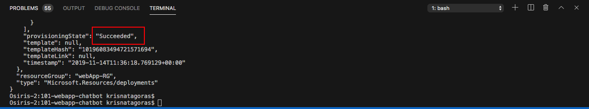
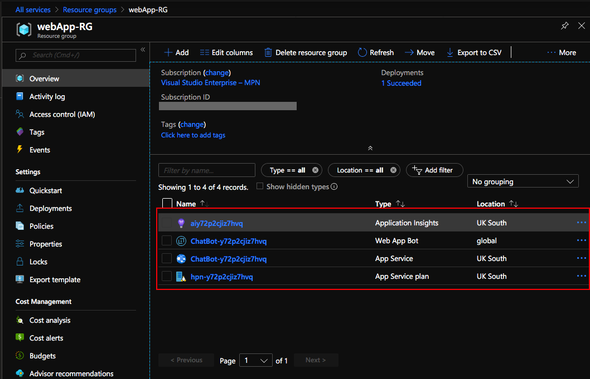

# Azure Web Chat Bot ARM Template

Here we continue our adventure through ARM Templates.  The aim of this Get Start is to create a Web App Service and deploy a Web Chat Bot using Azure Services.

But let's understand a bit better how all this will work.

### Azure Bot Service

Azure Bot Service and Bot Framework provide tools to build, test, deploy, and manage intelligent bots all in one place. The creation of a Bot using Azure goes beyond
just the deployment of our ARM Template. Here we gonna scratch just the surface of what is offered in Azure. Through the use of modular and extensible framework provided by the SDK, tools, templates, and AI services, developers can create bots that use speech, understand natural language, handle questions and answers, and much more.

Azure Bot Service and Bot Framework offer an integrated set of tools and services to facilitate the creation of Bots. You can choose your favorite development environment or command-line tools to create your bot. SDKs exist for C#, JavaScript, and Typescript. (SDKs for Java and Python are under development.) Plus, Azure Bot Service and Bot Framework, provide tools for various stages of bot development to help you design and build bots. From **Plan** to -> **Build** to -> **Test** to -> **Publish** to -> **Connect** and **Evaluate**.

Here some extra documentation if you got hooked by Web ChatBots: [Chat Bot Documentation](https://docs.microsoft.com/en-us/azure/bot-service/?view=azure-bot-service-4.0).

It's fair to guess if you came to this Tutorial, you already know what a bot means, but let's just cover some basics:

>Bots provide an experience that feels less like using a computer and more like dealing with a person - or at least an intelligent robot. They can be used to shift simple, repetitive tasks, such as making a dinner reservation or gathering profile information, on to automated systems that may no longer require direct human intervention. Users converse with a bot using text, interactive cards, and speech. A bot interaction can be a quick question and answer, or it can be a sophisticated conversation that intelligently provides access to services.

#### How bots work

A bot is an app that users interact within a conversational way, using text, graphics (such as cards or images), or speech. Every interaction between the user and the bot generates an activity. The Bot Framework Service, which is a component of the Azure Bot Service, sends information between the user's bot-connected app (such as Facebook, Skype, Slack, MS Team and Web - the service we gonna use for this bot - which we call the channel) and the bot.
We also gonna need an App Registration where we gonna generate our credentials in order to connect the bot with its channel.

Unfortunately, create credentials aren't yet supported by ARM Templates, so that is a Requisite for our ARM Chat Bot Deployment and we need to do that using the Azure Portal.

#### Prequisites:
#### App Registration

To create your own App ID, follow the steps below.

1. Sign in to the [Azure Portal](https://portal.azure.com/) using your Azure Student Account.

2. Go to **All Services** and search for **app registrations**. You can favorite this service by clicking on the star.  

3. Go to the app registrations blade and click **New registration** in the action bar at the top.

4. Enter a display name for the application registration in the Name field and select the supported account types. The name does not have to match the bot ID.
>**Important**  
>
>In the Supported account types, select the Accounts in any organizational directory and personal Microsoft accounts (e.g. Skype, Xbox, Outlook.com) radio button. If any of the other options are selected, **bot creation will fail.**

5. Click **Register**. After a few moments, the newly created app registration should open a blade. Copy the Application (client) ID in the Overview blade and paste it into the App ID field. (That is a parameter need it in order to deploy our ARM Template)

Now we gonna need to generate a secret for the App Registration:
6. Click on **Certificates & secrets** in the left navigation column of your app registration’s blade.
7. In that blade, click the **New client secret** button. In the dialog that pops up, enter an optional description for the secret and select **Never** from the Expires radio button group.

>**Note**

>The secret will only be visible while on this blade, and you won't be able to retrieve it after you leave that page. Be sure to copy it somewhere safe.

Now that you create your credentials, let's have a look at the Template.

###The Template
Don't let the size of the template scares you. The structure is very intuitive and once that you get the gist of it, you gonna see how easier your life will be regarding creating resources on Azure.

The parameters we will manipulate and inform are: 

Parameter         | Suggested value     | Description
:--------------- | :-------------      |:---------------------
**Subscription**  | Your subscription    |Select your Azure Student Subscription.
**Resource Group**| WebAppResourceGroup|      You can create a new resource group or choose from an existing one.
**Location**| The default location | Select the geographic location for your resource group. Your location choice can be any location listed, though it's often best to choose a location closest to your customer. The location cannot be changed once the bot is created.
**Web App Name** |*location*-*name*-*enviroment* i.e.:  uks-mybot-test  | The unique URL name of the bot. For example, if you name your bot uks-mybot-test, then your bot's URL will be http://uks-mybot-test.azurewebsites.net. The name must use alphanumeric and underscore characters only. There is a 35 character limit to this field. The App name cannot be changed once the bot is created. I personally like to add the location of the app into the name, and also the environment. That is the reason that my Web App Name is: uks-mybot-test
**App ID**| Your App ID | The App ID that you've created in the previous section.
**App Secret**| Complex Password| The secret that you've created in the previous section.

##Deployment
There are a few ways to deploy this template.
You can use [PowerShell](https://docs.microsoft.com/en-us/azure/azure-resource-manager/resource-group-template-deploy), [Azure CLI](https://docs.microsoft.com/en-us/azure/azure-resource-manager/resource-group-template-deploy-cli), [Azure Portal](https://docs.microsoft.com/en-us/azure/azure-resource-manager/resource-group-template-deploy-portal) or your favorite SDK.

For this task, we gonna deploy using Visual Code and the portal and a little surprise for you at the end. :D 

For Azure CLI I choose to use the Visual Code with Azure CLI extensions, if you like, you can find more information [here](https://code.visualstudio.com/docs/azure/extensions). But bare in mind that you don't need to use the Visual Code, you can stick with the old good always present **Command Line** on Windows or any **bash terminal**.

###Using Azure CLI with Visual Code
type on the terminal windows: **az login**

 

You gonna be redirected to the Azure Portal where you can use your credentials to login into.

After login, you gonna have your credentials. 

In order to set the right subscription, you can use the following command:

**az account set --subscription "< your subscription id >"**

 

####Resource Group

After you logged in, we gonna need to create a Resource Group for our deployment. If you haven't yet created a Resource Group, we gonna do that now! But what is a Resource Group, one might ask. Bare with me! A Resource Group is a container that holds related resources for an Azure solution. The resource group includes those resources that you want to manage as a group. Simply saying, it's like a folder that contains files. Simple as that ;-)

To create a Resource Group, you need a name and the location for your Resource Group.

For a list of locations, type: **az account list-locations**

To create the Resource group, just type the command: 
 
**az group create --name < mygroupname> --location < yourlocation >**

Super simple, right? Now that we have our **Resource Group** created, let's deploy our Virtual Machine.

**az group deployment create --name "name of your deployment" --resource-group "The group you created" --template-file "./azuredeploy.json"**

You gonna need to insert the parameters information:

As you can see, it's running.   

Go grab a cup of coffee, have some fresh air and I'm sure that before you come back you gonna have your Ubuntu Server Virtual Machine ready.

 
And there we go, our deploy is Succeeded:  

Let's go and check the resource at the Azure Portal:
Go the Resource Group, find the Resource group you've created.
And there it's your **Resources**:

- App Service plan
- App Service
- Web App Bot

Click on the Web App Bot. 

On this blade you have all the setups for your Web App Bot. On this overview you have resources from **Plan** to -> **Build** to -> **Test** to -> **Publish** and -> **Connect**.
You can download the source code, publish your bot in different environments, connect to different channels, like Facebook, Skype, Cortana and also MS Teams.

All these resources are great, right?

Let's now test our Web ChatBot. Click in **Test in Web Chat**

And that is just the tip of the iceberg. There is plenty of documentation to dig in and most important: 

Don't forget to have fun!

###Using the Portal

At the Portal, in All Services look for **Templates**, you can favorite this service.

Click in **Add** to add your template:

On General, type a name and a description for your template, and click on [OK].

On ARM Template, replace the contents of the template with your template, and click on [OK].

 

Click on the refresh button and there is your template:

Open the template and click in [Deploy]

 

On the screen Custom Deployment, insert the information that you must be already familiar with. 

Select [I agree] and click on [Purchase].

 

As you can see, it's deploying.

 

And voilà, you have your Web App Bot deployed.

Go to the Resource. Repeat the test you have done before and enjoy your coding.

**p.s.: Pretty easy to create resources on Azure, right? But if you are the sort of IT guy that always looks for automating things on the extreme :D Surprise, surprise!.
Just click on the button below and it will automatically deploy the VM on your Azure Portal.**

#####Important disclaimer: For bot Service, we are using the F0 free tier of access, which means that we have a limited amount of access, by the time of writing this guide is 10K of messages that you can use in the Web ChatBot. Anyway if you exceed that access you may be charged, in order to avoid that you can delete the resource and deploy it again, you don't want to finish all your credits at once, right? 

###How to shutdown your resources:
####Using the portal:

On the portal, open your Resource Group, select your Web ChatBot and then just click on the [Delete] Button.

Just refresh your screen and you are good to go.