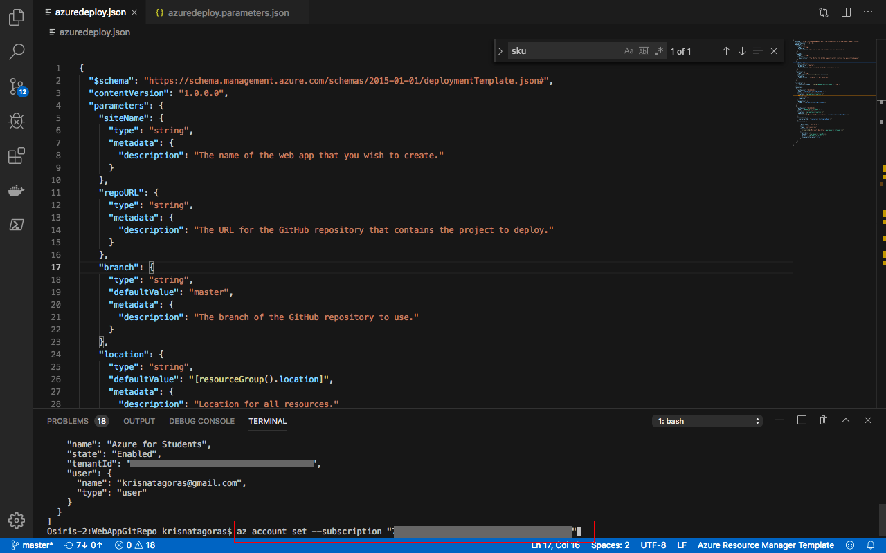
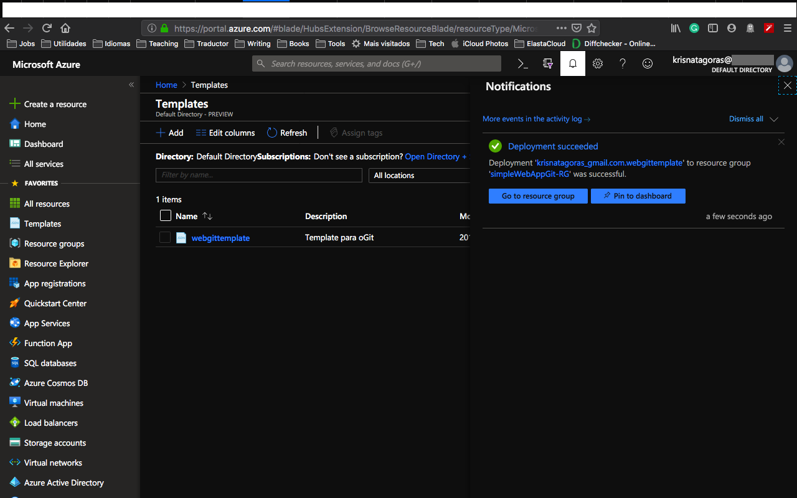

# Azure Web App with Git Hub Account

Here we are in another chapter on our ARM Templates learning path. This time we gonna deploy a simple Web App Service with a GitHub Repository Account linked.

But let's understand a bit better how all this will work.

### How Web Apps works in Azure?

Azure App Service is a fully managed compute platform that is optimized for hosting websites and web applications. Customers can use App Service on Linux to host web apps natively on Linux for supported application stacks. The Languages section lists the application stacks that are currently supported.

#### Languages

App Service on Linux supports several Built-in images to increase developer productivity.

Language          | Supported Versions     
:--------------- | :-------------  
Node.js     | 4.4, 4.5, 4.8, 6.2, 6.6, 6.9, 6.10, 6.11, 8.0, 8.1, 8.2, 8.8, 8.9, 8.11, 8.12, 9.4, 10.1, 10.10, 10.14
Java *     | Tomcat 8.5, 9.0, Java SE, WildFly 14 (all running JRE 8)
PHP     | 5.6, 7.0, 7.2, 7.3
Python     | 2.7, 3.6, 3.7
.NET Core     | 1.0, 1.1, 2.0, 2.1, 2.2
Ruby     | 2.3, 2.4, 2.5, 2.6

#### Deployments
- FTP
- Local Git
- GitHub
- Bitbucket

The purpose of this ARM Template is **deploy a Linux WebApp** with a **GitHub Account liked**.

### Prequisites:
#### Have a Git Hub Account

If you don't have yet a Git Hub account, you can create your account on [Git Hub](https://github.com/).

What we gonna need for this task is the address of the GitRepo.

Copy this address, we will need to pass it as a parameter during the deployment.

###The Template
Don't let the size of the template scares you. The structure is very intuitive and once that you get the gist of it, you gonna see how easier your life will be regarding creating resources on Azure.

Those are the parameters on the template, nevertheless, there are just three parameters we will need to insert. The parameters we will manipulate and inform are:

Parameter         | Suggested value     | Description
:--------------- | :-------------      |:---------------------
**siteName** |*location*-*name*-*enviroment* i.e.:  uks-mywebappgit-test  | The unique URL name of the WebApp. I recommend you to use the notation above, that helps to create a unique name for your Web Application. The name must use alphanumeric and underscore characters only. There is a 35 character limit to this field. The App name cannot be changed once the bot is created.
**repoURL**  | Git Repository URL     |The URL for the GitHub repository that contains the project to deploy.
**branch**  | master     |The branch of the GitHub repository to use.
**Resource Group**| simpleWebAppGit-RG|  That is the Resource Group you gonna need to deploy your resources.
**Location**| The default location | Select the geographic location for your resource group. Your location choice can be any location listed, though it's often best to choose a location closest to your customer. The location cannot be changed once the bot is created.

##Deployment
There are a few ways to deploy this template.
You can use [PowerShell](https://docs.microsoft.com/en-us/azure/azure-resource-manager/resource-group-template-deploy), [Azure CLI](https://docs.microsoft.com/en-us/azure/azure-resource-manager/resource-group-template-deploy-cli), [Azure Portal](https://docs.microsoft.com/en-us/azure/azure-resource-manager/resource-group-template-deploy-portal) or your favorite SDK.

For this task, we gonna deploy using Visual Code and the portal and a little surprise for you at the end. :D

For Azure CLI I choose to use the Visual Code with Azure CLI extensions, if you like, you can find more information [here](https://code.visualstudio.com/docs/azure/extensions). But bare in mind that you don't need to use the Visual Code, you can stick with the old good always present **Command Line** on Windows or any **bash terminal**.

###Using Azure CLI with Visual Code
type on the terminal windows: **az login**

You gonna be redirected to the Azure Portal where you can use your credentials to login into.

After login, you gonna have your credentials.

In order to set the right subscription, you can use the following command:

**az account set --subscription "< your subscription id >"**

####Resource Group

After you logged in, we gonna need to create a Resource Group for our deployment. If you haven't yet created a Resource Group, we gonna do that now! But what is a Resource Group, one might ask. Bare with me! A Resource Group is a container that holds related resources for an Azure solution. The resource group includes those resources that you want to manage as a group. Simply saying, it's like a folder that contains files. Simple as that ;-)

To create a Resource Group, you need a name and the location for your Resource Group.

For a list of locations, type: **az account list-locations**

To create the Resource group, just type the command:

**az group create --name < mygroupname> --location < yourlocation >**

Super simple, right? Now that we have our **Resource Group** created, let's deploy our Web Application.

**az group deployment create --name "name of your deployment" --resource-group "The group you created" --template-file "./azuredeploy.json"**

You gonna need to insert the parameters information:

As you can see, it's running.   

Go grab a cup of coffee, have some fresh air and I'm sure that before you come back you gonna have your Web App with GitHub Account will be deployed.

And there we go, our deploy is Succeeded:  

Let's go and check the resource at the [Azure Portal](https://portal.azure.com).

On the portal, go to Resource Groups. On this blade, you can see the Resource Group we've created.

Go the Resource Group, find the Resource group you've created.
Click on the Resource Group and there it's our resources **Resources**:

- App Service plan
- App Service

Click on the Web Plan and then look for **Deployment Center**.

Here you can check our external git hub account linked with your Web App.

And that is just the tip of the iceberg. You can start to deploy code to your new Web Application or Web Site.

Most important, don't forget to have fun!

###Using the Portal

At the Portal, in All Services look for **Templates**, you can favorite this service.

Click in **Add** to add your template:

On General, type a name and a description for your template, and click on [OK].

On ARM Template, replace the contents of the template with your template, and click on [OK].

Click on the refresh button and there is your template:

Open the template and click in [Deploy]

On the screen Custom Deployment, insert the information that you must be already familiar with.

Select [I agree] and click on [Purchase].

As you can see, it's deploying.

After a couple of minutes, voilà, you have your Web App with GitHub Account deployed.

Go to the Resource. Repeat the test you have done before and enjoy your coding.

**p.s.: Pretty easy to create resources on Azure, right? But if you are the sort of IT guy that always looks for automating things on the extreme :D Surprise, surprise!.
Just click on the button below and it will automatically deploy the VM on your Azure Portal.**

#####Important disclaimer: Azure charge you for the resources you are using, and you don't want to finish all your credits at once, right? So, for not running out of credit, don't forget to stop the Web App at the portal or even delete the Resource Group you create to avoid any unnecessary charges.

###How to shutdown your resources:
####Using the portal:

On the portal, open your Resource Group, if you will not use the Web App anymore, you can just click on the [Delete] Button.

You can also just stop the Web App in case you gonna need the resource. Open the resource and click on Stop.

Just refresh your screen and you are good to go.
