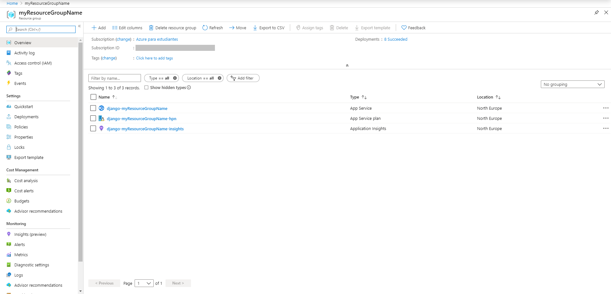
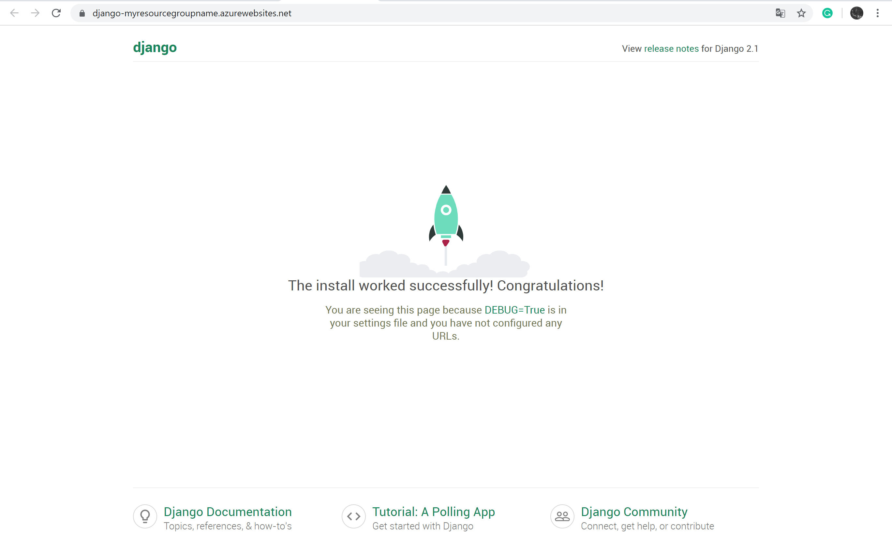
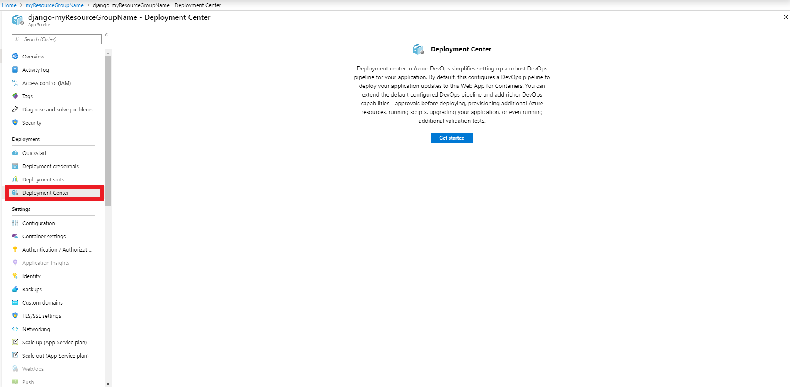
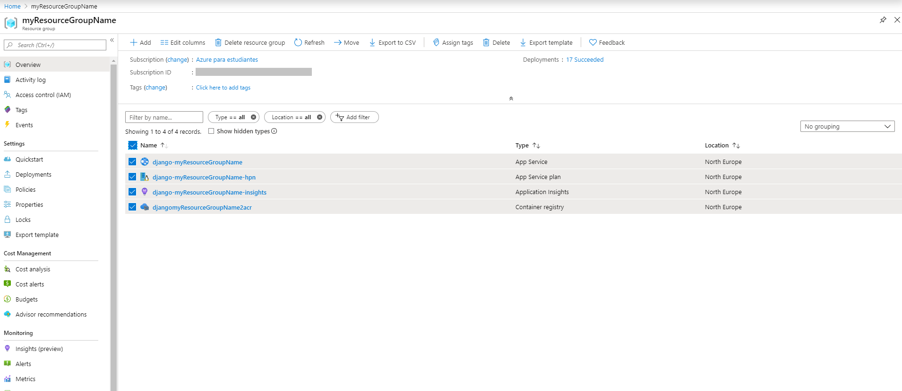

# Django App - App Service

This README intends to deploy a Django App. This template was designed to be an easy and fast way to create an App Service to deploy your Django App.

You can deploy this template by using the [Azure Portal](https://docs.microsoft.com/en-us/azure/azure-resource-manager/resource-group-template-deploy-portal) or [Azure CLI](https://docs.microsoft.com/en-us/azure/azure-resource-manager/resource-group-template-deploy-cli). Let's dig on the template and have some fun coding. 

## The template

In the template, we will have different sections. These sections are:

    - Parameters
    - Variables
    - Resources

Let's see each section.

### Parameters

The parameters are fields that we should modify our App Service.
Here, we will find only a parameter:

|**PARAMETERS NAME**   |**DESCRIPTION**   |
|---|---|
|webAppName   |Name for your application. It has to be unique.   |
|location   |Location for the deploy of our resources.   |

To ensure that this name is unique, we will add to that name, the name of the resource group where we will deploy the App Service to the name field. The format will be like follows:
**'appServiceName'-'resourceGroupName'**

### Variables

The variables are fields that we should not modify. That's because it is configured to get our App Service deployed into a Free tier.

On that template, we have the following variables:

|**VARIABLES NAME**   |**DESCRIPTION**   |
|---|---|
|sku   |Shape for our product.   |
|skuCode   |Code to identify our product.   |
|workerSize   |Optional. The worker size. Possible values are Small, Medium, and Large. For JSON, the equivalents are 0 = Small, 1 = Medium, and 2 = Large   |
|hostingPlanName   |Name for the hosting plan. On the free tier, you can only have 1 Linux hosting environment.   |
|nameInsights  |Name for the application insights  |

#### Resources

The resources are the services that we will deploy into Azure. In this template we will deploy two resources:

|**RESOURCE NAME**   |**DESCRIPTION**   |
|---|---|
|Microsoft.Web/sites   |This is our App Service.   |
|Microsoft.Web/serverfarms   |This is the hosting for our App Service. There is a limit of 1 free tier Linux server per subscription.   |
|microsoft.insights/components   |Used to monitor our live web application   |

## Deployment

There are a few ways to deploy this template.
You can use [PowerShell](https://docs.microsoft.com/en-us/azure/azure-resource-manager/resource-group-template-deploy), [Azure CLI](https://docs.microsoft.com/en-us/azure/azure-resource-manager/resource-group-template-deploy-cli), [Azure Portal](https://docs.microsoft.com/en-us/azure/azure-resource-manager/resource-group-template-deploy-portal) or your favorite SDK.

For this task, we will deploy using the Portal and Azure CLI, I choose to use the Visual Code with Azure CLI extensions, if you like, you can find more information [here](https://code.visualstudio.com/docs/azure/extensions). But bare in mind that you don't need to use the Visual Code, you can stick with the old good always present **Command Line** on Windows or any **bash terminal**.

### Using Azure CLI with Visual Code

Type on the terminal windows:
**az login**

You gonna be redirected to the Azure Portal where you can use your credentials to login into.

After login, you gonna have your credentials.

To set the right subscription, you can use the following command:
**az account set --subscription 'your subscription id'**

### Resource Group

A resource group is a container that holds related resources for an Azure solution. The resource group includes those resources that you want to manage as a group. 

We gonna need to create a resource group for our deployment if we haven't yet create a resource group.

To create a resource group, we will need a name and the location. For a list of locations, type:
**az account list-locations**

To create the resource group, just type the command:
**az group create --name 'mygroupname' --location 'thelocation'**

Now, we are ready to deploy our template. Type the next command to get it:
**az group deployment create --resource-group 'your resource-group name' --template-file 'full path and name of your template'**

It will spend some time on the deployment. Bring it like 5 minutes until the process finish.

When it finished, let's go to the Portal, and let's see our App Services.

Congratulations! You have deployed the template successfully. We can see our web visiting an URL like that:
**<app-name>.azurewebsites.net**

You can redeploy it automatically with just click on this button:

### Deploy your code

It will be really easy. First of all, download the basic Django project configuration from [Azure-Sample](https://github.com/Azure-Samples/docker-django-webapp-linux.git). You can clone the repository using git.

Once we have cloned the repository, let's create a new repository in GitHub. Here is where we will push our Django App to make the deployment. Let's now go to the portal, to the deployment centre in our App Service Resource.

Let's click on "Get Started" and then select the GitHub option. If it is the first time you make this, you will have to synchronize your GitHub and Azure account.
Select next ... And then select the repository and the branch.

If we make all good, the system will recognize our dockerfile automatically. Finally, we will have to create an Azure DevOps and a Container Registry on the last step of the deployment or use an existing one.

Make sure that it is deployed successfully to production. Now we can see our Django app deployed in our app services.

### How to delete your resources

On the portal, open your resource group and click on the Delete button.

### What to do if the deployment fails

When we are trying to deploy our template, we can find that this fails. If that happens, what we will do it is to delete the resource group and then redeploy our template.

To delete the resource group, we will go to our resource group, and then, we will delete it the same that we made in the last section.