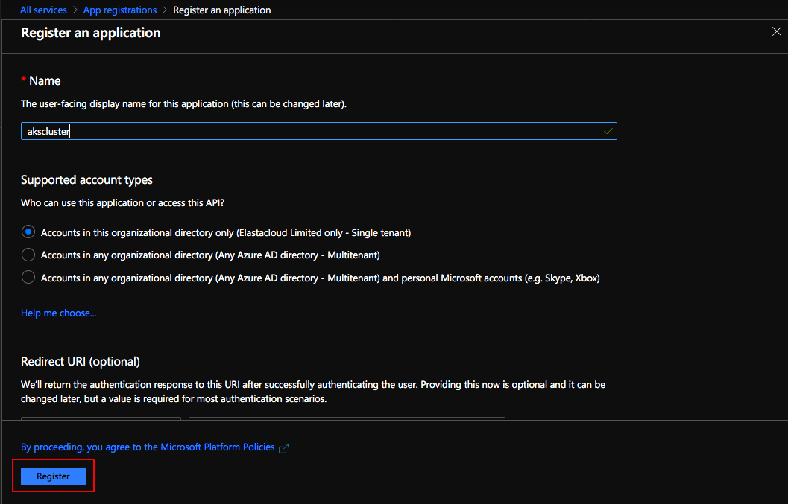
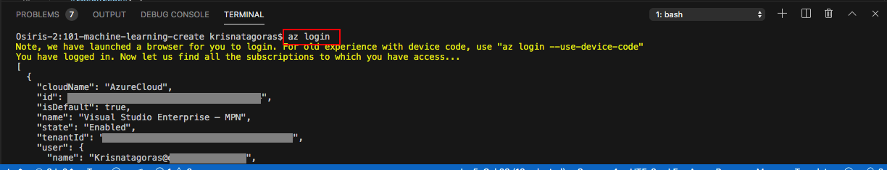

# Azure Kubernetes Service (AKS)

The purpose of this ARM Template is deploy a **AKS Cluster**.

But let's understand a bit better how **Azure Kubernetes Service (AKS)** work.

## Overview

### What is Azure Kubernetes Service (AKS)

Azure Kubernetes Service (AKS) makes it simple to deploy a managed Kubernetes cluster in Azure. AKS reduces the complexity and operational overhead of managing Kubernetes by offloading much of that responsibility to Azure. As a hosted Kubernetes service, Azure handles critical tasks like health monitoring and maintenance for you. The Kubernetes masters are managed by Azure. You only manage and maintain the agent nodes. As a managed Kubernetes service, AKS is free - you only pay for the agent nodes within your clusters, not for the masters.

### Clusters and nodes

AKS nodes run on Azure virtual machines. You can connect storage to nodes and pods, upgrade cluster components, and use GPUs. AKS supports Kubernetes clusters that run multiple node pools to support mixed operating systems and Windows Server containers (currently in preview). Linux nodes run a customized Ubuntu OS image, and Windows Server nodes run a customized Windows Server 2019 OS image.

### Development tooling integration

Kubernetes has a rich ecosystem of development and management tools such as Helm, Draft, and the Kubernetes extension for Visual Studio Code. These tools work seamlessly with AKS.

Additionally, Azure Dev Spaces provides a rapid, iterative Kubernetes development experience for teams. With minimal configuration, you can run and debug containers directly in AKS.

The Azure DevOps project provides a simple solution for bringing existing code and Git repository into Azure. The DevOps project automatically creates Azure resources such as AKS, a release pipeline in Azure DevOps Services that includes a build pipeline for CI, sets up a release pipeline for CD, and then creates an Azure Application Insights resource for monitoring.

## Pre Deployment Steps

Before proceeding to the deployment of the **AKS Cluster** template, we need to perform the following steps.

### App Registration

To create your own App ID, follow the steps below.

1. Using your favorite web browser sign in to the [Azure Portal](https://portal.azure.com/).

2. Go to **All Services** and search for **app registrations**. You can favorite this service by clicking on the star.  

3. Go to the app registrations blade and click **New registration** in the action bar at the top.

4. Enter a for the App registration in the Name field and select the supported account types of your choice. Then click in [Register].

5. You were directed to the overview page. Copy the Application (client) ID. You need this ID to deploy your **AKS Cluster**

6. Go to [Certificate & Secrets], click on [New Client Secret]. Provide a description and the when expires. You need to copy the secret, once that you leave the page will not show the secret again.

### Create an SSH key pair

Configure all linux machines with the SSH RSA public key string. Use the ssh-keygen command to generate SSH public and private key files. By default, these files are created in the ~/.ssh directory. Your key should include three parts, for example 'ssh-rsa AAAAB...snip...UcyupgH azureuser@linuxvm'

The following command creates an SSH key pair using RSA encryption and a bit length of 2048:

#### ssh-keygen -t rsa -b 2048

For more information about SSH Key for authentication to Linux VM in azure, click [here](https://docs.microsoft.com/en-gb/azure/virtual-machines/linux/create-ssh-keys-detailed)

## The Template

Don't let the size of the template scares you. The structure is very intuitive and once that you get the gist of it, you will see how much easier your life will be deploying resources to Azure.

These are the parameters on the template, most of them already have values inserted, the ones that you need to inform are: **linuxAdminUsername**, **Resource Group**, **sshRSAPublicKey**, **servicePrincipalClientId** and **servicePrincipalClientSecret** (The App ID and secret that you created from the **App Registration**).

Here is the full list parameters in this template:

Parameter         | Suggested value     | Description
:--------------- | :-------------      |:---------------------
**clusterName** | [concat('aksclus', resourceGroup().name)] | Specifies the name of the AKS Cluster.
**Resource Group**| your Resource Group | You can create a new resource group or choose from an existing one.
**Location**| location | The location of your Resource Group.
**dnsLabelPrefix** | [toLower(concat('dns',parameters('clusterName')))] | Optional DNS prefix to use with hosted Kubernetes API server FQDN.
**osDiskSizeGB** | 0 | Disk size (in GB) to provision for each of the agent pool nodes. This value ranges from 0 to 1023. Specifying 0 will apply the default disk size for that agentVMSize.
**agentCount** | 3 | The number of nodes for the cluster.
**agentVMSize** | Standard_B2s | The size of the Virtual Machine.
**linuxAdminUsername** | adminusername | User name for the Linux Virtual Machines. Usernames can be a maximum of 20 characters and cannot end in a period (".").
**sshRSAPublicKey** | you public key | Configure all linux machines with the SSH RSA public key string. Your key should include three parts, for example 'ssh-rsa AAAAB...snip...UcyupgH azureuser@linuxvm'
**servicePrincipalClientId**| Your App ID | The App ID that you've created in the [Pre Deployment Steps].
**servicePrincipalClientSecret** | Your Secret | The Secret you've created in the [Pre Deployment Steps].
**osType** | linux | The type of operating system.
**kubernetesVersion** | 1.13.12 | The version of Kubernetes. For more information about kubernetes versions, click [here](https://docs.microsoft.com/en-gb/azure/aks/supported-kubernetes-versions).

## Deployment

There are a few ways to deploy this template.
You can use [PowerShell](https://docs.microsoft.com/en-us/azure/azure-resource-manager/resource-group-template-deploy), [Azure CLI](https://docs.microsoft.com/en-us/azure/azure-resource-manager/resource-group-template-deploy-cli), [Azure Portal](https://docs.microsoft.com/en-us/azure/azure-resource-manager/resource-group-template-deploy-portal) or your favorite SDK.

For Azure CLI I'm using the Visual Code with Azure CLI extensions. If you would like you can find more information [here](https://code.visualstudio.com/docs/azure/extensions). But bare in mind that you don't need to use the Visual Code app, you can stick with the always present **Command Line** on Windows or the Linux **bash terminal**.

### Using Azure CLI with Visual Code

In the terminal window type: **az login**

You will be redirected to the Azure Portal in your web browser where you can insert your credentials and log in.

After logging in, you will see your credentials on the terminal.

To set the right subscription, type following command:

#### az account set --subscription "your subscription id"

### Resource Group

Now you need a Resource Group for our deployment. If you haven't already created a Resource Group, you can do it now. If you are new to Azure and wonder what is a Resource Group? Bare with me! A Resource Group is a container that holds related resources for an Azure solution. The resource group includes those resources that you want to manage as a group. Simply saying: it's like a folder that contains files. Simple as that.

To create a Resource Group, you need a name and a location for your Resource Group.

For a list of locations, type: **az account list-locations**

To create the Resource group, type the command:

#### az group create --name "resource-group" --location "your location"

Super simple, right? Now that we have our **Resource Group** created, let's deploy the **Web App Bot** using the az cli.

#### az group deployment create --name "name of your deployment" --resource-group "resource-group" --template-file "./azuredeploy.json"

Insert the Parameters and press [enter].

As you can see, it's running.

Go grab a cup of coffee, have some fresh air. Before you come back you will have your **AKS Cluster**.

And there we go, your deployment has Succeeded:

Let's check the resource in the [Azure Portal](https://portal.azure.com).

On the portal, navigate to Resource Groups. On this blade, you can see the Resource Group we've created.

Click on the Resource Group to expand and show the **Resources**:

- Kubernetes service

Click on the Kubernetes service.

On this blade an overview of Kubernetes service.

Congratulations, you have deployed a **AKS Cluster** and that is just the tip of the Iceberg.

Most important, don't forget to have fun!

### Using the Portal

Using your favorite web browser Navigate to the Portal, in All Services look for **Templates**, you may want to add this service to favorites.

Click on **Add** to add your template:

On General, type the name and the description for your template, and click on [OK].

On ARM Template, replace the contents of the template with your template, and click on [OK].

Click on the refresh button and you will find your template. Click on your template and then click in [Deploy]

On the screen Custom Deployment, inform the values for the parameters, by now you must be already familiar with these.

Select [I agree] and click on [Purchase].

As you can see, it's deploying.

After a couple of minutes, voilà, you have your **Azure Bot Service** deployed.

Go to the Resource and check your Cluster.

**p.s.: It's pretty easy to create resources on Azure, right? But if you are the sort of IT guy that always loves automation, here is the surprise. Just click on the button below and it will automatically deploy Azure Bot Service through the  Azure Portal.**

#### Important disclaimer: Azure charges you for the resources you are using, and you don't want to use all your credits at once, right? So, don't forget to stop the Azure Kubernetes Service(AKS) at the portal or even delete the Resource Group you have created to avoid unnecessary charges

### How to shutdown your resources

#### Using the portal

On the portal, open your Resource Group, if you want to remove the **AKS Cluster** , you can just click on the [Delete] Button.

Alternatively you can delete the Resource Group, clicking on [Delete Resource Group] buttton.

Just refresh your screen and you are good to go.
