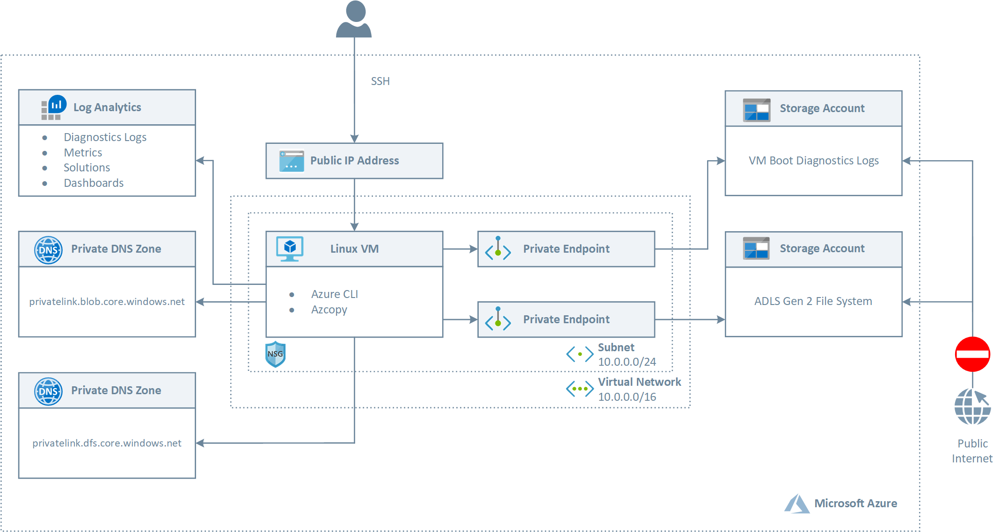
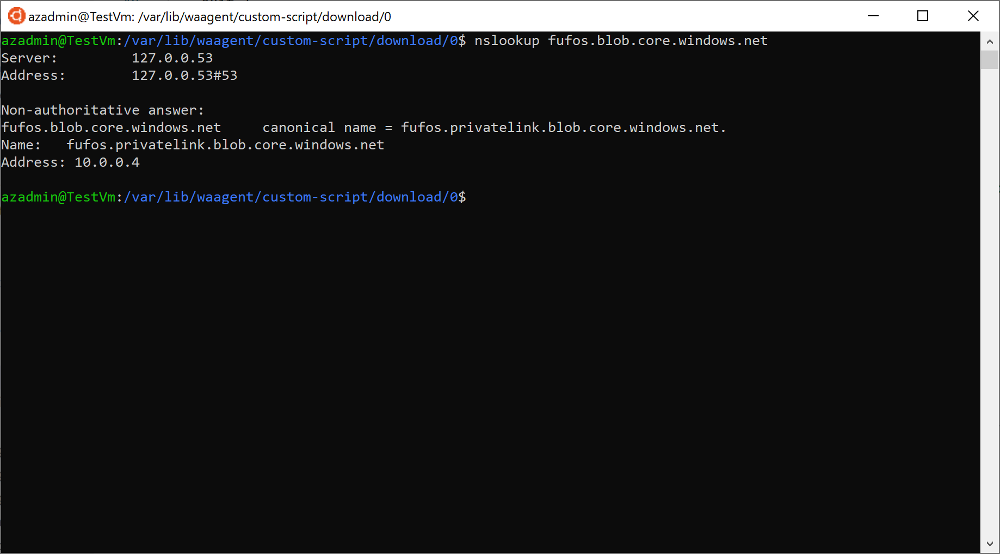

# Connect privately to a storage account from a virtual network using Azure Private Endpoint #


[](https://portal.azure.com/#create/Microsoft.Template/uri/https%3A%2F%2Fraw.githubusercontent.com%2FAzure%2Fazure-quickstart-templates%2Fmaster%2F201-blob-storage-private-endpoint%2Fazuredeploy.json)
[](https://portal.azure.us/#create/Microsoft.Template/uri/https%3A%2F%2Fraw.githubusercontent.com%2FAzure%2Fazure-quickstart-templates%2Fmaster%2F201-blob-storage-private-endpoint%2Fazuredeploy.json)
[](http://armviz.io/#/?load=https%3A%2F%2Fraw.githubusercontent.com%2FAzure%2Fazure-quickstart-templates%2Fmaster%2F201-blob-storage-private-endpoint%2Fazuredeploy.json)

This sample demonstrates how to create a Linux Virtual Machine in a virtual network that privately accesses a blob storage account using an [Azure Private Endpoint](https://docs.microsoft.com/en-us/azure/private-link/private-endpoint-overview). Azure Private Endpoint is a network interface that connects you privately and securely to a service powered by Azure Private Link. Private Endpoint uses a private IP address from your virtual network, effectively bringing the service into your virtual network. The service could be an Azure service such as Azure Storage, Azure Cosmos DB, SQL, etc. or your own Private Link Service. For more information, see [What is Azure Private Link?](https://docs.microsoft.com/en-us/azure/private-link/private-link-overview). For more information on the DNS configuration of a private endpoint, see [Azure Private Endpoint DNS configuration](https://docs.microsoft.com/en-us/azure/private-link/private-endpoint-dns).

## Architecture ##

The following picture shows the architecture and network topology of the sample.



The ARM template deploys the following resources:

- Virtual Network: this virtual network has a single subnet that hosts an Linux (Ubuntu) virtual machine
- Network Security Group: this resource contains an inbound rule to allow the access to the virtual machine on port 22 (SSH)
- The virtual machine is created with a managed identity which is assigned the contributor role at the resource group scope level
- A Public IP for the Linux virtual machine
- The NIC used by the Linux virtual machine that makes use of the Public IP
- A Linux virtual machine used for testing the connectivity to the storage account via a private endpoint
- A Log Analytics workspace used to monitor the health status of the Linux VM
- An Azure Data Lake Storage (ADLS) Gen2 storage account
- A Private DNS Zone for a blob storage resource
- A Private Endpoint for the blob storage account

The ARM deployes uses the [Azure Custom Script Extension](https://docs.microsoft.com/en-us/azure/virtual-machines/extensions/custom-script-linux) to download and run the following Bash script. The script runs the nslookup command against the public URL of the storage account to verify that this gets resolved to a private address.

```bash
#!/bin/bash

# Variables
storageAccountName=$1

# Parameter validation
if [[ -z storageAccountName ]]; then
    echo "storageAccountName parameter cannot be null or empty"
    exit 1
fi

# Update the system
sudo apt-get update -y

# Upgrade packages
sudo apt-get upgrade -y

# Run nslookup to verify that the <storage-account>.blob.core.windows.net public hostname of the storage account 
# is properly mapped to <storage-account>.privatelink.blob.core.windows.net by the private DNS zone
# and the latter mapped to the private address by the A record
nslookup "$storageAccountName.blob.core.windows.net"
```

if you open an ssh session to the Linux virtual machine and manually run the nslookup command, you should see an output like the following:



