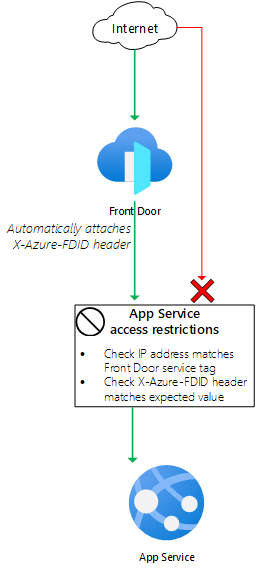

# Front Door Standard/Premium (Preview) with App Service origin

  

This sample deploys:

- An App Service plan and application without private endpoints enabled.
- A Front Door profile, endpoint, origin group, and origin to direct traffic to the App Service application. You can use either the standard or premium Front Door SKU for this sample.
- [App Service access restrictions](https://docs.microsoft.com/azure/app-service/app-service-ip-restrictions) to block access to the application unless they have come through Front Door. The traffic is checked to ensure it has come from the `AzureFrontDoor.Backend` service tag, and also that the `X-Azure-FDID` header is configured with your specific Front Door instance's ID.

The following diagram illustrates the components of this sample.

## Important note

Front Door Standard/Premium is in preview, so it is not recommended for production use.
