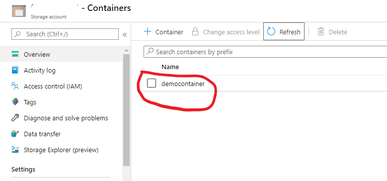

# Using MSI and Role Assignments to manage Managed Application resources

<a href="https://portal.azure.com/#create/Microsoft.Template/uri/https%3A%2F%2Fraw.githubusercontent.com%2FAzure%2Fazure-quickstart-templates%2Fmaster%2F201-managed-application-usingmsi-for-management%2Fazuredeploy.json" target="_blank">
    
</a>
<a href="http://armviz.io/#/?load=https%3A%2F%2Fraw.githubusercontent.com%2FAzure%2Fazure-quickstart-templates%2Fmaster%2F201-managed-application-usingmsi-for-management%2Fazuredeploy.json" target="_blank">
    
</a>

This sample demonstrates how you can include MSI and role assignments in your managed application template to manage and modify resources within the managed resource group. It also includes a sample action on the managed application which can be used to trigger these actions by the user of the managed application. To understand this sample we assume you are aware of the following concepts (Links with samples)

[Managed Application Basics](https://github.com/Azure/azure-quickstart-templates/tree/master/101-managed-application)

[Custom Providers Basics](https://github.com/Azure/azure-quickstart-templates/tree/master/101-custom-rp-with-function)

[Custom Providers with Logic Apps](https://github.com/Azure/azure-quickstart-templates/tree/master/101-custom-rp-with-logicapp)

[Integrating Managed Applications With Custom Providers](https://github.com/Azure/azure-quickstart-templates/tree/master/201-managed-application-with-customprovider)

This sample template combines two steps:

1) Deploys a Service catalog managed application definition.
2) Deploys a managed application using deployed application definition.

In a production environment a typical scenario would deploy the application definition and application instance as separate steps. For example, a definition is deployed once and an application many times. In this sample the two steps are combined to make it easy to quickly see the final result of those steps.

## Adding MSI and Role assignments in your template
MSI or managed service identity is a means by which you can give identities to resources in Azure. For more details on MSI please [click here](https://docs.microsoft.com/en-us/azure/active-directory/managed-identities-azure-resources/overview)

In the current sample a system assigned identity is added on a the logic app as shown here:

```
    {
        "type": "Microsoft.Logic/workflows",
        "apiVersion": "2017-07-01",
        "name": "[parameters('logicAppName')]",
        "location": "[parameters('location')]",
        "identity": {
            "type": "SystemAssigned"
        },
        .
        .
        .
    }
```

This creates an identity in Azure AD for the logic app and once we assign a role to it, the logic app gets permissions to run operations. In this sample this is done in the following step : 

```
    {
        "apiVersion": "2017-09-01",
        "type": "Microsoft.Authorization/roleAssignments",
        "name": "[parameters('rolenameguid')]",
        "properties": {
            "roleDefinitionId": "[variables('storageBlobOwnerId')]",
            "principalId": "[reference(parameters('logicAppName'), '2017-07-01', 'Full').identity.principalId]",
            "scope": "[resourceGroup().id]"
        },
        .
        .
    }
```

Here the identity of the logic app gets permission to run the storage operations on blobs in the managed resource group. 

Note : 
In your scenario you could also assign the MSI to VM's or Function apps and grant access to that MSI using any of the role definitions. 

## Using the MSI to run operations. 

In the definition for the logic app an authentication section is included , which instructs it to use msi for authentication when making the http calls to storage. Note that in your scenario this step could be included in a function app or a VM in which case you would have to use their mechanisms to use the msi identity.

```
"authentication": 
                {
                    "audience": "https://@{coalesce(triggerBody()?['properties']?['storageAccountName'], parameters('storagename'))}.blob.core.windows.net",
                    "type": "ManagedServiceIdentity"
                },
```

## Using Custom providers to trigger the actions

Once the template is deployed , you can use custom providers to make a call to the logic app which will create a container in the storage account created in the managed app. To do this you can use armclient and run the following command (In Powershell): 

[Instructions for using ArmClient](https://github.com/projectkudu/ARMClient)

```
    PS C:> $val = "{ 'properties': {'containerName' : 'containername'}}"
    PS C:> armclient POST /subscriptions/<subid>/resourceGroups/<rgname>/providers/Microsoft.Solutions/applications/appname/customcreateContainer?api-version=2018-09-01-preview $val
```

This should output the following : 

```
{
  "ContainerName": "containername",
  "Status": "Created"
}

```

On re-run for the command, as expected , you will get an error with the failure from the storage account. 

```
{
  "error": {
    "code": "DownstreamEndpointError",
    "message": "The resource provider 'public' received a non-success response 'Conflict' from the downstream endpoint for the request 'POST' on 'createContainer'. Please refer to additional info for details.",
    "additionalInfo": [
      {
        "type": "Downstream",
        "info": "{\"?xml\":{\"@version\":\"1.0\",\"@encoding\":\"utf-8\"},\"Error\":{\"Code\":\"ContainerAlreadyExists\",\"Message\":\"The specified container already exists.\\nRequestId:feca8fd8-e01e-0054-509b-c11052000000\\nTime:2020-01-02T18:33:59.9552173Z\"}}"
      }
    ]
  }
}
```

You can also verify this by navigating to the storage account and checking the continer list to see that your container has been created as expected : 


You can now also include this in viewdefinition and expose this with the UI for the managed application as shown in the sample for managed application with custom providers.
[Integrating Managed Applications With Custom Providers](https://github.com/Azure/azure-quickstart-templates/tree/master/201-managed-application-with-customprovider)