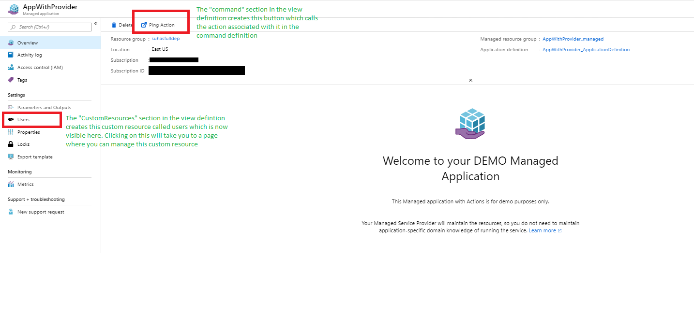
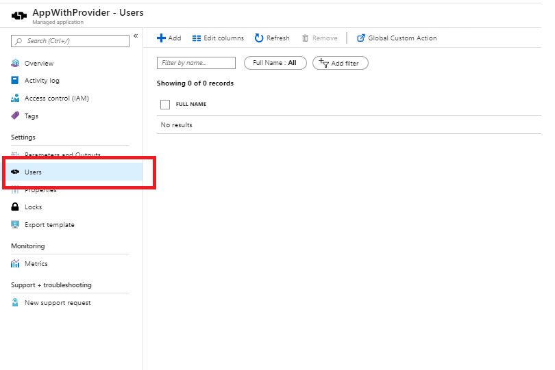
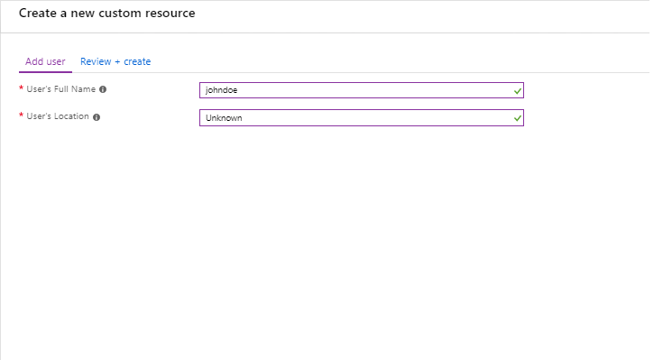

# Extending a Managed Application with a Custom Provider

<a href="https://portal.azure.com/#create/Microsoft.Template/uri/https%3A%2F%2Fraw.githubusercontent.com%2FAzure%2Fazure-quickstart-templates%2Fmaster%2F201-managed-application-with-customprovider%2Fazuredeploy.json" target="_blank">
    
</a>
<a href="http://armviz.io/#/?load=https%3A%2F%2Fraw.githubusercontent.com%2FAzure%2Fazure-quickstart-templates%2Fmaster%2F201-managed-application-with-customprovider%2Fazuredeploy.json" target="_blank">
    
</a>

This sample template deploys a managed application along with a managed application definition that contains a custom resource provider within it. A custom resource provider allows you to extend your managed applications to include simple actions and add custom resources to it. An example of a action could be something like a restart which reboots all VM's within the managed resource group and an example of a custom resource could be an object like a User which holds information about the users connected to the managed application. 
[To learm more about managed applications click here](https://docs.microsoft.com/en-us/azure/managed-applications/overview)

To deploy the managed application, this template first deploys a Service catalog Managed Application Definition and uses the definition to  deploy the managed application. You can also use the package located under the artifacts folder to deploy the managed application as a marketplace definition. To learn more about Managed Application definitions and Marketplace please visit :

1) [Publish an Azure managed application definition](https://docs.microsoft.com/en-us/azure/managed-applications/publish-managed-app-definition-quickstart)
2) [Azure managed applications in the Marketplace](https://docs.microsoft.com/en-us/azure/managed-applications/publish-marketplace-app)

This sample uses the custom provider created as part of the sample [101-custom-rp-with-function](..\101-custom-rp-with-function) and incorporates it into a managed application. Please go through that sample to understand how the custom provider is created and the functionality exposed.

## Details on the created Managed Application 

This sample deployment creates the following two resources

1) A Managed Application definition.
2) The actual Managed Application. 

### Managed Application

Once you click on the managed application you will notice that there are 2 differences from a managed application created without the custom provider. 



1) A button on top captioned "Ping Action"
2) A new section under settings called "Users"

These come up as a result of definitions specified under the view definition file present as part of the managed application package. We will look into the details on how to specify and configure these in later sections. For now we can take a look into the functionality exposed by these.

### Ping Action


Once you click on the ping action this runs the custom provider action called ping. This makes a call to the custom provider and returns a success notification as shown above. In api format the call made is as following :

```
POST  
https://management.azure.com/subscriptions/{subscriptionid}/resourceGroups/{resourcegroup}/providers/Microsoft.Solutions/applications/{applicationname}/customping?api-version=2018-09-01-preview
```
In the current sample the ping just returns a 200 OK , but in the case of deployed managed applications it can do whatever custom action you seek to provide as part of the package eg : Reboot , Scale out etc.

**NOTE : You may have notices that the call made is to the path _customping_ rather than the _ping_ as exposed in the custom provider. This is  to let the managed application know that the call is to be forwarded to the custom provider.**

### Users Resource



Clicking on the user resource takes us to a page created for the users. As shown above this takes you to a page which is used to managed the user resource. To actually create the user, please click on the add button above. This creates a page that takes in input which is used to create the user resource. This page is constructed using the same createUidefinition that is used to create the managed application. 



Once you fill in the details and follow the prompts in the blades it will run the command to create the user and you can see the newly created user as a new line item in the user page. 


In api format the call being made is as follows :
```
PUT  
https://management.azure.com/subscriptions/{subscriptionid}/resourceGroups/{resourcegroup}/providers/Microsoft.CustomProviders/resourceProviders/{customrpname}/customusers/<username>?api-version=2018-09-01-preview {Input for the API from createUIdefinition}
```
You can further create \ delete the user resource using the current page.

The nice thing about this whole experience is that the entire customization for the UI is done with no code ! The configuration for this is specified in the viewdefinition file packaged as part of the managed application definition. To understand this specific configuration please check the details on the view definition file here :

+ [**Creating the view definition file**](artifacts/ManagedAppZip/README.md)
