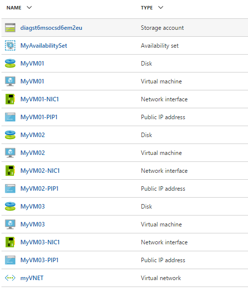

# Multi VM Template with Managed Disk 

&nbsp;
&nbsp;

&nbsp;
&nbsp;

&nbsp;
&nbsp;

This template will provision N number of virtual machines with your choice in a single VNET. Every VM will be provisioned with a Network Interface and a Public IP resource. All the VMs will be provisioned in a single Availability Set. A single storage account will be provisioned to store the diagnostic information. 
If you provision 3 VM’s with this template, your resources will look like below in the resource group. 

`Tags:Managed Disks, Azure VMs, Copy Index`

