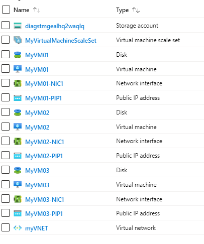

# Add multiple VMs into a Virtual Machine Scale Set


[](https://portal.azure.com/#create/Microsoft.Template/uri/https%3A%2F%2Fraw.githubusercontent.com%2FAzure%2Fazure-quickstart-templates%2Fmaster%2F201-vm-vmss-flexible-orchestration-mode%2Fazuredeploy.json)  [](http://armviz.io/#/?load=https%3A%2F%2Fraw.githubusercontent.com%2FAzure%2Fazure-quickstart-templates%2Fmaster%2F201-vm-vmss-flexible-orchestration-mode%2Fazuredeploy.json)

[](https://portal.azure.us/#create/Microsoft.Template/uri/https%3A%2F%2Fraw.githubusercontent.com%2FAzure%2Fazure-quickstart-templates%2Fmaster%2F201-vm-vmss-flexible-orchestration-mode%2Fazuredeploy.json)
[](http://armviz.io/#/?load=https://portal.azure.us/#create/Microsoft.Template/uri/https%3A%2F%2Fraw.githubusercontent.com%2FAzure%2Fazure-quickstart-templates%2Fmaster%2F201-vm-vmss-flexible-orchestration-mode%2Fazuredeploy.json)
  


This template will provision N number of virtual machines with your choice in a single VNET. Every VM will be provisioned with a Network Interface and a Public IP resource. All the VMs will be provisioned in a Virtual Machine Scale Set in Flexible Orchestration Mode. 
If you provision 3 VM’s with this template, your resources will look similar to this in the resource group. 



`Tags:Managed Disks, Azure VMs, VMSS`

## Register for VMSS with Flexible Orchestration Mode Preview


Before you can deploy virtual machine scale sets in Flexible orchestration mode, you must first register your subscription for the preview feature. The registration may take several minutes to complete.

CLI
```
az account set -s “SUBSCRIPTION_NAME_OR_ID” 

az feature register --namespace microsoft.
compute --name VMOrchestratorMultiFD

# feature registration can take several minutes. You can check registration status

az feature show --namespace microsoft.compute --name VMOrchestratorMultiFD 
```


PowerShell
```
Register-AzProviderFeature -FeatureName VMOrchestratorMultiFD -ProviderNamespace Microsoft.Compute

// feature registration can take several minutes. You can check registration status

Get-AzProviderFeature 
```


