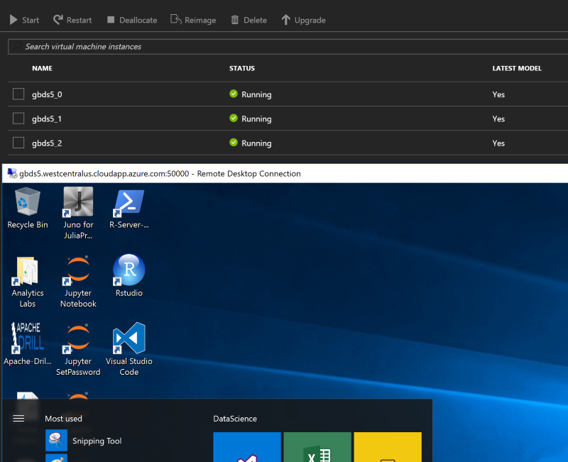

# VM scale set based on the Azure Data Science VM 

&nbsp;
&nbsp;

&nbsp;
&nbsp;

&nbsp;
&nbsp;

<a href="https://portal.azure.com/#create/Microsoft.Template/uri/https%3A%2F%2Fraw.githubusercontent.com%2FAzure%2Fazure-quickstart-templates%2Fmaster%2F201-vmss-datascience%2Fazuredeploy.json" target="_blank">
    
</a>
<a href="http://armviz.io/#/?load=https%3A%2F%2Fraw.githubusercontent.com%2FAzure%2Fazure-quickstart-templates%2Fmaster%2F201-vmss-datascience%2Fazuredeploy.json" target="_blank">

</a>

This template creates a VM scale set based on the Azure Marketplace [Windows 2016](https://azuremarketplace.microsoft.com/marketplace/apps/microsoft-ads.windows-data-science-vm?tab=Overview) and [Ubuntu 16.04-LTS](https://azuremarketplace.microsoft.com/en-us/marketplace/apps/microsoft-ads.linux-data-science-vm-ubuntu?tab=Overview) Data Science VMs.

The template creates a scale set, a load balancer and a public IP address. Inbound NAT pools are defined to route incoming connections to the VMs in the set.

Inbound NAT rules are configured as follows:
```
SSH/RDP to the ip/dns address port 50000 to connect to VM#0
SSH/RDP to the ip/dns address port 50001 to connect to VM#1
etc..
```



## Additional information

[Introduction to the Azure Data Science VM](https://docs.microsoft.com/azure/machine-learning/machine-learning-data-science-virtual-machine-overview)


