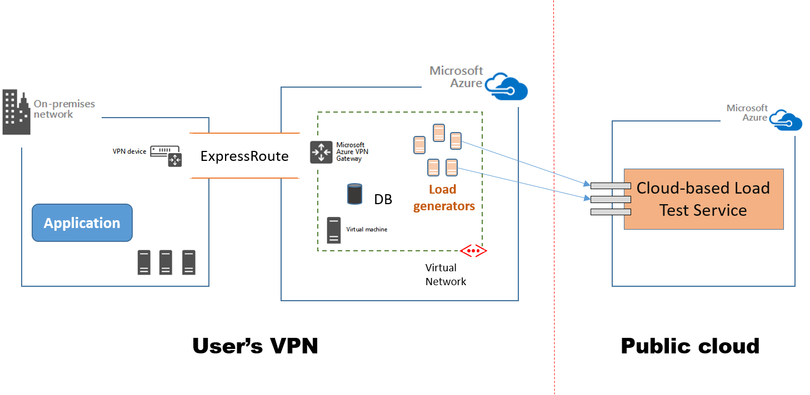

# Load test rig in a specific VNet for testing private apps


[](https://portal.azure.com/#create/Microsoft.Template/uri/https%3a%2f%2fraw.githubusercontent.com%2fAzure%2fazure-quickstart-templates%2fmaster%2f201-vsts-cloudloadtest-rig-existing-vnet%2fazuredeploy.json)
<a href="http://armviz.io/#/?load=https%3a%2f%2fraw.githubusercontent.com%2fAzure%2fazure-quickstart-templates%2fmaster%2f201-vsts-cloudloadtest-rig-existing-vnet%2fazuredeploy.json" target="_blank">
    
</a>
          
Using this template, you can create your own load test rig on Azure IaaS virtual machines in order to test applications that do not have a public end-point. The load generating agent machines will be created in the specified VNet. This VNet should have line of sight to the application you want to test. The test rig will be configured for your Visual Studio Team Services (VSTS) account and can be used to run cloud-based load tests using Visual Studio.


<b> Load generators inside a user's virtual network </b>

```json
{
    "VSTSAccountName": "<VSTS account name using for CLT>",
    "VSTSPersonalAccessToken": "<Get PAT token for VSTS account>",
    "AgentCount": "<number of desired VMs>",
    "AdminUsername":"<Admin user name>",
    "AdminPassword":"<password>" 
	"ExistingVNetResourceGroupName": "<Resource group name where the Vnet exists"
	"ExistingVNetName":"<VNet name>"
	"SubnetName":"<Subnet under VNet where you want to deployment load agents>"
}
```

If you wish to deploy a simple rig without an existing VNet, please use the following ARM template.

<a href="https://github.com/Azure/azure-quickstart-templates/tree/master/101-vsts-cloudloadtest-rig"> Create VM rig for load testing using VSTS CLT service </a>