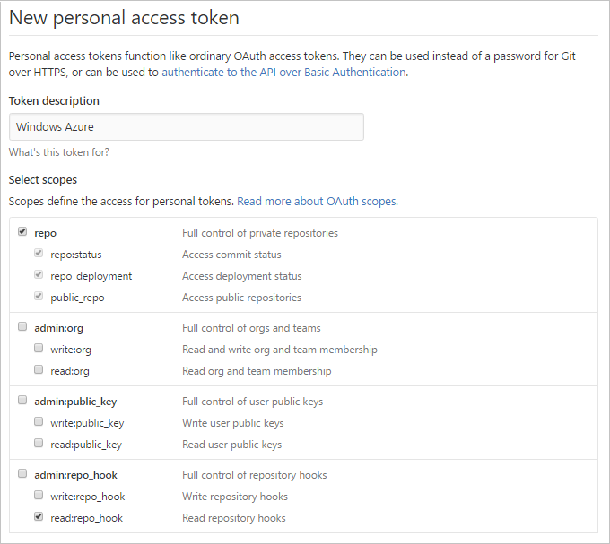
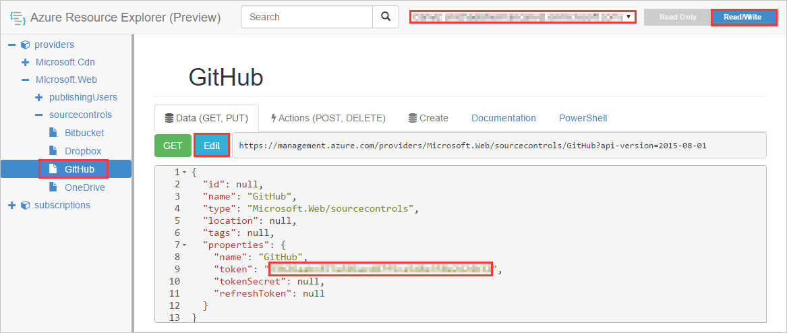
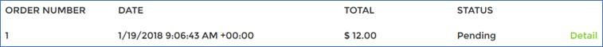

# eShopOnWeb

## GitHub Authorization ##

Follow the instructions below to authorize your Azure subscription to access your GitHub, also an alternative way is to add GitHub integration to another web app manually in your web app blade, then Azure will add the authorization for you automatically.

> **Note:** Skip this section if you ever integrated your GitHub account with your Azure subscription before.

1. Generate Token.

   - Open https://github.com/settings/tokens in your web browser.
   - Sign into your GitHub account where you forked this repository.
   - Click **Generate Token**.
   - Enter a value in the **Token description** text box.
   - Select the followings (your selections should match the screenshot below):
     - repo (all) -> repo:status, repo_deployment, public_repo
     - admin:repo_hook -> read:repo_hook

      

   - Click **Generate token**.
   - Copy the token.

2. Add the GitHub Token to Azure in the Azure Resource Explorer.

   - Open https://resources.azure.com/providers/Microsoft.Web/sourcecontrols/GitHub in your web browser.
   - Log in with your Azure account.
   - Select the correct Azure subscription.
   - Select **Read/Write** mode.
   - Click **Edit**.
   - Paste the token into the **token** property.

     

   - Click **PUT**.

## Deploy Components to Azure ##

1. Fork this repository to your GitHub account.

2. Click the **Deploy to Azure** button.

   

   

3. Fill in the deployment settings.

   - **Resource group**: Recommended to create a new group.

   - **Name Prefix**: Provide the prefix name for all resources.

   - **Administrator Login**: Provide the admin login name for the database.

   - **Administrator Login Password**: Provide the admin login password for the database, it must meet the complexity requirements, e.g. `Jan232@18`

   - **Source Code Repository URL**: Provide the repository URL of your own fork.

   - **Source Code Branch**: Leave it as `master`.

   - **Source Code Manual Integration**: Choose **false**, as you are deploying from your own fork.

   - Check **I agree to the terms and conditions stated above**.

4. Click **Purchase**.

> **Note:** The static files (JS/CSS) hosted on CDN might not take effect immediately, so you might see the page layout of the newly created website is messing up until hours later.

## How to Use the eShop Website ##

1. Open the website in browser.

2. Sign in with this default credential.

   User Name                | Password
   ------------------------ | ---------
   demouser@microsoft.com   | Pass@word1

3. Use the BRAND/TYPE dropdowns to filter the products.

   

4. Choose a product and click "ADD TO BASKET".
5. Modify the "Quality" if need and click "CHECKOUT".
6. Click "My orders" on the top right of the page.
7. You would see the order status is "Pending".

   

8. Once you refresh the page around 1 min later, the status would be changed to "Paid" automatically (pretend third-party payment).

   
