# Use Azure Firewall as a DNS Proxy in a Hub and Spoke topology along with Private Endpoints


[](https://portal.azure.com/#create/Microsoft.Template/uri/https%3A%2F%2Fraw.githubusercontent.com%2FAzure%2Fazure-quickstart-templates%2Fmaster%2F301-azure-firewall-dns-proxy%2Fazuredeploy.json)
[](https://portal.azure.us/#create/Microsoft.Template/uri/https%3A%2F%2Fraw.githubusercontent.com%2FAzure%2Fazure-quickstart-templates%2Fmaster%2F301-azure-firewall-dns-proxy%2Fazuredeploy.json)
[](http://armviz.io/#/?load=https%3A%2F%2Fraw.githubusercontent.com%2FAzure%2Fazure-quickstart-templates%2Fmaster%2F301-azure-firewall-dns-proxy%2Fazuredeploy.json)

This sample show how to deploy a [hub-spoke topology](https://docs.microsoft.com/en-us/azure/architecture/reference-architectures/hybrid-networking/hub-spoke?tabs=cli) in Azure. The hub virtual network acts as a central point of connectivity to many spoke virtual networks that are connected to hub virtual network via [virtual network peering](https://docs.microsoft.com/en-us/azure/virtual-network/virtual-network-peering-overview). The hub can also be used as the connectivity point to your on-premises networks using a [VPN gateway](https://docs.microsoft.com/en-us/azure/vpn-gateway/vpn-gateway-about-vpngateways). The spoke virtual networks can be hosted in the same or a different Azure subscription with respect to the hub virtual network and they are used to isolate workloads from one another. The benefits of using a hub and spoke configuration include cost savings, overcoming subscription limits, and workload isolation. This topology shows how to:

- Deploy a zone-redundant Azure Firewall in a complex hub-and-spoke network topology that spans across multiple availability zones within a region. For more information on this network topology, see [Hub and spoke network topology](https://docs.microsoft.com/en-us/azure/cloud-adoption-framework/ready/azure-best-practices/hub-spoke-network-topology).
- Use Azure Firewall to inspects ingress and egress traffic between zones: internet, on-premises, and spokes. The hub and spoke topology gives the central IT department an effective way to enforce security policies in a central location. It also reduces the potential for misconfiguration and exposure. You can centrally create allow or deny network filtering rules by source and destination IP address, port, and protocol. Azure Firewall is fully stateful, so it can distinguish legitimate packets for different types of connections. Rules are enforced and logged across multiple subscriptions and virtual networks. In this sample, a network rule collection is used to provide internet access to the spoke virtual networks peered to the hub virtual network and to enable vnet-to-vnet communications between the two spoke virtual networks. In addition, the ARM template provided the option to deploy DNAT rules to access the virtual machines in the spoke virtual machines via SSH as an alternative to Azure Bastion. For more information, see [Configure Azure Firewall rules](https://docs.microsoft.com/en-us/azure/firewall/rule-processing).
- Use Azure Firewall to inspect or block traffic from clients to the managed services exposed via private endpoints. For more information, see [Use Azure Firewall to inspect traffic destined to a private endpoint](https://docs.microsoft.com/en-us/azure/private-link/inspect-traffic-with-azure-firewall).
- Use Azure Firewall as a DNS Proxy to a custom DNS forwader virtual machine deployed in the hub virtual network or directly to the default Azure-provided DNS. A DNS proxy is an intermediary for DNS requests from client virtual machines to a DNS server. If you configure a custom DNS server, then enable DNS proxy to avoid a DNS resolution mismatch, and enable FQDN (fully qualified domain name) filtering in the network rules. This functionality is required to have reliable FQDN filtering in network rules. If you don't enable DNS proxy, then DNS requests from the client might travel to a DNS server at a different time or return a different response compared to that of the firewall. DNS proxy puts Azure Firewall in the path of the client requests to avoid inconsistency. You can enable DNS proxy in Azure Firewall and Firewall Policy settings. For more information, see [Azure Firewall DNS Proxy](https://docs.microsoft.com/en-us/azure/firewall/dns-settings#dns-proxy). To learn more about DNS proxy logs, see the [Azure Firewall log and metrics documentation](https://docs.microsoft.com/en-us/azure/firewall/logs-and-metrics).
- Use Azure Bastion to open an RDP or SSH session directly from the Azure portal to a virtual machine in the hub virtual network where Bastion is deployed or a virtual machine in any peered spoke virtual network. For more information, see [VNet peering and Azure Bastion](https://docs.microsoft.com/en-us/azure/bastion/vnet-peering).
- How to deploy a VPN gateway A VPN to send encrypted traffic between an Azure virtual network and an on-premises location over the public Internet. For more information, see [VPN gateway](https://docs.microsoft.com/en-us/azure/vpn-gateway/vpn-gateway-about-vpngateways).
- How to use Private DNS Zones in a hub and spoke topology to provide secure access to managed services to the computing resources (virtual machines, virtual machine scale sets, AKS, webs apps, Azure Functions, etc.) deployed in the hub virtual network or any spoke virtual network peered to the hub virtual network. This sample shows how two virtual machines can access a blob storage account and an ADLS Gen2 file system via private endpoints deployed in the hub virtual network. For more information, see:

  - [Centralized vs Decentralized Private DNS Zones](https://github.com/paolosalvatori/private-endpoints-topologies)
  - [Enterprise-Scale - Reference Implementation](https://github.com/Azure/Enterprise-Scale)
  - [What is Azure Private Link?](https://docs.microsoft.com/en-us/azure/private-link/private-link-overview)
  - [What is Azure Private  Endpoint?](https://docs.microsoft.com/en-us/azure/private-link/private-endpoint-overview)
  - [Azure Private Endpoint DNS configuration](https://docs.microsoft.com/en-us/azure/private-link/private-endpoint-dns)
  - [Name resolution for resources in Azure virtual networks](https://docs.microsoft.com/en-us/azure/virtual-network/virtual-networks-name-resolution-for-vms-and-role-instances#name-resolution-that-uses-your-own-dns-server)
  - [DNS in Microsoft Azure -- Part 1](https://journeyofthegeek.com/2019/11/14/dns-in-microsoft-azure-part-1/)
  - [DNS in Microsoft Azure -- Part 2](https://journeyofthegeek.com/2019/11/21/dns-in-microsoft-azure-part-2/)
  - [DNS in Microsoft Azure -- Part 3](https://journeyofthegeek.com/2019/11/24/dns-in-microsoft-azure-part-3/)
  - [Azure Private Link and DNS -- Part 1](https://journeyofthegeek.com/2020/03/05/azure-private-link-and-dns-part-1/)
  - [Azure Private Link and DNS -- Part 2](https://journeyofthegeek.com/2020/03/06/azure-private-link-and-dns-part-2/)
  - [Private Endpoint DNS Integration Scenarios](https://github.com/dmauser/PrivateLink/tree/master/DNS-Integration-Scenarios)

## Architecture with a custom DNS forwarder

The following diagram illustrates the DNS resolution sequence from a virtual network located in a spoke virtual network. The configuration uses a custom DNS forwarder deployed in Azure. The Azure Firewall is configured as a DNS Proxy to send DNS queries to the custom DNS forwarder that is implemented by using NGINX in a Linux virtual machine as a DNS Proxy to the default Azure-provided DNS. For more information, see [Deploy VMSS of a NGINX DNS Proxy into an existing Virtual Network.](https://github.com/microsoft/PL-DNS-Proxy). For more information on this topology and DNS configuration, see [Virtual network and on-premises workloads using a DNS forwarder](https://docs.microsoft.com/en-us/azure/private-link/private-endpoint-dns#virtual-network-and-on-premises-workloads-using-a-dns-forwarder). As an alternative solution based on [bind9](https://www.isc.org/bind/) to deploy a custom DNS forwarder in a virtual network, you can look at [DNS Forwarder VM](https://github.com/Azure/azure-quickstart-templates/tree/master/301-dns-forwarder). In order to deploy the following topology, make sure to set the value of the `deployCustomDnsForwarder` parameter to `true`.

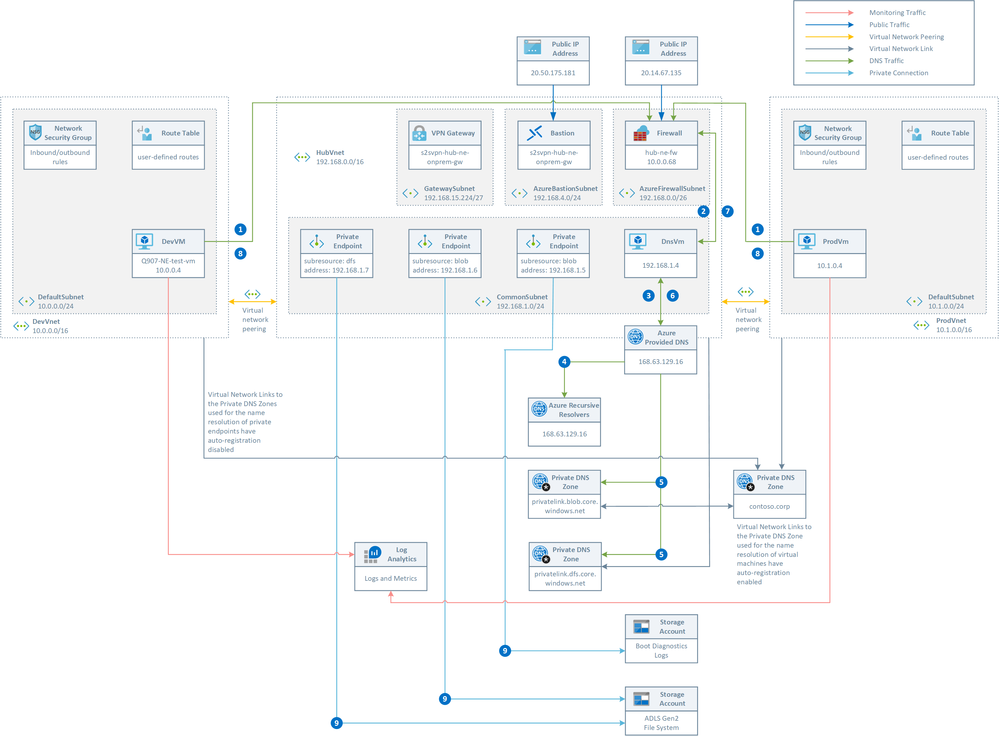

This topology implements the following scenario:

- Contoso Corporation implemented and deployed [Hub and Spoke network topology](https://docs.microsoft.com/en-us/azure/architecture/reference-architectures/hybrid-networking/hub-spoke?tabs=cli).
- Any outbound traffic is routed via the Azure Firewall in the two hub virtual network by using user-defined route (UDRs) defined in a route table associated to the default subnet in the two spoke virtual networks.

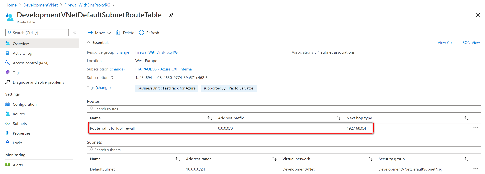

- Network rules in the Azure Firewall Policy are used to enable outbound traffic to the internet on bports80 and 443 from the hub virtual network and two spoke virtual networks.

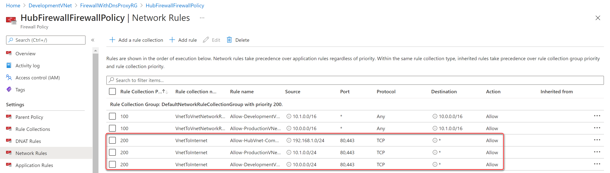

- Network rules in the Azure Firewall Policy are used to enable vnet-to-vnet communications between the two spoke virtual networks via the vnet peering connections to the hub virtual network and the Azure Firewall.

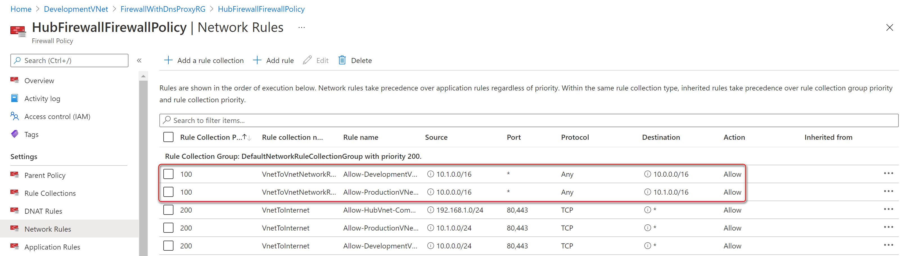

- DNAT Network rules in the Azure Firewall Policy are used to enable SSH access to the virtual machines in the two spoke virtual networks as an alternative to Azure Bastion.

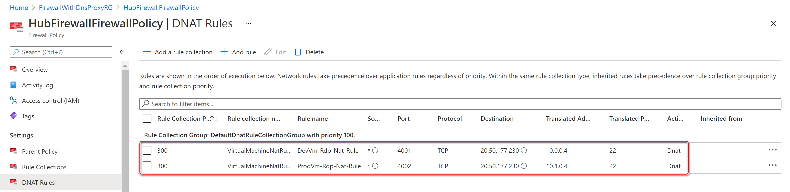

- DNS settings in the virtual network are configured to send DNS queries to the private IP adddress of the Azure Firewall.

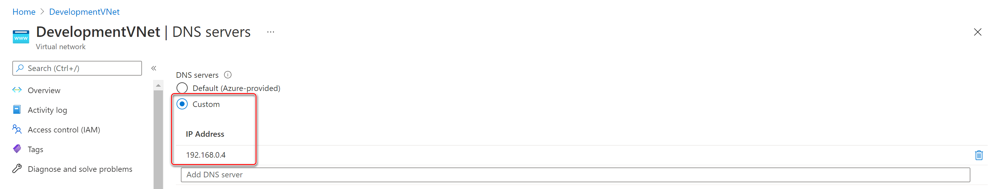

- DNS settings in the Azure Policy is configured to enable the DNS Proxy on the associated Azure Firewall that will listen on port 53 for DNS queries and will them to the the private IP adddress of the custom DNS forwarder. To ensure DNS traffic is directed to the Azure Firewalls associated with this policy, you must configure your virtual network DNS server settings and set the Azure Firewall’s private IP address as a custom DNS server.

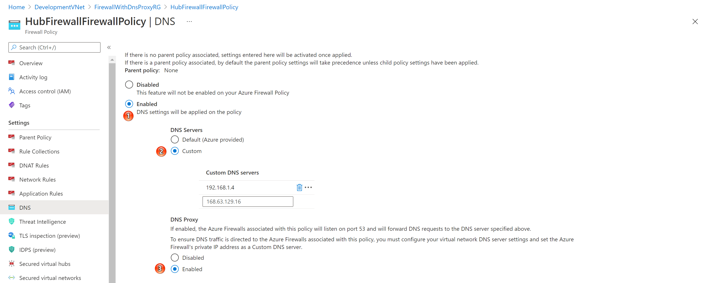

- Some of the subnets in the hub and spoke topology are configured to used a Network Security Group (NSG) to control the ingress and egress traffic to and from those suvnets. These NSGs are configured to send diagnostics logs and metrics to a Log Analytics workspace.
- A Private DNS Zone called `contoso.corp` is used for the name resolution of the virtual machines in the hub and spoke virtual networks. A virtual network link with auto-registration enabled exists between this Private DNS Zone and all the virtual networks in the topology.
- A Private DNS Zone for the name resolution of private endpoints to blob and ADLS storage accounts are deployed and a virtual network link is created between these Private DNS Zones and the hub virtual network.
- Two ADLS Gen2 storage accounts are deployed in the topology. One of them is used for the diagnostics boot logs of the three virtual machines deployed in the topology, while the second one is used as an ADLS Gen2 file system.
- A Linux virtual machine is deployed in each of the two spoke virtual networks and configured to run a Bash script via the custom script extension to run some DNS and access tests (see below for more information). In addition, the two virtial machines asre configured to send diagnostics logs and metrics to a Log Analytics workspace.

This is the list of steps necessary for the name resolution of the FQDN of a blob/ADLS storage account to the private IP address of the corresponding private endpoint deployed in the hub virtual network:

1. The virtual machine submits a DNS query for the FQDN of the `abc.blob.core.windows.net` blob storage account. The DNS request is sent to the Azure Firewall that acts as a DNS Proxy.
2. Azure Firewall forwards the DNS request to the custom DNS server
3. The custom DNS server forwards the request to the default Azure DNS at `168.63.129.16`
4. The authoritative query for `abc.blob.core.windows.net` returns `abc.privatelink.blob.core.windows.net` canonical name (CNAME)
5. The DNS request for `abc.privatelink.blob.core.windows.net` is sent the `privatelink.blob.core.windows.net` Private DNS Zone that uses the A record for `abc` to return the associated private IP address
6. The result is sent back to the custom DNS server
7. The result is sent back to the Azure Firewall
8. The result is sent back to the virtual machine
9. The virtual machine uses the private IP address of the private endpoint to access the `abc.blob.core.windows.net` storage account

## Architecture without a custom DNS forwarder

In the following topology, the DNS settings of the Azure Firewall Policy associated to the Azure Firewall is configured to directly send DNS queries to the default Azure-provided DNS. For more information on Azure Firewall Policies and Azure Firewall Manager, see [Azure Firewall Manager policy overview](https://docs.microsoft.com/en-us/azure/firewall-manager/policy-overview). In order to deploy the following topology, make sure to set the value of the `deployCustomDnsForwarder` parameter to `false`.

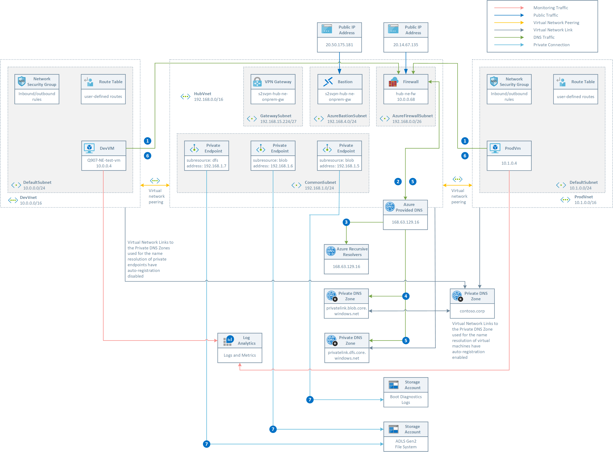

This topology implements the same scenario as the previous topology with two differences:

- No custom DNS forwarder is deployed in the hub virtual network.
- The DNS settings of the Azure policy are configured to enable the DNS proxy on the associated Azure Firewall, but in this case the Azure Firewall will listent for DNS request on port 53 and directly send them to the default Azure DNS.

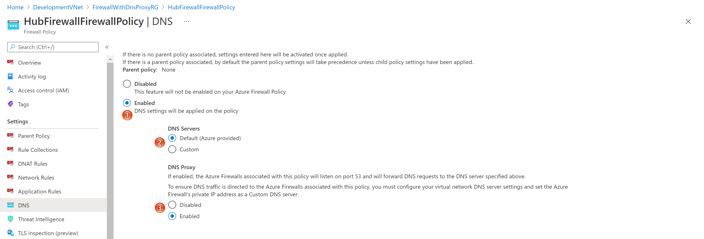

This is the list of steps necessary for the name resolution of the FQDN of a blob/ADLS storage account to the private IP address of the corresponding private endpoint deployed in the hub virtual network:

1. The virtual machine submits a DNS query for the FQDN of the `abc.blob.core.windows.net` blob storage account. The DNS request is sent to the Azure Firewall that acts as a DNS Proxy.
2. Azure Firewall forwards the request to the default Azure DNS at `168.63.129.16`
3. The authoritative query for `abc.blob.core.windows.net` returns `abc.privatelink.blob.core.windows.net` canonical name (CNAME)
4. The DNS request for `abc.privatelink.blob.core.windows.net` is sent the `privatelink.blob.core.windows.net` Private DNS Zone that uses the A record for `abc` to return the associated private IP address
5. The result is sent back to the Azure Firewall
6. The result is sent back to the virtual machine
7. The virtual machine uses the private IP address of the private endpoint to access the `abc.blob.core.windows.net` storage account

## VM Custom Script Extemsion

The two storage accounts are accessed via a different endpoint, hence their private endpoints need different private DNS zone:

| Storage Service | Zone Name |
| :-- | :--|
| Blob service | privatelink.blob.core.windows.net |
| Data Lake Storage Gen2 | privatelink.dfs.core.windows.net |

For more information, see [Use private endpoints for Azure Storage](https://docs.microsoft.com/en-us/azure/storage/common/storage-private-endpoints#dns-changes-for-private-endpoints).

The ARM template uses the [Azure Custom Script Extension](https://docs.microsoft.com/en-us/azure/virtual-machines/extensions/custom-script-linux) to download and run the following Bash script on the virtual machine. The script performs the following steps:

- Validates the parameters received by the Custom Script extension
- Updates the system and upgrades packages
- Installs curl and traceroute packages
- Install the NGINX web server on the local machine
- Customize the main page of the NGINX web server to print the name of the local machine
- Runs the nslookup command against the FQDN name of the two virtual machines
- Runs curl against the web server of the virtual machines using their FQDN
- Runs the nslookup command against the public URL of the ADLS Gen 2 storage account to verify that this gets resolved to a private address
- Runs the nslookup command against the public URL of the second storage account to verify that this gets resolved to a private address
- Downloads and installs the Azure CLI
- Logins using the system-assigned managed identity of the virtual machine
- Creates a file system in the ADLS Gen 2 storage account
- Creates a directory in the file system
- Creates a file in the directory with the content passed as a parameter

```bash
#!/bin/bash

# Variables
privateDnsZoneName=$1
vmName1=$2
vmName2=$3
adlsServicePrimaryEndpoint=$4
blobServicePrimaryEndpoint=$5
fileSystemName=${HOSTNAME,,}
directoryName="documents"
fileName="${HOSTNAME,,}.txt"
fileContent="This file was written by the $HOSTNAME virtual machine via a private endpoint."

# Parameter validation
if [[ -z $privateDnsZoneName ]]; then
    echo "privateDnsZoneName cannot be null or empty"
    exit 1
else
    echo "privateDnsZoneName        : $privateDnsZoneName"
fi

if [[ -z $vmName1 ]]; then
    echo "vmName1 cannot be null or empty"
    exit 1
else
    echo "vmName1                   : $vmName1"
fi

if [[ -z $vmName2 ]]; then
    echo "vmName2 cannot be null or empty"
    exit 1
else
    echo "vmName2                   : $vmName2"
fi

if [[ -z $adlsServicePrimaryEndpoint ]]; then
    echo "adlsServicePrimaryEndpoint cannot be null or empty"
    exit 1
else
    echo "adlsServicePrimaryEndpoint: $adlsServicePrimaryEndpoint"
fi

if [[ -z $blobServicePrimaryEndpoint ]]; then
    echo "blobServicePrimaryEndpoint cannot be null or empty"
    exit 1
else
    echo "blobServicePrimaryEndpoint: $blobServicePrimaryEndpoint"
fi

if [[ -z $fileSystemName ]]; then
    echo "fileSystemName parameter cannot be null or empty"
    exit 1
else
    echo "fileSystemName            : $fileSystemName"
fi

if [[ -z $directoryName ]]; then
    echo "directoryName parameter cannot be null or empty"
    exit 1
else
    echo "directoryName             : $directoryName"
fi

# Extract the adls storage account name from the adls service primary endpoint
# Note: when using the Azure CLI, you have to use both a blob and adls private endpoint
# because under the cover the tool uses calls to the blob REST API
storageAccountName=$(echo "$adlsServicePrimaryEndpoint" | awk -F'.' '{print $1}')

if [[ -z $storageAccountName ]]; then
    echo "storageAccountName cannot be null or empty"
    exit 1
else
    echo "storageAccountName: $storageAccountName"
fi

# Eliminate debconf: warnings
echo 'debconf debconf/frontend select Noninteractive' | debconf-set-selections

# Update the system
sudo apt-get update -y

# Upgrade packages
sudo apt-get upgrade -y

# Install NGINX web server
sudo apt-get install -y nginx

# Change the default page of the NGINX web server
sudo echo "This is [$HOSTNAME] virtual machine" > /var/www/html/index.html

# Install curl and traceroute
sudo apt-get install -y curl traceroute

# Install Azure CLI
curl -sL https://aka.ms/InstallAzureCLIDeb | sudo bash

# Run nslookup to verify that the <vm-name-1>.<private-dns-zone-name> is resolved to the private IP address of the first virtual machine
echo "nslookup ${vmName1,,}.$privateDnsZoneName"
nslookup ${vmName1,,}.$privateDnsZoneName

# Call the NGINX web server on the first virtual machine
echo "curl http://${vmName1,,}.$privateDnsZoneName"
curl http://${vmName1,,}.$privateDnsZoneName

# Run nslookup to verify that the <vm-name-2>.<private-dns-zone-name> is resolved to the private IP address of the second virtual machine
echo "nslookup ${vmName2,,}.$privateDnsZoneName"
nslookup ${vmName2,,}.$privateDnsZoneName

# Call the NGINX web server on the second virtual machine
echo "curl http://${vmName2,,}.$privateDnsZoneName"
curl http://${vmName2,,}.$privateDnsZoneName

# Run nslookup to verify that the <storage-account>.dfs.core.windows.net public hostname of the storage account
# is properly mapped to <storage-account>.privatelink.dfs.core.windows.net by the privatelink.dfs.core.windows.net
# private DNS zone and the latter is resolved to the private address by the A record
echo "nslookup $adlsServicePrimaryEndpoint"
nslookup $adlsServicePrimaryEndpoint

# Run nslookup to verify that the <storage-account>.blob.core.windows.net public hostname of the storage account
# is properly mapped to <storage-account>.privatelink.blob.core.windows.net by the privatelink.blob.core.windows.net
# private DNS zone and the latter is resolved to the private address by the A record
echo "nslookup $blobServicePrimaryEndpoint"
nslookup $blobServicePrimaryEndpoint

# Login using the virtual machine system-assigned managed identity
az login --identity

# Create file system for the Azure Data Lake Storage Gen2 account
echo "Checking if the $fileSystemName file system already exists in the $storageAccountName storage account..."
name=$(az storage fs show \
    --name $fileSystemName \
    --account-name $storageAccountName \
    --auth-mode login \
    --query name \
    --output tsv 2>/dev/null)

if [[ -z $name ]]; then
    echo "The $fileSystemName file system does not exist in the $storageAccountName storage account"
    echo "Creating the $fileSystemName file system in the $storageAccountName storage account..."

    az storage fs create \
        --name $fileSystemName \
        --account-name $storageAccountName \
        --auth-mode login

    if [[ $? == 0 ]]; then
        echo "The $fileSystemName file system was successfully created in the $storageAccountName storage account"
    else
        echo "Failed to create the $fileSystemName file system in the $storageAccountName storage account"
        exit
    fi
else
    echo "The $fileSystemName file system already exists in the $storageAccountName storage account"
fi

# Create a directory in the ADLS Gen2 file system
echo "Checking if the $directoryName directory exists in the $fileSystemName file system under the $storageAccountName storage account..."
name=$(az storage fs directory show \
    --file-system $fileSystemName \
    --name $directoryName \
    --account-name $storageAccountName \
    --auth-mode login \
    --query name \
    --output tsv 2>/dev/null)

if [[ -z $name ]]; then
    echo "The $directoryName directory does not exist in the $fileSystemName file system under the $storageAccountName storage account"
    echo "Creating the $directoryName directory in the $fileSystemName file system under the $storageAccountName storage account..."

    az storage fs directory create \
        --file-system $fileSystemName \
        --name $directoryName \
        --account-name $storageAccountName \
        --auth-mode login

    if [[ $? == 0 ]]; then
        echo "The directoryName directory was successfully created in the $fileSystemName file system under the $storageAccountName storage account"
    else
        echo "Failed to create the $directoryName directory in the $fileSystemName file system under the $storageAccountName storage account"
        exit
    fi
else
    echo "The $directoryName directory already exists in the $fileSystemName file system under the $storageAccountName storage account"
fi

# Create a file to upload to the ADLS Gen2 file system in the storage account
echo "$fileContent" >$fileName

# Upload the file to a file path in ADLS Gen2 file system.
echo "Uploading the $filename file to the $directoryName directory in the $fileSystemName file system under the $storageAccountName storage account..."
az storage fs file upload \
    --file-system $fileSystemName \
    --path "$directoryName/$fileName" \
    --source "./$fileName" \
    --account-name $storageAccountName \
    --overwrite true \
    --auth-mode login

if [[ $? == 0 ]]; then
    echo "The $filename file was successfully uploaded to the $directoryName directory in the $fileSystemName file system under the $storageAccountName storage account"
else
    echo "Failed to upload the $filename file to the $directoryName directory in the $fileSystemName file system under the $storageAccountName storage account"
    exit
fi

# List files and directories in the directory in the ADLS Gen2 file system.
echo "Listing the files inside the $directoryName directory in the $fileSystemName file system under the $storageAccountName storage account..."
az storage fs file list \
    --file-system $fileSystemName \
    --path $directoryName \
    --account-name $storageAccountName \
    --auth-mode login
```

The following table shows an example of the log generated by the Bash script. The log is available at `/var/lib/waagent/custom-script/download/0/stdout` file on the Linux virtual machine.

```bash
privateDnsZoneName        : contoso.corp
vmName1                   : DevVm
vmName2                   : ProdVm
adlsServicePrimaryEndpoint: adlsvteqnecsplyqu.dfs.core.windows.net
blobServicePrimaryEndpoint: blobvteqnecsplyqu.blob.core.windows.net
fileSystemName            : prodvm
directoryName             : documents
storageAccountName: adlsvteqnecsplyqu
Hit:1 http://azure.archive.ubuntu.com/ubuntu bionic InRelease
Get:2 http://azure.archive.ubuntu.com/ubuntu bionic-updates InRelease [88.7 kB]
Get:3 http://security.ubuntu.com/ubuntu bionic-security InRelease [88.7 kB]
Get:4 http://azure.archive.ubuntu.com/ubuntu bionic-backports InRelease [74.6 kB]
Hit:5 https://packages.microsoft.com/repos/azure-cli bionic InRelease
Fetched 252 kB in 0s (532 kB/s)
Reading package lists...
Reading package lists...
Building dependency tree...
Reading state information...
Calculating upgrade...
0 upgraded, 0 newly installed, 0 to remove and 0 not upgraded.
Reading package lists...
Building dependency tree...
Reading state information...
The following additional packages will be installed:
  fontconfig-config fonts-dejavu-core libfontconfig1 libgd3 libjbig0
  libjpeg-turbo8 libjpeg8 libnginx-mod-http-geoip
  libnginx-mod-http-image-filter libnginx-mod-http-xslt-filter
  libnginx-mod-mail libnginx-mod-stream libtiff5 libwebp6 libxpm4 nginx-common
  nginx-core
Suggested packages:
  libgd-tools fcgiwrap nginx-doc ssl-cert
The following NEW packages will be installed:
  fontconfig-config fonts-dejavu-core libfontconfig1 libgd3 libjbig0
  libjpeg-turbo8 libjpeg8 libnginx-mod-http-geoip
  libnginx-mod-http-image-filter libnginx-mod-http-xslt-filter
  libnginx-mod-mail libnginx-mod-stream libtiff5 libwebp6 libxpm4 nginx
  nginx-common nginx-core
0 upgraded, 18 newly installed, 0 to remove and 0 not upgraded.
Need to get 2462 kB of archives.
After this operation, 8210 kB of additional disk space will be used.
Get:1 http://azure.archive.ubuntu.com/ubuntu bionic-updates/main amd64 libjpeg-turbo8 amd64 1.5.2-0ubuntu5.18.04.4 [110 kB]
Get:2 http://azure.archive.ubuntu.com/ubuntu bionic/main amd64 fonts-dejavu-core all 2.37-1 [1041 kB]
Get:3 http://azure.archive.ubuntu.com/ubuntu bionic/main amd64 fontconfig-config all 2.12.6-0ubuntu2 [55.8 kB]
Get:4 http://azure.archive.ubuntu.com/ubuntu bionic/main amd64 libfontconfig1 amd64 2.12.6-0ubuntu2 [137 kB]
Get:5 http://azure.archive.ubuntu.com/ubuntu bionic/main amd64 libjpeg8 amd64 8c-2ubuntu8 [2194 B]
Get:6 http://azure.archive.ubuntu.com/ubuntu bionic/main amd64 libjbig0 amd64 2.1-3.1build1 [26.7 kB]
Get:7 http://azure.archive.ubuntu.com/ubuntu bionic-updates/main amd64 libtiff5 amd64 4.0.9-5ubuntu0.4 [153 kB]
Get:8 http://azure.archive.ubuntu.com/ubuntu bionic/main amd64 libwebp6 amd64 0.6.1-2 [185 kB]
Get:9 http://azure.archive.ubuntu.com/ubuntu bionic/main amd64 libxpm4 amd64 1:3.5.12-1 [34.0 kB]
Get:10 http://azure.archive.ubuntu.com/ubuntu bionic-updates/main amd64 libgd3 amd64 2.2.5-4ubuntu0.4 [119 kB]
Get:11 http://azure.archive.ubuntu.com/ubuntu bionic-updates/main amd64 nginx-common all 1.14.0-0ubuntu1.7 [37.4 kB]
Get:12 http://azure.archive.ubuntu.com/ubuntu bionic-updates/main amd64 libnginx-mod-http-geoip amd64 1.14.0-0ubuntu1.7 [11.2 kB]
Get:13 http://azure.archive.ubuntu.com/ubuntu bionic-updates/main amd64 libnginx-mod-http-image-filter amd64 1.14.0-0ubuntu1.7 [14.6 kB]
Get:14 http://azure.archive.ubuntu.com/ubuntu bionic-updates/main amd64 libnginx-mod-http-xslt-filter amd64 1.14.0-0ubuntu1.7 [13.0 kB]
Get:15 http://azure.archive.ubuntu.com/ubuntu bionic-updates/main amd64 libnginx-mod-mail amd64 1.14.0-0ubuntu1.7 [41.8 kB]
Get:16 http://azure.archive.ubuntu.com/ubuntu bionic-updates/main amd64 libnginx-mod-stream amd64 1.14.0-0ubuntu1.7 [63.7 kB]
Get:17 http://azure.archive.ubuntu.com/ubuntu bionic-updates/main amd64 nginx-core amd64 1.14.0-0ubuntu1.7 [413 kB]
Get:18 http://azure.archive.ubuntu.com/ubuntu bionic-updates/main amd64 nginx all 1.14.0-0ubuntu1.7 [3596 B]
Preconfiguring packages ...
Fetched 2462 kB in 0s (20.7 MB/s)
Selecting previously unselected package libjpeg-turbo8:amd64.
(Reading database ... 119020 files and directories currently installed.)
Preparing to unpack .../00-libjpeg-turbo8_1.5.2-0ubuntu5.18.04.4_amd64.deb ...
Unpacking libjpeg-turbo8:amd64 (1.5.2-0ubuntu5.18.04.4) ...
Selecting previously unselected package fonts-dejavu-core.
Preparing to unpack .../01-fonts-dejavu-core_2.37-1_all.deb ...
Unpacking fonts-dejavu-core (2.37-1) ...
Selecting previously unselected package fontconfig-config.
Preparing to unpack .../02-fontconfig-config_2.12.6-0ubuntu2_all.deb ...
Unpacking fontconfig-config (2.12.6-0ubuntu2) ...
Selecting previously unselected package libfontconfig1:amd64.
Preparing to unpack .../03-libfontconfig1_2.12.6-0ubuntu2_amd64.deb ...
Unpacking libfontconfig1:amd64 (2.12.6-0ubuntu2) ...
Selecting previously unselected package libjpeg8:amd64.
Preparing to unpack .../04-libjpeg8_8c-2ubuntu8_amd64.deb ...
Unpacking libjpeg8:amd64 (8c-2ubuntu8) ...
Selecting previously unselected package libjbig0:amd64.
Preparing to unpack .../05-libjbig0_2.1-3.1build1_amd64.deb ...
Unpacking libjbig0:amd64 (2.1-3.1build1) ...
Selecting previously unselected package libtiff5:amd64.
Preparing to unpack .../06-libtiff5_4.0.9-5ubuntu0.4_amd64.deb ...
Unpacking libtiff5:amd64 (4.0.9-5ubuntu0.4) ...
Selecting previously unselected package libwebp6:amd64.
Preparing to unpack .../07-libwebp6_0.6.1-2_amd64.deb ...
Unpacking libwebp6:amd64 (0.6.1-2) ...
Selecting previously unselected package libxpm4:amd64.
Preparing to unpack .../08-libxpm4_1%3a3.5.12-1_amd64.deb ...
Unpacking libxpm4:amd64 (1:3.5.12-1) ...
Selecting previously unselected package libgd3:amd64.
Preparing to unpack .../09-libgd3_2.2.5-4ubuntu0.4_amd64.deb ...
Unpacking libgd3:amd64 (2.2.5-4ubuntu0.4) ...
Selecting previously unselected package nginx-common.
Preparing to unpack .../10-nginx-common_1.14.0-0ubuntu1.7_all.deb ...
Unpacking nginx-common (1.14.0-0ubuntu1.7) ...
Selecting previously unselected package libnginx-mod-http-geoip.
Preparing to unpack .../11-libnginx-mod-http-geoip_1.14.0-0ubuntu1.7_amd64.deb ...
Unpacking libnginx-mod-http-geoip (1.14.0-0ubuntu1.7) ...
Selecting previously unselected package libnginx-mod-http-image-filter.
Preparing to unpack .../12-libnginx-mod-http-image-filter_1.14.0-0ubuntu1.7_amd64.deb ...
Unpacking libnginx-mod-http-image-filter (1.14.0-0ubuntu1.7) ...
Selecting previously unselected package libnginx-mod-http-xslt-filter.
Preparing to unpack .../13-libnginx-mod-http-xslt-filter_1.14.0-0ubuntu1.7_amd64.deb ...
Unpacking libnginx-mod-http-xslt-filter (1.14.0-0ubuntu1.7) ...
Selecting previously unselected package libnginx-mod-mail.
Preparing to unpack .../14-libnginx-mod-mail_1.14.0-0ubuntu1.7_amd64.deb ...
Unpacking libnginx-mod-mail (1.14.0-0ubuntu1.7) ...
Selecting previously unselected package libnginx-mod-stream.
Preparing to unpack .../15-libnginx-mod-stream_1.14.0-0ubuntu1.7_amd64.deb ...
Unpacking libnginx-mod-stream (1.14.0-0ubuntu1.7) ...
Selecting previously unselected package nginx-core.
Preparing to unpack .../16-nginx-core_1.14.0-0ubuntu1.7_amd64.deb ...
Unpacking nginx-core (1.14.0-0ubuntu1.7) ...
Selecting previously unselected package nginx.
Preparing to unpack .../17-nginx_1.14.0-0ubuntu1.7_all.deb ...
Unpacking nginx (1.14.0-0ubuntu1.7) ...
Setting up libjbig0:amd64 (2.1-3.1build1) ...
Setting up fonts-dejavu-core (2.37-1) ...
Setting up nginx-common (1.14.0-0ubuntu1.7) ...
Created symlink /etc/systemd/system/multi-user.target.wants/nginx.service → /lib/systemd/system/nginx.service.
Setting up libjpeg-turbo8:amd64 (1.5.2-0ubuntu5.18.04.4) ...
Setting up libnginx-mod-mail (1.14.0-0ubuntu1.7) ...
Setting up libxpm4:amd64 (1:3.5.12-1) ...
Setting up libnginx-mod-http-xslt-filter (1.14.0-0ubuntu1.7) ...
Setting up libnginx-mod-http-geoip (1.14.0-0ubuntu1.7) ...
Setting up libwebp6:amd64 (0.6.1-2) ...
Setting up libjpeg8:amd64 (8c-2ubuntu8) ...
Setting up fontconfig-config (2.12.6-0ubuntu2) ...
Setting up libnginx-mod-stream (1.14.0-0ubuntu1.7) ...
Setting up libtiff5:amd64 (4.0.9-5ubuntu0.4) ...
Setting up libfontconfig1:amd64 (2.12.6-0ubuntu2) ...
Setting up libgd3:amd64 (2.2.5-4ubuntu0.4) ...
Setting up libnginx-mod-http-image-filter (1.14.0-0ubuntu1.7) ...
Setting up nginx-core (1.14.0-0ubuntu1.7) ...
Setting up nginx (1.14.0-0ubuntu1.7) ...
Processing triggers for systemd (237-3ubuntu10.44) ...
Processing triggers for man-db (2.8.3-2ubuntu0.1) ...
Processing triggers for ufw (0.36-0ubuntu0.18.04.1) ...
Processing triggers for ureadahead (0.100.0-21) ...
Processing triggers for libc-bin (2.27-3ubuntu1.4) ...
Reading package lists...
Building dependency tree...
Reading state information...
traceroute is already the newest version (1:2.1.0-2).
curl is already the newest version (7.58.0-2ubuntu3.12).
0 upgraded, 0 newly installed, 0 to remove and 0 not upgraded.
Hit:1 http://azure.archive.ubuntu.com/ubuntu bionic InRelease
Hit:2 http://azure.archive.ubuntu.com/ubuntu bionic-updates InRelease
Hit:3 http://azure.archive.ubuntu.com/ubuntu bionic-backports InRelease
Hit:4 https://packages.microsoft.com/repos/azure-cli bionic InRelease
Hit:5 http://security.ubuntu.com/ubuntu bionic-security InRelease
Reading package lists...
Reading package lists...
Building dependency tree...
Reading state information...
lsb-release is already the newest version (9.20170808ubuntu1).
curl is already the newest version (7.58.0-2ubuntu3.12).
gnupg is already the newest version (2.2.4-1ubuntu1.4).
apt-transport-https is already the newest version (1.6.12ubuntu0.2).
0 upgraded, 0 newly installed, 0 to remove and 0 not upgraded.
Hit:1 http://azure.archive.ubuntu.com/ubuntu bionic InRelease
Hit:2 http://azure.archive.ubuntu.com/ubuntu bionic-updates InRelease
Hit:3 http://azure.archive.ubuntu.com/ubuntu bionic-backports InRelease
Hit:4 http://security.ubuntu.com/ubuntu bionic-security InRelease
Hit:5 https://packages.microsoft.com/repos/azure-cli bionic InRelease
Reading package lists...
Reading package lists...
Building dependency tree...
Reading state information...
azure-cli is already the newest version (2.20.0-1~bionic).
0 upgraded, 0 newly installed, 0 to remove and 0 not upgraded.
nslookup devvm.contoso.corp
Server:         127.0.0.53
Address:        127.0.0.53#53

Non-authoritative answer:
Name:   devvm.contoso.corp
Address: 10.0.0.4

curl http://devvm.contoso.corp
This is [DevVm] virtual machine
nslookup prodvm.contoso.corp
Server:         127.0.0.53
Address:        127.0.0.53#53

Non-authoritative answer:
Name:   prodvm.contoso.corp
Address: 10.1.0.4

curl http://prodvm.contoso.corp
This is [ProdVm] virtual machine
nslookup adlsvteqnecsplyqu.dfs.core.windows.net
Server:         127.0.0.53
Address:        127.0.0.53#53

Non-authoritative answer:
adlsvteqnecsplyqu.dfs.core.windows.net  canonical name = adlsvteqnecsplyqu.privatelink.dfs.core.windows.net.
Name:   adlsvteqnecsplyqu.privatelink.dfs.core.windows.net
Address: 192.168.1.6

nslookup blobvteqnecsplyqu.blob.core.windows.net
Server:         127.0.0.53
Address:        127.0.0.53#53

Non-authoritative answer:
blobvteqnecsplyqu.blob.core.windows.net canonical name = blobvteqnecsplyqu.privatelink.blob.core.windows.net.
Name:   blobvteqnecsplyqu.privatelink.blob.core.windows.net
Address: 192.168.1.4

[
  {
    "environmentName": "AzureCloud",
    "homeTenantId": "72f988bf-86f1-41af-91ab-2d7cd011db47",
    "id": "1a45a694-ae23-4650-9774-89a571c462f6",
    "isDefault": true,
    "managedByTenants": [],
    "name": "FTA PAOLOS - Azure CXP Internal",
    "state": "Enabled",
    "tenantId": "72f988bf-86f1-41af-91ab-2d7cd011db47",
    "user": {
      "assignedIdentityInfo": "MSI",
      "name": "systemAssignedIdentity",
      "type": "servicePrincipal"
    }
  }
]
Checking if the prodvm file system already exists in the adlsvteqnecsplyqu storage account...
The prodvm file system already exists in the adlsvteqnecsplyqu storage account
Checking if the documents directory exists in the prodvm file system under the adlsvteqnecsplyqu storage account...
The documents directory does not exist in the prodvm file system under the adlsvteqnecsplyqu storage account
Creating the documents directory in the prodvm file system under the adlsvteqnecsplyqu storage account...
{
  "content_length": 0,
  "continuation": null,
  "date": "2021-03-15T08:39:50+00:00",
  "etag": "\"0x8D8E78DE66C7513\"",
  "last_modified": "2021-03-15T08:39:51+00:00",
  "request_id": "bbc1db45-c01f-0050-4876-193b28000000",
  "version": "2020-02-10"
}
The directoryName directory was successfully created in the prodvm file system under the adlsvteqnecsplyqu storage account
Uploading the  file to the documents directory in the prodvm file system under the adlsvteqnecsplyqu storage account...
{
  "client_request_id": "0094fb82-856a-11eb-abe0-000d3a457072",
  "content_length": 0,
  "date": "2021-03-15T08:39:52+00:00",
  "etag": "\"0x8D8E78DE7155610\"",
  "last_modified": "2021-03-15T08:39:52+00:00",
  "request_id": "77619041-301f-0009-7576-19bcab000000",
  "version": "2020-02-10"
}
The  file was successfully uploaded to the documents directory in the prodvm file system under the adlsvteqnecsplyqu storage account
Listing the files inside the documents directory in the prodvm file system under the adlsvteqnecsplyqu storage account...
[
  {
    "contentLength": 76,
    "etag": "0x8D8E78DE7155610",
    "group": null,
    "isDirectory": false,
    "lastModified": "2021-03-15T08:39:52",
    "name": "documents/prodvm.txt",
    "owner": null,
    "permissions": null
  }
]
```

## DNS Forwarder

When the value of the `deployCustomDnsForwarder` parameter is set to `true`, a Linux virtual machine is deployed in the hub virtual network and the [Azure Custom Script Extension](https://docs.microsoft.com/en-us/azure/virtual-machines/extensions/custom-script-linux) is used to download and run the following Bash script on the virtual machine which installs and configure NGINX to forward DNS requests on port 53 to the default Azure DNS at `168.63.129.16`.

```bash
#!/bin/bash

apt-get update -y && apt-get upgrade -y
apt-get install -y nginx
echo "Hello World from host" $HOSTNAME "!" | sudo tee -a /var/www/html/index.html

touch /etc/nginx/nginx.conf
cat >> /etc/nginx/nginx.conf <<EOF
stream {
      upstream dns_servers {
       server 168.63.129.16:53;
}

server {
 listen x.x.x.x:53  udp;
 listen x.x.x.x:53; #tcp
 proxy_pass dns_servers;
 proxy_responses 1;
 error_log  /var/log/nginx/dns.log info;
}
}
EOF

myip=`hostname -i | awk '{print $1}'`
sed -i "s/x.x.x.x/$myip/" /etc/nginx/nginx.conf


sudo nginx -t && sudo service nginx reload
```

## Deployment

You can use the `template.json` ARM template and `parameters.json` file included in this repository to deploy the sample. Make sure to edit the `parameters.json` file to customize the installation. You can also use the `deploy.sh` Bash script under the scripts folder to deploy the ARM template. The following figure shows the resources deployed by the ARM template in the target resource group.

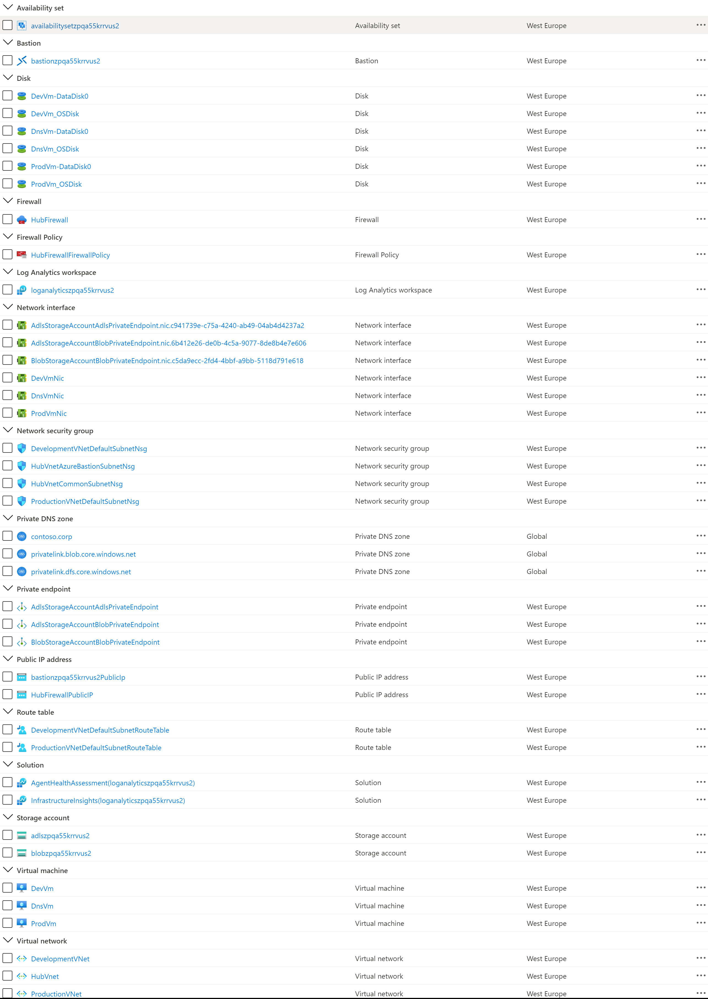

Here is the code of the Bash script used to deploy the topology.

```bash
#!/bin/bash

# Variables
resourceGroupName="FirewallWithDnsProxyRG"
location="WestEurope"
deploy=1

# ARM template and parameters files
template="../templates/azuredeploy.json"
parameters="../templates/azuredeploy.parameters.json"

# SubscriptionId of the current subscription
subscriptionId=$(az account show --query id --output tsv)
subscriptionName=$(az account show --query name --output tsv)

# Check if the resource group already exists
createResourceGroup() {
    rg=$1

    echo "Checking if [$rg] resource group actually exists in the [$subscriptionName] subscription..."

    if ! az group show --name "$rg" &>/dev/null; then
        echo "No [$rg] resource group actually exists in the [$subscriptionName] subscription"
        echo "Creating [$rg] resource group in the [$subscriptionName] subscription..."

        # Create the resource group
        if az group create --name "$rg" --location "$location" 1>/dev/null; then
            echo "[$rg] resource group successfully created in the [$subscriptionName] subscription"
        else
            echo "Failed to create [$rg] resource group in the [$subscriptionName] subscription"
            exit 1
        fi
    else
        echo "[$rg] resource group already exists in the [$subscriptionName] subscription"
    fi
}

# Validate the ARM template
validateTemplate() {
    resourceGroup=$1
    template=$2
    parameters=$3
    arguments=$4

    echo "Validating [$template] ARM template..."

    if [[ -z $arguments ]]; then
        error=$(az deployment group validate \
            --resource-group "$resourceGroup" \
            --template-file "$template" \
            --parameters "$parameters" \
            --query error \
            --output json)
    else
        error=$(az deployment group validate \
            --resource-group "$resourceGroup" \
            --template-file "$template" \
            --parameters "$parameters" \
            --arguments $arguments \
            --query error \
            --output json)
    fi

    if [[ -z $error ]]; then
        echo "[$template] ARM template successfully validated"
    else
        echo "Failed to validate the [$template] ARM template"
        echo "$error"
        exit 1
    fi
}

# Deploy ARM template
deployTemplate() {
    resourceGroup=$1
    template=$2
    parameters=$3
    arguments=$4

    if [ $deploy != 1 ]; then
        return
    fi
    # Deploy the ARM template
    echo "Deploying ["$template"] ARM template..."

    if [[ -z $arguments ]]; then
         az deployment group create \
            --resource-group $resourceGroup \
            --template-file $template \
            --parameters $parameters 1>/dev/null
    else
         az deployment group create \
            --resource-group $resourceGroup \
            --template-file $template \
            --parameters $parameters \
            --parameters $arguments 1>/dev/null
    fi

     az deployment group create \
        --resource-group $resourceGroup \
        --template-file $template \
        --parameters $parameters 1>/dev/null

    if [[ $? == 0 ]]; then
        echo "["$template"] ARM template successfully provisioned"
    else
        echo "Failed to provision the ["$template"] ARM template"
        exit -1
    fi
}

# Create Resource Group
createResourceGroup "$resourceGroupName"

# Deploy JMeter Test Harness
deployTemplate \
    "$resourceGroupName" \
    "$template" \
    "$parameters"
```

## Testing

If you open an SSH session to the any of the virtual machines in one of the two spoke virtual network using Azure Bastion or via Azure Firewall DNAT rules, you can manually run the `nslookup` using the FQDN of the virtual machines and storage accounts to prove that they properly get resolved to their corresponding private IP address, as shown in the following picture.

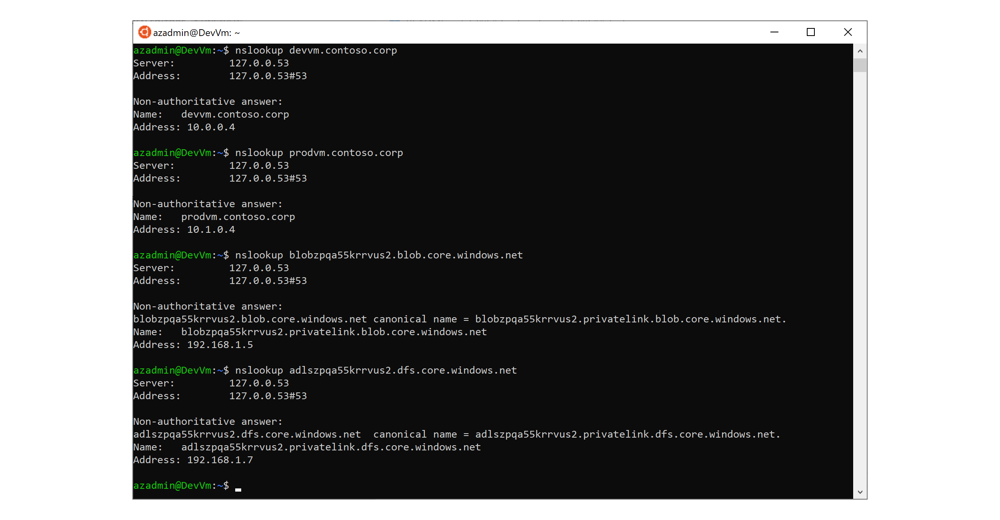