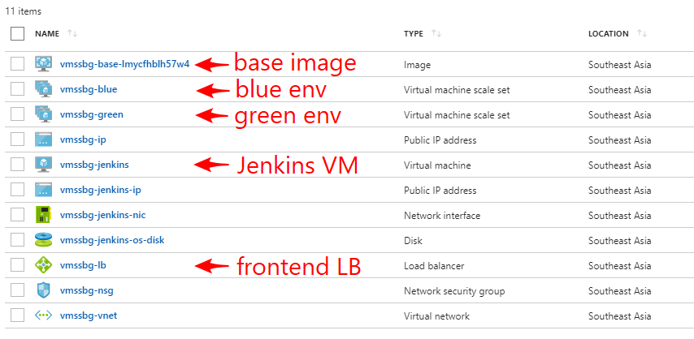
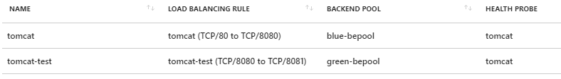
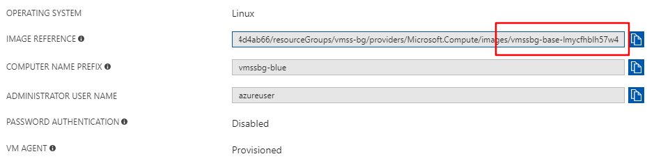
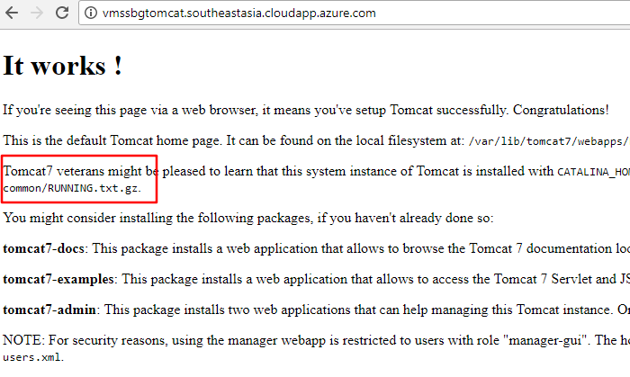
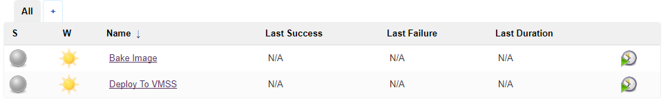
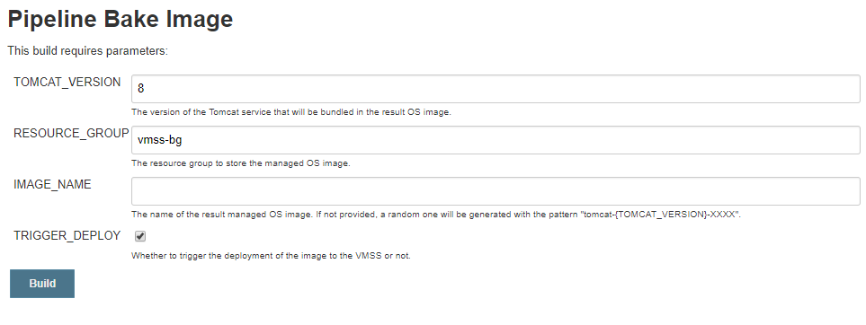
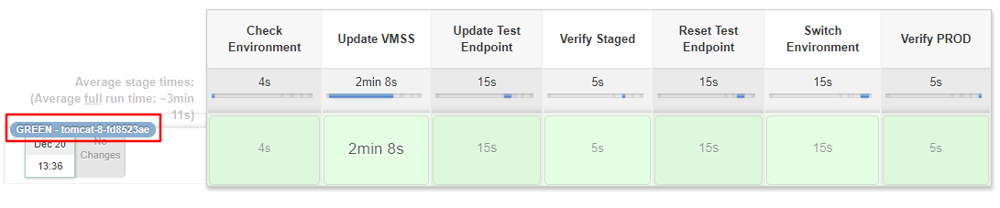
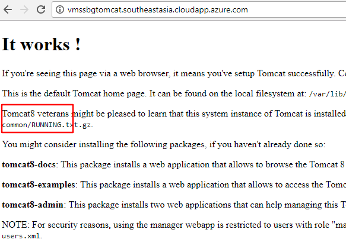
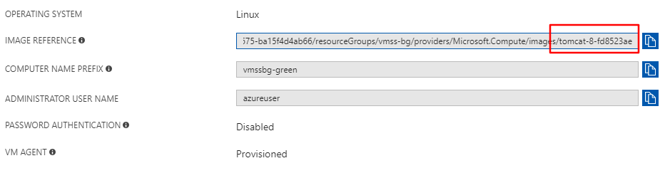
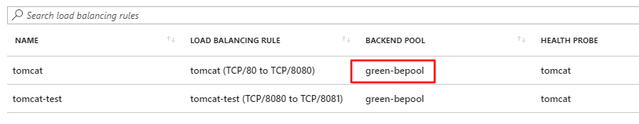

# Jenkins Blue-green Deployment to VMSS (Preview)

&nbsp;
&nbsp;

&nbsp;
&nbsp;

&nbsp;
&nbsp;

***Disclaimer***: The blue-green deployment to Azure Virtual Machine ScaleSet (VMSS) described here is still in
preview. It may be changed in future as the Azure infrastructure level support is still not finalized.

<a href="https://portal.azure.com/#create/Microsoft.Template/uri/https%3A%2F%2Fraw.githubusercontent.com%2FAzure%2Fazure-quickstart-templates%2Fmaster%2F301-jenkins-vmss-blue-green%2Fazuredeploy.json" target="_blank">
    
</a>
<a href="http://armviz.io/#/?load=https%3A%2F%2Fraw.githubusercontent.com%2FAzure%2Fazure-quickstart-templates%2Fmaster%2F301-jenkins-vmss-blue-green%2Fazuredeploy.json" target="_blank">
    
</a>

This template / guide provisions a Jenkins master on a VM running on Azure, configures a DevOps pipeline to bake
a managed OS image with Tomcat 7 or 8 installed and deploys it to the VMSS. It is an example to demonstrate how we can use
Jenkins pipeline to do blue-green deployment on VMSS.

The quickstart template will provision the following in Azure:

* A Jenkins master running on a Linux Ubuntu 16.04 LTS VM in Azure. The instance is pre-configured with the Azure Service
   Principal you provide. This credential is used to manage the Azure resources.

* A managed Ubuntu 16.04 LTS OS image with Tomcat 7 installed.

* Two VMSS's provisioned from the above managed OS image, one for the blue environment and one for green, which are connected
   to an Azure Load Balancer as two separate backends. Initially, the blue one is active and green one is inactive.

* A basic Jenkins pipeline that accepts a managed OS image ID, and deploy the image to the inactive VMSS and switch the
   Load Balancer routing to the inactive one if tests look good:

   1. Check the current active VMSS backend to determine which VMSS to deploy to.
   1. Update the inactive VMSS with the given OS image ID.
   1. Update the test endpoint to point to the inactive VMSS endpoints.

      We used a separate port as the test endpoint. In real world projects, we can also add another IP to the load balancer
      frontend, and use that IP as the endpoint for testing.

   1. Verify the test endpoint works as expected.
   1. Reset test endpoint to avoid conflict.

      **Note**: Azure Load Balancer requires the (backend pool, port, protocol) combination to be unique among all the rules
      in the same load balancer. We need to update the test endpoint later before we switch the service routing to avoid conflict.

   1. Switch the load balancer routing to route the traffic to the updated inactive environment.
   1. Verify the updated environment works fine.

* A basic Jenkins pipeline that creates a managed OS image, with either Tomcat 7 or 8 installed. This pipeline may trigger
   the above deployment pipeline if the image is built successfully.

## Prerequisites

* Enable [Azure Load Balancer Standard](https://docs.microsoft.com/en-us/azure/load-balancer/load-balancer-standard-overview)
   for your subscription.

   Check the [Region availability](https://docs.microsoft.com/en-us/azure/load-balancer/load-balancer-standard-overview?toc=%2fazure%2fvirtual-network%2ftoc.json#region-availability)
   documentation to see if the target region has enabled Azure Load Balancer Standard, and if not, follow 
   [the steps](https://docs.microsoft.com/en-us/azure/load-balancer/load-balancer-standard-overview?toc=%2fazure%2fvirtual-network%2ftoc.json#additionalpreviewregions)
   to register it for your subscription.

* [Azure Service Principal](https://docs.microsoft.com/en-us/azure/azure-resource-manager/resource-group-create-service-principal-portal).

## Try It Out

1. Click the **Deploy to Azure** button from above, this will lead you to the ARM provision page.
1. Fill in the parameters, agree to the terms & conditions and click **Purchase**. It takes about 20 minutes for the
   provision process to complete. Once the deployment is completed, the resource group contains all the resources
   for the OS image, Jenkins master and VMSS's:

   

   * The base image is created during the deployment to initialize the VMSS. It's built from Ubuntu 16.04 LTS, with
      Tomcat 7 installed.
   * 2 VMSS clusters are created, representing the blue environment and green environment.
   * A Ubuntu 16.04 LTS VM is created hosting the Jenkins master.
   * A frontend Load Balancer is created to provide the public endpoint and load balancing to the backend VMSS.

   Click the load balancer resource, and on the left panel, click **Load balancing rules**. You can see there are two
   rules defined:

   

   * **tomcat**: the rule that routes the public endpoint on port 80 to the active background VMSS which is
      `blue-bepool` initially.
   * **tomcat-test**: the rule that routes the test endpoint on port 8080 to the inactive background VMSS which is
      `green-bepool` initially.

      Note that the backend port is set to 8081 instead of the actual Tomcat working port 8080, because there is a
      restriction that the backend pool and port combination should be unique among all the rules in the same load balancer.
      We set this to an invalid port when we do not need the test endpoint to reduce possible conflict, e.g., when we
      need to switch the backend pool. And when it is required such as in the deployment verification, we update the rule
      to make it work.

   Click one of the VMSS resource, and on the left panel, click **Operating system**. You can see the operating system
   parameters for the VMSS. The `IMAGE REFERENCE` field shows the image ID for the VMSS, which is the basic one in the
   resource group.

   

1. Check in the resource gorup, then click **Deployments** to find the latest deployment with the name `Microsoft.Template`.
   The following details will be displayed in the `Outputs` section:

   * `ADMIN_USERNAME`: The admin username for the Jenkins master VM and the VM's in the VMSS's. You need to use the
      private key paired with the public key you passed in during the provision to authenticate with these machines.
   * `JENKINS_URL`: The URL for the Jenkins instance.
   * `SSH`: The SSH command to create a tunnel through which you can login and manage the Jenkins instance securely.
   * `TOMCAT_URL`: The URL for the Tomcat service.
   * `BASE_IMAGE_ID`: The OS image ID that is used to provision the VMSS.

1. Visit the `TOMCAT_URL` and you will see the Tomcat 7 landing page:

   

1. Run the command listed in the `SSH` box. Check the password by running the following command in the SSH session:

   ```sh
   sudo cat /var/lib/jenkins/secrets/initialAdminPassword
   ```

1. Visit `http://localhost:8080`, login with the user `admin` and password from above. Two jobs have been setup on the
   Jenkins instance:

   

1. Click on the job **Bake Image**, then on the left click the link **Build with Parameters**. The job accepts some parameters
   to customize the image build process (with [Packer](https://www.packer.io/)):

   

   Click **Build**.

1. If `TRIGGER_DEPLOY` is enabled in previous step (default behavior), the **Bake Image** job will trigger the **Deploy To VMSS**
   job when the image is ready.

1. The **Deploy To VMSS** job accepts a image ID and deploys the image to the inactive VMSS, which is **green** initially.
   It then updates the frontend load balander to route the traffic to the newly updated VMSS.

   

1. When the job completes, refresh the Tomcat page and you can see the Tomcat version has been updated:

   

1. Check the image ID for the **green** VMSS, you can see it's already updated:

   

1. Check the frontend load balancer rules, you can see the **tomcat** rule is now routing to the `green-bepool`:

   

## Manual Steps

You can also setup and do the blue/green development to VMSS manually. The following guides explain how is the quick
start template doing in the background, with Azure CLI and other tools, to do blue-green deployment to VMSS manually.

### Preparation

* [Azure CLI](https://docs.microsoft.com/en-us/cli/azure/install-azure-cli?view=azure-cli-latest).

* [Packer](https://www.packer.io/) to bake the Tomcat VM images.

   [A Packer deployment configuration](packer-tomcat.json) is included in the repo. Download it to your machine, and run
   the following commands to bake two VM images with Tomcat 7 or 8 installed. Replace the `<place-holder>` with your
   environment configuration and run the script lines with Bash.

   ```bash
   image_resource_group="<resource-group-to-store-VM-image>"
   image_location="<location-for-the-image-resource-group>"

   client_id="<service-principal-client-id>"
   client_secret="<service-principal-client-secret>"
   subscription_id="<subscription-id>"
   tenant_id="<tenant-id>"

   # create resource group to store the VM images
   az group create --name "$image_resource_group" --location "$image_location"

   # create VM images using Packer
   for tomcat_version in 7 8; do
       packer build \
           -var "client_id=$client_id" \
           -var "client_secret=$client_secret" \
           -var "subscription_id=$subscription_id" \
           -var "tenant_id=$tenant_id" \
           -var "tomcat_version=$tomcat_version" \
           -var "resource_group=$image_resource_group" \
           -var "location=$image_location" \
           packer-tomcat.json
   done

   # record the image ID for later use
   tomcat7_image_id="$(az image show --resource-group "$image_resource_group" --name tomcat-7 --query id --output tsv)"
   tomcat8_image_id="$(az image show --resource-group "$image_resource_group" --name tomcat-8 --query id --output tsv)"
   ```

### Setup the Azure Infrastructure

1. Setup variables for later use. It's likely you only need to customize the `location` and the variables with `$suffix`.

   ```bash
   # resource name suffix for uniqueness
   suffix="$(uuidgen | head -c 8)"
   # resource group name for the VMSS
   resource_group="vmss-bg-$suffix"
   # location for the resource group
   location="Southeast Asia"
   # front-end load balancer name to be created
   lb_name=vmssbg-lb
   # public IP name
   ip_name=vmssbg-ip
   # DNS name for the public IP endpoint
   dns_name="vmssbg$suffix"
   # shared virtual network name
   vnet_name=vmssbg-vnet
   # shared subnet name
   subnet_name=vmssbg-subnet
   # shared network security group name
   nsg_name=vmssbg-nsg
   # admin user name for the VMSS instances
   admin_username=azureuser
   # public key for the SSH authentication on VMSS instances, generate one if not exists
   public_key="$(readlink -f ~/.ssh/id_rsa.pub)"
   ```

1. Create the resource group.

   ```bash
   az group create --name "$resource_group" --location "$location"
   ```

1. Create and setup the shared network security group.

   ```bash
   az network nsg create --resource-group "$resource_group" --name "$nsg_name"
   # for simplicity we opened a wide range of ports, you should tweak the NSG rules on your demand.
   az network nsg rule create \
       --resource-group "$resource_group" \
       --nsg-name "$nsg_name" \
       --name allow-public-access \
       --priority 101 \
       --destination-port-ranges 22-55000
   ```

1. Create the VMSS for blue environment with the `tomcat-7` image. Note that we pass in the `--lb-sku Standard`
   to use the Standard tier Azure Load Balancer.

   ```bash
   az vmss create --resource-group "$resource_group" --name vmss-blue \
       --image "$tomcat7_image_id" \
       --admin-user "$admin_username" \
       --ssh-key-value "$public_key" \
       --instance-count 2 \
       --nsg "$nsg_name" \
       --public-ip-address "$ip_name" \
       --public-ip-address-dns-name "$dns_name" \
       --vnet-name "$vnet_name" \
       --subnet "$subnet_name" \
       --lb "$lb_name" \
       --backend-pool-name blue-bepool \
       --lb-nat-pool-name blue-natpool \
       --lb-sku Standard
   ```

1. Create the backend pool and inbound NAT pool for the green environment.

   **Note**: Currently, management of multiple VMSS backends and NAT pools for Azure Load Balancer is still not
   available on Azure Portal, and the technique is not documented elsewhere. Please consider this as experimental.

   ```bash
   az network lb address-pool create --lb-name "$lb_name" -g "$resource_group" --name green-bepool
   az network lb inbound-nat-pool create \
       --backend-port 22 \
       --frontend-port-range-start 50120 \
       --frontend-port-range-end 50239 \
       --lb-name "$lb_name" \
       --name green-natpool \
       --protocol Tcp \
       --resource-group "$resource_group" \
       --frontend-ip-name loadBalancerFrontEnd
   ```

1. Create the VMSS for the green environment with the `tomcat-7` image.

   ```bash
   az vmss create --resource-group "$resource_group" --name vmss-green \
       --image "$tomcat7_image_id" \
       --admin-username azureuser \
       --instance-count 2 \
       --nsg "$nsg_name" \
       --vnet-name "$vnet_name" \
       --subnet "$subnet_name" \
       --lb "$lb_name" \
       --backend-pool-name green-bepool \
       --lb-nat-pool-name green-natpool
   ```

1. Setup the load balancer probe and initially route the traffic to the blue environment.

   ```bash
   az network lb probe create \
       --resource-group "$resource_group" \
       --lb-name "$lb_name" \
       --name tomcat \
       --port 8080 \
       --protocol Http \
       --path /

   az network lb rule create \
       --resource-group "$resource_group" \
       --lb-name "$lb_name" \
       --name tomcat \
       --frontend-port 80 \
       --backend-port 8080 \
       --protocol Tcp \
       --backend-pool-name blue-bepool \
       --probe-name tomcat
   ```

1. Check that you can visit the service endpoint via HTTP.

   ```bash
   ip="$(az network public-ip show --resource-group "$resource_group" --name "$ip_name" --query ipAddress --output tsv)"
   echo "Visit http://$ip"
   ```

### Blue/Green Deploy to VMSS

By now we have already setup the Azure infrastructure for the VMSS blue-green deployment. The following steps show
how to deploy to the green environment, do online tests and flip the production environment from blue to green.

1. Upgrade the green environment using image `tomcat-8`.

   ```bash
   az vmss update --resource-group "$resource_group" --name vmss-green --set "virtualMachineProfile.storageProfile.imageReference.id=$tomcat8_image_id"
   az vmss update-instances --resource-group "$resource_group" --name vmss-green --instance-ids \*
   ```

1. Setup a temporary load balancer rule to verify the green environment. You can also setup another public IP endpoint
   for testing purpose.

   ```bash
   test_port=$(( ( RANDOM % 100 ) + 30000 ))
   az network lb rule create \
       --resource-group "$resource_group" \
       --lb-name "$lb_name" \
       --name tomcat-test \
       --frontend-port "$test_port" \
       --backend-port 8080 \
       --protocol Tcp \
       --backend-pool-name green-bepool \
       --probe-name tomcat
   ```

1. Wait until we can visit the test endpoint by checking the following command periodically. We can also do other
   tests on this endpoint.

   ```bash
   # periodically check until we get 200 response
   curl -s -D - -o /dev/null "http://$ip:$test_port"
   ```

1. Remove the temporary load balancer rule.

   ```bash
   az network lb rule delete --resource-group "$resource_group" --lb-name "$lb_name" --name tomcat-test
   ```

1. Switch the production environment to green.

   ```bash
   az network lb rule update --resource-group "$resource_group" --lb-name "$lb_name" --name tomcat --backend-pool-name green-bepool
   ```

1. Further test to ensure that the production endpoint works with the green environment.

   ```bash
   echo "Visit http://$ip"
   ```

1. Now the blue environment is the stage environment and we can prepare for the next deployment on blue.

