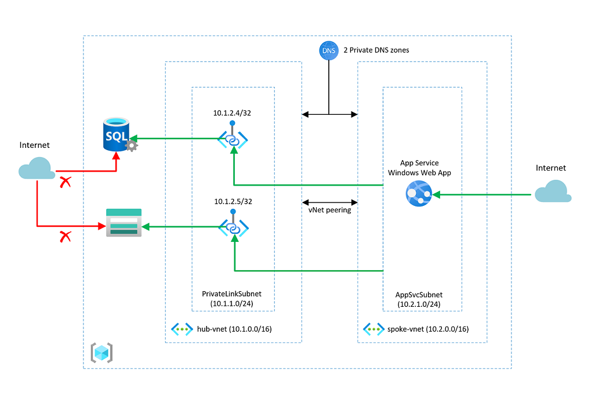

### Overview

This solution deploys a Windows Azure App Services web app into a subnet using regional vnet integration. An Azure SQL DB and a storage account are also created, each with its own private link and private DNS resources to allow access form the web app over a private address space. FIrewall rules are added to the storage account ot prevent publci access & the Azure SQL Server is configured to disallow public traffic. A dns record is created in each zone for the Azure SQL Server and storage account.

The following resources are deployed as part of this solution

- Hub Virtual Network (10.1.0.0/16)
  - PrivateLinkSubnet (10.1.1.0/24)
- Spoke Virtual Network(10.2.0.0/16)
  - AppSvcSubnet (10.2.1.0/24)
- Virtual Netowrk peering between hub and spoke virtual networks
- Azure SQL Server
  - Azure SQL DB
  - Private link
  - Private DNS zone
- Storage account
  - Private link
  - Private DNS zone
- App Service Web app
  - Regional vnet integration

### Deployment

You can click the "deploy to Azure" button below or follow the instructions for command line deployment using the scripts in the root of this repo.

  

### Validation

To validate that the web app can resolve the privte endpoints for the Azure SQL DB and storage account follow the stpes below. 
- Naviagate to the Azure web app and select the 'KUDU' blade and select 'Advanced' then click the 'Go' hyperlink
- A new web page will open displaying the web app's management environment
- Select 'Environment' then 'PowerShell'
- In the PowerShell console, type the following commands to test that name resolution is working for both the Azure SQL DB and storage account. The private IP address for each resource should be returned.
  - `nameresolver <storage account name>.<storage account private DNS zone name>`
  - `nameresolver <Azure SQL DB name>.<Azure SQL DB private DNS zone name>`

### Architecture Diagram

