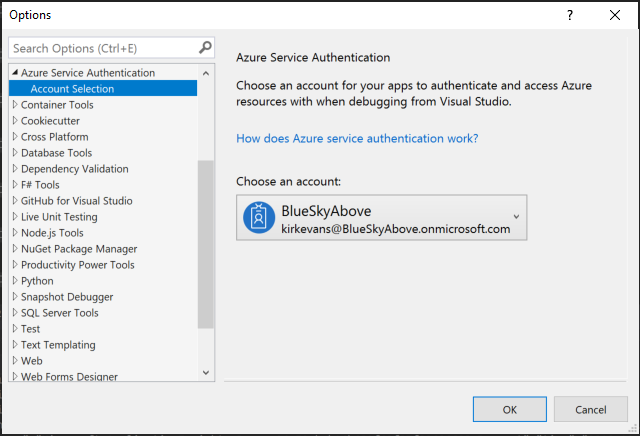

# aspnet-mvc-keyvault-storage

Example of using ASP.NET MVC Core with Azure AD managed identities to call Azure KeyVault, obtain a secret containing an Azure Storage key, and call Azure Blob operations to list, view, create, and delete blobs within a container.

## Overview of solution

The solution is an ASP.NET MVC Core web app that authenticates the user using OpenId Connect using Azure AD. The app uses an Azure AD Managed Identity (formerly known as MSI) to call Azure Key Vault to obtain a secret containing an Azure Storage key. Finally, it uses the Azure Storage key to call the Azure Blob service to list, view, create, and delete blobs within a container.

The blob operations are contained within a class that uses the repository pattern. The ASP.NET MVC controller uses dependency injection to inject the logging and repository into the controller.

## Registering an application in Azure Active Directory

The application requires an application registration in Azure Active Directory.

1. Sign in to the [Azure portal](https://portal.azure.com).

2. On the top bar, select your account. Under the **DIRECTORY** list, choose the Active Directory tenant where you wish to register your app. If there isn't a **DIRECTORY** list in the drop down menu, skip this step, as you only have a single tenant associated with your Azure account. For more information, see [How to get an Azure Active Directory tenant](https://docs.microsoft.com/azure/active-directory/develop/active-directory-howto-tenant).

3. In the left navigation sidebar, select **Azure Active Directory**. If you don't see **Azure Active Directory** in the list, select **More Services** and choose **Azure Active Directory** in the **SECURITY + IDENTITY** section of the service list.

4. From the sidebar, select **App registrations**.

5. Select **New application registration** and provide a friendly name for the app, app type, and sign-on URL:
   - **Name**: **webapp-keyvault-storage-msi**
   - **Application Type**: **Web app / API**
   - **Sign-on URL**: `http://localhost:5000/signin-oidc`
  
   Select **Create** to register the app.

6. On the **Properties** blade, set the **Logout URL** to `http://localhost:5000/signout-oidc` and select **Save**.

7. From the Azure portal, note the following information:

   **The Tenant domain:** See the **App ID URI** base URL. For example: `contoso.onmicrosoft.com`
   
   **The Tenant ID:** See the **Endpoints** blade. Record the GUID from any of the endpoint URLs. For example: `da41245a5-11b3-996c-00a8-4d99re19f292`
   
   **The Application ID (Client ID):** See the **Properties** blade. For example: `ba74781c2-53c2-442a-97c2-3d60re42f403`

> [!NOTE]
> The base address in the **Sign-on URL** and **Logout URL** settings is `http://localhost:5000`. This localhost address allows the sample app to run insecurely from your local system. Port 5000 is the default port for the [Kestrel server](https://docs.microsoft.com/aspnet/core/fundamentals/servers/kestrel). Update these URLs if you configure the app for production use (for example, `https://www.contoso.com/signin-oidc` and `https://www.contoso.com/signout-oidc`).

## Deploying the solution to Azure

The solution can be easily deployed by going to [https://github.com/Azure/azure-quickstart-templates/webapp-keyvault-storage-msi](https://github.com/Azure/azure-quickstart-templates/webapp-keyvault-storage-msi) and clicking the Deploy to Azure button. Provide the tenant domain, tenant ID, and client ID from the Azure AD application registration that you created in the previous section.

Once the solution is deployed, a web application is created in Azure. **Update** the Azure AD application registration. 

1. On the **Overview** page for the Azure Web App that was deployed, copy the URL for the web site (for example, "https://sample.azurewebsites.net/".) 2. On the **Settings** page for the application registration in Azure AD, select **Reply URLS**.
2. Add the URL for the Azure Web App and append "/signin-oidc". For example, https://demo.azurewebsites.net/signin-oidc. **Save** your changes.

## Running the solution locally

If you want to run the solution locally:

1. Deploy the solution as described above. 
2. Open the Application Settings blade for each web application that was deployed to Azure. 
3. Copy the application settings from the Azure Web App to the `appsettings.json` file locally.

The application uses Managed Service Identity to communicate with Azure Key Vault. To debug locally, sign into the Azure CLI with the credentials of a user that has permission to get secrets from Azure Key Vault. If you are using Visual Studio 2017 or higher, you can explicitly set the user. Open the solution in Visual Studio 2017 and go to the **Options / Azure Service Authentication / Account Selection** screen. The account that you run as must also have permission to Get secrets from the created Azure Key Vault.

