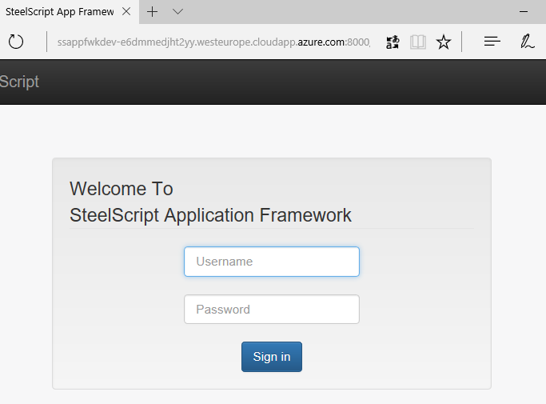

# SteelScript Application Framework developer machine

## Description

This ARM template deploys Steelscript Application Framework on a fresh linux VM for development purpose. The deployment has been tested on Centos and Ubuntu linux VM.

Steelscript Application Framework reference for developers: https://support.riverbed.com/apis/steelscript/appfwk/toc.html

## Quick deploy

<a href="https://portal.azure.com/#create/Microsoft.Template/uri/https%3A%2F%2Fraw.githubusercontent.com%2Fazure%2Fazure-quickstart-templates%2Fmaster%2Fsteelscript-appfwkdev-linux%2Fazuredeploy.json" target="_blank">
    
</a>
<a href="http://armviz.io/#/?load=https%3A%2F%2Fraw.githubusercontent.com%2FAzure%2Fazure-quickstart-templates%2Fmaster%2Fsteelscript-appfwkdev-linux%2Fazuredeploy.json" target="_blank">
    
</a>

1. Click the "Deploy to Azure" button, fill parameters and launch the deployment
    * Set your ssh public key to connect to the VM
    * Select the VM size
    * Choose the linux distribution

2. When deployment is done (should take less than 25min), see the outputs
    * URL
    * ssh command

## Usage (when the deployment is done)

### Open the URL in a browser

Get the URL in the Deployment outputs. For example:
```
URL = http://ssappfwkdev-e6dmmedjht2yy.westeurope.cloudapp.azure.com:8000
```



### Connect to the VM using SSH

Get the command in the Deployment outputs. For example:
```
ssh command = ssh ssappfwkdev-admin@ssappfwkdev-e6dmmedjht2yy.westeurope.cloudapp.azure.com
```

### Manually start the web server 
The Application Framework web server is automatically started during the deployment. 
If it stops, for example when the VM restarts, it should be manually started. Here is the command:

```
$ cd /appfwk_project ; sudo python runserver 0.0.0.0:8000 
```
    
## Troubleshooting

### Check installation log files in the VM

```
$ sudo cat /var/log/azure/custom-script/handler.log
$ sudo ls /var/log/azure/Microsoft.Azure.Extensions.CustomScript
...
```

### Identify appfwk webserver processes running in background

```
$ ps -eo pid,command | grep "appfwk_project/manage.py" | grep -v grep
```
```
45530 sudo python /appfwk_project/manage.py runserver 0.0.0.0:8000
45533 python /appfwk_project/manage.py runserver 0.0.0.0:8000
45540 /bin/python /appfwk_project/manage.py runserver 0.0.0.0:8000
```

### Stop appfwk webserver running in background (kill processes)
```
$ sudo kill $(ps -eo pid,command | grep "appfwk_project/manage.py" | grep -v grep | awk '{ print $1 }')
```
