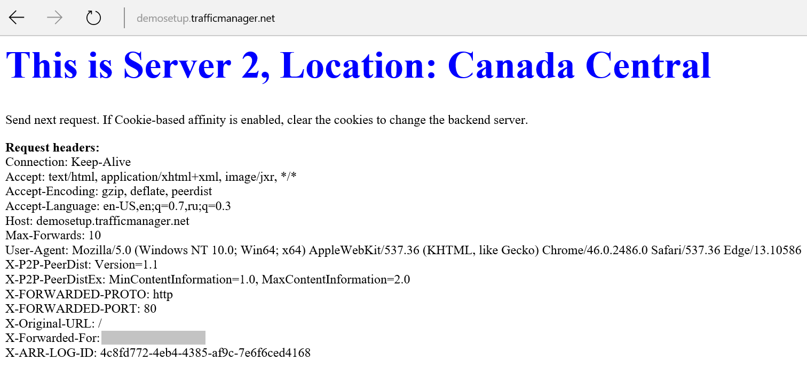

# Azure Traffic Manager over Application Gateways Demo Setup

This template allows you to quickly deploy Azure Traffic Manager on top of Application Gateways demo to test distribution of the traffic between the endpoints in different regions.

## To Deploy Demo Setup:

1. Push Deploy to Azure button.
2. Enter DNS name for Traffic Manager profile.
3. If needed change traffic routing method (you can re-configure later).
4. Select locations for the endpoints.
5. Choose admin credentials for the backend Web servers.
6. Start template deployment.

## Testing Your Setup

Once your demo setup is ready use can access it using the DNS name entered (example: http://mytestserver.trafficmanager.net).

In order to try your test setup in action you can re-send your requests, bring down/up the VMs/Web servers created as a part of the deployment, change Azure Traffic Manager profile settings.

When your HTTP request hits backend server, you should be able to see a page like the one below:

