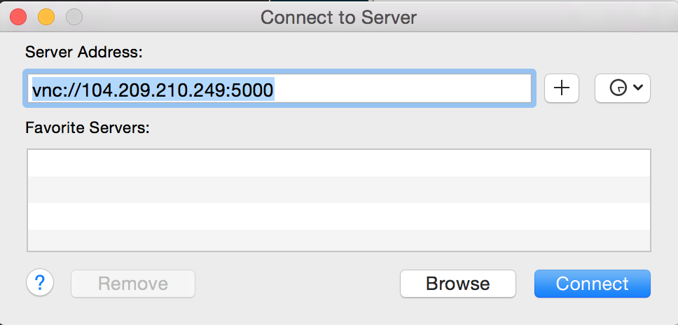

# Ubuntu Desktop VM in ARM

This is an Azure template to create an Ubuntu Desktop VM.  This is great as a jumpbox behind a NAT.

<a href="https://portal.azure.com/#create/Microsoft.Template/uri/https%3A%2F%2Fraw.githubusercontent.com%2FAzure%2Fazure-quickstart-templates%2Fmaster%2Fubuntu-desktop-gnome%2Fazuredeploy.json" target="_blank">
    
</a>
<a href="http://armviz.io/#/?load=https%3A%2F%2Fraw.githubusercontent.com%2FAzure%2Fazure-quickstart-templates%2Fmaster%2Fubuntu-desktop-gnome%2Fazuredeploy.json" target="_blank">
    
</a>

This template runs quickly, but the overall install takes about 1 hour to complete.  You can SSH into the VM and *tail -f /var/log/azure/firstinstall.log* to see progress.

Once complete, you can create a compressed SSH tunnel to VNC port 5901, and then use VNC to see the desktop.  You can edit ~azureuser/bin/startvnc to adjust the resolution of the desktop.  Be sure to enable compression on the tunnel, otherwise performance will be sluggish.  Instructions for accessing from Windows are below.

# Accessing from Windows

These instructions walk through on how to setup a fast secure remote desktop session to your new Ubuntu Desktop machine.

1. Prerequisites - install the following software
 1. Putty - enables SSH with a secure compressed tunneling for remote desktop - http://www.chiark.greenend.org.uk/~sgtatham/putty/download.html
 2. vncviewer (64 bit) - allows remote desktop - https://www.realvnc.com/download/viewer/

2. Setup compressed vnc tunneling in putty - this enables a secure and fast tunnel through SSH for your remote desktop experience
 1. Run putty
 2. Enable compression, this allows for a fast remote desktop experience
 
 3. Add a tunnel - this enables a secure remote desktop over ssh.
 
 4. save your session:
 

3. Connect to your linux with VNC
 1. Open vnc
 2. Click "options" and ensure best quality is chosen (note that the SSH tunnel you setup previously will handle compression)
 
 3. since the ssh provides encryption and to get maximum speed from ssh compression, turn off encrytpion, and open your session to "localhost:1".  ":1" represents port 5901, which you had previously setup with the ssh tunnel:
 
 4. Click "Connect", and enter "password" for the password:
 
 5. now you should be connected to your session.

# Accessing From OS X

OS X is already setup with a VNC viewer, so all that needs to be done is to create the SSH tunnel:

```
ssh  -N -f -L 5000:localhost:5901 azureuser@<JUMPBOX_IP>
```

Go to Finder, and press `Cmd + K`. Then connect to the VNC tunnel, using `password` as the password:



Enter the password and you'll be all setup.

