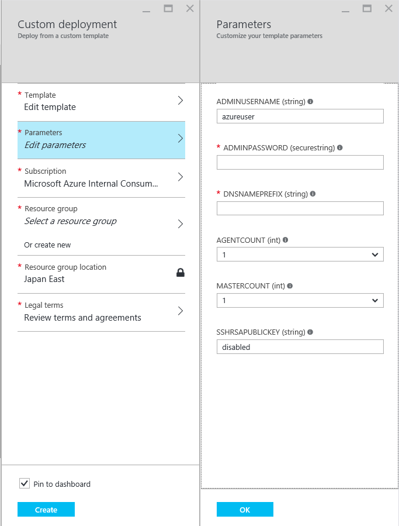
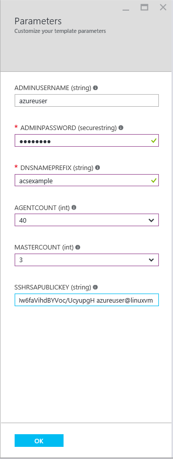
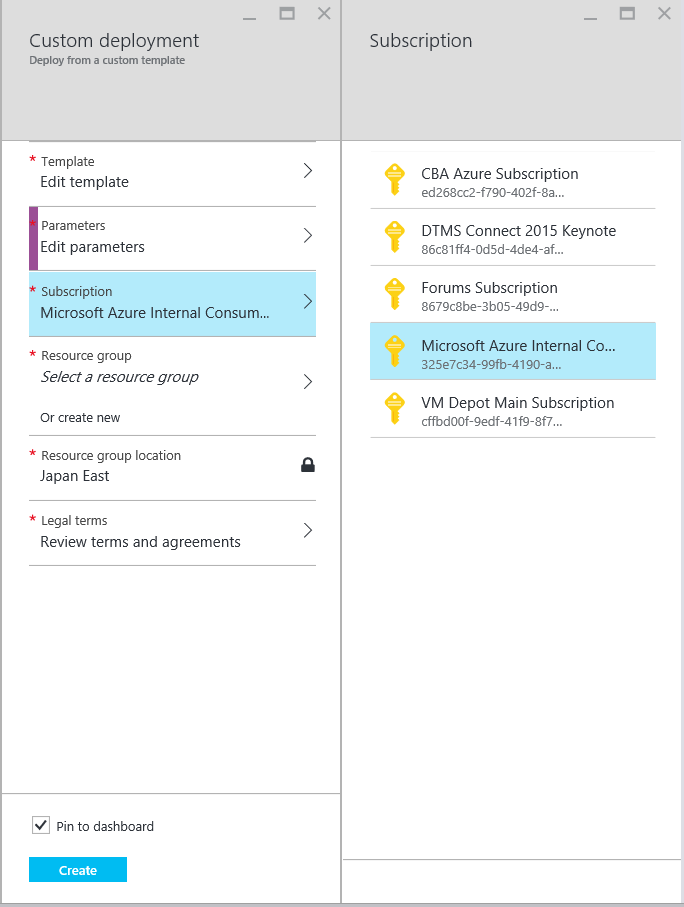
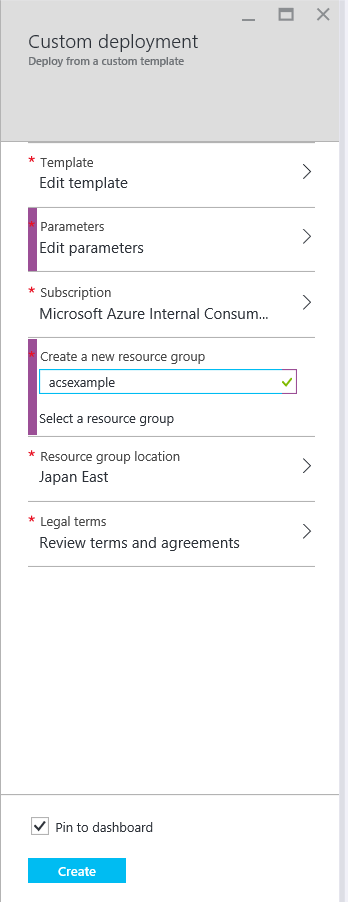
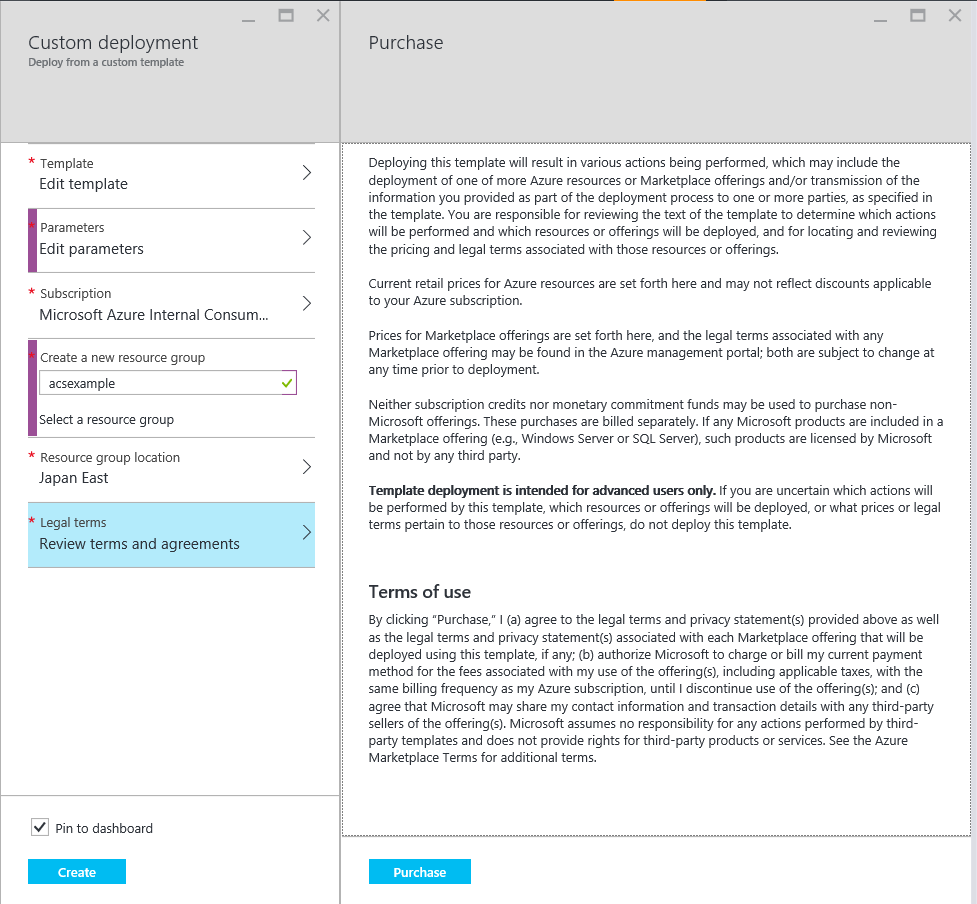
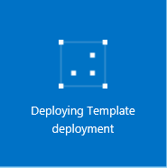
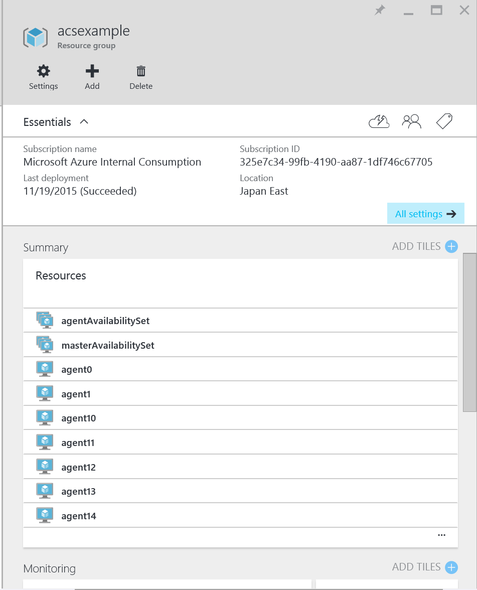

#101: Creating a Service using the Portal
 
To access Azure Container Service, you will need an Azure subscription. If you don't have one then sign up for a [free trial](http://www.windowsazure.com/en-us/pricing/free-trial/?WT.mc_id=AA4C1C935).
 
Select an ARM template from  [rgardler's fork](https://github.com/rgardler/azure-quickstart-templates) of the Azure QuickStarts repo in Github. All Azure Container Service Templates start with 'acs-'
 
There are two templates of particular interest:
 
* Mesos: https://github.com/rgardler/azure-quickstart-templates/tree/acs/acs-mesos-full-template
* Swarm: https://github.com/rgardler/azure-quickstart-templates/tree/acs/acs-swarm-full-template
 
This will take you to the portal and present a form that looks something like this:
 
 
 
To complete the form:

Field           | Description
----------------|-----------
ADMINUSERNAME   | This is the username for your user account on each of the Virtual Machines that will be created
ADMINPASSWORD   | This is the password used for the user account on each Virtual Machine created. It is recommended that you use SSH keys for production environments. See below.
DNSNAMEPREFIX   | This must be a world unique value. It will be used to create DNS names for each of the key parts of the service. More information below.
AGENTCOUNT      | This is the number of Virtual Machines to create in your cluster that will host containers
MASTERCOUNT     | This is the number of Virtual Machines to configure as masters for your cluster. You can select 1, but this will not provide any resilience in your cluster and is only recommended for testing. Most users will want to pick 3 or 5 here.
SSHRSAPUBLICKEY	| It is recommended that you use SSH for authentication against the Virtual Machines. This is where you add your public key. At the time of writing you can set this to "disabled" which means no SSH key will be used. This is not recommended for production environments. If you need to create an SSH key you can find guidance for [windows](https://azure.microsoft.com/en-us/documentation/articles/virtual-machines-windows-use-ssh-key/) and [Linux](https://azure.microsoft.com/en-us/documentation/articles/virtual-machines-linux-use-ssh-key/) on the Azure documentation site.
 
Once completed your parameters form will look something like this:
 
 
 
 
Click OK. The parameters blade will disappear.
 
If you have more than one subscription ensure the right one is selected in the "subscription" blade:
 
 	
 
Next we need to provide a resource group name. You can select an existing one or select a new one as shown below:
 
 
 
For the preview the service is only available in Japan East, more regions are coming so do not  change the resource group location.
 
You then need to review and agree to the Legal terms by opening the Legal Terms blade and clicking "Purchase". Note that during preview there is no charge for the Azure Container Service beyond the normal Azure charges for virtual machines, storage, networking etc. We have yet to decide on a pricing model beyond preview.
 
 
 
Finally, click "Create". You will return to your dashboard and, assuming you did not uncheck "Pin to dashboard" on the deployment blade, you will see an animated tile that looks something like this:

 
 
After a short while this will change from "submitting deployment for template deployment" to "deploying template deployment":
 
 
 
Now sit back and relax for a few minutes (exactly how long depends on how many agents and hosts you requested. But expect it to be 5-15 minutes (the 40 machine cluster I created for this example took 14 minutes). Once complete you will see some blades that show the resources just created:
 
 
 
## Next Steps
 
Now that you have a cluster up and running you can take one of two recommended paths:
 
1.	If you are familiar with Mesos and Docker then read 201: Deploying a Docker Container
2.	If you are new to Mesos and Docker then read 110: Application Management through the UI
 
 
