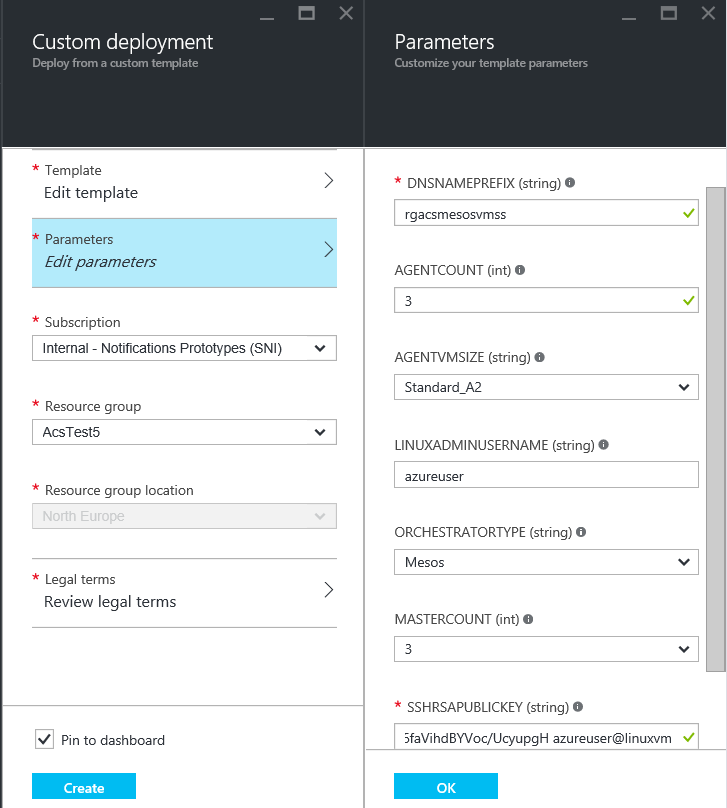
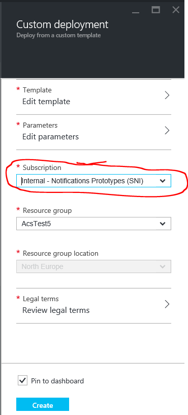
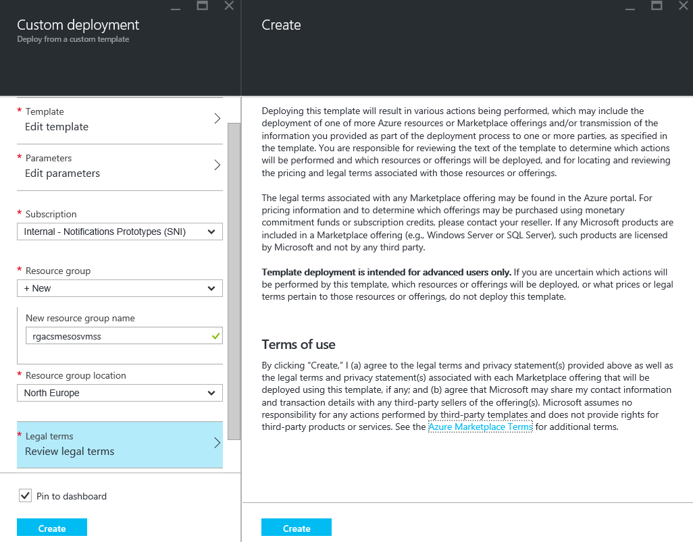
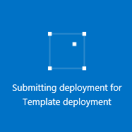

#101: Creating a Service using the Portal
 
To access Azure Container Service, you will need an Azure subscription. If you don't have one then sign up for a [free trial](http://www.windowsazure.com/en-us/pricing/free-trial/?WT.mc_id=AA4C1C935).
 
Select an ARM template from  [rgardler's fork](https://github.com/rgardler/azure-quickstart-templates) of the Azure QuickStarts repo in Github. All Azure Container Service Templates start with 'acs-'
 
There are two templates of particular interest:
 
* Mesos: https://github.com/rgardler/azure-quickstart-templates/tree/acs/acs-mesos-full-template
* Swarm: https://github.com/rgardler/azure-quickstart-templates/tree/acs/acs-swarm-full-template
 
On those pages you can click the "deploy to Azure" button. This will take you to the Azure portal where you can configure your instance of the Azure Container Service..

## Edit Parameters 

The first task is to set appropriate parametr values for the service. The form will look something like this:
 
 
 
To complete the form:

Field           | Description
----------------|-----------
DNSNAMEPREFIX   | This must be a world unique value. It will be used to create DNS names for each of the key parts of the service. More information below.
AGENTCOUNT      | This is the number of Virtual Machines to create in your cluster that will host containers.
AGENTVMSIZE     | Specifies the size of your Agent VMs. Be careful to select
a size that provides enough resources to host your largest containers.
ADMINUSERNAME   | This is the username for your user account on each of the Virtual Machines that will be created. For convenience this should be the same as the username associated with your SSH key (see below), though this is not necessary.
ORCHESTRATORTYPE| Select the orchestrator you would like to use in your ACS cluster.
MASTERCOUNT     | This is the number of Virtual Machines to configure as masters for your cluster. You can select 1, but this will not provide any resilience in your cluster and is only recommended for testing. Most users will want to pick 3 or 5 here.
SSHRSAPUBLICKEY	| It is required that you use SSH for authentication against the Virtual Machines. This is where you add your public key. It is very important that you are careful when pasting your key value into this box. Some editors will insert line-breaks into the content, this will break the key. Verify that your key has no line breaks and that it includes the 'ssh-rsa' prefix and the 'username@domain' postfix. It should loke something like 'ssh-rsa AAAAB3Nz...SNIPPEDCONTENT...UcyupgH azureuser@linuxvm' If you need to create an SSH key you can find guidance for [windows](https://azure.microsoft.com/en-us/documentation/articles/virtual-machines-windows-use-ssh-key/) and [Linux](https://azure.microsoft.com/en-us/documentation/articles/virtual-machines-linux-use-ssh-key/) on the Azure documentation site.
  
Once you have set appropriate values for your parameters, click OK. Assuming you have no detectable errots the parameters blade will disappear and we can move on. If there are detectable errors they will be highlighted in red, correct the errors and click OK again. Unfortunately, some parameter errors can only be detected during deploy, e.g. invalid SSH key (be sure to read the notes above on SSH keys or non-unique DNS name).
 
## Select Azure Subscription 

If you have more than one subscription ensure the right one is selected in the "subscription" blade:
 
 	
 
## Select or Create Resource Group 
 
Next we need to provide a resource group name. You can select an existing one or select a new one as shown below:
  
If you select an existing resource group in the previous step the region paramater  will automatically be set to that resource groups location. If you are creating a new resource group then you should select a region for it.

 

## Legal Terms
 
You must now review and agree to the Legal terms by opening the Legal Terms blade and clicking "Create". Note that during preview there is no charge for the Azure Container Service beyond the normal Azure charges for virtual machines, storage, networking etc. 
 
 
 
## Start the Deployment
 
Finally, click "Create" on the deployment blade. You will return to your dashboard and, assuming you did not uncheck "Pin to dashboard" on the this blade. Your dashboard will now display an animated tile that looks something like this:

 
 
After a short while this will change from "submitting deployment for template deployment" to "deploying template deployment":
 
 
 
Now sit back and relax for a few minutes (exactly how long depends on how many agents and hosts you requested. But expect it to be 5-15 minutes (the 40 machine cluster I created for this example took 14 minutes). Once complete you will see some blades that show the resources just created:
 
 
 
 
