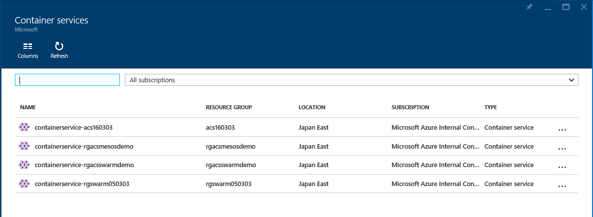
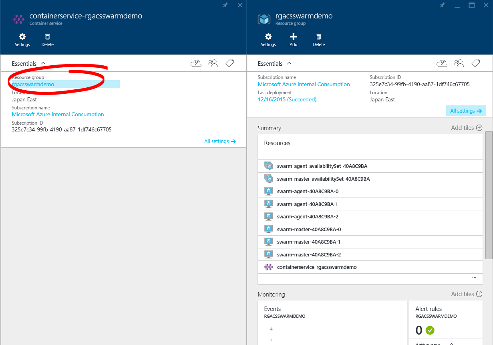
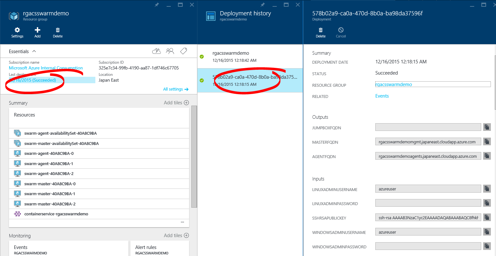

# 103: Azure Container Service in the Portal

After creating an Azure Container service you can view your resources in the Azure Portal. To do so log in to the [portal](http://aka.ms/acsportal) - it is important that you use this link during the preview as we have not yet exposed this through any other navigation in the portal. You might want to bookamrk it.

The UI looks something like this:

From here you can view the settings for the container service, delete it or click through to any container services you have created and then into the resource group that containers your resources:

 
 From the resource group page you can view individual resources and click through to the deployments made to this resource group. The deployments will give you useful information such as the template used, the paramaters you set and the outputs of the template (such as the FQDN of the masters and agents).
 
 