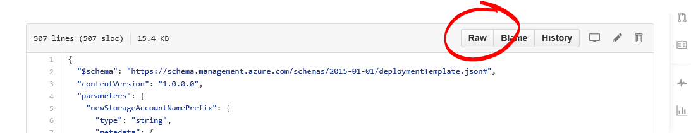

# 105: Creating a Service using the Command Line

To access Azure Container Service using the command line, you will need an Azure subscription. If you don't have one then you can sign up for a free trial. You will also need to have installed and configured either the Azure CLI (cross platform) or the Azure PowerShell Azure.
 
Select an ARM template from  rgardler's fork of the Azure QuickStarts repo in Github. All Azure Container Service Templates start with 'acs-'
 
There are two templates of particular interest:
 
* Mesos: https://github.com/rgardler/azure-quickstart-templates/tree/acs/acs-mesos-full-template
* Swarm: https://github.com/rgardler/azure-quickstart-templates/tree/acs/acs-swarm-full-template
 
## Using the Azure CLI (Cross Platform)
 
First you need to ensure that your CLI tools are configured to use Azure Resource manager. This is done with:
 
```bash
azure config mode arm
```
 
If you want to create your cluster in a new Resource Group you must first create the Resource Group. Use this command:
 
```bash
azure group create GROUP_NAME REGION
```
 
Where `GROUP_NAME` is the name of the resource group you want to create, and `REGION` is the region where you want to create the Resource Group.
 
Once you have a Resource Group you can create your cluster with:
 
```bash
azure group deployment create RESOURCE_GROUP DEPLOYMENT_NAME --template-uri TEMPLATE_URI
```

Where:
`RESOURCE_GROUP` is the name of the Resource Group you want to use for this service
`DEPLOYMENT_NAME` is the name of this deployment
`TEMPLATE_URI` is the location of the deployment file. Note that this must be the RAW file, not a pointer to the GitHub UI. To find this URL select the azuredeploy.json file in GitHub and click the RAW button:
 
 
 
###Providing a Parameters file
 
This version of the command requires the user to define parameters interactively. If you want to provide a parameters file in json format you can do so with the `-p` switch. For example:
 
 ```bash
azure group deployment create RESOURCE_GROUP DEPLOYMENT_NAME --template-uri TEMPLATE_URI -p '{ "param1": "value1" … }'
 ```
 
There is an example parameters file (called 'azuredeploy.parameters.json') in GitHub alongside each template.
 
##PowerShell

These instructions are based on the 1.0 version of the [Azure PowerShell cmdlets](https://azure.microsoft.com/en-gb/blog/azps-1-0/). 
 
If you want to create your cluster in a new Resource Group you must first create the Resource Group. Use this command:

```powershell
New-AzureRmResourceGroup -Name GROUP_NAME -Location REGION
```

Where `GROUP_NAME` is the name of the resource group you want to create, and `REGION` is the region where you want to create the Resource Group.
 
Once you have a Resource Group you can create your cluster with:
 
```powershell
New-AzureRmResourceGroupDeployment -Name DEPLOYMENT_NAME -ResourceGroupName RESOURCE_GROUP_NAME -TemplateUri TEMPLATE_URI
 ```
 
###Dynamic Template Parameters
 
If you are familiar with PowerShell, you know that you can cycle through the available parameters for a cmdlet by typing a minus sign (-) and then pressing the TAB key. This same functionality also works with parameters that you define in your template. As soon as you type the template name, the cmdlet fetches the template, parses it, and adds the template parameters to the command dynamically. This makes it very easy to specify the template parameter values. And, if you forget a required parameter value, PowerShell prompts you for the value.
 
Below is the full command with parameters included. You can provide your own values for the names of the resources.

```
New-AzureRmResourceGroupDeployment -ResourceGroupName RESOURCE_GROUP_NAME-TemplateURI TEMPLATE_URI -param1 value1 -param2 value2 …..
```
